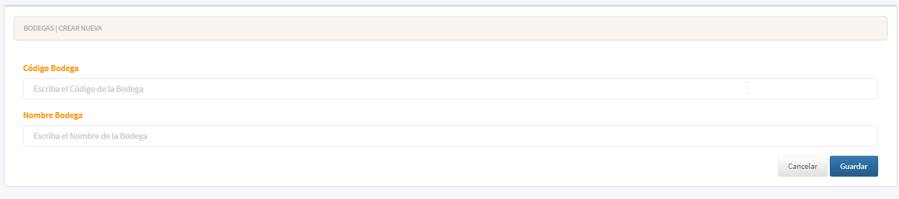

[Regresar al Inicio](../README.md)

---
# MAESTROS TIPO I

Los maestros que se denominan **TIPO I** son aquellos maestros que tiene los siguientes campos:

- Código
- Nombre

Se utilizan como información más básica para se utilizada en otros maestros.

**Nota:** Para el manejo referirse al [Manejo General de Información](manejo-general-informacion.md)

