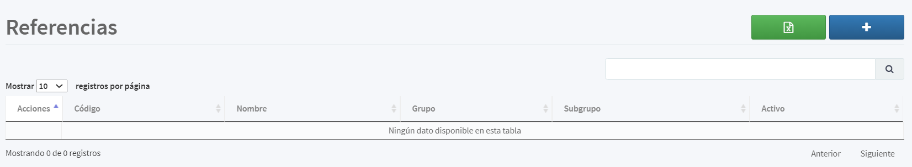
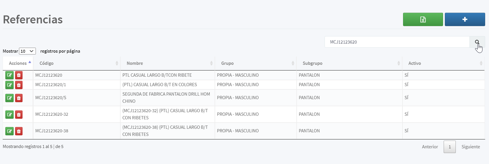
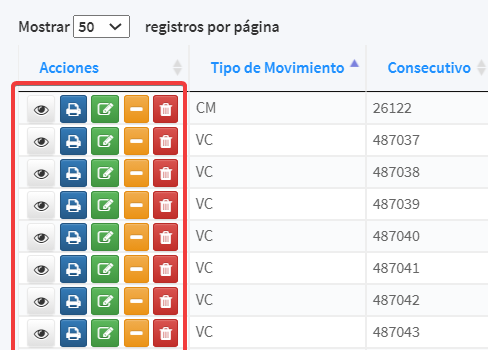
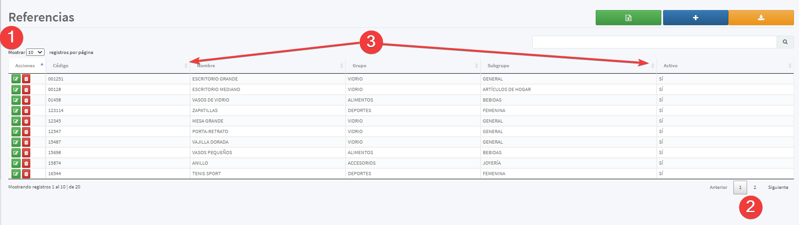

[Regresar al Inicio](../README.md)

---
# MANEJO GENERAL DE LA INFORMACION

El 90% del uso de la aplicación sigue los siguientes líneamientos.

## Index o Consulta Principal

Aqui se lista la información de la opción en la que se encuentra

Para buscar información se debe digitar lo que se desea buscar y darle clic en 

De acuerdo a los permisos se habilitan los botones de Editar, Eliminar, Congelar, Anular, Imprimir dependiento del módulo.

En la parte superior izquierda aparecen las opciones de:

- Crear o Adicionar Registros

 

- Exportar a Microsoft Excel

 

- Exportar a PDF

 

Por medio de la cuadrícula de consulta de la información se permite 

1. Mostrar una cantidad de registros por cada página
2. Desplazarse entre páginas
3. Ordenar por las columnas

