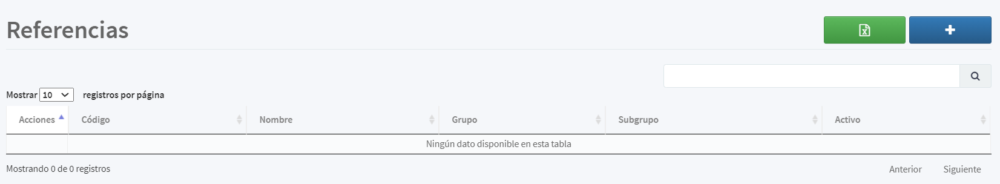
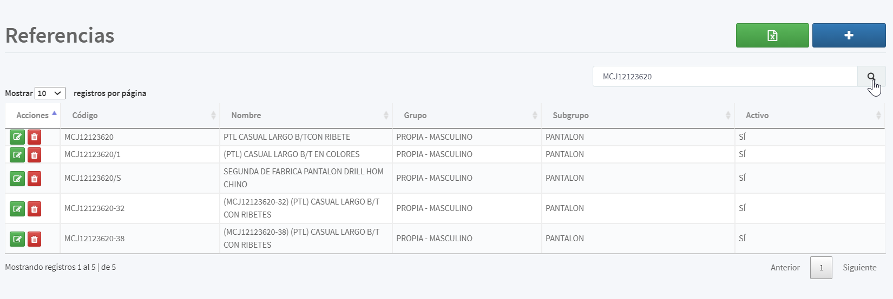
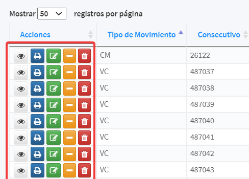
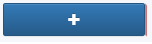
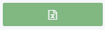
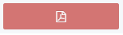
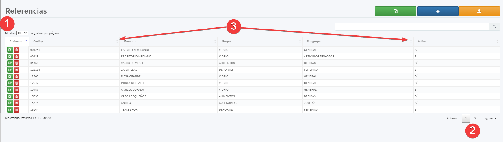
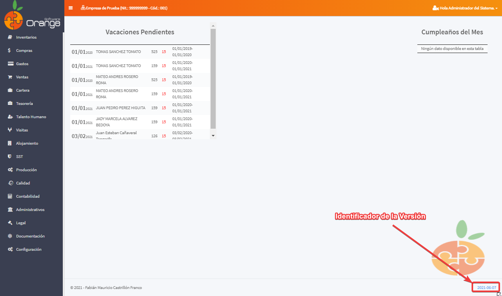

[Regresar al Inicio](../README.md)

---
# MANEJO GENERAL DE LA INFORMACION

El 90% del uso de la aplicación sigue los siguientes líneamientos.

## Index o Consulta Principal

Aqui se lista la información de la opción en la que se encuentra

Para buscar información se debe digitar lo que se desea buscar y darle clic en 

De acuerdo a los permisos se habilitan los botones de Editar, Eliminar, Congelar, Anular, Imprimir dependiento del módulo.

En la parte superior izquierda aparecen las opciones de:

- Crear o Adicionar Registros

 

- Exportar a Microsoft Excel

 

- Exportar a PDF

 

Por medio de la cuadrícula de consulta de la información se permite 

1. Mostrar una cantidad de registros por cada página
2. Desplazarse entre páginas
3. Ordenar por las columnas

En la parte inferior derecha se puede visualizar un link de la Versión del Sistema y al darle clic este refiere a las notas de la versión

## Indicadores de Carga

Cuando realiza operaciones en el sistema (búsquedas, guardado de datos, generación de reportes), verá un indicador visual de carga. Este indicador le informa que la aplicación está procesando su solicitud.

**Espere a que desaparezca antes de cerrar la página o realizar nuevas acciones críticas.**

El indicador de carga:
- Aparece automáticamente en consultas, formularios y operaciones especiales
- Muestra un mensaje describiendo qué se está procesando
- Desaparece cuando se completa la operación
- En algunos servidores lentos, puede permanecer visible más tiempo (normal)
- No bloquea completamente la navegación en la mayoría de casos

## Accesos directos (Favoritos)

El sistema permite marcar opciones como favoritas desde el menú lateral mediante una estrella junto a cada opción navegable.

- **Estrella activa:** indica que la opción ya está guardada como favorito.
- **Estrella inactiva:** indica que la opción aún no está en favoritos.
- Al hacer clic sobre la estrella se agrega o elimina el favorito para el **usuario** en la **empresa activa**.

### Visualización de favoritos

- **Dashboard principal:** los favoritos se muestran en formato de **recuadros grandes**, con el ícono centrado en la parte superior y el texto en la parte inferior.
- **Resto de opciones del sistema:** se muestra una barra compacta superior de favoritos, en formato discreto y de menor tamaño para no invadir la pantalla.

### Nota de comportamiento

Los favoritos se guardan por usuario y por empresa, por lo que al cambiar de compañía pueden variar según la configuración realizada en cada una.
