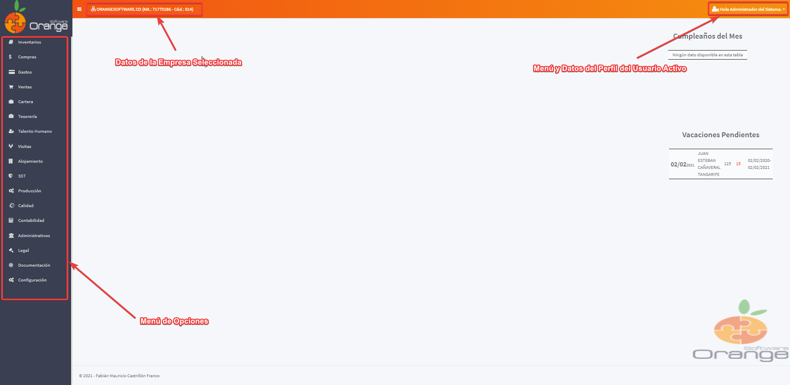
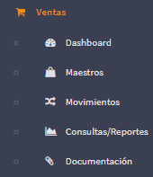
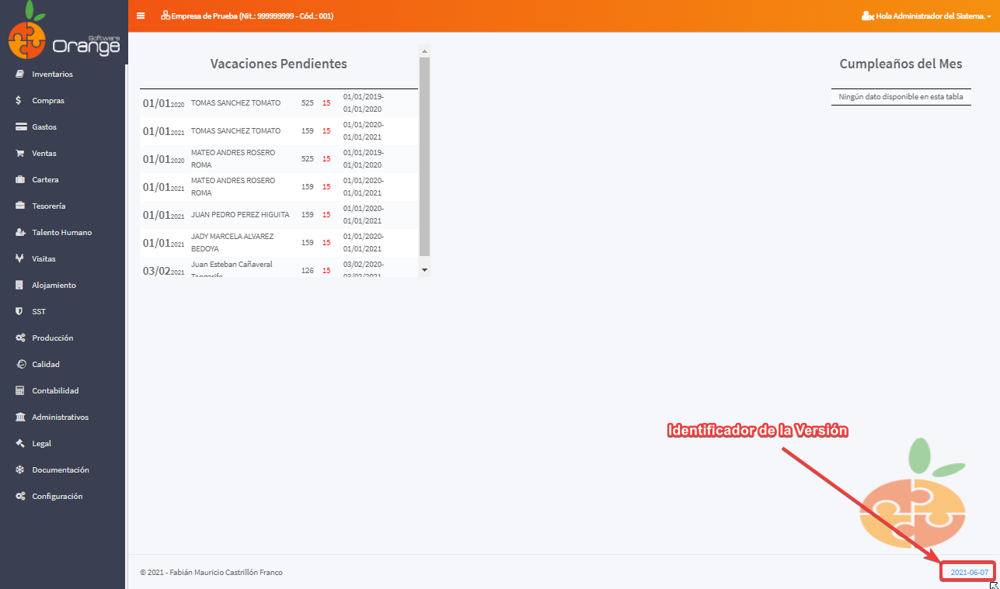

# Documentación OrangeSoftware ERP

**Autor:** Fabián Mauricio Castrillón Franco

## Descripción ##

**OrangeERP** es una Aplicación en la nube, enmarcada en la metodología SAAS (Software as a Service, por sus siglas en Inglés). **OrangeERP** es un aplicación multiempresa y multiusuario.

## Módulos - Servicios Ofrecidos

- [Inventarios](inventarios/readme.md)
- [Compras](compras/readme.md)
- [Gastos](gastos/readme.md)
- [Ventas](ventas/readme.md)
- [Cartera](cartera/readme.md)
- [Tesorería](tesoreria/readme.md)
- [Talento Humano](talento-humano/readme.md)
- [Producción](produccion/readme.md)
- [Calidad](calidad/readme.md)
- [Contabilidad](contabilidad/readme.md)
- [Administrativos](administrativos/readme.md)
- [Documentación](documentacion/readme.md)
- [Configuración](configuracion/readme.md)

## Estructura General

## Estructura de los menús de la opciones

> Se pueden abrir varias pestañas para poder realizar varias tareas al tiempo, esto se puede realizar seleccionando la opción sosteniendo la tecla *CTRL + Clic del Mouse*, o darle *Boton derecho del MOUSE* y *Abrir vínculo en una nueva pestaña*

**Dashboard:** Informes gráficos del módulo (para los que se encuentran habilitados).

**Maestros:** Aquí se ubican los maestros necesarios para que el módulo tenga la información necesaria para funcional.

**Movimientos:** Donde se realizan los movimientos del módulo.

**Consultas/Reportes:** Cómo su nombre lo indica aquí se listan las distintas consultas y/o reportes relacionados con el módulo.

**Procesos:** Procesos importantes relacionados con el módulo.

**Documentación:** Permite almacenas manuales, funciones o procedimientos relacionados con el módulo, para que la empresa tenga un repositorio centralizado de su documentación.

## Procedimiento para reportar errores

Al momento de realizar un reporte de inconsistencias o errores, en lo posible presentarlo o explicarlo con el paso, se recomienda utilizar la [Herramienta proporcionada por Microsoft en Windows](https://support.microsoft.com/es-es/windows/grabar-pasos-para-reproducir-un-problema-46582a9b-620f-2e36-00c9-04e25d784e47)

## Releases

Identificador de la Versión el cual dirige a las notas de la versión y la actualización.

- [2025-11](releases/2025-11.md)

