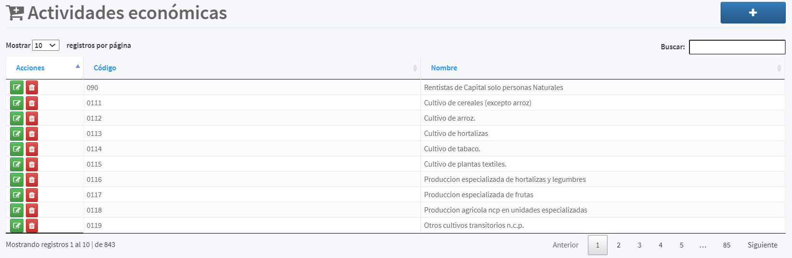

[Regresar al Inicio](../readme.MD)

---
# ACTIVIDADES ECONOMICAS

Es un [Maestro Tipo I](../../general/maestros-tipoI.md) que nos permite almacenas las actividades económicas que son utilizadas al momento de crear alguno de los distintos [Terceros](../../contabilidad/maestros/terceros.md) que maneja el sistema

