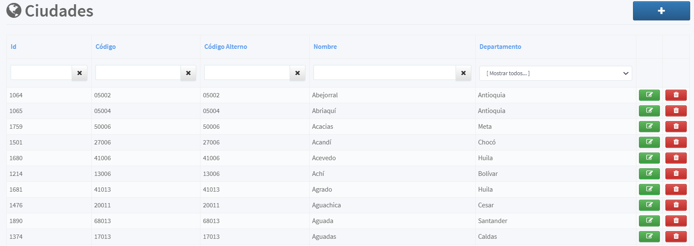

[Regresar al Inicio](../README.md)

---
# CIUDADES

Es un [Maestro Tipo II](../../general/maestros-tipoII.md) que nos permite almacenar las ciudades que se utilizan en el sistema

Para poder crear una ciudad debe existir previamente información del [Departamento](departamentos.md)

