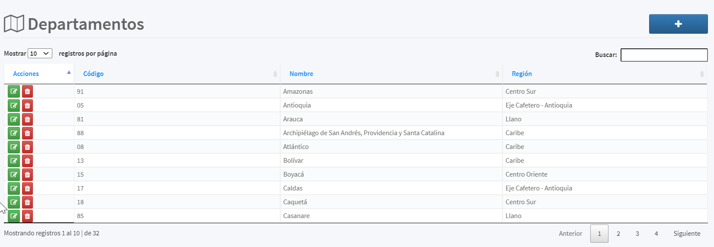

[Regresar al Inicio](../README.md)

---
# DEPARTAMENTOS

Es un [Maestro Tipo I](../../general/maestros-tipoI.md) que nos permite almacenas los departamentos que son utilizadas en el maestros de [Ciudades](ciudades.md)

