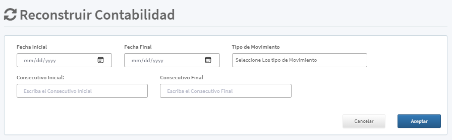

[Regresar al Inicio](../README.md)

---
# RECONSTRUIR CONTABILIDAD

El proceso para reconstruir contabilidad es de gran delicadez e importancia, el sistema lo que realiza es eliminar los registros contables seleccionados y volver a recálcular los movimientos contables.

Se solicita la siguiente información para realizar la consulta de los documentos a realizar.

1. Intervalo de Fechas
2. Tipos de Movimiento: Se pueden seleccionar varios tipos al tiempo
3. Intervalo de Consecutivos

Dichos filtros de consulta deben coincidir con la información para realizar la adecuada consulta

Nota: Dependiendo del tamaño de la consulta el proceso puede tardar varios minutos
