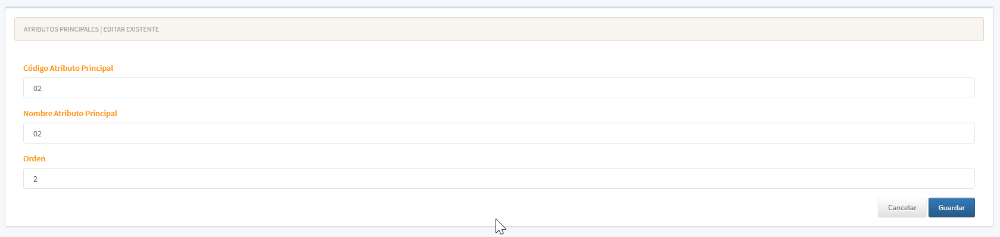

[Regresar al Inicio](../readme.md)

---

# 🏷️ Atributos Principales


---

## 📋 Descripción

Los **Atributos Principales** son características o propiedades que se asignan a las [Referencias](referencias.md) (productos) para clasificarlas y gestionarlas de manera más específica.

Es un [Maestro Tipo I](../../Generales/maestros-tipoI.md) que permite almacenar los atributos principales que se utilizan para dar una característica adicional a las referencias.

**Ejemplos de uso:**
- **Tallas:** XS, S, M, L, XL, XXL
- **Presentaciones:** Caja, Display, Unidad
- **Colores:** Rojo, Azul, Verde, Amarillo
- **Tamaños:** Pequeño, Mediano, Grande
- **Sabores:** Chocolate, Vainilla, Fresa
- **Material:** Algodón, Poliéster, Lana

**¿Para qué sirve este maestro?**  
Permite crear, editar, consultar y eliminar los atributos principales de su empresa para clasificar y organizar mejor su inventario de productos.

> 💡 **Nota:** Los Atributos Principales trabajan en conjunto con los [Atributos Secundarios](atributos-secundarios.md) para crear combinaciones específicas de productos (por ejemplo: Camisa Roja Talla M).

---

## 🎯 Acceso al Módulo

### Ruta de Navegación

1. Ingrese al sistema Orange ERP
2. En el menú principal, haga clic en **Inventarios**
3. Seleccione **Maestros**
4. Haga clic en **Atributos Principales**



---

## 🖥️ Pantalla Principal

La pantalla principal muestra una tabla con todos los atributos principales registrados en el sistema:

### Elementos de la Pantalla

| Elemento | Descripción |
|----------|-------------|
| **Botón + (Crear)** | Botón azul en la esquina superior derecha para crear un nuevo atributo |
| **Botón ⚠️ (Importar)** | Botón amarillo para importar atributos desde Orange VFP (si aplica) |
| **Badge "Ayuda"** | Enlace a la ayuda de maestros tipo I |
| **Buscador** | Caja de texto para filtrar los atributos (mínimo 2 caracteres) |
| **Tabla** | Lista de todos los atributos con columnas: Acciones, Código, Nombre |
| **Botón ✏️ (Editar)** | Botón verde para modificar un atributo existente |
| **Botón 🗑️ (Eliminar)** | Botón rojo para eliminar un atributo |
| **Paginación** | Controles en la parte inferior para navegar entre páginas |

### Características Visuales Mejoradas

- ✨ **Animaciones suaves:** Al pasar el mouse sobre las filas
- 🎨 **Efectos hover:** Las filas se resaltan al pasar el mouse
- 🔍 **Búsqueda optimizada:** Con tiempo de espera (debounce) para mejor rendimiento
- 📱 **Diseño responsive:** Se adapta a diferentes tamaños de pantalla

---

## ➕ Crear un Nuevo Atributo Principal

### Paso a Paso

1. **Haga clic en el botón azul "+" (más)** ubicado en la esquina superior derecha de la pantalla

2. **Complete los campos del formulario:**

   | Campo | ¿Es obligatorio? | Descripción | Ejemplo |
   |-------|------------------|-------------|---------|
   | **Código** | ✅ Sí | Identificador único del atributo. Máximo 20 caracteres alfanuméricos. Se convierte automáticamente a mayúsculas | `TALLA` |
   | **Nombre** | ✅ Sí | Nombre descriptivo del atributo. Máximo 100 caracteres. No puede contener comas (,) ni punto y coma (;) | `Tallas de Prendas` |
   | **Orden** | ✅ Sí | Número que define el orden de visualización del atributo | `1` |

   > 💡 **Tips importantes:**
   > - El **código** se usa para identificación técnica y reportes
   > - El **nombre** es lo que verán los usuarios en pantalla
   > - El **orden** determina la secuencia de aparición en listados y combos
   > - Use órdenes como 1, 2, 3... o 10, 20, 30... para facilitar futuros reordenamientos

3. **Haga clic en el botón "Guardar"**

   El botón mostrará un ícono de guardado mientras procesa la información

4. **Confirmación**

   Aparecerá un mensaje de éxito: **"¡Guardado exitoso!"**
   
   El sistema lo redirigirá automáticamente a la lista de atributos después de 2 segundos.

### ¿Qué puede salir mal?

| Error | Causa | Solución |
|-------|-------|----------|
| "El código del atributo principal es obligatorio" | No digitó el código | Complete el campo código |
| "El nombre del atributo principal es obligatorio" | No digitó el nombre | Complete el campo nombre |
| "El orden es obligatorio" | No digitó el orden | Complete el campo orden con un número |
| "El código ya existe" | Ya existe un atributo con ese código | Use un código diferente |
| "No puede usar comas o punto y coma en el nombre" | El nombre contiene caracteres prohibidos | Elimine las comas (,) y punto y coma (;) del nombre |

---

## ✏️ Editar un Atributo Principal Existente

### Paso a Paso

1. **Busque el atributo** que desea modificar en la tabla principal

2. **Haga clic en el botón verde (lápiz)** en la columna "Acciones"

3. **Modifique los campos** que necesite cambiar
   - Código
   - Nombre
   - Orden

4. **Haga clic en "Guardar"**

5. **Confirmación:** Verá el mensaje "¡Guardado exitoso!" y será redirigido a la lista

### ⚠️ Restricciones Importantes

**Tenga cuidado al editar atributos principales porque:**
- ✔️ Puede cambiar el **código**, **nombre** y **orden** en cualquier momento
- ⚠️ Si el atributo ya está asignado a referencias, el cambio afectará todos los productos
- ⚠️ Si hay [Atributos Secundarios](atributos-secundarios.md) asociados, seguirán vinculados
- ⚠️ Si hay movimientos de inventario, los reportes históricos mostrarán el nuevo valor

**Recomendación:** Si el atributo ya está en uso, mejor cree uno nuevo en lugar de modificar el existente.

---

## 🗑️ Eliminar un Atributo Principal

### Paso a Paso

1. **Identifique el atributo** que desea eliminar en la tabla

2. **Haga clic en el botón rojo (papelera)** en la columna "Acciones"

3. **Confirme la eliminación**

   Aparecerá un mensaje de confirmación mostrando:
   - Código del atributo
   - Nombre del atributo
   - Advertencia: **"Esta acción no se puede deshacer"**

4. **Opciones:**
   - **"Sí, eliminar"**: Elimina el atributo permanentemente
   - **"Cancelar"**: Cancela la operación (no elimina nada)

5. **Confirmación de eliminación exitosa**

   Verá el mensaje: **"¡Atributo principal eliminado!"**
   
   La tabla se actualizará automáticamente mostrando los atributos restantes.

### ⛔ ¿Cuándo NO puedo eliminar un atributo?

**No puede eliminar un atributo que:**
- ✖️ Tenga [Atributos Secundarios](atributos-secundarios.md) asociados
- ✖️ Esté asignado a referencias (productos) en [Referencias con Atributos](referencias.md)
- ✖️ Tenga movimientos de inventario registrados
- ✖️ Esté siendo usado en [Movimientos con Atributos](../movimientos/)

**¿Qué hacer si no puedo eliminar?**
1. Revisar el mensaje de error específico
2. Eliminar primero todos los atributos secundarios asociados
3. Quitar el atributo de todas las referencias que lo usen
4. Si no es posible eliminarlo, considere desactivarlo (contacte soporte para esta funcionalidad)

---

## 🔍 Buscar Atributos Principales

El sistema incluye una funcionalidad de búsqueda optimizada para encontrar atributos rápidamente.

### Características del Buscador

| Característica | Descripción |
|----------------|-------------|
| **Ubicación** | Esquina superior derecha de la tabla |
| **Mínimo de caracteres** | 2 caracteres para iniciar la búsqueda |
| **Tiempo de espera** | 0.5 segundos después de dejar de escribir |
| **Campos de búsqueda** | Código y Nombre del atributo |
| **Es sensible a mayúsculas** | No, busca sin distinguir mayúsculas/minúsculas |
| **Tecla ESC** | Limpia el campo de búsqueda instantáneamente |

### Cómo Usar el Buscador

1. **Digite mínimo 2 letras** del código o nombre del atributo

   **Ejemplos:**
   - Digite `ta` para encontrar "**TA**LLA"
   - Digite `pre` para encontrar "**PRE**sentación"
   - Digite `col` para encontrar "**COL**ores"

2. **Espere 0.5 segundos** y la tabla se filtrará automáticamente

3. **Para limpiar la búsqueda:**
   - Presione la tecla **ESC**
   - O borre todo el texto del campo

### 💡 Tips de Búsqueda

- Use palabras clave cortas y específicas
- No necesita escribir completo el código o nombre
- La búsqueda es instantánea después del tiempo de espera
- Si no encuentra resultados, intente con otra palabra

---

## 🔗 Relación con Otros Módulos

### Atributos Secundarios

Los **Atributos Principales** son la categoría superior. Cada atributo principal puede tener múltiples [Atributos Secundarios](atributos-secundarios.md).

**Ejemplo de jerarquía:**
```
Atributo Principal: TALLA
    ├── Atributo Secundario: XS
    ├── Atributo Secundario: S
    ├── Atributo Secundario: M
    ├── Atributo Secundario: L
    ├── Atributo Secundario: XL
    └── Atributo Secundario: XXL

Atributo Principal: COLOR
    ├── Atributo Secundario: Rojo
    ├── Atributo Secundario: Azul
    ├── Atributo Secundario: Verde
    └── Atributo Secundario: Amarillo
```

### Referencias (Productos)

Las [Referencias](referencias.md) pueden tener asignados uno o más atributos principales para crear variantes del mismo producto.

**Ejemplo:**
- **Producto:** Camisa Polo
  - **Atributo 1:** Talla (XS, S, M, L, XL)
  - **Atributo 2:** Color (Blanco, Negro, Azul)
  - **Resultado:** 15 variantes (5 tallas × 3 colores)

### Movimientos de Inventario

Al realizar movimientos (ventas, compras, traslados), el sistema permite especificar los atributos para controlar existencias de forma detallada.

---

## 📊 Casos de Uso Comunes

### Caso 1: Empresa Textil

**Necesidad:** Manejar prendas con diferentes tallas y colores

**Solución:**
1. Crear atributo principal `TALLA` con secundarios: XS, S, M, L, XL, XXL
2. Crear atributo principal `COLOR` con secundarios: Blanco, Negro, Azul, Rojo
3. Asignar ambos atributos a cada referencia de prenda
4. El sistema controlará existencias por talla y color independientemente

### Caso 2: Distribuidora de Alimentos

**Necesidad:** Productos con diferentes presentaciones y sabores

**Solución:**
1. Crear atributo principal `PRESENTACION` con secundarios: Caja x12, Caja x24, Display x48
2. Crear atributo principal `SABOR` con secundarios: Chocolate, Vainilla, Fresa, Frambuesa
3. Cada producto tendrá control de inventario por presentación y sabor

### Caso 3: Ferretería

**Necesidad:** Productos con diferentes medidas y materiales

**Solución:**
1. Crear atributo principal `MEDIDA` con secundarios: 1/2", 3/4", 1", 1 1/2", 2"
2. Crear atributo principal `MATERIAL` con secundarios: PVC, Acero, Cobre, Bronce
3. Control preciso de tubos por medida y material

---

## ❓ Preguntas Frecuentes (FAQ)

### ¿Cuántos atributos principales puedo crear?

No hay límite técnico. Sin embargo, se recomienda usar solo los necesarios para mantener el sistema simple.

### ¿Puedo cambiar el código de un atributo después de crearlo?

Sí, técnicamente es posible. Sin embargo, se recomienda **NO hacerlo** si el atributo ya está en uso, ya que puede afectar reportes e integraciones.

### ¿Qué pasa si elimino un atributo por error?

La eliminación es **permanente** y no se puede deshacer. Se recomienda estar seguro antes de eliminar. Si tiene dudas, consulte con soporte técnico.

### ¿Los atributos son compartidos entre empresas?

No. Cada empresa tiene sus propios atributos principales independientes.

### ¿Puedo importar atributos desde Orange VFP?

Sí, si tiene configurada la URL del API de Orange VFP, puede usar el botón "Importar" para traer las tallas existentes.

### ¿Cómo sé qué atributos están en uso?

Actualmente no hay un reporte específico. Se recomienda intentar eliminar el atributo: si está en uso, el sistema mostrará un error indicándolo.

---

## 🎓 Mejores Prácticas

1. **Planifique antes de crear:** Defina bien qué atributos necesita antes de empezar
2. **Use códigos cortos y claros:** Ej: `TAL`, `COL`, `PRES` en lugar de códigos largos
3. **Nombres descriptivos:** Sea claro en el nombre para que todos entiendan
4. **Orden lógico:** Use números con espacios (10, 20, 30) para facilitar reordenamientos futuros
5. **Evite caracteres especiales:** No use comas, punto y coma u otros caracteres problemáticos
6. **Documente internamente:** Mantenga un documento con el significado de cada atributo
7. **Capacite al equipo:** Asegúrese que todos entiendan cómo usar los atributos

---

## 📝 Control de Cambios

| Versión | Fecha | Descripción |
|---------|-------|-------------|
| 2.0 | 2026-02-18 | Refactorización completa del módulo con mejoras visuales, optimización de código y documentación detallada |
| 1.0 | [Fecha anterior] | Versión inicial |

---

[Regresar al Inicio](../readme.md)
