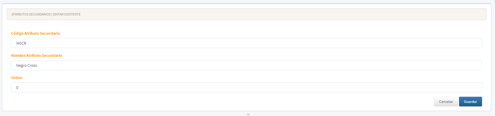

[Regresar al Inicio](../readme.md)

---

# Atributos Secundarios

Es un [Maestro Tipo I](../../Generales/maestros-tipoI.md) que nos permite almacenar los Atributos Secundarios que son utilizadas darle una característica adicional a las [Referencias](referencias.md) que maneja el sistema.

Por Ejemplo:

- Colores
- Tamaños
- Sabores

