[Regresar al Inicio](../readme.md)

---

# 📦 Bodegas

---

## 📋 Descripción

Las **Bodegas** son los lugares físicos o lógicos donde se almacenan las [Referencias](referencias.md) (productos) que maneja el sistema.

**Ejemplos de uso:**
- Bodega Principal
- Bodega de Materia Prima
- Bodega de Productos Terminados
- Bodega Sucursal Norte
- Bodega de Tránsito
- Bodega de Cuarentena

**¿Para qué sirve este maestro?**  
Permite crear, editar, consultar y eliminar las bodegas de su empresa para administrar los inventarios de forma organizada.

---

## 🎯 Acceso al Módulo

### Ruta de Navegación

1. Ingrese al sistema Orange ERP
2. En el menú principal, haga clic en **Inventarios**
3. Seleccione **Maestros**
4. Haga clic en **Bodegas**

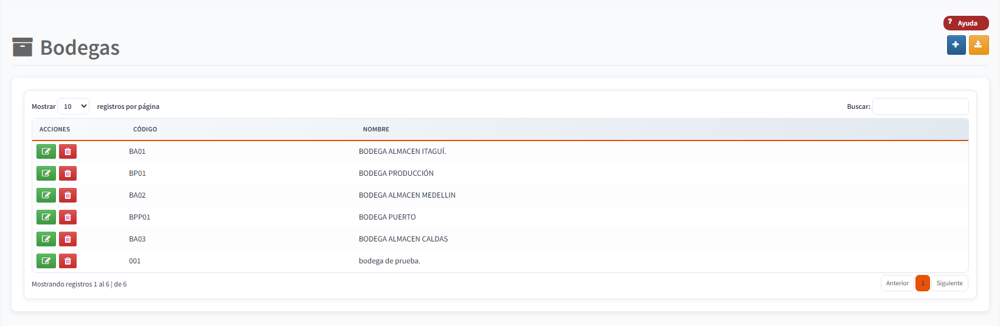

---

## 🖥️ Pantalla Principal

La pantalla principal muestra una tabla con todas las bodegas registradas en el sistema:

### Elementos de la Pantalla

| Elemento | Descripción |
|----------|-------------|
| **Botón + (Crear)** | Botón azul en la esquina superior derecha para crear una nueva bodega |
| **Botón ⚠️ (Importar)** | Botón amarillo para importar bodegas desde Orange VFP (si aplica) |
| **Buscador** | Caja de texto para filtrar las bodegas (mínimo 3 caracteres) |
| **Tabla** | Lista de todas las bodegas con columnas: Acciones, Código, Nombre |
| **Botón ✏️ (Editar)** | Botón verde para modificar una bodega existente |
| **Botón 🗑️ (Eliminar)** | Botón rojo para eliminar una bodega |
| **Paginación** | Controles en la parte inferior para navegar entre páginas |

---

## ➕ Crear una Nueva Bodega

### Paso a Paso

1. **Haga clic en el botón azul "+" (más)** ubicado en la esquina superior derecha de la pantalla

   

2. **Complete los campos del formulario:**

   | Campo | ¿Es obligatorio? | Descripción | Ejemplo |
   |-------|------------------|-------------|---------|
   | **Código** | ✅ Sí | Identificador único de la bodega. Máximo 10 caracteres alfanuméricos. | `BOD01` |
   | **Nombre** | ✅ Sí | Nombre descriptivo de la bodega | `Bodega Principal` |

   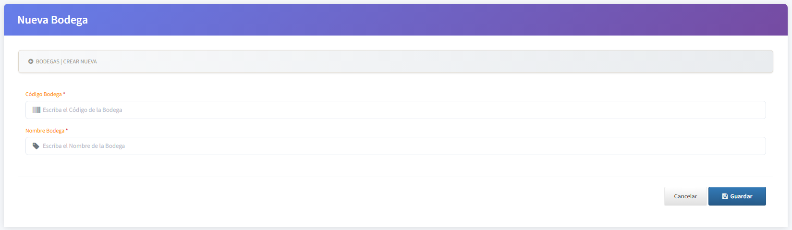

   > 💡 **Tip:** Use códigos cortos y memorables como `BOD01`, `MATPRI`, `SUCNOR`

3. **Haga clic en el botón "Guardar"**

   El botón cambiará a "Guardando..." mientras procesa la información

4. **Confirmación**

   Aparecerá un mensaje verde: **"¡Guardado exitoso!"**
   
   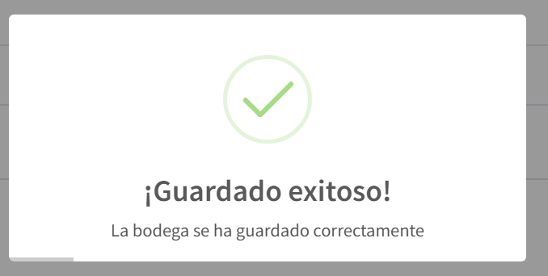

   El sistema lo redirigirá automáticamente a la lista de bodegas después de 2 segundos.

### ¿Qué puede salir mal?

| Error | Causa | Solución |
|-------|-------|----------|
| "El código de la bodega es obligatorio" | No digitó el código | Complete el campo código |
| "El nombre de la bodega es obligatorio" | No digitó el nombre | Complete el campo nombre |
| "El código ya existe" | Ya existe una bodega con ese código | Use un código diferente |

---

## ✏️ Editar una Bodega Existente

### Paso a Paso

1. **Busque la bodega** que desea modificar en la tabla principal

2. **Haga clic en el botón verde (lápiz)** en la columna "Acciones"

   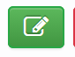

3. **Modifique los campos** que necesite cambiar

   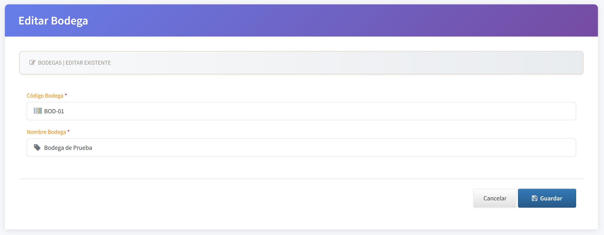

4. **Haga clic en "Guardar"**

5. **Confirmación:** Verá el mensaje "¡Guardado exitoso!" y será redirigido a la lista

### ⚠️ Restricciones Importantes

- **No puede cambiar el código** si la bodega ya tiene movimientos de inventario registrados
- Si intenta cambiar el código de una bodega con movimientos, el sistema mostrará un error
- Puede cambiar el **nombre** en cualquier momento sin restricciones

---

## 🗑️ Eliminar una Bodega

### Paso a Paso

1. **Identifique la bodega** que desea eliminar en la tabla

2. **Haga clic en el botón rojo (papelera)** en la columna "Acciones"

   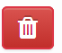

3. **Confirme la eliminación**

   Aparecerá un mensaje de confirmación mostrando:
   - El código de la bodega
   - El nombre de la bodega
   - Advertencia: "Esta acción no se puede deshacer"

   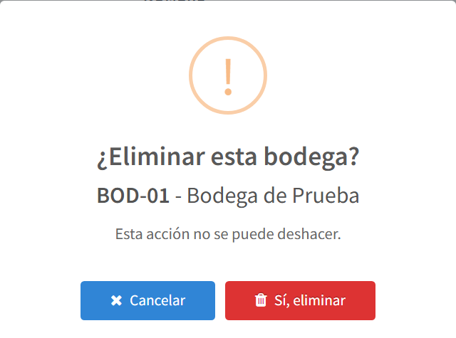

4. **Opciones:**
   - **"Sí, eliminar"**: Elimina la bodega permanentemente
   - **"Cancelar"**: Cancela la operación (no elimina nada)

5. **Confirmación de eliminación exitosa**

   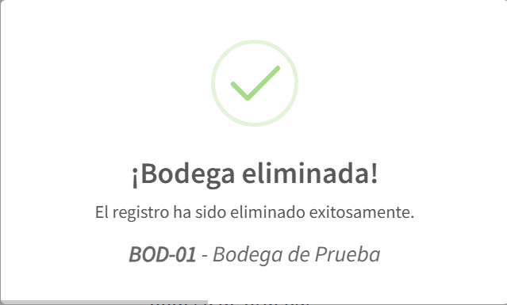

   La tabla se actualizará automáticamente mostrando las bodegas restantes.

### ⛔ ¿Cuándo NO puedo eliminar una bodega?

**No puede eliminar una bodega que tenga:**
- ✖️ Productos con existencias
- ✖️ Movimientos de inventario registrados (entradas, salidas, traslados)
- ✖️ Saldos pendientes
- ✖️ Movimientos contables asociados

**¿Qué hacer si no puedo eliminar?**
1. Revisar el motivo del error en el mensaje que aparece
2. Trasladar los productos a otra bodega
3. Realizar ajustes de inventario para dejar saldo en cero
4. Consultar con el área contable si hay movimientos pendientes

---

## 🔍 Buscar Bodegas

El sistema incluye una funcionalidad de búsqueda optimizada para encontrar bodegas rápidamente.

### Características del Buscador

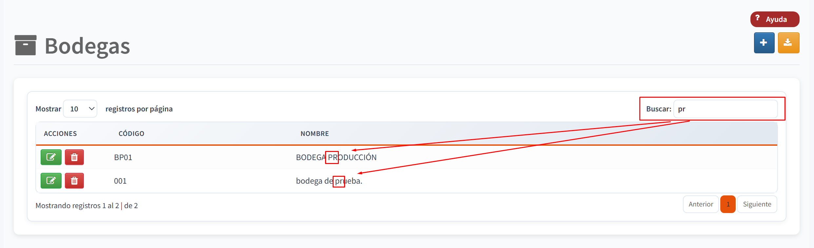

| Característica | Descripción |
|----------------|-------------|
| **Ubicación** | Esquina superior derecha de la tabla |
| **Mínimo de caracteres** | 3 caracteres para iniciar la búsqueda |
| **Tiempo de espera** | 0.5 segundos después de dejar de escribir |
| **Campos de búsqueda** | Código y Nombre de la bodega |
| **Es sensible a mayúsculas** | No, busca sin distinguir mayúsculas/minúsculas |

### Cómo Usar el Buscador

1. **Digite mínimo 3 letras** del código o nombre de la bodega

   Ejemplos:
   - Digite `pri` para encontrar "Bodega **Pri**ncipal"
   - Digite `BOD` para encontrar todas las bodegas con código "**BOD**01", "**BOD**02", etc.
   - Digite `mat` para encontrar "Bodega de **Mat**eria Prima"

2. **Espere medio segundo** (automáticamente el sistema buscará)

3. **Vea los resultados filtrados** en la tabla

### Limpiar la Búsqueda

**Opción 1:** Borre todo el texto del buscador  
**Opción 2:** Presione la tecla `ESC` (Escape)

Ambas opciones most rarán nuevamente todas las bodegas.

### 💡 Tips de Búsqueda

- ✅ Use fragmentos de palabras: `suc` encuentra "Bodega **Suc**ursal Norte"
- ✅ Funciona con acentos: `almacén` o `almacen` encontrarán el mismo resultado
- ✅ El buscador es inteligente: espera a que termine de escribir para evitar búsquedas innecesarias
- ✅ Si escribe menos de 3 caracteres, el sistema no buscará

---

## 📊 Funcionalidades de la Tabla

La tabla principal tiene características interactivas para facilitar la gestión:

### Resaltar Filas

**Haga clic en cualquier fila** para resaltarla en color azul claro. Esto ayuda a identificar visualmente qué bodega está consultando.

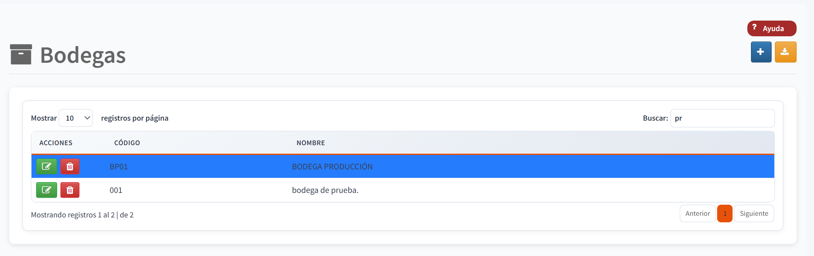

### Ver Contenido Completo

**Pase el cursor del mouse sobre cualquier celda** para ver el contenido completo en un tooltip. Útil cuando el texto es muy largo.

### Paginación

Si tiene muchas bodegas, la tabla las divide en páginas:

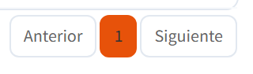

| Control | Función |
|---------|---------|
| **← Anterior** | Va a la página anterior |
| **Números** | Haga clic en un número para ir a esa página específica |
| **Siguiente →** | Va a la página siguiente |
| **Mostrando X de Y** | Indica cuántas bodegas está viendo del total |

### Animaciones Visuales

- **Hover sobre filas**: Las filas se elevan ligeramente y cambian de color
- **Hover sobre botones**: Los botones crecen y muestran sombra
- **Entrada de datos**: Los iconos de los campos crecen cuando hace focus

---

## 🔐 Permisos Requeridos

Para usar este maestro necesita los siguientes permisos (configurados por el administrador del sistema):

| Acción | Permiso | Botón/Función visible si tiene permiso |
|--------|---------|----------------------------------------|
| **Ver lista** | Lectura | Puede acceder al módulo |
| **Crear** | Crear | Botón azul "+" |
| **Editar** | Actualizar | Botón verde "✏️" |
| **Eliminar** | Eliminar | Botón rojo "🗑️" |

> 💼 Si no ve algún botón, significa que no tiene ese permiso. **Contacte a su administrador del sistema** para solicitar acceso.

---

## ❓ Preguntas Frecuentes

### 1. ¿Cuántas bodegas puedo crear?

**R:** No hay un límite definido. Puede crear tantas bodegas como necesite para organizar su inventario.

---

### 2. ¿Puedo usar el mismo código en dos bodegas?

**R:** No, cada bodega debe tener un **código único** en el sistema. Si intenta usar un código duplicado, el sistema mostrará un error.

---

### 3. ¿Qué longitud máxima tiene el código?

**R:** El código puede tener hasta **10 caracteres** (letras, números o combinación).

**Ejemplos válidos:**
- `BOD01`
- `ALMACEN`
- `SUC-NORTE`
- `MP2024`

---

### 4. ¿Puedo renombrar una bodega después de crear movimientos?

**R:** **Sí**, puede cambiar el **nombre** en cualquier momento sin problemas.  
**No**, no puede cambiar el **código** una vez que tenga movimientos de inventario.

---

### 5. ¿Qué pasa si elimino una bodega por error?

**R:** La eliminación es **irreversible**. Por eso el sistema muestra un mensaje de confirmación detallado antes de eliminar.

**Recomendación:** Si no está seguro, **no elimine** la bodega. Consulte primero con su supervisor.

---

### 6. ¿Por qué no encuentro la bodega que busqué?

**Verifique:**
1. ✅ Está escribiendo correctamente el nombre o código
2. ✅ Ha digitado mínimo **3 caracteres**
3. ✅ La bodega no fue eliminada previamente
4. ✅ Tiene permisos de **Lectura** para ver bodegas
5. ✅ Esperó medio segundo después de escribir

---

### 7. ¿Puedo importar bodegas desde otro sistema?

**R:** Sí, si su empresa migró desde **Orange VFP**, verá un botón amarillo de **importación** en la esquina superior derecha.

**Pasos:**
1. Haga clic en el botón amarillo "⚠️ Importar"
2. El sistema se conectará a Orange VFP
3. Importará automáticamente las bodegas
4. Verá un mensaje de confirmación con las bode gas importadas

> **Nota:** Esta función solo está disponible si su administrador configuró la URL de Orange VFP.

---

### 8. ¿Los cambios se ven en tiempo real?

**R:** Sí y No.
- **Sí:** Si usted crea, edita o elimina, verá los cambios inmediatamente
- **No:** Si otro usuario realiza cambios simultáneamente, debe **refrescar la página** (F5) para verlos

---

### 9. ¿Puedo deshacer una eliminación?

**R:** No, las eliminaciones son permanentes. Por eso es importante:
- Leer cuidadosamente el mensaje de confirmación
- Verificar el código y nombre antes de confirmar
- Consultar con su supervisor si tiene dudas

---

### 10. El sistema me dice "No se puede eliminar". ¿Por qué?

**R:** La bodega tiene información relacionada. Posibles causas:

| Causa | Cómo verificar | Solución |
|-------|---------------|----------|
| Tiene productos | Ir a Inventarios por Bodega | Trasladar productos a otra bodega |
| Tiene movimientos | Revisar Kardex | No se puede eliminar, debe inactivar |
| Tiene saldos pendientes | Ver reportes de inventario | Hacer ajustes de inventario |

**Contacte a su administrador** si necesita ayuda con este tipo de situaciones.

## 🎓 Buenas Prácticas

### Nomenclatura de Códigos

✅ **Recomendado:**
- Use códigos cortos: `BOD01`, `ALM01`, `SUC01`
- Use prefijos descriptivos: `MAT-` para materia prima, `PT-` para producto terminado
- Sea consistente: Si usa `BOD01`, use `BOD02`, `BOD03` (no `BODEGA2`)

❌ **Evite:**
- Códigos muy largos: `BODEGA_PRINCIPAL_EDIFICIO_A`
- Caracteres especiales: `BOD#01`, `ALM@2`
- Espacios en blanco: `BOD 01`
- Códigos sin significado: `ABC`, `XYZ`, `TEMP`

### Nomenclatura de Nombres

✅ **Recomendado:**
- Use nombres descriptivos claros
- Incluya la ubicación si aplica: "Bodega Sucursal Medellín"
- Sea específico: "Bodega de Materia Prima - Plásticos"

❌ **Evite:**
- Nombres genéricos: "Bodega 1", "Bodega A"
- Abreviaturas confusas: "Bod Prpal Mtrl Prm"
- Nombres muy largos que no se lean completos en reportes

### Organización

💡 **Consejos:**
1. Cree bodegas por **ubicación física** primero (Sucursal Norte, Sucursal Sur)
2. Luego cree bodegas por **tipo de producto** si es necesario (Materia Prima, Producto Terminado)
3. Considere crear bodegas virtuales para casos especiales:
   - `TRANSITO` - Para productos en tránsito entre bodegas
   - `CUARENTENA` - Para productos en inspección de calidad
   - `DEVOLUCIONES` - Para productos devueltos por clientes
4. No cree bodegas que no vaya a usar - mantenga la lista limpia

---

## 🔗 Información Relacionada

### Maestros Relacionados

- [Referencias](referencias.md) - Los productos que se almacenan en las bodegas
- [Ubicaciones](ubicaciones.md) - Posiciones dentro de cada bodega
- [Unidades de Medida](unidades-de-medida.md) - Para cantidades de inventario

### Movimientos Relacionados

- [Entradas/Salidas](../movimientos/entradas-salidas.md) - Registrar movimientos de inventario
- [Traslados](../movimientos/traslados.md) - Mover productos entre bodegas

### Consultas Relacionadas

- [Inventarios por Bodega](../consultas/inventarios-por-bodega.md) - Ver existencias por bodega
- [Kardex de Inventarios](../consultas/kardex-de-inventarios.md) - Historial de movimientos

### Documentación General

- [Maestros Tipo I](../../Generales/maestros-tipoI.md) - Entender este tipo de maestro
- [Manejo General de Información](../../Generales/manejo-general-informacion.md) - Operaciones CRUD generales

## 📝 Historial de Cambios

| Versión |Fecha | Autor | Cambios |
|---------|-------|-------|---------|
| 2.0 | 2026-02-18 | Sistema | Manual completo refactorizado para usuarios finales con guía visual detallada |
| 1.0 | [Fecha anterior] | Fabián Castrillón | Versión inicial básica |

---

**[⬅️ Volver a Maestros de Inventarios](../readme.md)** | **[🏠 Inicio](../../README.md)**

