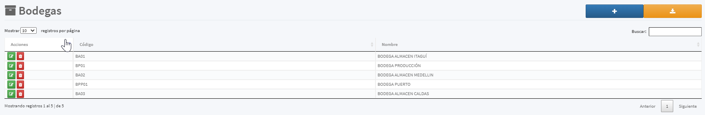

[Regresar al Inicio](../readme.md)

---

# Bodegas

Es un [Maestro Tipo I](../../Generales/maestros-tipoI.md) que nos permite almacenar las Bodegas que son utilizadas  para administrar los inventarios de acuerdo, bien sea, a la ubicación física o lógica de las [Referencias](referencias.md) que maneja el sistema.

