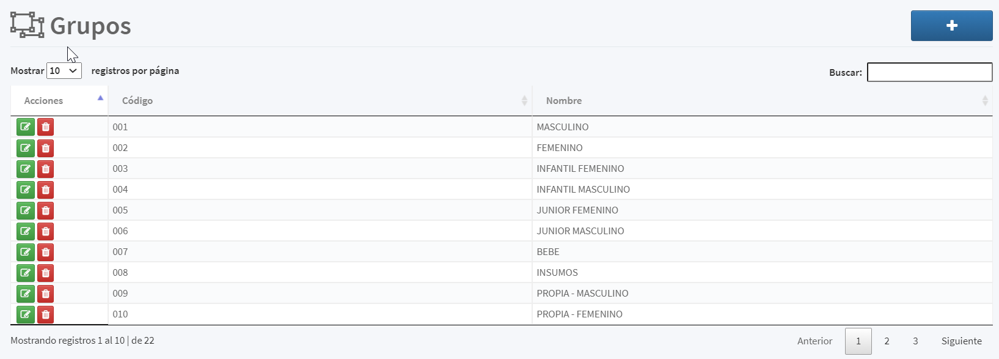

[Regresar al Inicio](../readme.md)

---

# Grupos

Es un [Maestro Tipo I](../../Generales/maestros-tipoI.md) que nos permite almacenas los grupos que son utilizadas al momento de crear alguno de las distintas [Referencias](referencias.md) que maneja el sistema, su funcionalidad principal es ofrecer la primera clasificación de los inventarios para facilitar el análisis de reportes y estadísticas. 

## Entre los Ejemplos tenemos

- Un concesionario de venta de vehiculos puede tener los siguientes grupos:
    - Automóviles
    - Motocicletas
    - Repuestos
- Un empresa que comercializa o produce prendas de vestir:
    - Masculino
    - Femenino
    - Junior
    - Infantil

