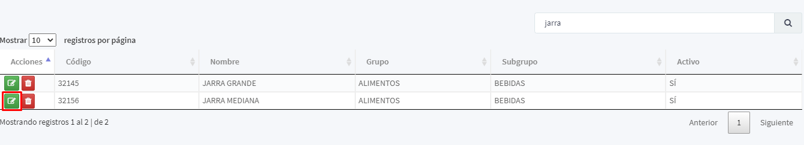

[Regresar al Inicio](../readme.md)

---

# Cambio de precios en Bloque de Referencias

Para actualizar los precios de todos los atributos correspondientes a una referencia existente, se debe buscar la referencia y editarla

Luego abrimos la pestaña de atributos.

Allí le damos clic a la pestaña mostrar campos.

Después de desplegar el formulario, llenamos los campos que deseamos cambiar, los campos que se pueden actualizar son: **precio 1, precio 2, precio 3, precio 4, precio 5, costo esperado y costo calculado.**

 Después de esto damos clic en el botón actualizar precios.

 

 El sistema nos pregunta si estamos seguros de realizar el proceso, damos clic en SI y todos los atributos de la referencia quedaran con los valores ingresados

  

  