[Regresar al Inicio](../readme.md)

---

# Referencias

## Manual de Usuario

### Objetivo

Esta guia describe el uso completo del maestro de Referencias, incluyendo creacion, edicion, atributos, costos, precios, consumos, proveedores, operaciones e inventarios.

### Acceso y permisos

- Ruta: Inventarios > Maestros > Referencias.
- Permisos requeridos:
  - Ver: consultar listado.
  - Crear: crear referencias y copiar.
  - Actualizar: editar referencias.
  - Eliminar: borrar referencias.

### Pantalla principal (Listado)

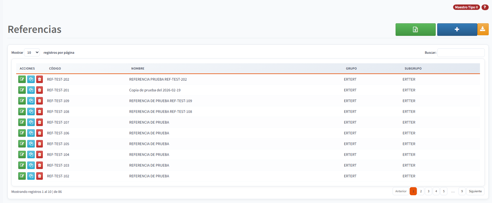

En el listado puedes:

- Buscar por codigo o nombre usando el cuadro de busqueda.
- Filtrar con los encabezados de columna.
- Abrir una referencia para editar.
- Copiar referencias tipo R.
- Eliminar referencias (si tienes permiso).

### Crear una referencia (paso a paso)

1. Ingresa a Inventarios > Maestros > Referencias.
2. Clic en Crear.
3. Completa la pestana Referencia.
   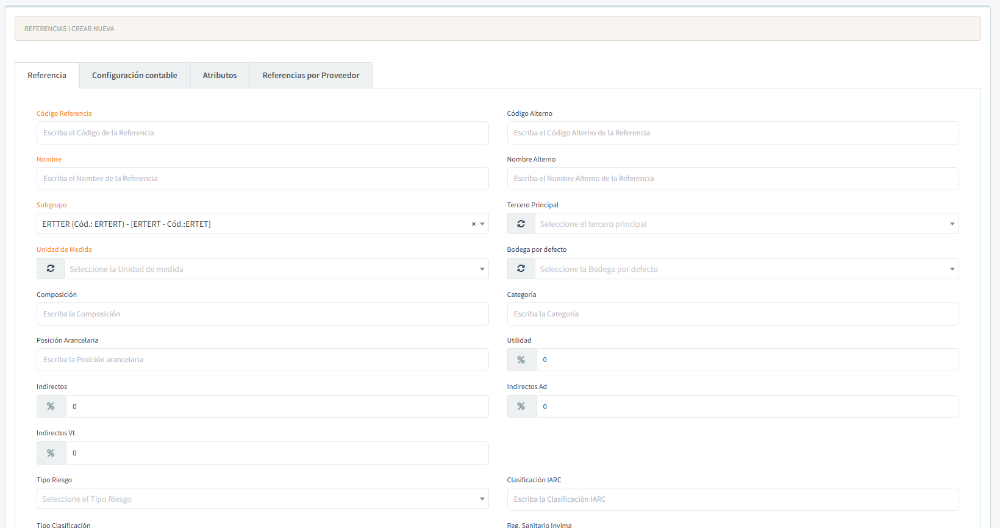
4. Completa Configuracion contable.
5. Agrega Atributos (si aplica).
6. Guarda.
7. (Opcional) Configura Inventarios, Proveedores, Consumos y Operaciones.

**Resultado final - Pestaña Referencia completa:**
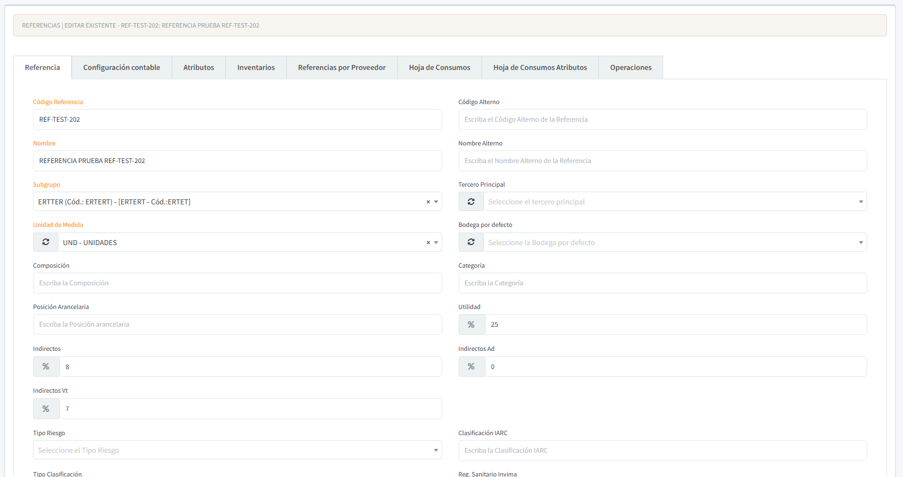

### Editar una referencia (paso a paso)

1. En el listado, clic en el icono Editar.
2. Modifica los campos necesarios.
3. Guarda los cambios.

### Pestaña Referencia

Campos habituales:

- Codigo de Referencia y Codigo Alterno.
- Nombre y Nombre Alterno.
- Grupo y Subgrupo.
- Unidad de Medida.
- Impuestos y configuracion de IVA.
- Costo Esperado y Costo Calculado (si aplica).

Recomendaciones:

- Mantener codigos unicos.
- Usar nombres claros y consistentes para reportes.

### Pestaña Configuracion contable

Define la relacion contable:

- Cuentas de Inventarios, Costos, Ventas, Descuentos, IVA.
- Naturaleza de cuentas segun la politica contable.

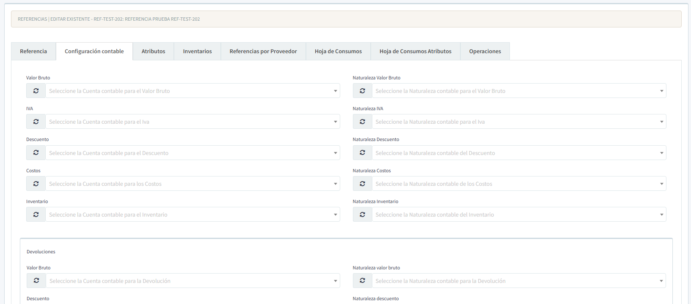

### Pestaña Atributos

Permite crear combinaciones de atributos y definir precios por atributo.

**Listado de atributos:**
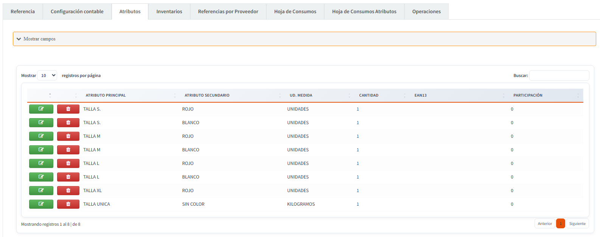

Acciones frecuentes:

- Agregar Atributo Principal y Secundario.
- Definir unidad de medida y cantidades.
- Asignar EAN8 y EAN13.
- Configurar precios y costos.

**Formulario de atributo:**
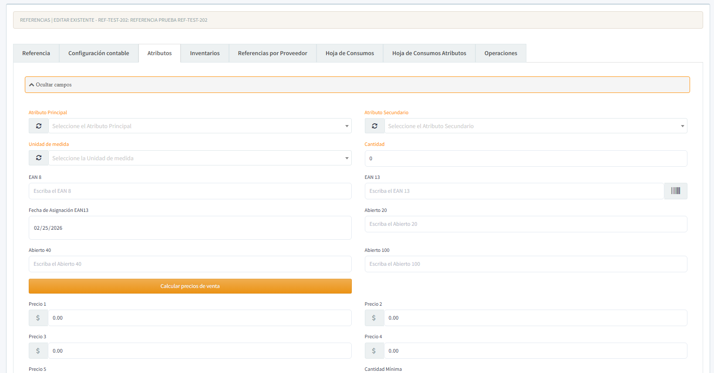

#### Calculo de costo y precios (un solo boton)

El boton Calcular precios de venta realiza el calculo completo en este orden:

1. **Costo Calculado**: se calcula desde **Costo Esperado** usando el porcentaje de empresa **PorCostoCalculado**.
2. **Precios de venta (Precio 1 a 5)**: se calculan con base en el **Costo Calculado**.

Formula de referencia:

- CostoCalculado = CostoEsperado / (1 - PorCostoCalculado / 100)
- PrecioN = CostoCalculado / (1 - PorPrecioN / 100)

**Antes del cálculo:**
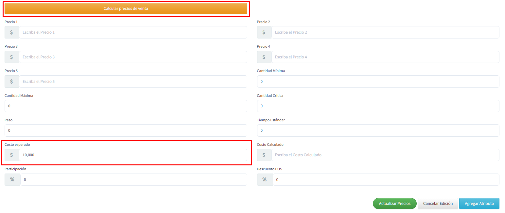

**Después del cálculo (Costo Calculado y Precios generados):**
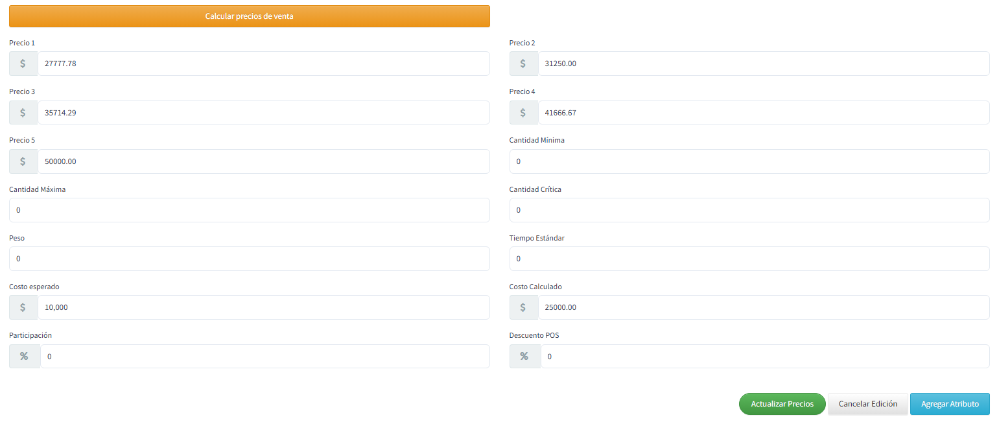

### Pestaña Inventarios (si aplica)

Disponible cuando la referencia maneja inventarios.

- Consulta saldos y movimientos relacionados.
- Verifica ubicaciones, bodegas y lotes si aplica.

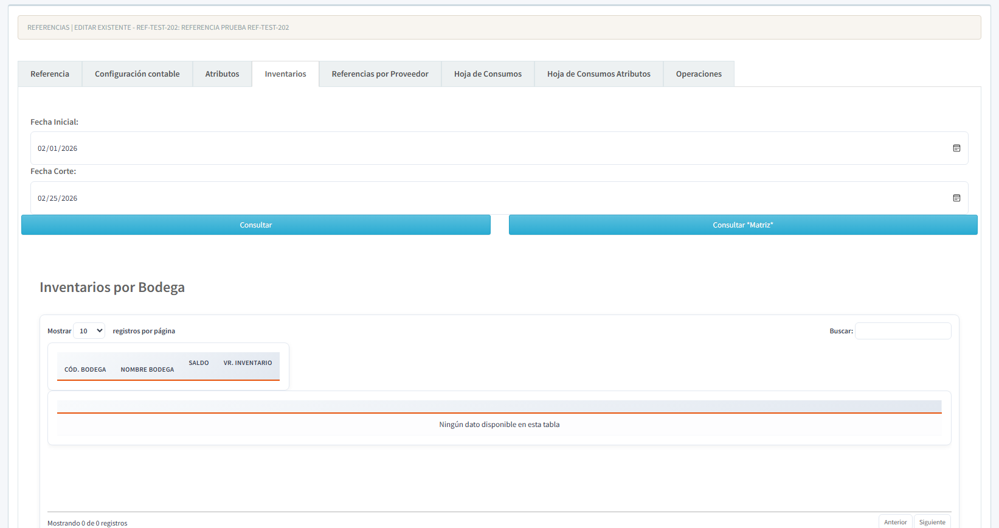

### Referencias por Proveedor

- Asocia proveedores a la referencia.
- Define codigos alternos del proveedor.
- Configura precios por proveedor.

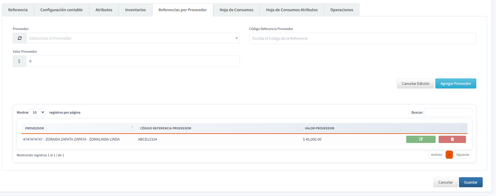

### Hoja de Consumos

- Define materiales consumidos.
- Configura cantidades por unidad de referencia.

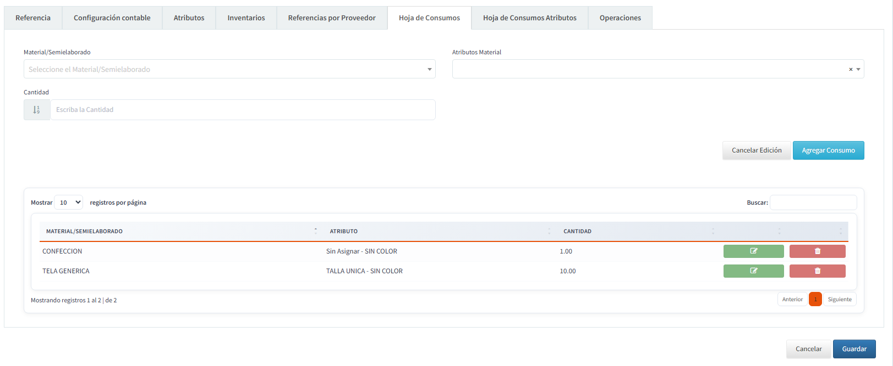

### Hoja de Consumos por Atributos

- Define consumos especificos por combinacion de atributos.

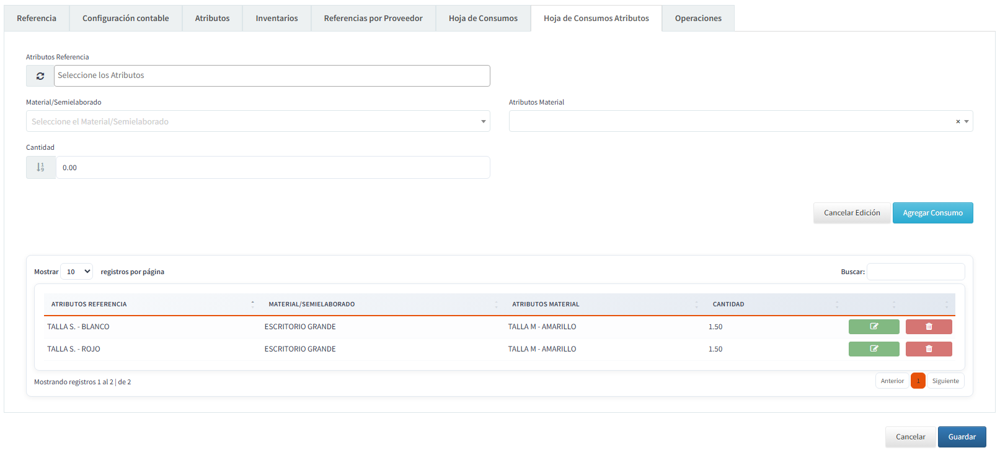

### Operaciones

- Registra operaciones de produccion.
- Define secuencia y tiempo.

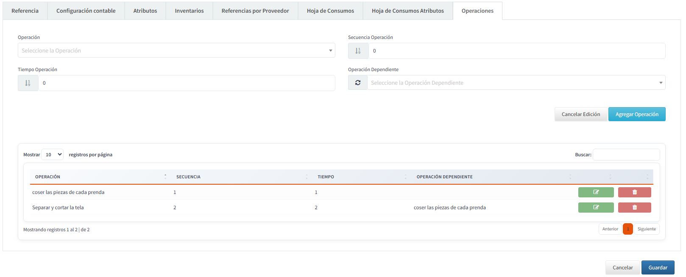

### Guardar y validaciones

- Campos obligatorios deben estar completos.
- Codigos deben ser unicos.
- Si hay errores, el sistema mostrara mensajes en pantalla.

### Buenas practicas

- Crear primero la referencia y luego configurar atributos y consumos.
- Validar costos antes de calcular precios.
- Mantener consistencia de codigos en proveedores.

## Copiar Referencias

La funcionalidad de **Copiar Referencias** permite duplicar una referencia existente junto con toda su configuración, facilitando la creación de referencias similares sin tener que configurar cada elemento manualmente.

### Acceso a la Funcionalidad

1. Navegar a **Inventarios > Maestros > Referencias**
2. En el listado de referencias, localizar la referencia que desea copiar
3. En la columna de acciones, hacer clic en el botón azul con ícono de copiar 

> **Nota:** El botón de copiar solo está disponible para referencias de tipo 'R' (Referencias) y requiere el permiso de **Crear** en el módulo de Referencias.

### Proceso de Copia

#### 1. Abrir Modal de Copia

Al hacer clic en el botón de copiar, se abrirá una ventana modal con los siguientes campos:

| Campo | Descripción | Obligatorio |
|-------|-------------|-------------|
| **Código Referencia Origen** | Código de la referencia que se está copiando (solo lectura) | N/A |
| **Nuevo Código** | Código único para la nueva referencia | Sí |
| **Nuevo Nombre** | Nombre/descripción para la nueva referencia | Sí |

#### 2. Validaciones

- El **Nuevo Código** no puede estar vacío
- El **Nuevo Nombre** no puede estar vacío
- El **Nuevo Código** debe ser único en el sistema

#### 3. Confirmación

Después de ingresar los datos, el sistema mostrará un mensaje de confirmación:

```
¿Está seguro de copiar la referencia [CÓDIGO-ORIGEN]?
Se creará una nueva referencia con código: [NUEVO-CÓDIGO]
```

### Elementos Copiados

Cuando se confirma la copia, el sistema duplica los siguientes elementos:

- ✅ **Atributos de Movimiento** - Todos los pares de atributos principal/secundario configurados
- ✅ **Materiales** - Referencias de materiales asociados con sus propiedades
- ✅ **Proveedores** - Lista de proveedores con códigos y precios
- ✅ **Consumos** - Materiales y cantidades necesarias para producción
- ✅ **Operaciones** - Procesos de fabricación con tiempos y secuencias
- ✅ **Consumos por Atributos** - Consumos específicos según combinación de atributos

### Resultado de la Copia

Al finalizar el proceso exitosamente:

1. Se muestra un mensaje con el resumen de la operación:
   ```
   Referencia copiada exitosamente
   
   • Total de registros copiados: [X]
   • Atributos de movimiento: [X]
   • Materiales: [X]
   • Proveedores: [X]
   • Consumos: [X]
   • Operaciones: [X]
   • Consumos por atributos: [X]
   ```

2. El sistema redirige automáticamente a la página de **Crear/Editar** de la nueva referencia creada, permitiendo realizar ajustes adicionales si es necesario.

### Casos de Uso

Esta funcionalidad es especialmente útil en los siguientes escenarios:

- **Referencias Similares:** Crear variantes de un producto con estructuras parecidas
- **Nuevas Líneas de Producto:** Iniciar una nueva línea basándose en productos existentes
- **Versiones de Referencias:** Crear nuevas versiones manteniendo la configuración base
- **Migración de Configuraciones:** Replicar estructuras probadas hacia nuevos productos

### Consideraciones Importantes

⚠️ **Permisos:** Se requiere el permiso de **Crear Referencias** para utilizar esta funcionalidad.

⚠️ **Código Único:** El nuevo código debe ser único. Si ya existe, el sistema mostrará un error.

⚠️ **Revisión Post-Copia:** Aunque la copia es completa, se recomienda revisar la nueva referencia para ajustar:
- Precios específicos
- Proveedores activos
- Tiempos de operación según capacidad de planta
- Cantidades de consumo si aplican ajustes

⚠️ **Datos No Copiados:** Los siguientes elementos NO se copian:
- Inventarios y saldos existentes
- Movimientos históricos
- Listas de precios específicas
- Imágenes y fotografías

### Solución de Problemas

| Problema | Causa Probable | Solución |
|----------|----------------|----------|
| No aparece el botón de copiar | Falta permiso de Crear o la referencia no es tipo 'R' | Verificar permisos con el administrador del sistema |
| Error "El código ya existe" | El código ingresado está en uso | Cambiar el código por uno único |
| Error al copiar | Problema de conexión o validación en datos origen | Verificar que la referencia origen esté completa y válida |
| No redirige a la nueva referencia | Error en la respuesta del servidor | Buscar manualmente la referencia con el nuevo código creado |

---

[Regresar al Inicio](../readme.md)
