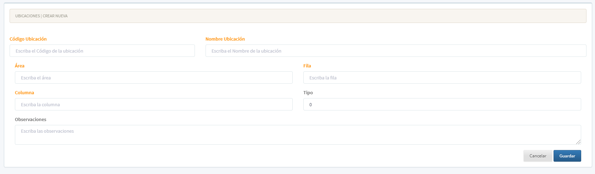

[Regresar al Inicio](../readme.md)

---

# Ubicaciones

Maestro de Ubicaciones para poder ser utilizado en los movimientos de inventarios y dar un manejo más exacto en la ubicaciones de las [Referencias](referencias.md) en las distintas [Bodegas](bodegas.md)

