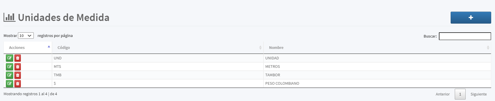

[Regresar al Inicio](../readme.md)

---

# Unidades de Medida

Es un [Maestro Tipo I](../../Generales/maestros-tipoI.md) que nos permite almacenar las Unidades de medida que son utilizadas  para información adicionalde las [Referencias](referencias.md) que maneja el sistema.

