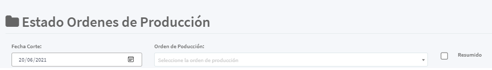
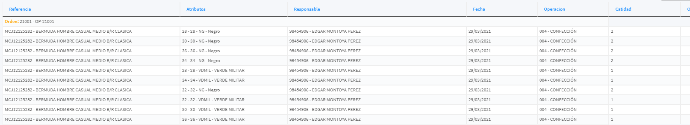

[Regresar a Producción](../readme.md)

---
# ESTADO DE ORDENES DE PRODUCCIÓN

Está Consulta o Reporte permite listar el estado actual de las ordenes de producción permitiendo encontrar la información de la operación en la que se encuentra y su responsable

La información básica de consulta es:

- Fecha de Corte: Permite consultar a una fecha determinada como se encontraba a dicha fecha las ordenes de producción.

- Orden de Producción: Consultar específicamente una [orden de producción](../movimientos/orden-de-produccion.md)

- Resumido: Permite presentar la [orden de producción](../movimientos/orden-de-produccion.md) sumando las cantidad o cada uno de sus referencias y atributos.

Luego de haber selecconado la información básica de consulta este botón permite realizar la consulta

## Detallado

El sistema agrupa la orden de producción presentando los siguiente campos:

- [Referencia](../../inventarios/maestros/referencias.md)
- [Atributo Principal](../../inventarios/maestros/atributos-principales.md)
- [Atributo Secundario ](../../inventarios/maestros/atributos-secundarios.md)
- Fecha
- [Operación](../maestros/operaciones.md)
- Cantidad

## Resumido

- [Orden de Producción](../movimientos/ordenes-produccion.md)
- Fecha
- [Operación](../maestros/operaciones.md)
- Responsable
- Cantidad

## Exportaciones

- Excel
- PDF
