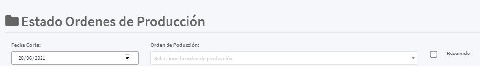
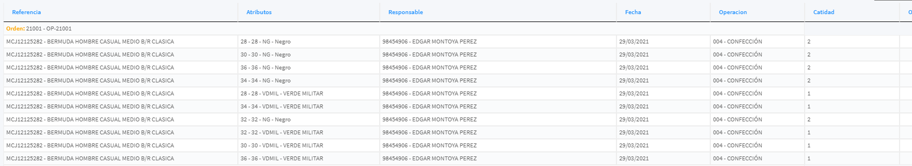

[Regresar a Producción](../readme.md)

---
# ESTADO DE ORDENES DE PRODUCCIÓN

Está Consulta o Reporte permite listar el estado actual de las ordenes de producción permitiendo encontrar la información de la operación en la que se encuentra y su responsable

La información básica de consulta es:

- Fecha de Corte: Permite consultar a una fecha determinada como se encontraba a dicha fecha las ordenes de producción.

- Orden de Producción: Consultar específicamente una [orden de producción](../movimientos/orden-de-produccion.md)

- Resumido: Permite presentar la [orden de producción](../movimientos/orden-de-produccion.md) sumando las cantidad o cada uno de sus referencias y atributos.

Luego de haber selecconado la información básica de consulta este botón permite realizar la consulta

## Detallado

El sistema agrupa la orden de producción presentando los siguiente campos:

- [Referencia](../../inventarios/maestros/referencias.md)
- [Atributo Principal](../../inventarios/maestros/atributos-principales.md)
- [Atributo Secundario ](../../inventarios/maestros/atributos-secundarios.md)
- Fecha
- Fecha Entrega
- [Operación](../maestros/operaciones.md)
- Cantidad

## Resumido

- [Orden de Producción](../movimientos/ordenes-produccion.md)
- Fecha
- [Operación](../maestros/operaciones.md)
- Responsable
- Cantidad

## Exportaciones

- Excel
- PDF

## Visualización de Operación (ícono + color)

En las vistas **Detallado** y **Resumido** la columna **Operación** se presenta con:

- Ícono de operación (Font Awesome).
- Texto de operación en el color configurado.

La visualización usa la configuración definida en el maestro de Operaciones de Producción.

## Resumen por operación (dinámico)

En la vista **Resumido** se muestra, encima de la tabla, un resumen visual por operación integrado al formulario.

Características del resumen:

- Se presenta como chips redondeados con el color configurado de la operación.
- Cada chip incluye ícono de operación, nombre de operación, **Cantidad** y **Lotes**.
- El contenido es dinámico: cambia automáticamente de acuerdo con la búsqueda y filtros aplicados en el DataTable resumido.

Notas de funcionamiento:

- **Cantidad:** suma de cantidades de los registros visibles según el filtro actual.
- **Lotes:** número de registros/lotes visibles para cada operación según el filtro actual.
- Si no hay resultados para el filtro aplicado, el resumen muestra que no hay datos para visualizar.
