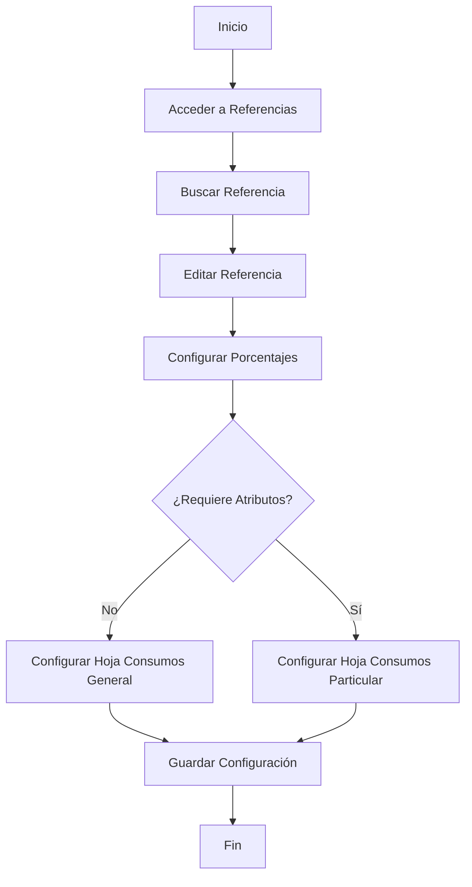
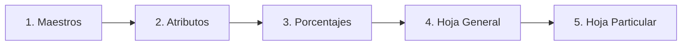

# Manual de Usuario - Configuración de Hoja de Consumos


## 📋 Tabla de Contenidos

- [Introducción](#-introducción)
- [Requisitos Previos](#-requisitos-previos)
- [Flujo del Proceso](#-flujo-del-proceso)
- [Paso 1: Acceder al Módulo de Referencias](#paso-1-acceder-al-módulo-de-referencias)
- [Paso 2: Buscar y Seleccionar la Referencia](#paso-2-buscar-y-seleccionar-la-referencia)
- [Paso 3: Configurar Porcentajes (Indirectos y Utilidad)](#paso-3-configurar-porcentajes-indirectos-y-utilidad)
- [Paso 4: Configurar Hoja de Consumos General](#paso-4-configurar-hoja-de-consumos-general)
- [Paso 5: Configurar Hoja de Consumos Particular (Con Atributos)](#paso-5-configurar-hoja-de-consumos-particular-con-atributos)
- [Descripción de Campos](#-descripción-de-campos)
- [Notas Importantes](#-notas-importantes)
- [Solución de Problemas](#-solución-de-problemas)
- [Glosario](#-glosario)

---

## 🎯 Introducción

Este manual describe el proceso completo para configurar la **Hoja de Consumos** en el Sistema de Gestión de Inventarios. La Hoja de Consumos permite definir los materiales o semielaborados que se consumen en la producción de una referencia específica, junto con sus cantidades y porcentajes de costos indirectos.

### Objetivo

Configurar adecuadamente:
- Porcentajes de costos indirectos y utilidad
- Consumos generales de la referencia
- Consumos particulares basados en atributos específicos

---

## 📦 Requisitos Previos

Antes de iniciar la configuración, asegúrese de:

- [x] Tener permisos de edición en el módulo **Inventarios**
- [x] Conocer los códigos de las referencias a configurar
- [x] Tener definidos los materiales/semielaborados en el maestro
- [x] Conocer los porcentajes de indirectos aplicables
- [x] Haber definido los atributos de las referencias (si aplica)

---

## 🔄 Flujo del Proceso



---

## Paso 1: Acceder al Módulo de Referencias

### Navegación

1. En el menú lateral izquierdo, ubique el módulo **Inventarios**
2. Haga clic en la opción **Referencias** (identificada con el ícono 🔄)


### Elementos de la Interfaz

| Elemento | Descripción |
|----------|-------------|
| **Inventarios** | Módulo principal del sistema |
| **Maestros** | Gestión de maestros de datos |
| **Referencias** | Módulo de configuración de referencias (destacado) |
| **Bodegas** | Gestión de almacenes |

> **💡 Tip:** El módulo de Referencias se encuentra entre Maestros y Bodegas en el menú de Inventarios.

---

## Paso 2: Buscar y Seleccionar la Referencia

### Búsqueda de Referencias

Una vez en el módulo de Referencias, verá una interfaz con:


### Elementos de la Pantalla

| Elemento | Función |
|----------|---------|
| **Show 10 entries** | Selecciona el número de registros a mostrar por página |
| **Search:** | Campo de búsqueda rápida (destacado en rojo) |
| **Acciones** | Botones de edición (✏️) y eliminación (🗑️) |
| **Exportar Excel** | Botón verde para exportar datos |
| **Agregar (+)** | Botón azul para crear nueva referencia |

### Pasos para Buscar

1. Utilice el campo **Search:** (esquina superior derecha) para buscar por:
   - Código de referencia
   - Nombre de la referencia
   - Grupo
   - Subgrupo

2. Localice la referencia deseada en el listado

3. Haga clic en el botón de **edición** (✏️ verde) en la columna **ACCIONES**

### Ejemplo de Búsqueda

```
Búsqueda por código: MCJ12778955
Resultado: BERMUDA CIERRES
Grupo: PROPIA
Subgrupo: BERMUDA
```

> **⚠️ Advertencia:** Los registros muestran la paginación en la parte inferior. Si no encuentra la referencia en la página actual, navegue usando los botones de paginación (1, 2, 3, ..., Next).

---

## Paso 3: Configurar Porcentajes (Indirectos y Utilidad)

### Ubicación de los Campos

Al editar una referencia, se abrirá un formulario con múltiples pestañas. Los campos de porcentajes se encuentran en la pestaña de configuración general de la referencia.


### Campos de Configuración

#### Sección Izquierda

| Campo | Descripción | Tipo | Ejemplo |
|-------|-------------|------|---------|
| **Indirectos** | Porcentaje de costos indirectos generales | Numérico (%) | 15% |
| **Indirectos Vt** | Porcentaje de costos indirectos de ventas | Numérico (%) | 8% |

#### Sección Derecha

| Campo | Descripción | Tipo | Ejemplo |
|-------|-------------|------|---------|
| **Utilidad** | Porcentaje de margen de utilidad esperado | Numérico (%) | 25% |
| **Indirectos Ad** | Porcentaje de costos indirectos administrativos | Numérico (%) | 12% |

### Instrucciones de Configuración

1. **Indirectos:** Ingrese el porcentaje de costos indirectos de producción
   ```
   Ejemplo: Si los costos indirectos de fabricación representan el 15% 
   del costo directo, ingrese: 15
   ```

2. **Indirectos Vt:** Defina el porcentaje de costos indirectos de ventas
   ```
   Incluye: comisiones, transporte, publicidad
   Ejemplo: 8
   ```

3. **Utilidad:** Establezca el margen de utilidad objetivo
   ```
   Representa el % de ganancia sobre el costo total
   Ejemplo: 25
   ```

4. **Indirectos Ad:** Configure los costos administrativos indirectos
   ```
   Incluye: gastos administrativos, servicios generales
   Ejemplo: 12
   ```

### Cálculo de Precio Sugerido

El sistema utiliza estos porcentajes para calcular el precio de venta sugerido:

```
Precio Sugerido = Costo Directo × (1 + Indirectos/100) × (1 + Indirectos Vt/100) × 
                  (1 + Utilidad/100) × (1 + Indirectos Ad/100)
```

> **📊 Ejemplo de Cálculo:**
> ```
> Costo Directo: $100
> Indirectos: 15%
> Indirectos Vt: 8%
> Utilidad: 25%
> Indirectos Ad: 12%
> 
> Precio = 100 × 1.15 × 1.08 × 1.25 × 1.12 = $175.14
> ```

---

## Paso 4: Configurar Hoja de Consumos General

### Acceso a la Pestaña

Dentro del formulario de edición de la referencia, seleccione la pestaña **"Hoja de Consumos"**


### Estructura de la Interfaz

#### Sección Superior - Formulario de Adición

| Campo | Descripción | Obligatorio |
|-------|-------------|-------------|
| **Material/Semielaborado** | Selector del material a consumir | ✅ Sí |
| **Cantidad** | Cantidad consumida por unidad producida | ✅ Sí |
| **Atributos Material** | Atributos específicos del material | ❌ No |

#### Botones de Acción

- **Cancelar Edición** (Gris): Descarta los cambios en curso
- **Agregar Consumo** (Azul): Guarda el consumo en la lista

### Proceso de Configuración

#### 1. Seleccionar Material/Semielaborado

```
1. Haga clic en el campo "Seleccione el Material/Semielaborado"
2. Se desplegará un listado con los materiales disponibles
3. Busque el material deseado
4. Seleccione el material haciendo clic sobre él
```

#### 2. Definir Cantidad

```
1. Ingrese la cantidad en el campo numérico
2. Use el botón de ajuste (⬍⬍) si está disponible
3. La cantidad representa: unidades de material por unidad de producto
```

**Ejemplo:**
```
Material: TELA DENIM
Cantidad: 1.5 metros por pantalón
```

#### 3. Definir Atributos del Material (Opcional)

Si el material tiene variaciones (color, talla, etc.):

```
1. Haga clic en el selector "×" de Atributos Material
2. Seleccione los atributos aplicables
3. Configure las combinaciones necesarias
```

#### 4. Agregar el Consumo

```
1. Verifique que todos los campos obligatorios estén completos
2. Haga clic en el botón "Agregar Consumo"
3. El consumo se agregará a la tabla inferior
```

### Sección Inferior - Lista de Consumos

#### Estructura de la Tabla

| Columna | Descripción |
|---------|-------------|
| **MATERIAL/SEMIELABORADO** | Código y nombre del material |
| **ATRIBUTO** | Atributos configurados (si aplica) |
| **CANTIDAD** | Cantidad por unidad producida |

#### Gestión de Registros

```
Mostrar: Selector de cantidad de registros por página (10, 25, 50, 100)
Buscar: Campo de búsqueda rápida
Anterior/Siguiente: Navegación entre páginas
```

### Estados de la Tabla

- **"Ningún dato disponible en esta tabla"** → No se han configurado consumos aún
- Tabla con datos → Consumos ya configurados y guardados

### Validaciones del Sistema

> **⚠️ Validaciones Importantes:**
> 
> - El material seleccionado debe existir en el maestro
> - La cantidad debe ser mayor a 0
> - No se permite duplicar combinaciones de Material + Atributos
> - Los cambios se guardan al hacer clic en "Agregar Consumo"

### Ejemplos de Configuración

#### Ejemplo 1: Producto Simple
```
Producto: Camiseta Básica
Material: TELA JERSEY
Cantidad: 0.80 metros
Atributos: (ninguno)
```

#### Ejemplo 2: Producto con Variaciones
```
Producto: Pantalón
Material: TELA DENIM
Cantidad: 1.50 metros
Atributos: Color Azul, Talla 32
```

---

## Paso 5: Configurar Hoja de Consumos Particular (Con Atributos)

### ¿Cuándo Usar Consumos Particulares?

Utilice esta opción cuando:
- Los consumos varían según atributos de la referencia
- Diferentes combinaciones de atributos requieren diferentes materiales
- Las cantidades cambian según características específicas


### Estructura de la Interfaz

#### Sección Superior - Configuración de Atributos

| Campo | Descripción | Función |
|-------|-------------|---------|
| **Atributos Referencia** | Atributos de la referencia principal | Define la variación del producto |
| **Material/Semielaborado** | Material a consumir | Selección del insumo |
| **Atributos Material** | Atributos del material | Características del insumo |
| **Cantidad** | Cantidad consumida | Valor numérico |

### Proceso de Configuración Detallado

#### 1. Configurar Atributos de Referencia

```yaml
Propósito: Define para qué variación del producto aplica este consumo

Pasos:
  1. Haga clic en el campo "Atributos Referencia"
  2. Seleccione el/los atributo(s) de la referencia
     Ejemplos:
       - Talla: S, M, L, XL
       - Color: Rojo, Azul, Verde
       - Modelo: Clásico, Sport, Premium
  3. El sistema filtrará los consumos según estos atributos
```

**Ejemplo:**
```
Referencia: Camisa Polo
Atributo Referencia: Talla L
Interpretación: Este consumo aplica solo para Talla L
```

#### 2. Seleccionar Material/Semielaborado

```yaml
Proceso:
  1. Clic en "Seleccione el Material/Semielaborado"
  2. Buscar en el listado desplegable
  3. Seleccionar el material correcto
  
Consideraciones:
  - Debe estar previamente creado en el maestro
  - Puede ser materia prima o semielaborado
  - El código debe ser único
```

#### 3. Definir Atributos del Material

```yaml
Uso: Cuando el material tiene variaciones propias

Ejemplos:
  Material: BOTONES
  Atributos Material: 
    - Color: Negro
    - Tamaño: 15mm
    
  Material: HILO
  Atributos Material:
    - Color: Azul Marino
    - Grosor: #40
```

#### 4. Establecer Cantidad

```yaml
Formato: Valor numérico con decimales
Unidad: Según la unidad de medida del material

Ejemplos:
  - Tela: 1.5 metros
  - Botones: 6 unidades
  - Hilo: 0.05 conos
```

#### 5. Guardar el Consumo

```
Botón: "Agregar Consumo" (azul)
Acción: Agrega el registro a la tabla inferior
Resultado: El consumo queda vinculado a los atributos definidos
```

### Tabla de Consumos Particulares

#### Columnas de la Tabla

| Columna | Contenido | Ordenable |
|---------|-----------|-----------|
| **ATRIBUTOS REFERENCIA** | Atributos de la variación del producto | ✓ |
| **MATERIAL/SEMIELABORADO** | Código y nombre del material | ✓ |
| **ATRIBUTOS MATERIAL** | Características del material | ✓ |
| **CANTIDAD** | Cantidad consumida | ✓ |

#### Controles de la Tabla

```
Mostrar: [10 ▼] registros por página
Buscar: [         ] (campo de búsqueda)
Paginación: Anterior [1] Siguiente
```

### Diferencias: General vs Particular

| Aspecto | Hoja General | Hoja Particular |
|---------|--------------|-----------------|
| **Atributos Referencia** | No se usan | ✅ Se definen |
| **Aplicación** | Todos los productos | Solo variaciones específicas |
| **Complejidad** | Simple | Alta |
| **Uso típico** | Productos estándar | Productos con variaciones |

### Ejemplo Completo

#### Escenario: Camiseta con Diferentes Tallas

```yaml
Referencia: CAMISETA POLO MCJ001

Consumo 1:
  Atributos Referencia: Talla S
  Material: TELA PIQUE
  Atributos Material: Color Blanco
  Cantidad: 0.6 metros

Consumo 2:
  Atributos Referencia: Talla M
  Material: TELA PIQUE
  Atributos Material: Color Blanco
  Cantidad: 0.7 metros

Consumo 3:
  Atributos Referencia: Talla L
  Material: TELA PIQUE
  Atributos Material: Color Blanco
  Cantidad: 0.85 metros

Consumo 4:
  Atributos Referencia: Talla XL
  Material: TELA PIQUE
  Atributos Material: Color Blanco
  Cantidad: 1.0 metros
```

### Validaciones Especiales

> **🔍 El Sistema Valida:**
> 
> - No duplicación de combinaciones Atributos Referencia + Material + Atributos Material
> - Consistencia entre atributos definidos y atributos del maestro
> - Cantidades mayores a cero
> - Existencia previa de materiales y atributos

### Casos de Uso Avanzados

#### Caso 1: Material Diferente por Atributo

```yaml
Producto: Pantalón Jean
Situación: El tipo de botón varía según el modelo

Consumo A:
  Atributos Referencia: Modelo Clásico
  Material: BOTON METAL
  Cantidad: 5 unidades

Consumo B:
  Atributos Referencia: Modelo Premium
  Material: BOTON MADERA
  Cantidad: 5 unidades
```

#### Caso 2: Cantidad Variable por Atributo

```yaml
Producto: Cortina
Situación: El consumo de tela varía por longitud

Consumo A:
  Atributos Referencia: Longitud 1.80m
  Material: TELA BLACKOUT
  Cantidad: 2.5 metros

Consumo B:
  Atributos Referencia: Longitud 2.40m
  Material: TELA BLACKOUT
  Cantidad: 3.2 metros
```

---

## 📝 Descripción de Campos

### Campos de Porcentajes

#### Indirectos
```yaml
Tipo: Porcentaje (%)
Rango: 0 - 100
Decimales: 2
Descripción: Costos indirectos de fabricación
Incluye:
  - Mano de obra indirecta
  - Mantenimiento de equipos
  - Depreciación
  - Servicios públicos de planta
Fórmula: (Costos Indirectos / Costo Directo) × 100
```

#### Indirectos Vt
```yaml
Tipo: Porcentaje (%)
Rango: 0 - 100
Decimales: 2
Descripción: Costos indirectos de ventas
Incluye:
  - Comisiones de vendedores
  - Transporte y distribución
  - Publicidad y marketing
  - Gastos de almacenamiento
Fórmula: (Costos Venta / Costo Total) × 100
```

#### Utilidad
```yaml
Tipo: Porcentaje (%)
Rango: 0 - 999
Decimales: 2
Descripción: Margen de utilidad objetivo
Uso: Definir el porcentaje de ganancia esperado
Cálculo: Sobre costo total más indirectos
Ejemplo: Utilidad 25% = 25% de ganancia sobre costos
```

#### Indirectos Ad
```yaml
Tipo: Porcentaje (%)
Rango: 0 - 100
Decimales: 2
Descripción: Costos administrativos indirectos
Incluye:
  - Gastos administrativos generales
  - Servicios corporativos
  - Sistemas y tecnología
  - Recursos humanos
```

### Campos de Hoja de Consumos

#### Material/Semielaborado
```yaml
Tipo: Selector (Dropdown)
Fuente: Maestro de Materiales
Obligatorio: Sí
Validación: Debe existir en el maestro
Búsqueda: Por código o nombre
Formato: CODIGO - NOMBRE
```

#### Cantidad
```yaml
Tipo: Numérico
Decimales: 2-4 (configurable)
Mínimo: 0.0001
Obligatorio: Sí
Unidad: Según unidad de medida del material
Interpretación: Cantidad por unidad de producto terminado
```

#### Atributos Material
```yaml
Tipo: Selector múltiple
Fuente: Atributos definidos en maestro de materiales
Obligatorio: No
Uso: Para materiales con variaciones
Ejemplos:
  - Color
  - Talla
  - Acabado
  - Calidad
```

#### Atributos Referencia
```yaml
Tipo: Selector múltiple
Fuente: Atributos definidos en la referencia
Obligatorio: Solo en Hoja Particular
Uso: Definir para qué variación aplica el consumo
Comportamiento: Filtro de aplicación del consumo
```

---

## ⚠️ Notas Importantes

### Consideraciones Generales

> **💡 Mejores Prácticas:**
> 
> 1. **Definir porcentajes antes de consumos** → Los porcentajes afectan el cálculo de costos
> 2. **Revisar maestros primero** → Asegurar que materiales y atributos existan
> 3. **Validar cantidades** → Verificar que las cantidades sean correctas para evitar errores de costeo
> 4. **Documentar atributos** → Mantener una convención clara de nomenclatura

### Orden de Configuración Recomendado



### Impacto en Costos

```yaml
Advertencia: Los cambios en porcentajes afectan:
  - Costo total del producto
  - Precio de venta sugerido
  - Márgenes de utilidad
  - Reportes financieros

Recomendación:
  - Realizar cambios en períodos de cierre
  - Notificar al área financiera
  - Documentar razones del cambio
```

### Diferencias entre Hojas

| Característica | General | Particular |
|----------------|---------|------------|
| **Complejidad** | Baja | Alta |
| **Flexibilidad** | Limitada | Alta |
| **Mantenimiento** | Fácil | Requiere cuidado |
| **Uso recomendado** | Productos estándar | Productos con variaciones |
| **Precisión de costos** | Buena | Excelente |

### Validaciones del Sistema

El sistema realiza las siguientes validaciones automáticas:

```yaml
Validación 1:
  Campo: Material/Semielaborado
  Regla: Debe existir en maestro
  Acción: Bloquea guardado si no existe

Validación 2:
  Campo: Cantidad
  Regla: Mayor a cero
  Acción: Mensaje de error

Validación 3:
  Campo: Combinación de atributos
  Regla: No duplicados
  Acción: Alerta de duplicidad

Validación 4:
  Campo: Atributos
  Regla: Deben estar definidos en maestro
  Acción: No permite seleccionar atributos inexistentes
```

### Permisos Requeridos

```yaml
Módulo: Inventarios → Referencias
Permisos necesarios:
  - Visualizar: Para ver referencias
  - Editar: Para modificar configuración
  - Maestros: Para vincular materiales

Roles típicos:
  - Administrador: Acceso completo
  - Jefe de Producción: Edición de consumos
  - Ingeniero de Costos: Edición de porcentajes
  - Consultor: Solo lectura
```

---

## 🔧 Solución de Problemas

### Problema 1: No Aparece el Material en el Selector

**Síntomas:**
- El material no está disponible en el dropdown
- La búsqueda no arroja resultados

**Causas Posibles:**
1. El material no está creado en el maestro
2. El material está inactivo
3. Problema de permisos de visualización

**Solución:**
```yaml
Paso 1: Verificar en Maestros → Materiales
  - Buscar el código del material
  - Verificar estado: Activo/Inactivo

Paso 2: Si no existe
  - Crear el material en el maestro
  - Definir todos los campos obligatorios
  - Guardar y activar

Paso 3: Si existe pero está inactivo
  - Editar el material
  - Cambiar estado a "Activo"
  - Guardar cambios
```

### Problema 2: Error al Guardar Consumo

**Síntomas:**
- El botón "Agregar Consumo" no responde
- Mensaje de error al intentar guardar

**Causas Posibles:**
1. Campos obligatorios vacíos
2. Cantidad igual a cero
3. Combinación duplicada

**Solución:**
```yaml
Verificación 1: Campos obligatorios
  - Material/Semielaborado: Debe estar seleccionado
  - Cantidad: Debe ser > 0

Verificación 2: Duplicados
  - Revisar tabla inferior
  - Buscar combinación Material + Atributos
  - Si existe, editar en lugar de crear nuevo

Verificación 3: Formato de cantidad
  - Usar punto (.) para decimales
  - No usar separadores de miles
  - Ejemplo correcto: 1.5
  - Ejemplo incorrecto: 1,5 o 1.500
```

### Problema 3: Los Atributos no Coinciden

**Síntomas:**
- Los atributos del material no aparecen
- Error de consistencia al guardar

**Causas Posibles:**
1. Atributos no definidos en el maestro del material
2. Atributos de referencia no configurados

**Solución:**
```yaml
Para Material:
  1. Ir a Maestros → Materiales
  2. Editar el material
  3. Definir atributos en la pestaña correspondiente
  4. Guardar

Para Referencia:
  1. Ir a la pestaña "Atributos" de la referencia
  2. Definir los atributos necesarios
  3. Guardar
  4. Regresar a Hoja de Consumos
```

### Problema 4: Cálculo de Costos Incorrecto

**Síntomas:**
- El precio sugerido no corresponde
- Los porcentajes no se aplican correctamente

**Causas Posibles:**
1. Porcentajes mal configurados
2. Consumos duplicados
3. Cantidades incorrectas

**Solución:**
```yaml
Verificación de Porcentajes:
  1. Revisar que los valores sean porcentajes (no decimales)
     Correcto: 15 (para 15%)
     Incorrecto: 0.15
  
  2. Sumar todos los porcentajes
     Total esperado: Indirectos + Indirectos Vt + Utilidad + Indirectos Ad
     Ejemplo: 15 + 8 + 25 + 12 = 60% total

Verificación de Consumos:
  1. Revisar tabla de consumos
  2. Buscar duplicados
  3. Verificar cantidades
  4. Calcular costo total manual:
     Costo = Σ(Material_i × Cantidad_i)
```

### Problema 5: Cambios no se Reflejan

**Síntomas:**
- Los cambios realizados no aparecen
- Al reabrir la referencia, los datos son antiguos

**Causas Posibles:**
1. No se guardó la configuración
2. Problema de caché
3. Sesión expirada

**Solución:**
```yaml
Paso 1: Guardar explícitamente
  - Hacer clic en "Agregar Consumo" después de cada consumo
  - Hacer clic en "Guardar" al finalizar toda la configuración

Paso 2: Refrescar
  - Cerrar el formulario de edición
  - Refrescar la página (F5)
  - Volver a abrir la referencia

Paso 3: Verificar sesión
  - Si ha pasado mucho tiempo, la sesión puede expirar
  - Cerrar sesión y volver a iniciar
  - Repetir el proceso
```

### Tabla de Códigos de Error

| Código | Mensaje | Solución |
|--------|---------|----------|
| **ERR001** | "Material no encontrado" | Crear material en maestro |
| **ERR002** | "Cantidad debe ser mayor a 0" | Ingresar cantidad válida |
| **ERR003** | "Combinación duplicada" | Editar registro existente |
| **ERR004** | "Atributo no válido" | Definir atributo en maestro |
| **ERR005** | "Sin permisos de edición" | Contactar administrador |

---

## 📚 Glosario

### Términos Técnicos

#### Referencia
```yaml
Definición: Código único que identifica un producto o SKU
Componentes:
  - Código alfanumérico
  - Descripción
  - Grupo y subgrupo
  - Atributos (opcionales)
Ejemplo: MCJ12778955 - BERMUDA CIERRES
```

#### Material / Semielaborado
```yaml
Material:
  Definición: Materia prima que se consume en la producción
  Ejemplos: Tela, botones, hilo, etiquetas
  
Semielaborado:
  Definición: Producto intermedio que se incorpora al producto final
  Ejemplos: Bolsillos pre-confeccionados, cierres ensamblados
  
Diferencia:
  Material: Requiere transformación
  Semielaborado: Ya está parcialmente procesado
```

#### Atributos
```yaml
Definición: Características variables de un producto o material
Tipos:
  - Color
  - Talla
  - Modelo
  - Acabado
  - Calidad
  
Atributos de Referencia:
  Descripción: Variaciones del producto final
  Ejemplo: Camiseta → Tallas S, M, L, XL
  
Atributos de Material:
  Descripción: Variaciones del insumo
  Ejemplo: Botón → Colores Negro, Blanco, Café
```

#### Indirectos
```yaml
Definición: Costos que no se pueden atribuir directamente al producto
Características:
  - Se distribuyen proporcionalmente
  - Se expresan en porcentaje
  - Afectan el costo total

Tipos:
  Indirectos de Fabricación:
    - Mano de obra indirecta
    - Depreciación
    - Mantenimiento
    
  Indirectos de Ventas:
    - Comisiones
    - Transporte
    - Marketing
    
  Indirectos Administrativos:
    - Gastos de oficina
    - Sistemas
    - RRHH
```

#### Utilidad
```yaml
Definición: Margen de ganancia esperado sobre el producto
Cálculo: Porcentaje sobre costo total (incluidos indirectos)
Uso: Definir precio de venta sugerido
Ejemplo:
  Costo Total: $100
  Utilidad: 25%
  Precio Sugerido: $125
```

#### Consumo
```yaml
Definición: Cantidad de material necesaria para producir una unidad

Consumo General:
  Aplica: Para todas las unidades de la referencia
  Uso: Productos estándar sin variaciones

Consumo Particular:
  Aplica: Solo para combinaciones específicas de atributos
  Uso: Productos con variaciones que afectan consumos
```

#### Hoja de Consumos
```yaml
Definición: Listado de todos los materiales y cantidades necesarios
Propósito:
  - Calcular costo directo
  - Planificar compras
  - Generar órdenes de producción
  - Controlar inventarios

Tipos:
  General: Sin atributos
  Particular: Con atributos específicos
```

### Abreviaturas

| Abreviatura | Significado |
|-------------|-------------|
| **SKU** | Stock Keeping Unit (Unidad de Mantenimiento de Stock) |
| **UND** | Unidad |
| **Vt** | Ventas |
| **Ad** | Administrativos |
| **Cant** | Cantidad |
| **Ref** | Referencia |

### Unidades de Medida Comunes

| Código | Descripción | Uso Típico |
|--------|-------------|------------|
| **UND** | Unidad | Botones, etiquetas, piezas |
| **MT** | Metro | Telas, hilos, cintas |
| **KG** | Kilogramo | Materias primas a granel |
| **M2** | Metro cuadrado | Telas, cuero |
| **CONO** | Cono | Hilos industriales |
| **DOCENA** | Docena (12 unidades) | Botones, remaches |

---

## 📄 Anexos

### Anexo A: Convenciones de Nomenclatura

#### Códigos de Referencias
```
Formato recomendado: [PREFIJO][NÚMERO][SUFIJO]
Ejemplo: MCJ12778955
  - MC: Tipo de producto (MC = Men's Clothing)
  - J: Categoría (J = Jeans/Pantalones)
  - 12778955: Secuencial único
```

#### Nombres de Atributos
```yaml
Tallas:
  Estándar: XS, S, M, L, XL, XXL
  Numérica: 28, 30, 32, 34, 36, 38
  
Colores:
  Usar nombres descriptivos
  Evitar abreviaturas ambiguas
  Ejemplos:
    - Azul Marino (no "Az Mar")
    - Negro (no "Neg")
    - Beige Claro (no "Bei Cla")
```

### Anexo B: Fórmulas de Cálculo

#### Costo Directo
```
Costo Directo = Σ (Material_i × Cantidad_i × Precio_Unitario_i)
```

#### Costo con Indirectos de Fabricación
```
Costo_IF = Costo Directo × (1 + Indirectos/100)
```

#### Costo con Todos los Indirectos
```
Costo_Total = Costo_IF × (1 + Indirectos_Vt/100) × (1 + Indirectos_Ad/100)
```

#### Precio de Venta Sugerido
```
Precio_Venta = Costo_Total × (1 + Utilidad/100)
```

#### Fórmula Completa
```
Precio = Costo_Directo × (1 + Ind/100) × (1 + Ind_Vt/100) × 
         (1 + Utilidad/100) × (1 + Ind_Ad/100)
```

### Anexo C: Checklist de Configuración

#### Pre-Configuración
- [ ] Materiales creados en maestro
- [ ] Atributos definidos
- [ ] Unidades de medida configuradas
- [ ] Precios de materiales actualizados
- [ ] Permisos verificados

#### Durante Configuración
- [ ] Porcentajes de indirectos definidos
- [ ] Porcentaje de utilidad establecido
- [ ] Consumos generales agregados (si aplica)
- [ ] Consumos particulares agregados (si aplica)
- [ ] Cantidades verificadas
- [ ] No hay duplicados

#### Post-Configuración
- [ ] Guardar cambios
- [ ] Verificar cálculo de costos
- [ ] Revisar precio sugerido
- [ ] Documentar cambios
- [ ] Notificar a áreas involucradas

---

## 📞 Soporte y Contacto

### Recursos Adicionales

| Recurso | Ubicación |
|---------|-----------|
| **Documentación técnica** | `/docs/inventarios/` |
| **Videos tutoriales** | Portal interno → Capacitación |
| **Base de conocimientos** | Sistema de tickets → KB |

### Canales de Soporte

```yaml
Nivel 1 - Mesa de Ayuda:
  Medio: Teléfono, Chat, Email
  Horario: Lunes a Viernes 8:00 AM - 6:00 PM
  Respuesta: Inmediata

Nivel 2 - Soporte Técnico:
  Medio: Tickets
  Horario: Lunes a Viernes 8:00 AM - 5:00 PM
  Respuesta: 4 horas

Nivel 3 - Desarrollo:
  Medio: Tickets escalados
  Horario: Lunes a Viernes
  Respuesta: 24 horas
```

---

## 📋 Historial de Versiones

| Versión | Fecha | Autor | Cambios |
|---------|-------|-------|---------|
| 1.0.0 | 2026-02-09 | Arquitecto de Soluciones | Versión inicial del manual |

---

## 📜 Licencia y Derechos

```
© 2026 Sistema de Gestión de Inventarios
Documento de uso interno - Confidencial
Prohibida su reproducción sin autorización
```

---

**Fin del Manual de Usuario - Configuración de Hoja de Consumos**

*Para reportar errores o sugerencias sobre este manual, contacte al equipo de documentación.*