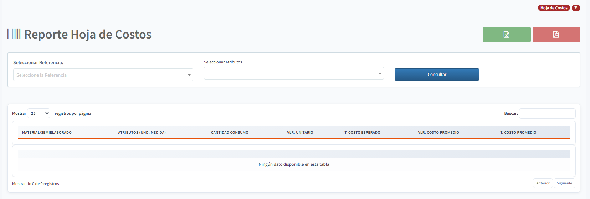
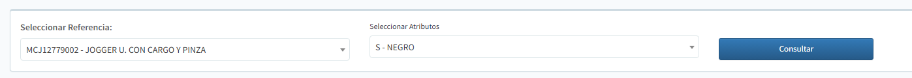
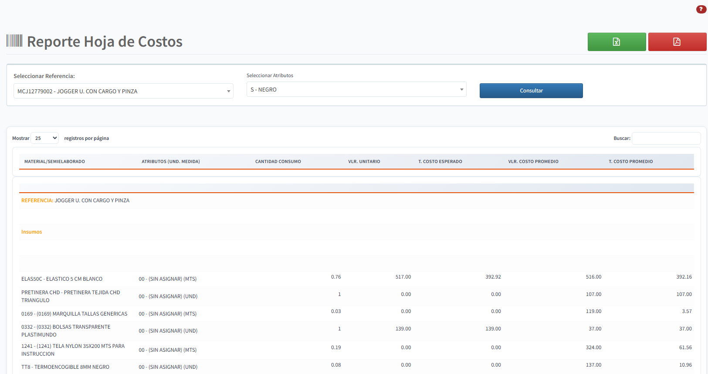
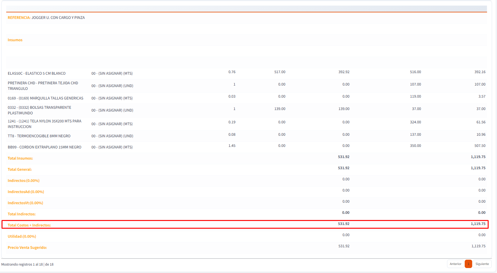

[Regresar a Producción](../readme.md)

---

# HOJA DE COSTOS

La Hoja de Costos es un reporte que permite consultar el detalle de los costos de producción de una referencia específica, mostrando los materiales, semielaborados y costos asociados a su fabricación.

## Objetivo

Este reporte permite analizar la estructura de costos de una referencia fabricada, comparando los costos esperados (definidos en la hoja de consumos en) versus los costos promedio reales en inventario.

## Acceso

- **Ruta:** Producción > Consultas y Reportes > Hoja de Costos
- **Permisos requeridos:** Ver módulo de Producción

## Parámetros de Consulta

### Campos de Filtro

1. **Seleccionar Referencia**
   - Campo obligatorio
   - Permite seleccionar la [referencia](../../inventarios/maestros/referencias.md) a consultar
   - Solo muestra referencias de tipo "R" (Referencias fabricadas)

2. **Seleccionar Atributos**
   - Campo dependiente de la referencia seleccionada
   - Muestra los [atributos principales](../../inventarios/maestros/atributos-principales.md) y [secundarios](../../inventarios/maestros/atributos-secundarios.md) disponibles
   - Permite filtrar la hoja de costos por un atributo específico

3. **Botón Consultar**
   - Ejecuta la consulta con los parámetros seleccionados

## Información Presentada

El reporte muestra una tabla con el detalle de costos que incluye:

| Campo | Descripción |
|-------|-------------|
| **Material/Semielaborado** | Referencia consumida en la producción ([materiales](../../inventarios/maestros/referencias.md) o semielaborados) |
| **Atributos (Und. Medida)** | Atributos del material y su [unidad de medida](../../inventarios/maestros/unidades-de-medida.md) |
| **Cantidad Consumo** | Cantidad definida en la hoja de consumos para producir una unidad |
| **Vlr. Unitario** | Valor unitario esperado del material según hoja de consumos |
| **T. Costo Esperado** | Total costo esperado (Cantidad × Vlr. Unitario) |
| **Vlr. Costo Promedio** | Costo promedio actual del material en inventario |
| **T. Costo Promedio** | Total costo promedio (Cantidad × Vlr. Costo Promedio) |

## Casos de Uso

### 1. Análisis de Rentabilidad
Comparar el costo esperado versus el costo promedio real permite identificar desviaciones en los costos de producción.

### 2. Actualización de Precios
Utilizar la información para actualizar precios de venta basados en costos reales de producción.

### 3. Control de Consumos
Verificar que los consumos definidos en las hojas de consumos correspondan con los materiales reales utilizados.

### 4. Costeo de Productos
Calcular el costo total de fabricación de un producto sumando todos los materiales y semielaborados requeridos.

## Exportaciones

El reporte soporta exportación a:
- **Excel:** Para análisis detallado y cálculos adicionales
- **PDF:** Para documentación y presentación

## Conceptos Relacionados

- **[Referencias](../../inventarios/maestros/referencias.md):** Productos fabricados o materiales
- **[Hojas de Consumos](../../inventarios/maestros/hojas-consumos.md):** Definición de materiales requeridos
- **[Atributos](../../inventarios/maestros/atributos-principales.md):** Variaciones de las referencias
- **[Órdenes de Producción](../movimientos/ordenes-produccion.md):** Ejecución de la producción
- **[Unidades de Medida](../../inventarios/maestros/unidades-de-medida.md):** Unidades de cantidad

## Notas Importantes

- La hoja de costos se calcula con base en las [hojas de consumos](../../inventarios/maestros/hojas-consumos.md) configuradas para la referencia
- El costo promedio se obtiene del inventario actual de cada material
- Las diferencias entre costo esperado y costo promedio pueden indicar variaciones en precios de materias primas
- Si una referencia no tiene hoja de consumos configurada, el reporte no mostrará información

## Ver También

- [Estado de Órdenes de Producción](estado-ordenes-produccion.md)
- [Trazabilidad](trazabilidad.md)
- [Órdenes de Producción](../movimientos/ordenes-produccion.md)
