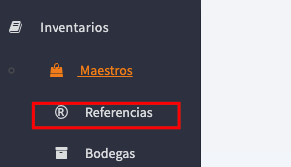
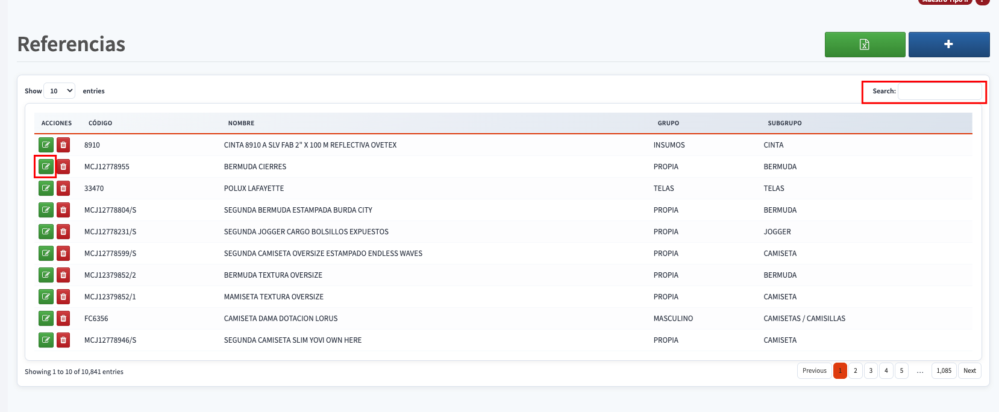
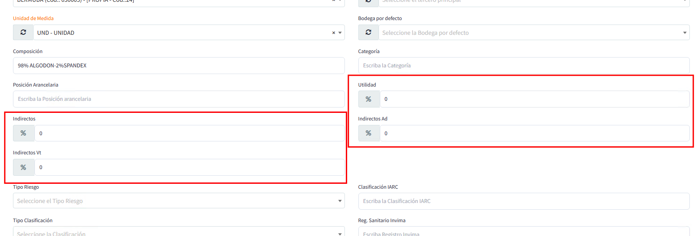
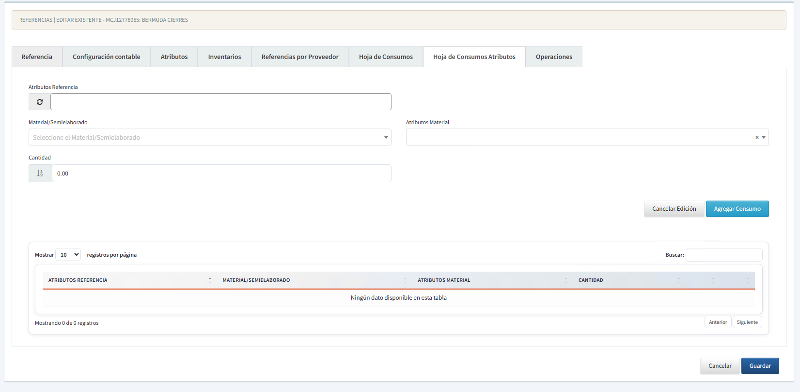

[Regresar a Inventarios](../readme.md)
---
# HOJA DE CONSUMOS

Permite configurar los materiales o semielaborados que se consumen en la producción de una [referencia](referencias.md), junto con sus cantidades y porcentajes de costos.

## Pre-requisitos
1. [Referencias](referencias.md) creada
2. [Materiales/Semielaborados](materiales.md) definidos en maestros
3. [Atributos](atributos.md) configurados (si aplica)
4. Porcentajes de costos definidos

## Acceso al Módulo


Navegar a **Inventarios → Referencias**

## Buscar y Editar Referencia


1. Usar campo **Search:** para buscar por código, nombre, grupo o subgrupo
2. Clic en botón de edición (✏️ verde) en columna **ACCIONES**

## Configurar Porcentajes


Definir los siguientes porcentajes en la pestaña de configuración general:

| Campo | Descripción |
|-------|-------------|
| **Indirectos** | Costos indirectos de fabricación |
| **Indirectos Vt** | Costos indirectos de ventas (comisiones, transporte, publicidad) |
| **Utilidad** | Margen de ganancia objetivo |
| **Indirectos Ad** | Costos administrativos indirectos |

**Fórmula Precio Sugerido:**
```
Precio = Costo Directo × (1 + Ind/100) × (1 + Ind_Vt/100) × (1 + Utilidad/100) × (1 + Ind_Ad/100)
```

## Hoja de Consumos General


Usar cuando los consumos aplican para **todas las unidades** de la referencia.

### Configuración
1. Seleccionar **Material/Semielaborado** del dropdown
2. Ingresar **Cantidad** (unidades por producto terminado)
3. Definir **Atributos Material** (opcional, si el material tiene variaciones)
4. Clic en **Agregar Consumo**

### Tabla de Consumos
Lista los consumos configurados con:
- Material/Semielaborado
- Atributo (si aplica)
- Cantidad

## Hoja de Consumos Particular (Con Atributos)


Usar cuando los consumos **varían según atributos** de la referencia (talla, color, modelo, etc.)

### Configuración
1. Seleccionar **Atributos Referencia** (define para qué variación aplica)
2. Seleccionar **Material/Semielaborado**
3. Definir **Atributos Material** (si aplica)
4. Ingresar **Cantidad**
5. Clic en **Agregar Consumo**

### Diferencias General vs Particular

| Aspecto | General | Particular |
|---------|---------|------------|
| **Atributos Referencia** | No se usan | ✅ Requeridos |
| **Aplicación** | Todos los productos | Solo variaciones específicas |
| **Uso típico** | Productos estándar | Productos con variaciones |

### Ejemplo
```
Referencia: CAMISETA POLO
Consumo 1:
  Atributos Referencia: Talla S
  Material: TELA PIQUE
  Cantidad: 0.6 metros

Consumo 2:
  Atributos Referencia: Talla M
  Material: TELA PIQUE
  Cantidad: 0.7 metros
```

## Validaciones del Sistema
- Material debe existir en maestro
- Cantidad mayor a 0
- No duplicar combinaciones Material + Atributos
- Atributos deben estar definidos en maestros

**NOTA:** Los cambios en porcentajes afectan el costo total, precio sugerido y reportes financieros. Guardar con **Agregar Consumo** después de cada entrada.