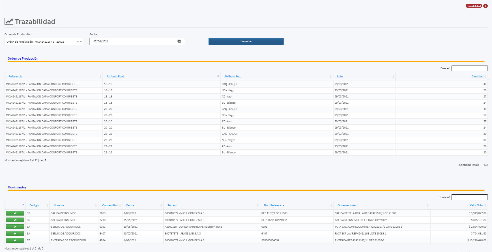
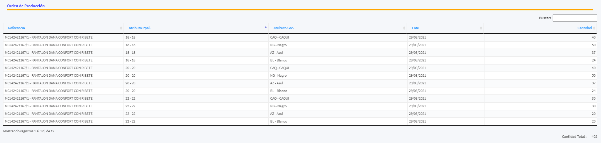
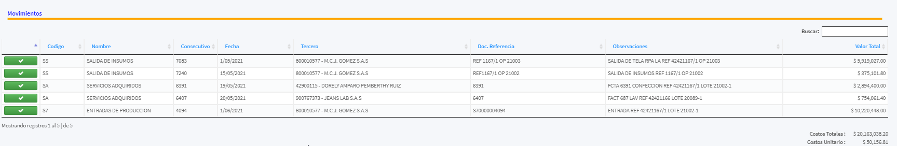
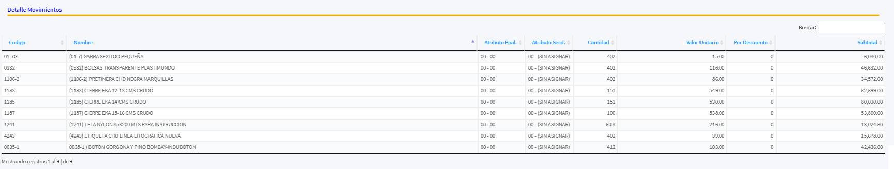
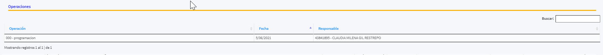

[Regresar a Producción](../readme.md)

---
# TRAZABILIDAD DE ORDENES DE PRODUCCIÓN

Nos permite consultar los movimientos de una [orden de producción](../movimientos/ordenes-produccion.md)

## Pre-requisitos

1. [Orden de Producción](../movimientos/ordenes-produccion.md) a consultar
2. Fecha de Análisis

## Detalle de la Orden de Producción

Se lista la información de la orden como:

- [Referencia](../../inventarios/maestros/referencias.md)
- [Atributos Principales](../../inventarios/maestros/atributos-principales.md)
- [Atributos Secundarios](../../inventarios/maestros/atributos-secundarios.md)
- Fecha
- Cantidad

adicional el Total de la Cantidad.

## Movimientos

Se lista los movimientos asociados a la orden:

- [Tipo de Movimiento](../../configuracion/seguridad/tipos-de-movimiento.md)
- Consecutivo
- Fecha
- [Tercero / Proveedor](../../contabilidad/maestros/terceros.md)
- Documento Referencia
- Observaciones 
- Valor Total del Documento

al darle clic en el "Boton VERDE" se despliega la información detallada del movimiento seleccionado

Aquí se lista los siguientes datos:

- [Referencia](../../inventarios/maestros/referencias.md)
- [Atributos Principales](../../inventarios/maestros/atributos-principales.md)
- [Atributos Secundarios](../../inventarios/maestros/atributos-secundarios.md)
- Cantidad
- Valor Unitario
- Porcentaje Descuento
- Subtotal 

## Operaciones

Información de los [Movimientos de las Ordenes de Producción](../movimientos/movimientos-produccion.md)

- [Operación](../maestros/operacion.md)
- Fecha
- [Responsable](../../contabilidad/maestros/terceros.md)
