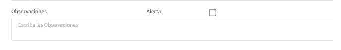

[Regresar al Inicio](../README.md)

---
# Release 2022-01
- Se implementa restricción para que cuando los movimientos de Ventas, Compras, Gastos tengan un recibo de caja o egreso estos no se permitan modificar (2022-01-06)
- Se adiciona a las referencias el IVA Descontable para ser utilizado en Compras y en Gastos (2022-01-06)

- Se adicionan los campos necesarios en Conceptos, Empleados y Compañías para el proceso de Nómina Electrónica (2022-01-06)

- Se implementa el Saldo de Cartera en Recibos de Caja y Egresos (2022-01-07)
- Se implementa consulta de  [Listas de Precios ](../inventarios/consultas/listas-precios.md) (2022-01-14)
- Se agrega mensaje de alerta en Observaciones (2022-01-14)

---
# BUGs (Errores Solucionados)

- Se organiza que la Fecha efectiva en Recibos de Caja y Egresos se guarde adecuadamente (2022-01-06)
- Se organiza que al buscar se le pueda dar ENTER en los Movimientos, Referencias y terceros (2022-01-07)

---
# Actividades Pendientes

- Permitir modificar cantidades en  Ordenes de Producción.
- Revisar BUG de guardado doble en Ordenes de Producción
- En Ventas organizar que se traiga el Cliente por Defecto
- Implementar Totales de los Inventarios por atributo principal y Secundario
- Colocar texto de Habeas Data en impresiones de Ventas (MCJ)
- Exportar los informes de contabilidad a Excel 
- Permitir captura de terceros en el movimiento de ventas
- Implementar Cuadre de Caja
- Implementar el Plan Separe (Verificar Sistema / Procedimiento)
- Implementar reporte de Cartera por Sucursal
- Poder ver el ticket promedio por Bodega
- Implementar Factura Electrónica desatendida
- Certificados de Retención en la fuente
s- Consulta de Asientos Contables con Filtros para mejorar la busqueda