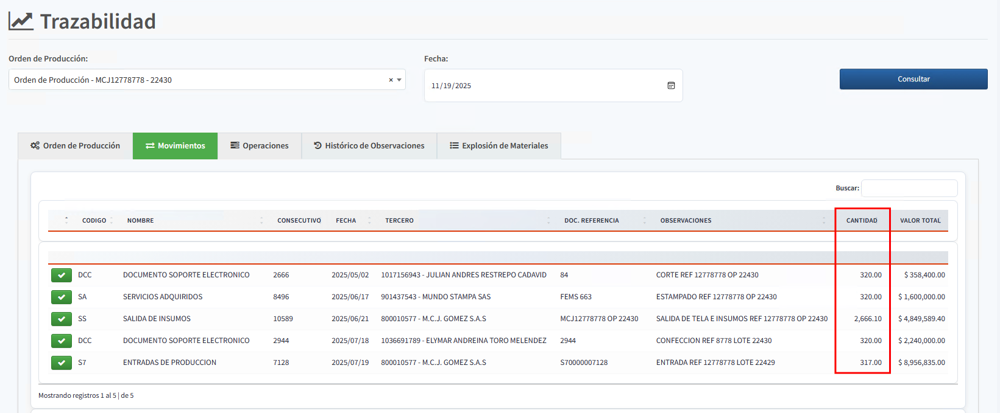

[Regresar al Inicio](../README.md)

---
# Release 2025-11
- Se agrega la cantidad total en movimientos en la [Trazabilidad de ordenes de producción](../produccion/consultas-reportes/trazabilidad.md).

---
# BUGs (Errores Solucionados)
- Se organiza para que no se dupliquen los adjuntos en referencias, al momento de crear referencias
- Se verifica error al crear referencias (Ya existían las referencias)
- Se bloquea el botón de guardar en movimientos para que no se dupliquen movimientos por error

