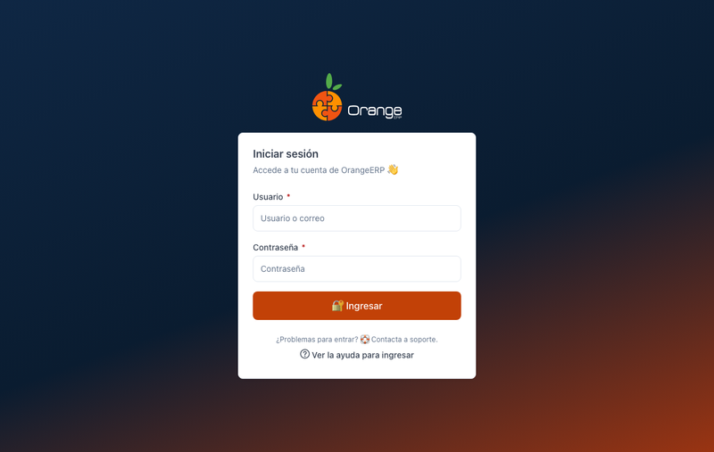
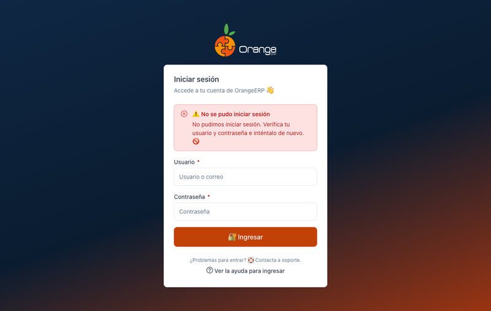

[Regresar al Inicio](../README.md)

---

# 🔐 Ingresar a OrangeERP

---

## 📋 Descripción

Para usar OrangeERP ingrese con su **usuario** y **contraseña**. Después elegirá la compañía con la que va a trabajar. Ver [Elegir la compañía](seleccion-compania.md).

---

## ➡️ Paso a paso

1. Escriba su **usuario** (o correo).
2. Escriba su **contraseña**.
3. Haga clic en **Ingresar** o presione **Enter**.

Si todo está bien, verá **"Sesión iniciada"** y pasará a elegir la compañía.

> 💡 Si solo tiene acceso a **una compañía**, el sistema entra directamente a ella.

---

## ⚠️ ¿Qué puede salir mal?

| Mensaje | Qué hacer |
|---------|-----------|
| El usuario es obligatorio. / La contraseña es obligatoria. | Complete el campo que falta. |
| No pudimos iniciar sesión. Verifica tu usuario y contraseña… | Revise los datos (mayúsculas, bloqueo de mayúsculas). |
| …Demasiados intentos fallidos: tu acceso está bloqueado temporalmente… | Espere unos minutos e inténtelo de nuevo. Si persiste, consulte al administrador. |
| El servicio no está disponible en este momento… | Inténtelo más tarde. Si continúa, contacte a soporte. |
| Tu sesión se cerró en otra pestaña | Cerró sesión en otra pestaña del navegador: ingrese de nuevo. |

---

## 🚪 Cerrar sesión

Use el botón **Salir** (ícono de puerta) en la barra superior. Al cerrar sesión en una pestaña, **se cierran todas** las pestañas de OrangeERP abiertas en ese navegador.

---

## ❓ Ayuda

En la pantalla de ingreso, el enlace **Ver la ayuda para ingresar** abre este manual. Dentro de la aplicación, el botón **?** junto al título de cada pantalla abre su manual en un panel lateral. Ver [Manejo general de la información](manejo-general-informacion.md#-ayuda-en-cada-pantalla).
