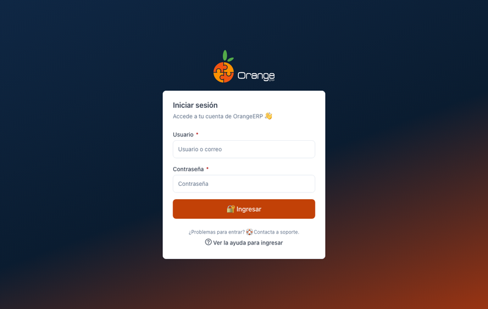
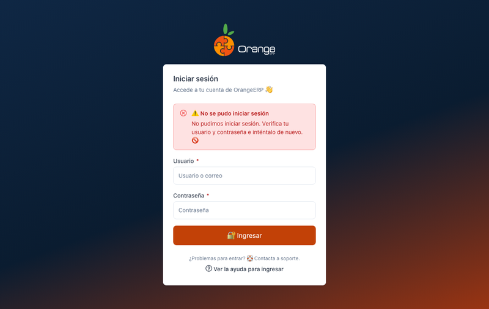
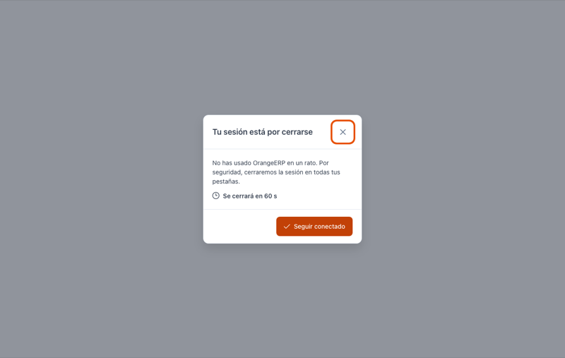
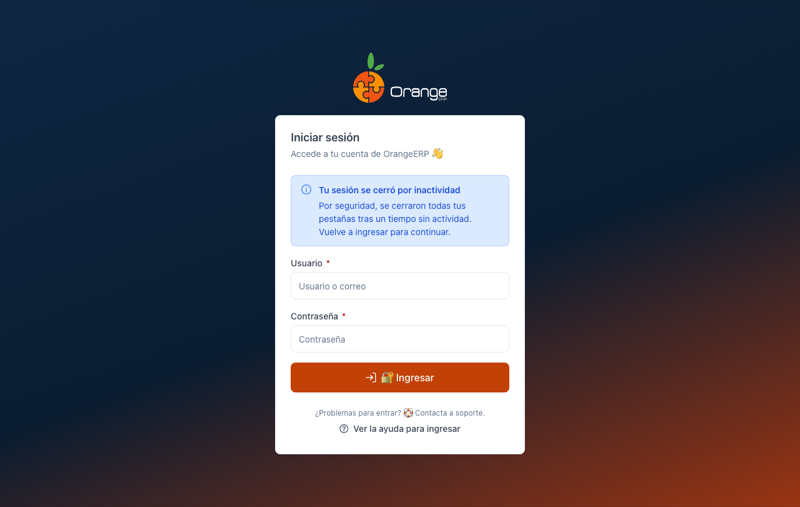

[Regresar al Inicio](../README.md)

---

# 🔐 Ingresar a OrangeERP

---

## 📋 Descripción

Para usar OrangeERP ingrese con su **usuario** y **contraseña**. Después elegirá la compañía con la que va a trabajar. Ver [Elegir la compañía](seleccion-compania.md).

---

## ➡️ Paso a paso

1. Escriba su **usuario** (o correo).
2. Escriba su **contraseña**.
3. Haga clic en **Ingresar** o presione **Enter**.

Si todo está bien, verá **"Sesión iniciada"** y pasará a elegir la compañía.

> 💡 Si solo tiene acceso a **una compañía**, el sistema entra directamente a ella.

---

## ⚠️ ¿Qué puede salir mal?

| Mensaje | Qué hacer |
|---------|-----------|
| El usuario es obligatorio. / La contraseña es obligatoria. | Complete el campo que falta. |
| No pudimos iniciar sesión. Verifica tu usuario y contraseña… | Revise los datos (mayúsculas, bloqueo de mayúsculas). |
| …Demasiados intentos fallidos: tu acceso está bloqueado temporalmente… | Espere unos minutos e inténtelo de nuevo. Si persiste, consulte al administrador. |
| El servicio no está disponible en este momento… | Inténtelo más tarde. Si continúa, contacte a soporte. |
| Tu sesión se cerró en otra pestaña | Cerró sesión en otra pestaña del navegador: ingrese de nuevo. |
| Tu sesión se cerró por inactividad | Pasaron 30 minutos sin usar OrangeERP: ingrese de nuevo. Ver *Cierre de sesión por inactividad*. |
| Un administrador cerró tu sesión | Un SuperUsuario cerró su sesión (por ejemplo, antes de un mantenimiento): puede ingresar de nuevo de inmediato. |

---

## 🚪 Cerrar sesión

Use el botón **Salir** (ícono de puerta) en la barra superior. Al cerrar sesión en una pestaña, **se cierran todas** las pestañas de OrangeERP abiertas en ese navegador.

---

## ⏳ Cierre de sesión por inactividad

Por seguridad, si pasa **30 minutos sin usar OrangeERP** (sin tocar el teclado, el ratón o la pantalla) en **ninguna** de sus pestañas, la sesión se cierra sola.

**Un minuto antes** verá este aviso con una cuenta atrás:

- Pulse **Seguir conectado** (o cierre el aviso con la **X**) para continuar trabajando: el conteo de 30 minutos empieza de nuevo.
- Si no hace nada, al llegar a 0 la sesión se cierra.

El tiempo cuenta para **todas las pestañas a la vez**: mientras trabaje en una, las demás no se cierran; y al pulsar **Seguir conectado** en una, el aviso desaparece de todas. Cuando la sesión se cierra, **todas** las pestañas vuelven a la pantalla de ingreso con este mensaje:

Ingrese de nuevo con su usuario y contraseña para continuar.

> ⚠️ Lo que no haya guardado se pierde al cerrarse la sesión. Guarde su trabajo antes de dejar el equipo.

> 💡 Que una pantalla se actualice sola (por ejemplo, una lista **En vivo**) no cuenta como actividad: solo cuenta lo que usted hace.

---

## ❓ Ayuda

En la pantalla de ingreso, el enlace **Ver la ayuda para ingresar** abre este manual. Dentro de la aplicación, el botón **?** junto al título de cada pantalla abre su manual en un panel lateral. Ver [Manejo general de la información](manejo-general-informacion.md#-ayuda-en-cada-pantalla).
