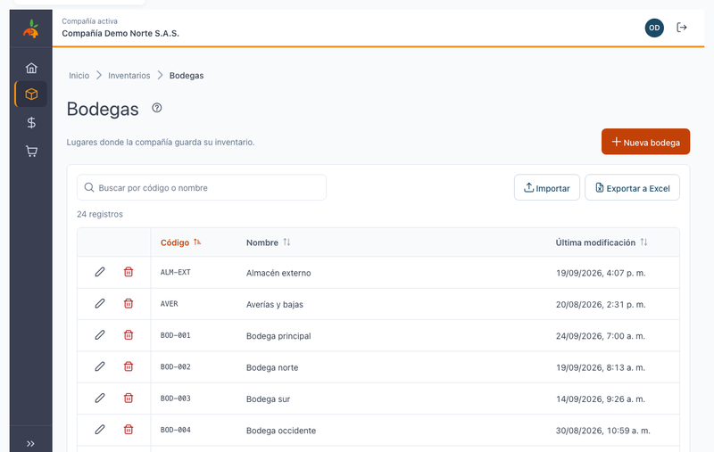
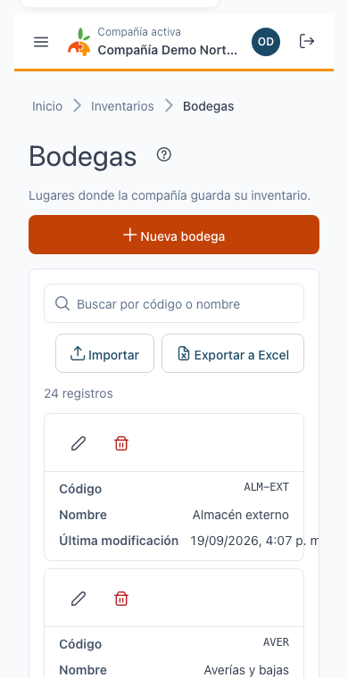
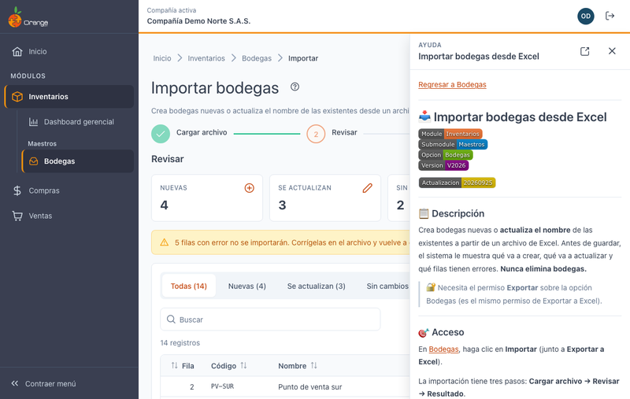

[Regresar al Inicio](../README.md)

---

# 🧰 Manejo general de la información

---

## 📋 Descripción

Las pantallas de OrangeERP V2026 funcionan igual: una **tabla** para consultar, **diálogos** para crear y editar, **confirmación** para eliminar y el botón **?** con la ayuda. Este manual explica esas partes comunes; cada opción (por ejemplo, [Bodegas](../inventarios/maestros/bodegas.md)) explica lo suyo.

---

## 📊 Tablas

| Acción | Cómo |
|--------|------|
| **Buscar** | Escriba en **Buscar**: filtra mientras escribe, sin distinguir mayúsculas ni tildes. La **✕** borra la búsqueda. |
| **Ordenar** | Clic en el encabezado de una columna: ascendente, descendente y sin orden. |
| **Paginar** | Flechas y números de página abajo; **Filas por página** (10, 20, 50 o 100). |
| **Acciones de la fila** | Íconos (editar ✏️, eliminar 🗑️…) en la **primera columna**, siempre visibles aunque la tabla se desplace. |
| **Exportar a Excel** | Descarga un `.xlsx` con **todas** las filas del filtro y orden actuales, encabezado fijo y filtros de Excel. |
| **Importar** | En las opciones que lo permiten, carga datos desde una plantilla de Excel con revisión antes de guardar. |

> 🔒 Los botones dependen de los permisos de su perfil (Crear, Actualizar, Eliminar, Exportar…). Si no ve uno, su perfil no lo tiene.

### En el celular

Cada fila se muestra como una **tarjeta**, con las acciones arriba.

---

## ✏️ Crear y editar

- Se hace en un **diálogo** sobre la tabla, sin salir de la pantalla.
- Los errores aparecen **debajo de cada campo** al guardar.
- **Guardar** (o **Enter**) guarda; **Cancelar** o **Esc** cierra sin guardar.
- Al guardar verá un aviso de éxito abajo a la derecha.

## 🗑️ Eliminar

Siempre pide **confirmación**. Si el registro tiene información relacionada en otros módulos, no se elimina y verá el motivo.

---

## ❓ Ayuda en cada pantalla

- El botón **?** junto al título abre el manual de la pantalla en un **panel lateral**. Puede seguir trabajando con el panel abierto.
- Los enlaces a otros manuales se abren **dentro del panel**; **←** vuelve al anterior.
- El ícono **↗** abre el manual en una pestaña nueva; **✕** o **Esc** cierra el panel.
- Si una pantalla aún no tiene manual, el panel lo indica.

---

## 🖥️ Título y color de la pestaña

El título de cada pestaña empieza con la compañía y el ícono tiene su color e iniciales. Ver [Elegir la compañía](seleccion-compania.md#-varias-compañías-a-la-vez).
