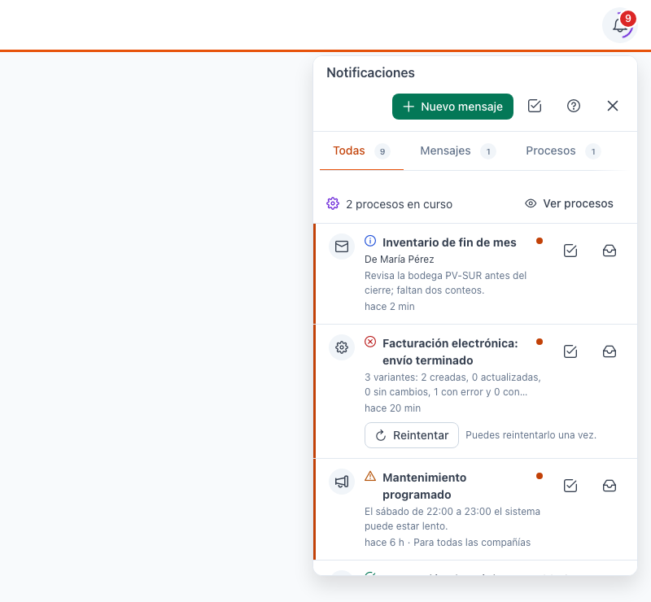
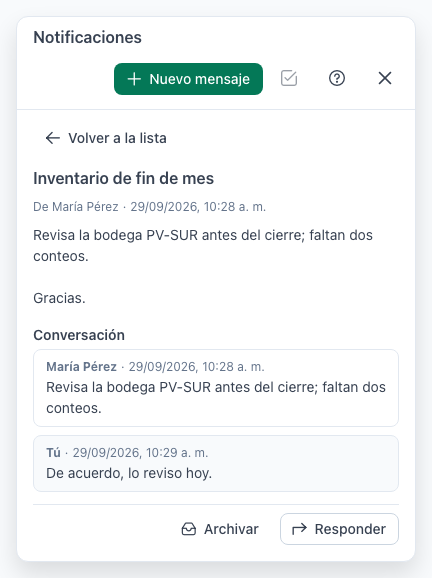
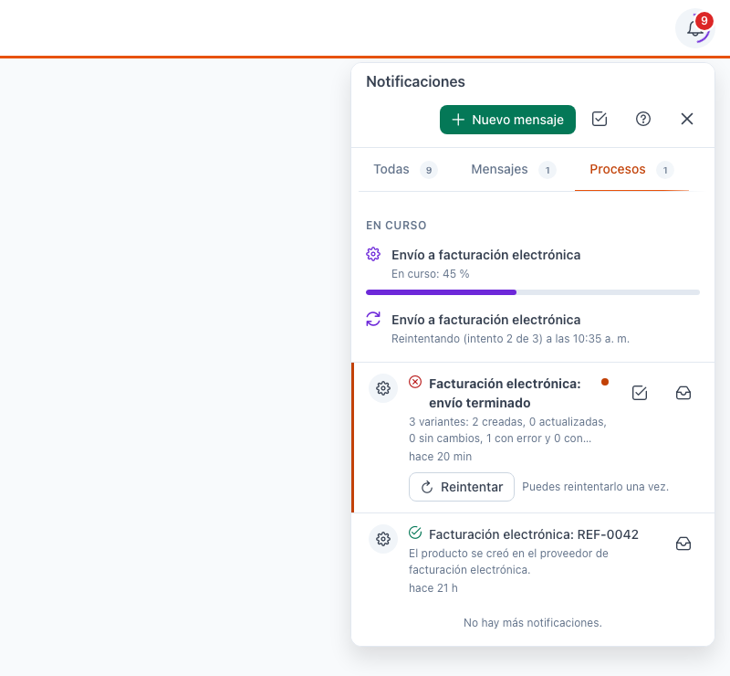
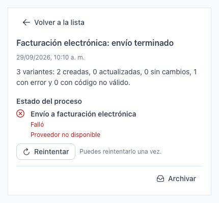
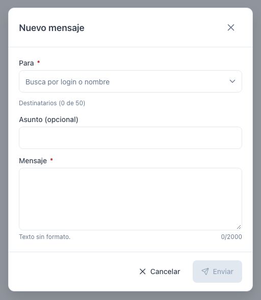
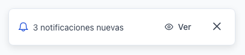
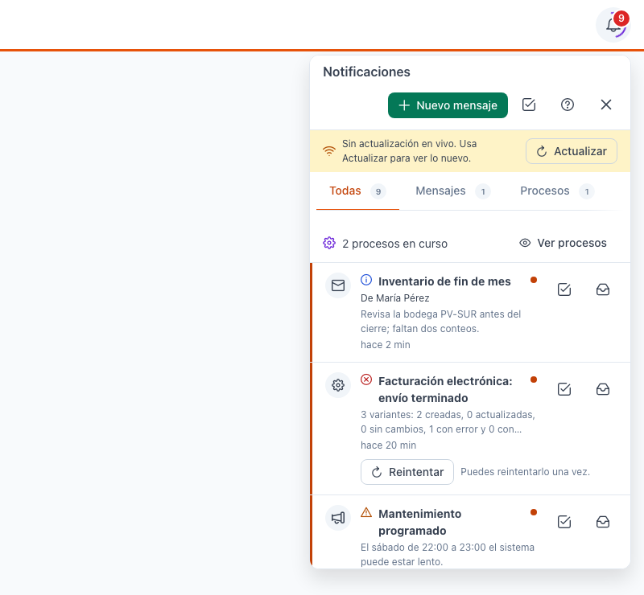
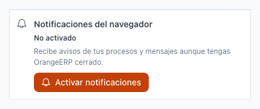
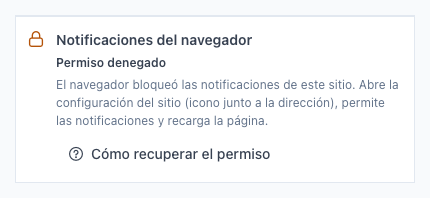

[Regresar al Inicio](../README.md)

---

# 🔔 Notificaciones

---

## 📋 Descripción

La **campana** de la barra superior le avisa de lo que pasa fuera de la pantalla en la que está trabajando:

- **Mensajes** que le escriben otros usuarios de su compañía.
- **Procesos**: el resultado de tareas que el sistema hace en segundo plano (por ejemplo, un envío a facturación electrónica o el cálculo de un informe).
- **Avisos del sistema**: comunicados generales, como un mantenimiento programado.

Desde el mismo panel puede **escribir mensajes**, **reintentar** un proceso que falló y **activar los avisos del navegador** para enterarse aunque no tenga OrangeERP a la vista.

---

## 🎯 Acceso

Haga clic en la **campana** de la barra superior, a la derecha. Está en todas las pantallas.

| Qué ve en la campana | Qué significa |
|----------------------|---------------|
| **Número rojo** | Notificaciones sin leer de la compañía de esta pestaña, más los avisos para todas las compañías. Desde 100 se muestra **99+**. Sin número: no tiene nada pendiente. |
| **Anillo violeta girando** | Tiene procesos en curso. |

> 💡 Cada pestaña del navegador trabaja con **una compañía**: la campana solo cuenta y muestra lo de esa compañía (y los avisos generales). Para ver lo de otra compañía, ábrala en otra pestaña (ver [Elegir la compañía](seleccion-compania.md)).

> ℹ️ Si no ve la campana, las notificaciones todavía no están habilitadas para su empresa.

---

## 🖥️ El panel de notificaciones

| Elemento | Para qué sirve |
|----------|----------------|
| **Nuevo mensaje** | Escribe un mensaje a otros usuarios de la compañía. Ver *Enviar un mensaje*. |
| **Marcar todas como leídas** (icono ☑ de la cabecera) | Marca como leídas todas las notificaciones de la pestaña que está viendo. |
| **?** | Abre esta ayuda. |
| **✕** | Cierra el panel. También se cierra con **Esc** o con un clic fuera de él. |
| **Todas / Mensajes / Procesos / Sistema** | Filtran la lista por tipo. Cada pestaña muestra cuántas tiene sin leer. |
| **N procesos en curso · Ver procesos** | Aparece en *Todas* cuando hay procesos trabajando. **Ver procesos** lo lleva a la pestaña Procesos. |
| **Lista** | Las notificaciones, de la más reciente a la más antigua. Al bajar se cargan más solas. |

Cada notificación muestra:

- Un **icono del tipo**: sobre para mensajes, engranaje para procesos y megáfono para avisos del sistema.
- Un **icono de gravedad** junto al título: información, éxito, advertencia o error.
- El **título** (en negrita y con un punto naranja si no la ha leído), quién la envió, un resumen y hace cuánto llegó.
- *Para todas las compañías*, si es un aviso general.
- **Marcar como leída** (☑) y **Archivar** (bandeja): archivar la quita de la lista.

### Abrir una notificación

Haga clic en la notificación:

- Si lleva a una pantalla (por ejemplo, el resultado de un proceso sobre una referencia), el panel se cierra, la notificación queda leída y se abre esa pantalla. Solo pasa si su perfil tiene permiso para consultarla.
- Si no, se abre el **detalle** dentro del mismo panel, con el texto completo. Use **Volver a la lista** para regresar.

---

## ⚙️ Procesos

Algunas tareas tardan y el sistema las hace en segundo plano mientras usted sigue trabajando. En la pestaña **Procesos**, arriba, la sección **En curso** muestra cómo va cada una:

| Estado | Qué significa |
|--------|---------------|
| **En espera** | El proceso está en cola y empezará pronto. |
| **En curso: 45 %** | Está trabajando; la barra muestra el avance. |
| **Reintentando (intento 2 de 3) a las …** | Hubo un problema pasajero y el sistema lo volverá a intentar solo a esa hora. |
| **Interrumpido** | Se detuvo de forma inesperada; el sistema lo retomará. |

Cuando el proceso termina, sale de *En curso* y le llega una notificación con el resultado.

### Reintentar un proceso que falló

Si un proceso falla después de sus intentos automáticos, la notificación del error muestra **Reintentar** y *"Puedes reintentarlo una vez."*

1. Haga clic en **Reintentar** (en la lista o en el detalle).
2. El proceso vuelve a *En curso* y verá *"El proceso se volvió a poner en cola."*

> ⚠️ Solo puede reintentar **una vez** y solo los procesos que usted inició. Si vuelve a fallar, revise la causa que indica la notificación o consulte a soporte.

---

## ✉️ Enviar un mensaje

Los mensajes sirven para avisos cortos entre usuarios de la **misma compañía**. No es un chat: se escribe y se responde.

1. En el panel, haga clic en **Nuevo mensaje**.
2. En **Para**, busque a la persona por su login o su nombre y elíjala. Repita para agregar más destinatarios (hasta **50**). Para quitar a alguien, use la **✕** de su nombre.
3. Escriba un **Asunto** (opcional, hasta 150 caracteres) y el **Mensaje** (hasta 2.000 caracteres, texto sin formato).
4. Haga clic en **Enviar**.

Verá *"Mensaje enviado."* y los destinatarios lo reciben en su campana.

**Responder**: abra el mensaje y haga clic en **Responder**. La respuesta va a quien le escribió; en el detalle verá la **Conversación** completa.

| Mensaje | Qué hacer |
|---------|-----------|
| Elige al menos un destinatario. / Escribe el mensaje. | Complete lo que falta. **Enviar** se habilita cuando hay destinatario y mensaje. |
| Algún destinatario ya no puede recibir mensajes en esta compañía. Revisa la lista. | Quite a esa persona: ya no está activa o no tiene la compañía asignada. |
| Enviaste muchos mensajes seguidos. Espera un momento e inténtalo de nuevo. | Hay un límite de mensajes por minuto y por día. Espere y vuelva a enviar. |
| No se pudo enviar el mensaje… | Falló la conexión. Lo que escribió se conserva: vuelva a enviar. |

---

## 🔄 Avisos al llegar algo nuevo

Mientras tiene OrangeERP abierto, las notificaciones llegan solas: la campana se actualiza y abajo a la derecha aparece un aviso breve con el título. Si llegan varias seguidas, se agrupan en un solo aviso, por ejemplo *"3 notificaciones nuevas"*. Haga clic en **Ver** para abrir el panel.

El aviso se cierra solo a los pocos segundos (o con la **✕**). Solo aparece en la pestaña que está mirando.

Si se pierde la conexión en vivo, el panel lo indica:

- *"Reconectando…"*: lo nuevo aparecerá cuando vuelva la conexión.
- *"Sin actualización en vivo. Usa Actualizar para ver lo nuevo."*: haga clic en **Actualizar** cuando quiera revisar.

---

## 📲 Notificaciones del navegador

Al final del panel puede activar los avisos del sistema operativo para **este navegador**. Así se entera de sus mensajes y del resultado de sus procesos aunque tenga OrangeERP cerrado o en segundo plano.

1. Haga clic en **Activar notificaciones**.
2. Si el navegador le pregunta, haga clic en **Permitir**.
3. El bloque cambia a **Activo en este dispositivo**.

Para dejar de recibirlas, haga clic en **Desactivar notificaciones**.

- Solo le llegan cuando **no** tiene OrangeERP a la vista; si lo está mirando, las ve en la campana y no se repiten.
- Por privacidad, el aviso solo dice de qué se trata (por ejemplo, *"Nuevo mensaje de …"* o el nombre del proceso y si terminó o falló), nunca el contenido.
- Al hacer clic en el aviso se abre OrangeERP en la compañía y la pantalla correspondientes.
- Puede activarlas hasta en **5 dispositivos**. Si activa un sexto, se desactiva el más antiguo.
- Al cerrar sesión, se desactivan en ese navegador.

### Cómo recuperar el permiso

Si el bloque dice **Permiso denegado**, el navegador bloqueó las notificaciones de este sitio:

1. Haga clic en el icono que está junto a la dirección del sitio, en la barra del navegador.
2. Busque **Notificaciones** y cámbielo a **Permitir**.
3. Recargue la página y vuelva a hacer clic en **Activar notificaciones**.

| Estado | Qué hacer |
|--------|-----------|
| **No soportado** (iPhone o iPad) | Abra OrangeERP en Safari, toque **Compartir › Añadir a pantalla de inicio**, abra la app instalada y actívelas desde allí. |
| **No soportado** (otro navegador) | Ese navegador no permite estos avisos. Use uno actualizado (Chrome, Edge o Firefox). |
| **No se pudieron activar / desactivar** | Revise su conexión y haga clic en **Reintentar**. |

> ℹ️ Si no ve el bloque *Notificaciones del navegador*, esta función no está habilitada para su empresa.

---

## ❓ Preguntas frecuentes

**¿Por cuánto tiempo se guardan las notificaciones?**
Hasta **15 días**. Después se borran solas, leídas o no, incluidos los mensajes.

**¿Por qué no veo una notificación que me dijeron que me enviaron?**
Revise que esté en la pestaña de la compañía correcta: cada pestaña solo muestra lo de su compañía. También revise que no la haya archivado.

**Hice clic en una notificación y no me llevó a ninguna pantalla.**
Si su perfil no tiene permiso para consultar esa pantalla, la notificación se abre en el detalle, dentro del panel.

**¿Puedo escribirle a un usuario de otra compañía?**
No. Los mensajes son entre usuarios de la compañía de la pestaña.

**¿Puedo recuperar una notificación archivada?**
No. Archivar la quita de su lista.

**¿Por qué no aparece Reintentar en un proceso que falló?**
Porque ya lo reintentó una vez, porque lo inició otra persona o porque ese tipo de proceso no se puede repetir con seguridad.

**¿Los usuarios de la versión anterior de OrangeERP ven la campana?**
No. Las notificaciones solo existen en la nueva versión.
