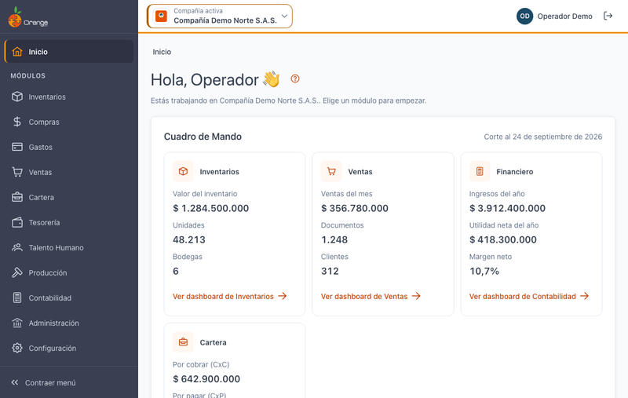
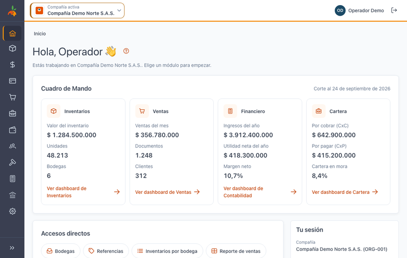
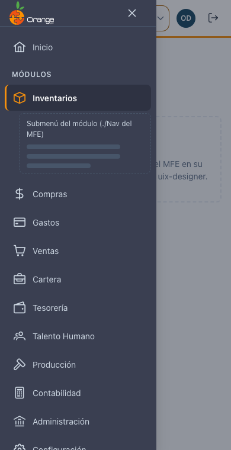

[Regresar al Inicio](../README.md)

---

# 🏠 Pantalla de Inicio y menú

---

## 📋 Descripción

El **Inicio** es la primera pantalla después de elegir la compañía. Muestra un resumen de la compañía, sus accesos directos y los módulos a los que tiene acceso.

---

## 🧭 Partes de la pantalla

| Parte | Para qué sirve |
|-------|----------------|
| **Barra superior** | Compañía activa (clic para cambiarla o abrir otra en una pestaña nueva, ver [Elegir la compañía](seleccion-compania.md)), su usuario y **Salir**. |
| **Menú lateral** | **Inicio** y los **módulos** a los que tiene acceso. Al entrar a un módulo, debajo aparecen sus opciones (por ejemplo, Inventarios › Maestros › Bodegas). |
| **Cuadro de Mando** | Indicadores principales por área (Inventarios, Ventas, Financiero, Cartera), si su perfil los tiene. **Ver dashboard de…** abre el dashboard del módulo. |
| **Accesos directos** | Las opciones que usa con frecuencia (se configuran en su perfil). |
| **Tus módulos** | Tarjetas para entrar a cada módulo. |
| **Tu sesión** | Compañía, NIT, usuario y fecha. |
| **?** | Abre esta ayuda. |

> 🔒 Solo verá los módulos, opciones e indicadores que su perfil tiene permitidos en esta compañía.

---

## 📐 Menú lateral

- **Contraer menú** (abajo del menú): deja solo los íconos para ganar espacio. Se recuerda para la próxima vez.
- En el **celular** el menú se abre con el botón ☰ de la barra superior.

---

## 🔗 Relacionado

- [Manejo general de la información](manejo-general-informacion.md): tablas, búsqueda, exportar y ayuda.
- [Dashboard de Inventarios](../inventarios/dashboard.md)
