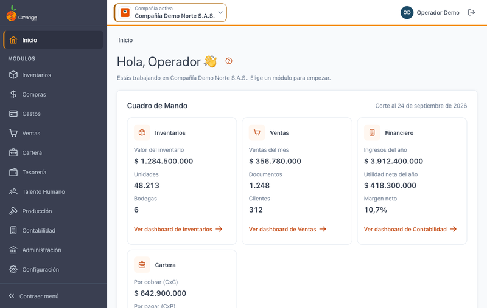
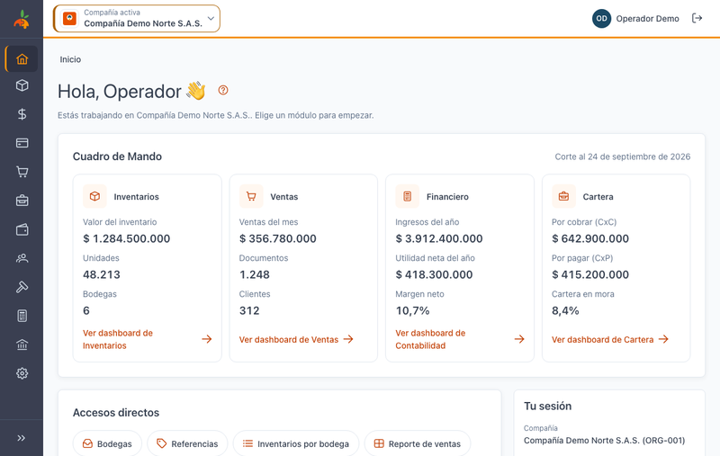
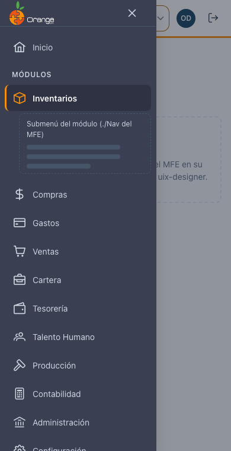
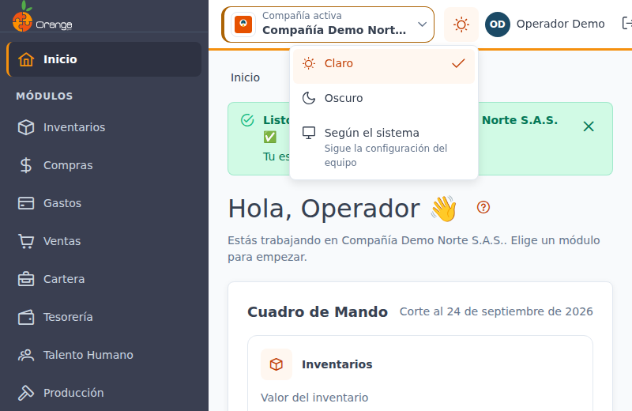
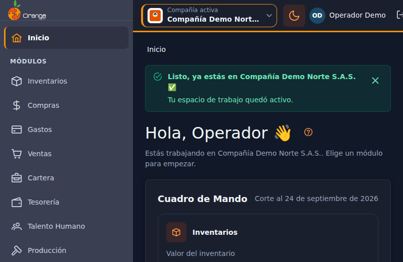

[Regresar al Inicio](../README.md)

---

# 🏠 Pantalla de Inicio y menú

---

## 📋 Descripción

El **Inicio** es la primera pantalla después de elegir la compañía. Muestra un resumen de la compañía, sus accesos directos y los módulos a los que tiene acceso.

---

## 🧭 Partes de la pantalla

| Parte | Para qué sirve |
|-------|----------------|
| **Barra superior** | Compañía activa (clic para cambiarla o abrir otra en una pestaña nueva, ver [Elegir la compañía](seleccion-compania.md)), su usuario, **Apariencia** (☀️ claro / 🌙 oscuro, ver abajo) y **Salir**. |
| **Menú lateral** | **Inicio** y los **módulos** a los que tiene acceso. Al entrar a un módulo, debajo aparecen sus opciones (por ejemplo, Inventarios › Maestros › Bodegas). |
| **Cuadro de Mando** | Indicadores principales por área (Inventarios, Ventas, Financiero, Cartera), si su perfil los tiene. **Ver dashboard de…** abre el dashboard del módulo. |
| **Accesos directos** | Las opciones que usa con frecuencia (se configuran en su perfil). |
| **Tus módulos** | Tarjetas para entrar a cada módulo. |
| **Tu sesión** | Compañía, NIT, usuario y fecha. |
| **?** | Abre esta ayuda. |

> 🔒 Solo verá los módulos, opciones e indicadores que su perfil tiene permitidos en esta compañía.

---

## 📐 Menú lateral

- **Contraer menú** (abajo del menú): deja solo los íconos para ganar espacio. Se recuerda para la próxima vez.
- En el **celular** el menú se abre con el botón ☰ de la barra superior.

---

## 🌓 Apariencia (modo claro u oscuro)

El botón **Apariencia** de la barra superior (ícono de sol, luna o monitor) cambia los colores de toda la aplicación:

| Opción | Qué hace |
|--------|----------|
| **Claro** | Fondo claro, siempre. |
| **Oscuro** | Fondo oscuro, siempre. Descansa la vista con poca luz. |
| **Según el sistema** | Sigue la configuración de su equipo o celular (cambia sola si el equipo pasa a modo oscuro). Es la opción inicial. |

- El cambio se aplica **al instante**, sin perder lo que está haciendo, y en **todas las pestañas** abiertas.
- Se recuerda **en este navegador**: en otro equipo o navegador puede elegir otra apariencia.
- Los colores de su compañía se conservan; en modo oscuro el menú lateral siempre es oscuro.

> ⌨️ Con teclado: lleve el foco a **Apariencia**, pulse **Enter**, muévase con las flechas y elija con **Enter**. **Esc** cierra el menú.

---

## 🔗 Relacionado

- [Manejo general de la información](manejo-general-informacion.md): tablas, búsqueda, exportar y ayuda.
- [Dashboard de Inventarios](../inventarios/dashboard.md)
