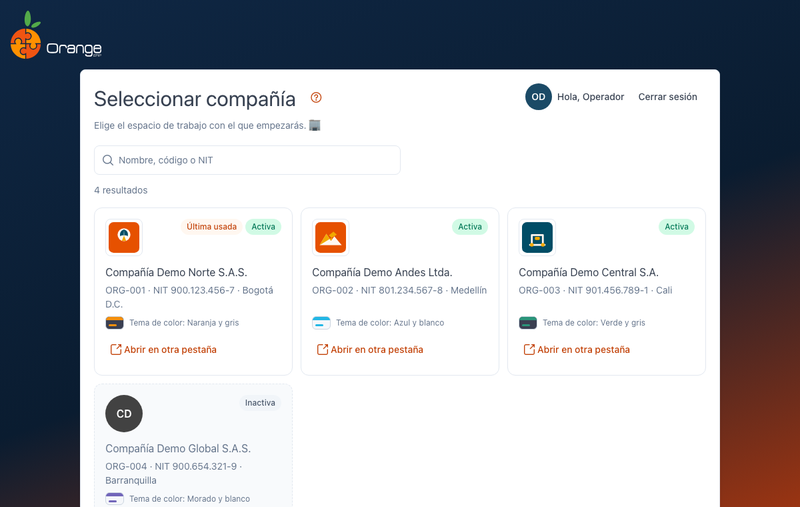
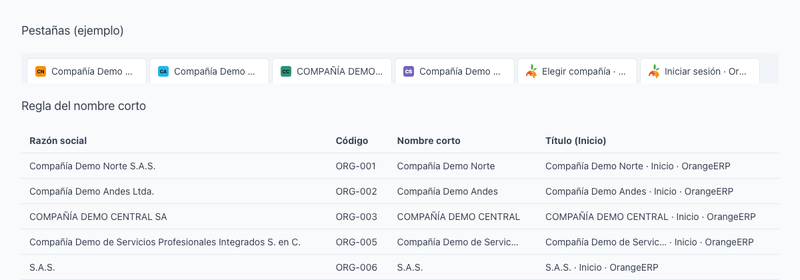
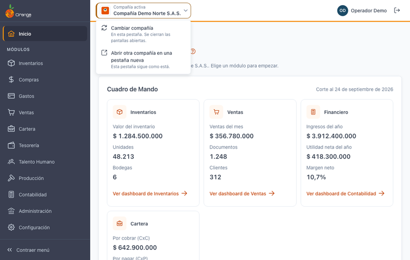

[Regresar al Inicio](../README.md)

---

# 🏢 Elegir la compañía (y trabajar con varias)

---

## 📋 Descripción

OrangeERP es **multiempresa**: después de ingresar, elija la compañía con la que va a trabajar. Cada **pestaña del navegador** trabaja con **una** compañía, y puede tener varias pestañas abiertas con compañías distintas al mismo tiempo.

---

## ➡️ Elegir la compañía

1. Busque la compañía por **nombre, código o NIT** (no distingue mayúsculas ni tildes).
2. Haga clic en la tarjeta de la compañía (o selecciónela y presione **Enter**).

| En la tarjeta | Significado |
|---------------|-------------|
| **Última usada** | La compañía con la que trabajó la última vez. |
| **Activa / Inactiva** | Una compañía inactiva no se puede abrir. |
| Color | El **tema de color** de la compañía (barra superior y menú). |

> 💡 Si solo tiene acceso a una compañía, entra directamente.

---

## 🗂️ Varias compañías a la vez

- **Abrir otra compañía en una pestaña nueva:** en la tarjeta use **Abrir en otra pestaña** (o Ctrl/Cmd + clic, o clic con la rueda del mouse). La pestaña actual no cambia.
- **Saber en qué compañía está cada pestaña:**
  - el **título de la pestaña** empieza con el nombre de la compañía (`Compañía · Pantalla · OrangeERP`);
  - el **ícono de la pestaña** tiene el **color** de la compañía y sus **iniciales**;
  - la barra superior y el menú usan el color de la compañía.

---

## 🔄 Cambiar de compañía en esta pestaña

1. Haga clic en el **nombre de la compañía** en la barra superior.
2. Elija **Cambiar compañía** (solo esta pestaña; se cierran las pantallas abiertas) o **Abrir otra compañía en una pestaña nueva**.
3. Si cambia, confirme y elija la nueva compañía.

---

## ⚠️ Mensajes

| Mensaje | Qué significa |
|---------|---------------|
| Sin compañías asignadas | Su usuario no tiene acceso a ninguna compañía. Consulte al administrador. |
| Compañía no disponible | La compañía está inactiva y no se puede abrir. |
| No tienes acceso a esa compañía o ya no está disponible / El enlace de la compañía no es válido | Abrió un enlace de una compañía a la que no tiene acceso o un enlace dañado. Elija una compañía de la lista. |
| No se pudieron cargar tus compañías | Error de conexión: use **Reintentar**. |
