[Regresar a Compras](../readme.md)

---

# 💰 Cartera de Proveedores

---

## 📋 Descripción

La **cartera de proveedores** muestra cuánto le debe la compañía a cada proveedor a una **fecha de corte**, con sus documentos (facturas, devoluciones y anticipos) y la **historia** de cómo se han ido pagando.

Es una pantalla **solo de consulta**: desde aquí no se crea, no se edita y no se elimina nada. Los pagos, las notas y las facturas se registran en sus pantallas de origen, y la cartera los toma de ahí.

> 📘 La búsqueda, el orden, la paginación y la ayuda funcionan igual en todas las tablas: ver [Manejo general de la información](../../Generales/manejo-general-informacion.md).

---

## 🎯 Acceso

1. En el menú principal, haga clic en **Compras**.
2. En **Maestros**, haga clic en **Cartera de Proveedores**.

También puede llegar desde la ficha de un proveedor: en la pantalla de [Proveedores](proveedores.md), abra la ficha y use el enlace **Cartera**. Se abre esta pantalla con ese proveedor ya abierto.

Para ver la pantalla necesita el permiso **Consultar** sobre la opción *Cartera de Proveedores*. Si no lo tiene, el ítem no aparece en el menú y, si escribe la dirección de la pantalla, vuelve a la pantalla de inicio. Para ver el botón **Exportar a Excel** necesita además el permiso **Exportar** (ver la tabla de permisos más abajo).

---

## 🖥️ Pantalla principal

| Elemento | Para qué sirve |
|----------|----------------|
| **?** (junto al título) | Abre esta ayuda en un panel lateral, sin salir de la pantalla. |
| **Fecha de corte** | Fecha hasta la que se cuentan los pagos y las notas. Por defecto es hoy. No se puede elegir una fecha futura. |
| **Rango de vencimiento** | Reparte el saldo de cada proveedor en tramos de días. Ver *Rangos de vencimiento* más abajo. |
| **Incluir proveedores en saldo cero** | Muestra también los proveedores que ya no deben nada. Ver *Saldo cero* más abajo. |
| **Más filtros** | Permite filtrar por **Tipo de movimiento** y por **Centro de costos**. |
| **Consultar** | Aplica la fecha de corte, el rango y los filtros que haya elegido. |
| **Actualizar** | Vuelve a calcular la cartera con los mismos filtros, para ver los saldos al día. |
| **Exportar a Excel** | Descarga todo el listado filtrado. Ver *Exportar a Excel* más abajo. |
| **Buscar por documento o nombre** | Filtra por NIT o por nombre del proveedor. Escriba al menos dos caracteres. |
| **Encabezados** | Un clic en el nombre de una columna ordena el listado por esa columna. Otro clic invierte el orden. Por defecto, el listado va del mayor saldo al menor. |
| **Filas por página** y paginación | Cambian cuántos proveedores ve por página (10, 25, 50 o 100). |

Las tarjetas de arriba suman el **filtro completo**, no solo la página que está viendo:

| Tarjeta | Qué suma |
|---------|----------|
| **Saldo por pagar** | Lo que la compañía debe a todos los proveedores del filtro. |
| **Vencido** | El saldo de los documentos que ya tienen atraso. |
| **Saldo a favor** | Anticipos, sobrepagos y notas sin aplicar. Ese valor ya está descontado del saldo por pagar y se muestra en negativo. |
| **Proveedores** | Cuántos proveedores cumplen el filtro actual. |

Debajo de las tarjetas aparece la línea **Saldos con corte al** (la fecha de corte) **· calculado a las** (la hora en que se calculó). Si hay proveedores en saldo cero ocultos, la línea indica cuántos son y tiene el enlace **mostrarlos**.

### Columnas del listado

| Columna | Qué muestra |
|---------|-------------|
| **NIT** | Documento del proveedor, con su dígito de verificación. |
| **Proveedor** | Nombre del proveedor. Haga clic en el nombre para ver sus documentos. |
| **Comprador** | El comprador asignado al proveedor. |
| **Docs.** | Cuántos documentos con saldo tiene el proveedor. |
| **Valor total** | Suma del valor de sus documentos. |
| **Notas** | Notas débito y crédito aplicadas a sus documentos. |
| **Pagos** | Egresos aplicados a sus documentos. |
| **Saldo** | Lo que se le debe (valor total − notas − pagos). |
| **Vencido** | La parte del saldo que ya está vencida. |
| **Mayor atraso** | Los días de atraso del documento más atrasado. Dice **Al día** si no tiene nada vencido, o **Vence en** y los días que faltan. |

Cuando elige un **rango de vencimiento**, aparecen además las columnas de tramos (ver más abajo).

Los saldos a favor se marcan con la etiqueta **A favor**. Los proveedores que están en cero y se muestran con la opción de saldo cero llevan la etiqueta **Saldo 0**.

> 📱 En pantallas pequeñas, cada proveedor se muestra como una tarjeta con sus datos principales.

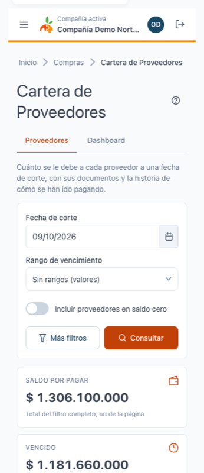

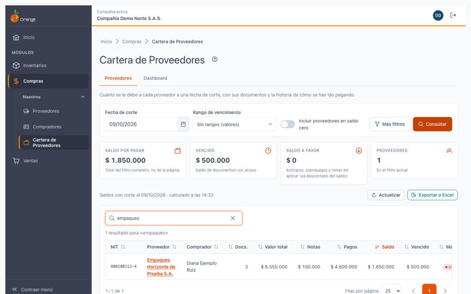

### Rangos de vencimiento

Elija un rango en **Rango de vencimiento** y haga clic en **Consultar**:

| Opción | Tramos de |
|--------|-----------|
| Sin rangos (valores) | No reparte el saldo; solo muestra el total. |
| Semanal (7 días) | 7 días. |
| Catorcenal (14 días) | 14 días. |
| Quincenal (15 días) | 15 días. |
| Mensual (30 días) | 30 días. |

Con un rango, cada proveedor muestra su saldo en tramos: los que **todavía no vencen** (*Vence en…*) y los **vencidos** (*Vencido…*). Con el rango mensual, los tramos son 1–30, 31–60, 61–90, 91–120 y más de 120 días; con los demás rangos, los tramos crecen con el mismo tamaño. La suma de los tramos siempre es igual al saldo del proveedor.

El tramo de *Vence en* más cercano incluye también los documentos que **vencen hoy**.

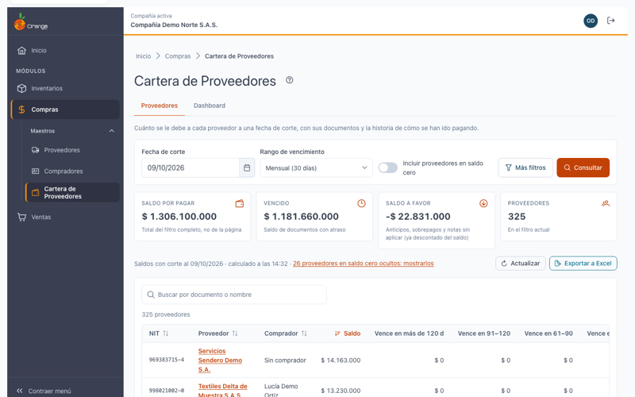

### Más filtros

Haga clic en **Más filtros** para ver:

- **Tipo de movimiento**: solo cuentan los documentos de ese tipo (por ejemplo, facturas de compra o gastos).
- **Centro de costos**: solo cuentan los documentos cuyo tipo tiene ese centro por defecto.

Elija el filtro y haga clic en **Consultar**. Con **Todos**, no se filtra.

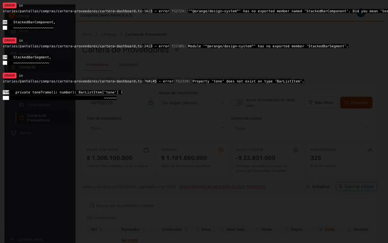

### Saldo cero

Por defecto, la lista solo muestra los proveedores que **deben algo** (saldo distinto de cero) a la fecha de corte.

- Active **Incluir proveedores en saldo cero** para ver también los proveedores que están en cero. Se marcan con **Saldo 0**.
- Con el selector **Qué mostrar** puede elegir **Con y sin saldo** o **Solo saldo cero**.

Un proveedor que nunca tuvo documentos de cartera no aparece en ningún caso.

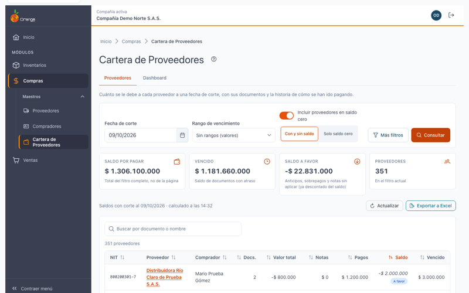

### Cuando no hay proveedores

Si a la fecha de corte no hay proveedores con saldo, verá el mensaje **No hay proveedores con saldo a esta fecha**. Cambie la fecha de corte o active **Incluir proveedores en saldo cero**.

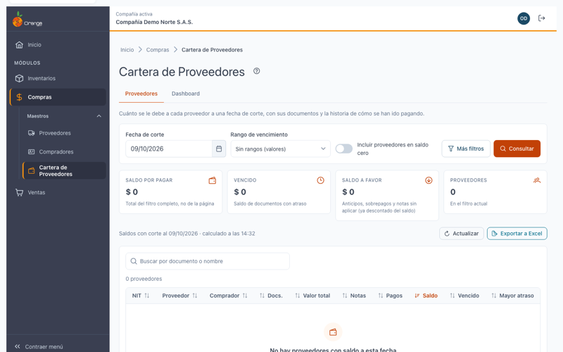

---

## 📄 Documentos de un proveedor

Haga clic en el nombre de un proveedor en el listado. Se abre la página de sus documentos, con el mismo nombre y la misma fecha de corte.

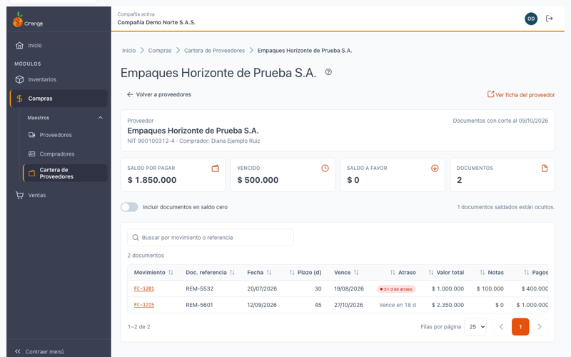

| Elemento | Para qué sirve |
|----------|----------------|
| **Volver a proveedores** | Regresa al listado con los filtros que tenía. |
| **Ver ficha del proveedor** | Abre la ficha del proveedor en la pantalla de Proveedores. |
| **Incluir documentos en saldo cero** | Muestra también los documentos ya saldados. La línea de la derecha dice cuántos están ocultos. |
| **Buscar por movimiento o referencia** | Filtra por el código del documento o por su documento de referencia. |
| **Movimiento** (código subrayado) | Abre la historia del documento. Ver *Historia del movimiento*. |

Las columnas son: **Movimiento**, **Doc. referencia**, **Fecha**, **Plazo (d)**, **Vence**, **Atraso**, **Valor total**, **Notas**, **Pagos** y **Saldo**.

- El **vencimiento** es la fecha del documento más sus días de plazo.
- El **atraso** es la diferencia entre la fecha de corte y el vencimiento. Un atraso positivo aparece en rojo como *días de atraso*; si todavía no vence, aparece *Vence en* y los días que faltan.
- Un **anticipo** aparece con su saldo a favor y la etiqueta **A favor**. Una **devolución** aparece con valor negativo.

Si eligió un rango de vencimiento en el listado, la página muestra además el **saldo por vencimiento** del proveedor en barras.

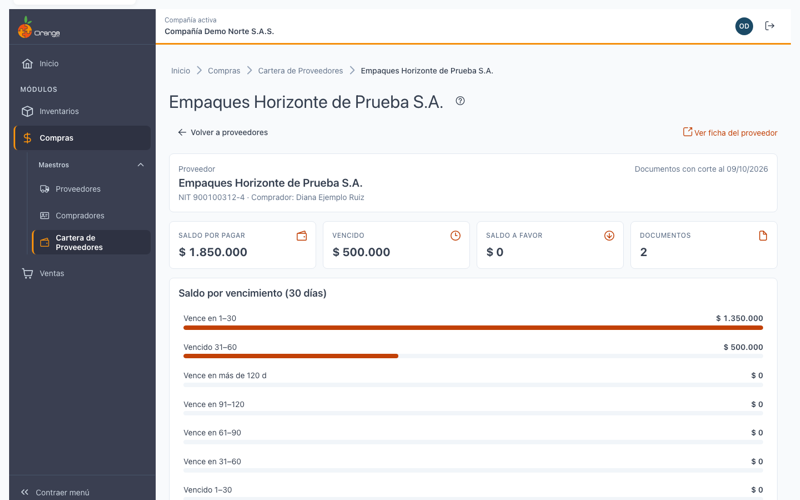

### Anticipos y saldo a favor

Un proveedor puede tener un anticipo o una nota sin aplicar. Ese documento aparece con su saldo a favor y reduce el saldo total del proveedor.

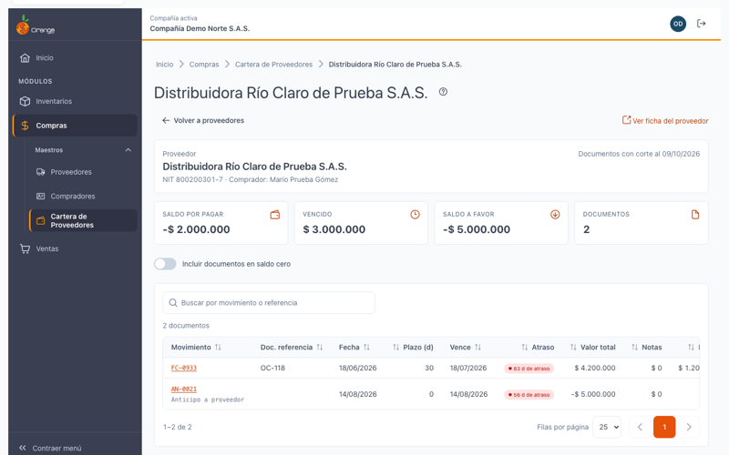

---

## 🔎 Historia del movimiento

La historia explica **cómo llegó un documento a su saldo**: desde que se generó, cada pago, nota o cruce que lo afectó, y cuánto queda.

Para abrirla, haga clic en el código del documento (por ejemplo, **FC-1201**) en la página de documentos. Se abre un panel a la derecha.

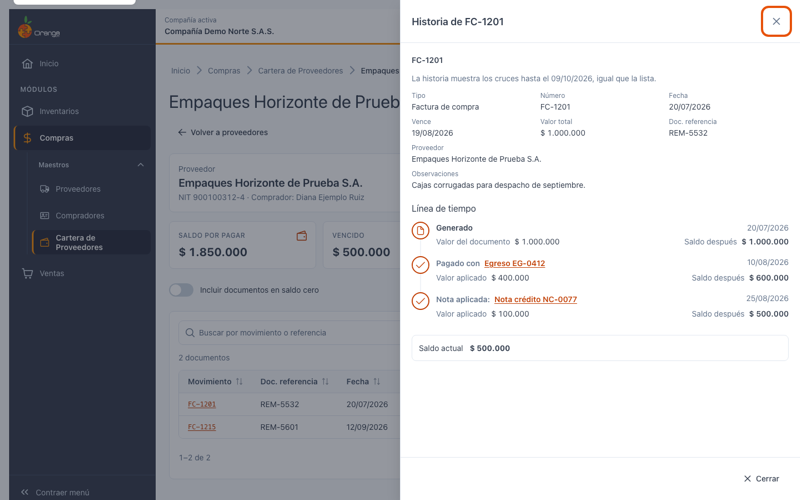

### Cómo leer la historia

La parte de arriba muestra los datos del documento: **Tipo**, **Número**, **Fecha**, **Vence**, **Valor total**, **Doc. referencia**, **Proveedor** y **Observaciones**.

Debajo está la **Línea de tiempo**:

| Línea | Qué significa |
|-------|---------------|
| **Generado** | El valor con el que se creó el documento, en su fecha. Es el punto de partida. |
| **Pagado con** (un egreso) | Un pago que cruzó contra este documento, con la fecha del pago y el valor aplicado. |
| **Nota aplicada** (una nota débito o crédito) | Una nota que cruzó contra este documento. |
| **Aplicado por** | Otro documento que cruzó contra este; no cambia el saldo. |
| **Sin aplicar** | El valor que queda sin cruzar en un egreso o un anticipo. |

En cada línea verá:

- **Valor aplicado**: cuánto se cruzó en esa operación.
- **Saldo después**: cuánto queda por pagar del documento después de esa línea.
- **Componentes del cruce**: descuento, IVA, retenciones, seguros y fletes, intereses u otros, cuando la operación los tiene. Solo aparecen los que tienen valor.

La última línea, **Saldo actual**, es el mismo saldo que ve en el listado. Si la fecha de corte es anterior a hoy, la historia solo muestra los cruces hasta esa fecha, igual que la lista.

### Reversos y saldo a favor

Un cruce con valor negativo es un **reverso**. Se marca con la etiqueta **Reverso**. Un reverso **se resta por su valor absoluto**: como cualquier otro cruce, no aumenta el saldo por ser negativo.

Los documentos con saldo a favor se marcan con la etiqueta **A favor** junto a su saldo.

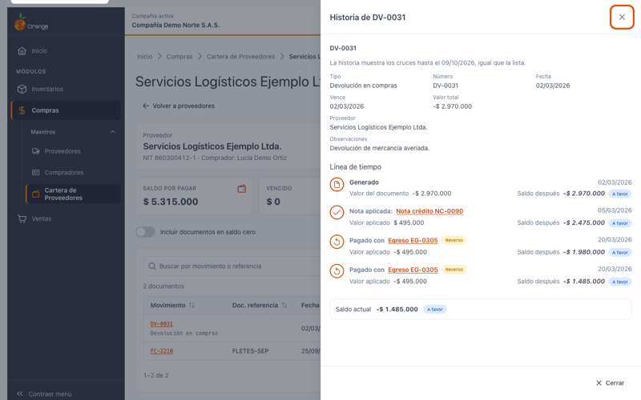

### Egreso con valor sin aplicar

Si abre un **egreso** (un pago) o un **anticipo**, la historia muestra las facturas que ese documento cruzó y cuánto aplicó a cada una. Lo que no se aplicó aparece al final como **Sin aplicar**, con el valor que queda.

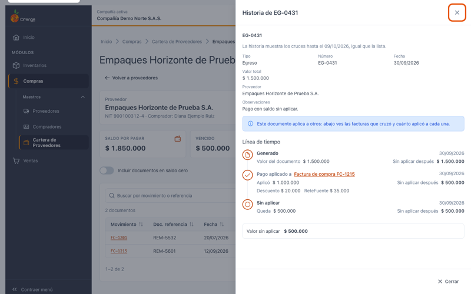

### Ir a otro documento y volver

En una línea de la historia, haga clic en el nombre del documento cruzado (por ejemplo, **Egreso EG-0412**). La historia cambia a ese documento. Para volver, use el botón **Atrás** del panel o el botón Atrás del navegador.

Use **Cerrar** para salir de la historia.

### Documentos sin cruces

Si el documento todavía no tiene pagos ni notas, la historia muestra solo **Generado** y el mensaje **Sin cruces todavía**.

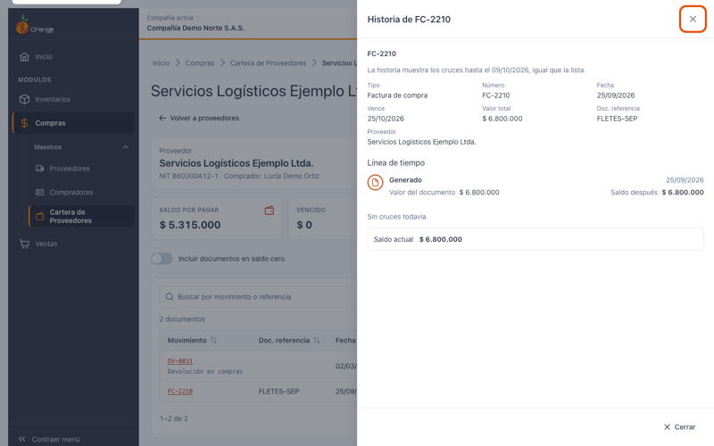

### Qué no aparece en la historia

Los documentos **anulados** no se muestran y no suman al saldo, ni como documento ni como cruce.

---

## 📤 Exportar a Excel

Haga clic en **Exportar a Excel** (necesita el permiso **Exportar**). Se descarga un archivo llamado `CarteraProveedores_` seguido de la fecha de corte, por ejemplo `CarteraProveedores_2026-10-09.xlsx`.

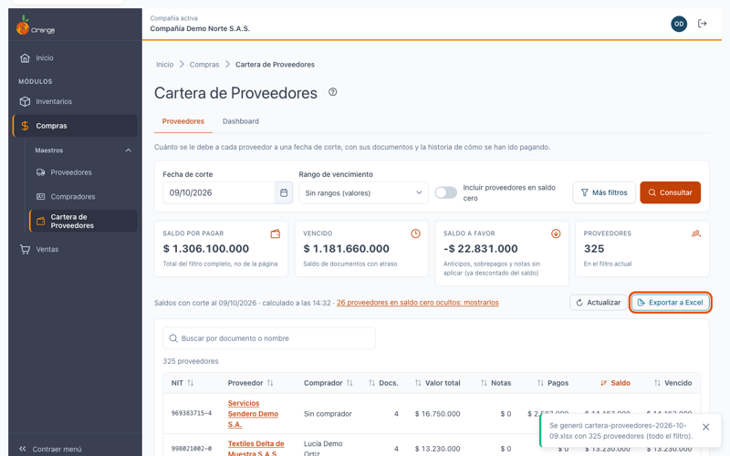

- El archivo tiene **todo el filtro**, no solo la página que está viendo.
- Trae el encabezado de la compañía, la fecha de corte, el rango, los filtros usados, la fecha y el usuario que lo generó.
- Una fila por proveedor, con su NIT, nombre, nombre comercial, teléfono, ciudad, zona, dirección, comprador, documentos, valor total, notas, pagos, saldo, vencido, saldo a favor y mayor atraso. Si eligió un rango, también trae los tramos.
- Al final, una fila **TOTAL**.

**Límite:** el archivo puede tener hasta **50.000 proveedores**. Si el filtro trae más, no se genera el archivo y verá el aviso *"Hay demasiadas filas para exportar (máximo 50.000). Acote el filtro e inténtalo de nuevo."* Escriba más texto en el buscador, elija una fecha de corte o un filtro más específico y vuelva a exportar.

Por ahora la exportación es **solo a Excel**. No hay exportación a PDF.

---

## 🔐 Permisos

| Permiso | Qué habilita |
|---------|--------------|
| Consultar | Ver el listado, abrir los documentos de un proveedor y ver la historia de cada documento. |
| Exportar | El botón **Exportar a Excel**. |

Si solo tiene **Consultar**, la pantalla funciona igual, pero no verá el botón **Exportar a Excel**.

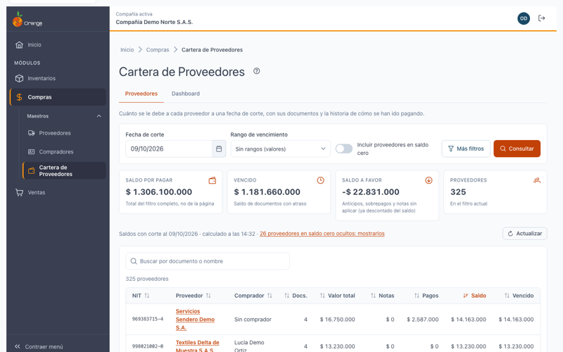

---

## ⏱️ Tiempos de carga

La cartera se calcula en el momento, a la fecha de corte que eligió. La **primera consulta puede tardar entre 2 y 3 segundos**. Mientras tanto verá el aviso *"Consultando la cartera…"* y, si tarda más, *"Calculando la cartera a la fecha de corte. La primera consulta puede tardar unos segundos."*

No es necesario recargar la página: espere a que aparezca el resultado.

---

## ⚠️ ¿Qué puede salir mal?

| Aviso | Qué significa y qué hacer |
|-------|---------------------------|
| *"No se pudo consultar la cartera"* | Hubo un problema de conexión o del servidor. Revise su conexión y haga clic en **Reintentar**. Sus filtros se conservan. |
| *"La fuente de datos no respondió a tiempo. Inténtelo de nuevo en unos minutos."* | El servidor tardó demasiado. Espere unos minutos y vuelva a consultar. |
| *"La fecha de corte no es válida. Elija una fecha que no sea futura."* | La fecha de corte está en el futuro. Elija hoy o una fecha anterior. |
| *"Un filtro ya no existe en esta compañía. Quite el filtro e inténtelo de nuevo."* | El tipo de movimiento o el centro de costos que eligió ya no existe. Quite el filtro y consulte otra vez. |
| *"El resultado es demasiado grande para consultarlo. Acote el filtro."* | Hay demasiados documentos para la consulta. Elija una fecha de corte o un filtro más específico. |
| *"No se encontró"* | El proveedor o el documento no existe en esta compañía, o ya fue anulado. Vuelva a la lista. |
| *"No se pudieron cargar los documentos"* | Los documentos del proveedor no llegaron. Haga clic en **Reintentar**. |
| *"No se pudo cargar la historia"* | La historia no llegó, pero los documentos siguen disponibles. Haga clic en **Reintentar**. |
| *"Esta historia tiene demasiados cruces para mostrarla."* | El documento tiene más de 1.000 cruces y la historia no se puede mostrar. |
| *"No se pudo generar el archivo. Inténtelo de nuevo."* | La exportación falló. Vuelva a intentarlo. |

---

## ❓ Preguntas frecuentes

**¿Por qué un proveedor aparece con saldo a favor?**
Porque tiene anticipos, sobrepagos o notas sin aplicar. Ese valor ya está descontado del saldo del proveedor y se marca con **A favor**.

**¿Por qué cambia el saldo si cambio la fecha de corte?**
La cartera solo cuenta los pagos y las notas con fecha hasta el corte. Con una fecha anterior, los pagos hechos después no se descuentan.

**¿Por qué no aparece un proveedor que sí existe en Proveedores?**
Solo aparecen los proveedores que tienen documentos de cartera (compras, gastos, comprobantes o anticipos) a la fecha de corte. Un proveedor sin documentos no aparece, aunque active el saldo cero. Los documentos anulados no cuentan.

**¿Por qué el vencimiento no coincide con el plazo que tiene hoy el proveedor?**
La cartera usa el **plazo del documento**: la fecha del documento más sus días de plazo. Si después cambió el plazo del proveedor, los documentos anteriores conservan el suyo.

**¿Por qué el total no cambia cuando paso de página?**
Los totales de las tarjetas y el conteo de proveedores son del filtro completo, no de la página.

**¿Por qué no veo un documento saldado?**
Los documentos en saldo cero están ocultos. Active **Incluir documentos en saldo cero** en la página del proveedor.

**¿Por qué un documento tiene una línea marcada como Reverso?**
Es un cruce con valor negativo. Se resta por su valor absoluto y no aumenta el saldo. Ver *Reversos y saldo a favor*.

**¿Por qué no veo el botón Exportar a Excel?**
Su perfil no tiene el permiso **Exportar** sobre esta opción. Consulte con el administrador.

**¿Se queda registro de las exportaciones?**
Sí. Se registra cuándo se exportó, con la fecha de corte y los filtros usados. No se registra el contenido del archivo.

---

## 📚 Relacionado

- [Proveedores](proveedores.md)
- [Compradores](compradores.md)
- [Manejo general de la información](../../Generales/manejo-general-informacion.md)
