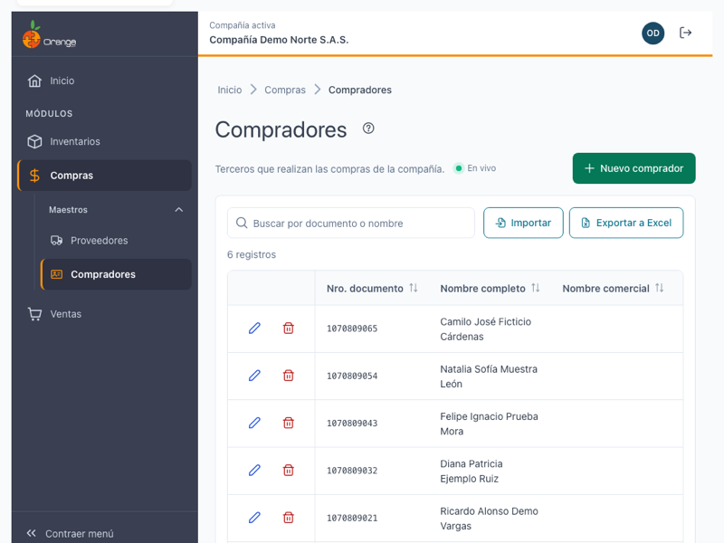
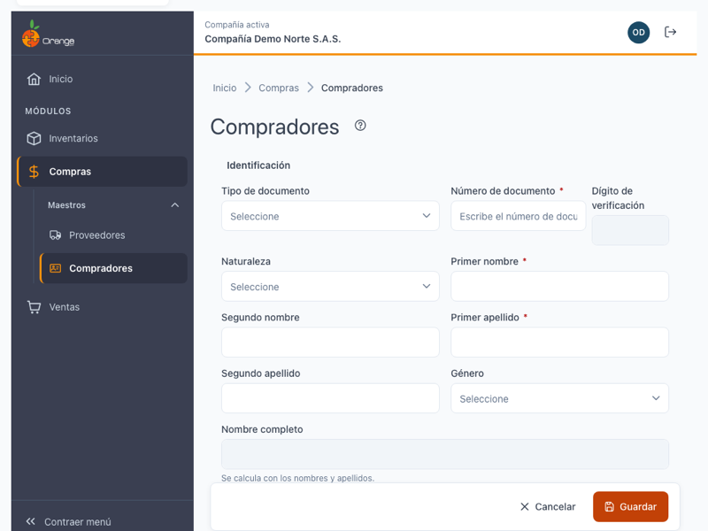
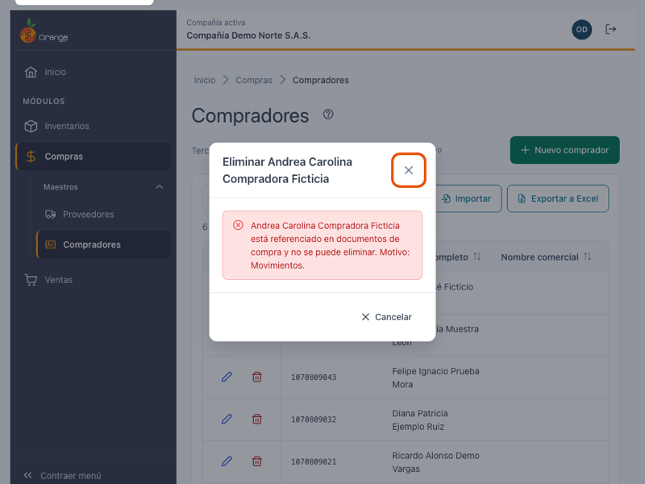
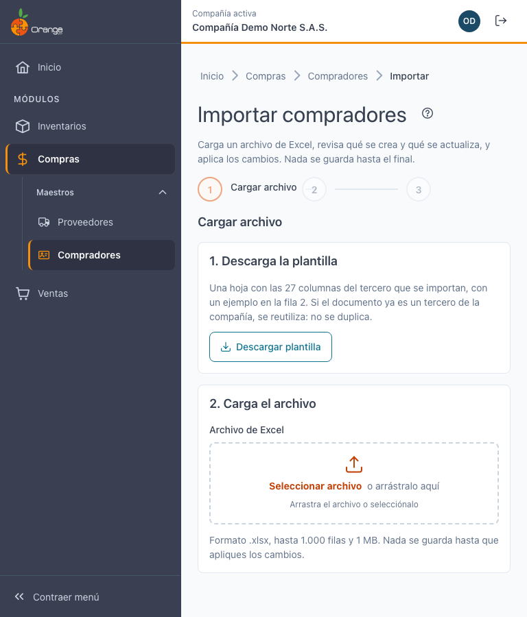
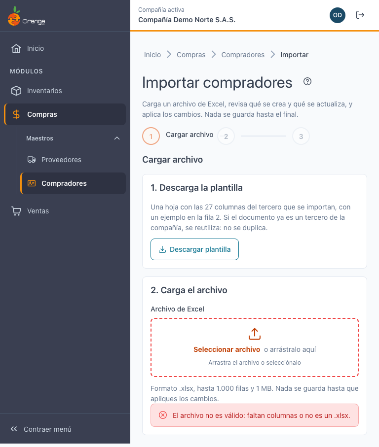
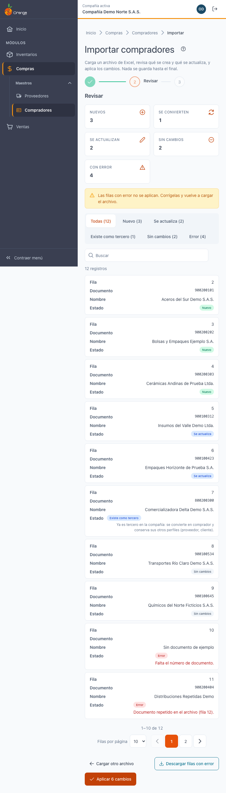
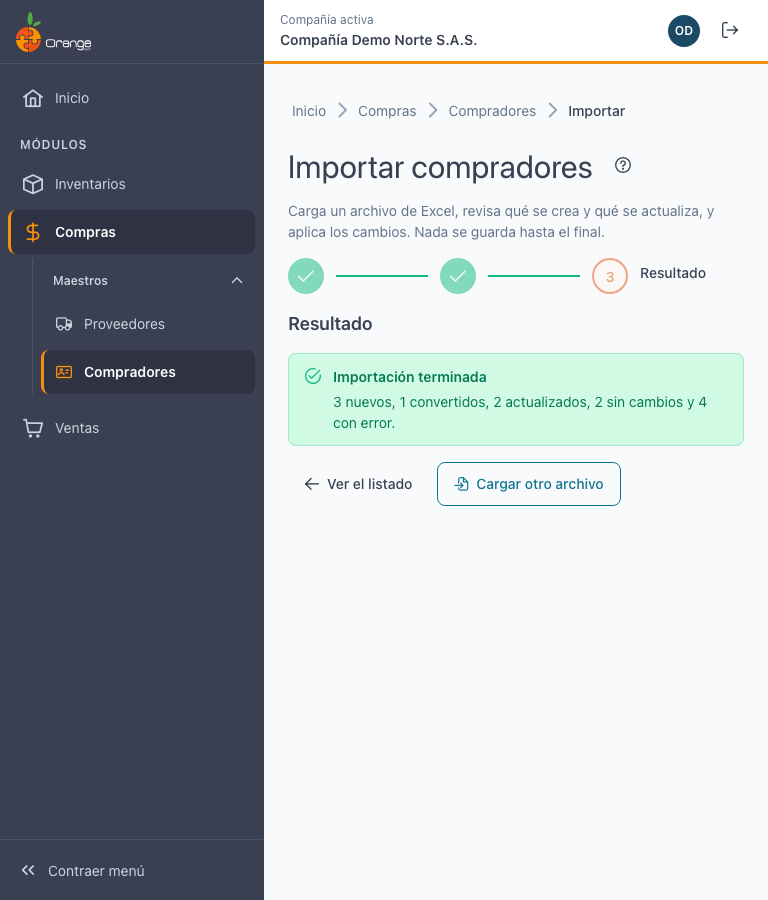
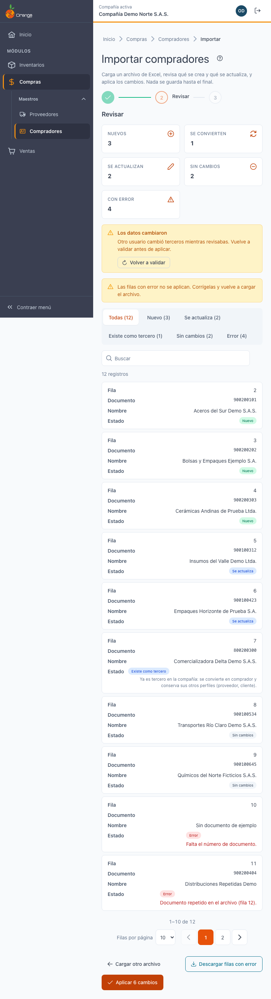

[Regresar a Compras](../readme.md)

---

# 🧑‍💼 Compradores

---

## 📋 Descripción

Los **compradores** son los terceros que realizan las compras de la compañía. Cada comprador tiene su ficha con los datos de identificación, ubicación y tributarios, además de su logo y sus documentos adjuntos.

En esta pantalla puede **consultar, crear, editar y eliminar** compradores, y **exportar** el listado a Excel. Trabaje siempre con la compañía que aparece en el título de la pestaña.

> 📘 La búsqueda, el orden, la paginación y la ayuda funcionan igual en todas las tablas: ver [Manejo general de la información](../../Generales/manejo-general-informacion.md).

> 💡 Un tercero puede ser **comprador y proveedor** a la vez. Sus datos, su logo y sus adjuntos son los mismos en ambas pantallas; ver [Proveedores](proveedores.md).

---

## 🎯 Acceso

1. En el menú principal, haga clic en **Compras**.
2. En **Maestros**, haga clic en **Compradores**.

Para ver la pantalla necesita el permiso **Consultar** sobre la opción Compradores. Los demás botones dependen de los permisos de su perfil (ver la tabla más abajo).

---

## 🖥️ Pantalla principal

| Elemento | Para qué sirve |
|----------|----------------|
| **?** (junto al título) | Abre esta ayuda en un panel lateral, sin salir de la pantalla. |
| **En vivo** | La pantalla está conectada: los cambios de otros usuarios aparecen solos. Ver *Cambios de otros usuarios* más abajo. |
| **Nuevo comprador** | Abre la ficha para crear un comprador. |
| **Buscar por documento o nombre** | Filtra el listado mientras escribe. No distingue mayúsculas ni tildes. |
| **Exportar a Excel** | Descarga los compradores que cumplen la búsqueda actual. Ver la sección *Exportar a Excel* más abajo. |
| **Importar** | Abre la página para cargar compradores desde un archivo de Excel. Solo aparece con el permiso **Exportar**. Ver *Importar desde Excel* más abajo. |
| **Lápiz** / **Papelera** | Editar o eliminar el comprador de esa fila. Siempre están en la **primera columna**. Si no tiene permiso para editar, el lápiz dice **Ver** y abre la ficha en solo lectura. |
| **Encabezados** | Un clic ordena de forma ascendente, el segundo descendente y el tercero quita el orden. |
| **Filas por página** y paginación | Cambian cuántos compradores ve por página (10, 20, 50 o 100) y la página. |

Las columnas del listado son: **Nro. documento**, **Nombre completo**, **Nombre comercial**, **Activo** y **Última modificación**.

**¿No ve algún botón?** Cada acción depende de los permisos de su perfil sobre la opción Compradores:

| Permiso | Qué habilita |
|---------|--------------|
| Consultar | Ver el listado, abrir la ficha y ver el logo y los adjuntos. |
| Crear | **Nuevo comprador**, subir el logo y los adjuntos. |
| Actualizar | Editar la ficha, reemplazar o quitar el logo, subir o quitar adjuntos. |
| Eliminar | **Papelera** y eliminar adjuntos. |
| Exportar | **Exportar a Excel** e **Importar**. |

Si solo tiene **Consultar**, la ficha aparece con el aviso *"Solo tienes permiso de consulta: la ficha no se puede modificar."*

---

## ➕ Crear un comprador

1. Haga clic en **Nuevo comprador**.
2. Escriba el **Tipo de documento** y el **Número de documento**. Mientras escribe, el sistema revisa si ese documento ya está registrado en la compañía (ver el paso siguiente).
3. Complete la ficha y haga clic en **Guardar**.

La ficha del comprador tiene **una sola pestaña, Tercero**, con:

- **Identificación**: tipo y número de documento, nombre o razón social, género.
- **Ubicación y contacto**: dirección, ciudad, teléfono, celular, correo y página web.
- **Información tributaria**: régimen, actividad económica, cuenta contable, resolución, gran contribuyente y autorretenedor.
- **Estado y observaciones**: activo y observaciones.
- **Logo** y **Adjuntos**: ver el logo y los adjuntos en [Proveedores](proveedores.md).

Al guardar verá el mensaje **"Comprador … creado."** y el comprador aparece en el listado. Si un campo está incompleto o tiene un valor no válido, la ficha muestra el motivo debajo del campo y no guarda hasta corregirlo.

### Verificar el documento antes de crear

Cuando escribe el número de documento (entre 5 y 20 caracteres) y deja el campo, el sistema verifica si ese documento ya existe en la compañía. Verá uno de estos avisos:

| Aviso | Qué significa | Qué puede hacer |
|-------|---------------|-----------------|
| *"Verificando si el documento ya está registrado…"* | La revisión está en curso. | Espere un momento. |
| *"Este documento ya existe en la compañía como {nombre} ({roles})."* y *"Se cargó la información registrada…"* | El tercero ya existe con otro perfil (cliente, empleado u otro). **No se duplica.** La ficha se llena con sus datos. | Revise los datos precargados y haga clic en **Guardar**: el tercero se agrega como comprador sin crear otro. |
| *"Este documento ya es comprador en la compañía."* y *"{nombre} ya está registrado con este documento."* | Ya tiene este perfil. | Haga clic en **Abrir su edición** para modificarlo. La ficha se abre directamente, sin preguntar nada: lo que escribió en el documento no cuenta como cambio. |
| *"No se pudo verificar el documento…"* | La revisión falló por la conexión. | Haga clic en **Reintentar**, o guarde: el sistema lo verifica otra vez al guardar. |

Si cambia el número de documento después de haber cargado un tercero existente, la información precargada se quita y la verificación se repite.

> ⚠️ Si otro usuario crea ese mismo tercero mientras usted llena la ficha, al guardar el sistema vuelve a revisar el documento: carga la información registrada en la ficha y le pide revisarla y guardar otra vez. Si el sistema no puede cargar el tercero registrado con ese documento, verá *"Este documento ya lo usa otro tercero de la compañía."* El sistema nunca crea dos terceros con el mismo documento.

---

## ✏️ Editar un comprador

1. Haga clic en el **lápiz** del comprador (o en **Ver** si solo tiene consulta).
2. Cambie los datos y haga clic en **Guardar**.

Si sale de la ficha con cambios sin guardar, el sistema pregunta **"¿Salir sin guardar?"**: **Seguir editando** lo deja en la ficha; **Salir sin guardar** descarta los cambios.

Si otro usuario modificó el mismo comprador mientras lo edita, vea *Cambios de otros usuarios* más abajo.

---

## 🗑️ Eliminar un comprador

Hay dos formas de empezar: la **papelera** de la fila en el listado, o el botón **Eliminar** al final de la ficha. Antes de borrar, el sistema confirma con **Eliminar comprador** y le muestra el documento.

| Situación | Qué ocurre |
|-----------|------------|
| El tercero **solo es comprador**. | Se elimina el comprador. Mensaje: *"Comprador … eliminado."* |
| El tercero **también es proveedor, cliente, empleado u otro perfil**. | El aviso dice *"Este tercero también es {roles}. Solo se retirará su condición de comprador; el tercero se conserva."* Se retira la condición de comprador y **el tercero se conserva** con sus otros perfiles. Mensaje: *"Se retiró la condición de comprador de …; el tercero se conserva."* |
| El comprador **está referenciado en documentos de compra**. | No se puede eliminar. El diálogo muestra: *"… está referenciado en documentos de compra y no se puede eliminar."* Si la pantalla da un motivo, aparece como **Motivo**. Cierre el diálogo: el comprador no cambia. |

Cuando se elimina el comprador de verdad, también se borran sus adjuntos y su logo. Si solo se retira la condición de comprador, el tercero, su logo y sus adjuntos se conservan.

### ¿Qué puede salir mal?

| Mensaje | Qué hacer |
|---------|-----------|
| *"No tienes permiso para realizar esta acción con compradores."* | Pida el permiso de **Eliminar** a su administrador. |
| *"El comprador ya no existe. Se quitó del listado."* | Otro usuario lo eliminó. El listado ya se actualizó. |
| *"No se pudo eliminar. Inténtalo de nuevo."* | Revise la conexión e intente otra vez. |

---

## 📤 Exportar a Excel

Haga clic en **Exportar a Excel**. Se descarga el archivo con los compradores que cumplen la **búsqueda** y el **orden** que tiene en pantalla, de todas las páginas (no solo la visible).

- El archivo puede tener **hasta 10.000 filas**. Si la búsqueda tiene más resultados, verá el aviso *"Hay más de 10.000 compradores: acota la búsqueda para exportar."* Escriba más texto en el buscador (documento o nombre) para reducir la lista y vuelva a exportar.
- Si la exportación falla por la conexión, verá *"No se pudo exportar los compradores. Inténtalo de nuevo."*
- Los avisos de exportar se quitan cuando inicia otro intento, cuando la exportación sale bien o cuando cambia la búsqueda o el orden.

---

## 📥 Importar desde Excel

Use esta función cuando tenga muchos compradores en una hoja de cálculo y quiera cargarlos de una vez. Antes de guardar, el sistema le muestra qué se va a crear, qué se va a convertir y qué se va a actualizar. **Nada se guarda hasta que haga clic en Aplicar.**

> ℹ️ Un comprador es la sección **Tercero** de la ficha. Si el documento ya es un tercero de la compañía (por ejemplo, proveedor o cliente), el sistema **no lo duplica**: lo convierte en comprador y conserva sus otros perfiles.

Para importar necesita el permiso **Exportar** sobre la opción Compradores. Si no lo tiene, el botón **Importar** no aparece en el listado.

### Antes de empezar

| Regla | Detalle |
|-------|---------|
| Formato | Archivo de Excel **.xlsx**. Solo se lee la **primera hoja**. |
| Tamaño | Hasta **1 MB** por archivo. |
| Filas | Hasta **1.000** filas con datos. Si tiene más, divídalo en varios archivos. |
| Columnas | Las columnas se reconocen por su **encabezado** (el nombre de la fila 1), no por su posición. Use la plantilla para no equivocarse. |
| Documento | La columna **Documento** es obligatoria: sin ella el archivo no se puede usar. |
| Columnas de proveedor | Si el archivo trae columnas de Proveedores (plazos, impuestos, banco, cupo), se **ignoran**: no se validan ni se guardan. |

### Paso a paso

**Paso 1. Cargar archivo**

1. En el listado de **Compradores**, haga clic en **Importar**.
2. Haga clic en **Descargar plantilla**. Se descarga el archivo **PlantillaImportarCompradores.xlsx**, con una hoja **Compradores**, las **27 columnas** de la sección Tercero y una fila de ejemplo en la fila 2.
3. Llene la plantilla: escriba un comprador por fila, empezando en la fila 2. **Borre la fila de ejemplo** o reemplácela por sus datos. Las filas vacías se omiten.
4. Haga clic en **Seleccionar archivo** (o arrastre el archivo a la zona punteada) y elija su archivo .xlsx.

El sistema lee el archivo en su equipo y lo revisa. Los avisos de archivo no válido (no es .xlsx, falta la columna **Documento**, no tiene filas, supera 1.000 filas o pesa más de 1 MB) son los mismos que en Proveedores: ver [Importar desde Excel en Proveedores](proveedores.md#-importar-desde-excel). Corrija el archivo y vuelva a cargarlo.

**Paso 2. Revisar (vista previa)**

Cuando el archivo está bien, el sistema compara cada fila con los terceros de la compañía y le muestra el resultado. **Esta revisión no guarda nada.**

- Los **indicadores** arriba muestran cuántas filas son **Nuevos**, **Se convierten**, **Se actualizan**, **Sin cambios** y **Con error**.
- Los **filtros** (Todas, Nuevo, Se actualiza, Existe como tercero, Sin cambios, Error) muestran solo las filas de ese estado.
- Cada fila muestra su **número de fila** del archivo, el **documento**, el **nombre** y el **estado**. Las filas con error muestran el motivo.
- Con el **buscador** puede buscar por documento o nombre.

**Paso 3. Aplicar**

1. Revise la vista previa. Si hay filas con error, puede corregirlas (ver la sección siguiente) o aplicar las demás.
2. Haga clic en **Aplicar N cambios**. El número cuenta las filas **Nuevos**, **Se convierten** y **Se actualizan**.
3. Espere el indicador **Aplicando…**. Al terminar verá la pantalla **Importación terminada** con el resumen: cuántos fueron nuevos, convertidos, actualizados, sin cambios y con error.

En la pantalla de resultado puede **Ver el listado** o **Importar otro archivo**. El listado de compradores se actualiza con los cambios aplicados.

Otros botones de la página:

| Botón | Qué hace |
|-------|----------|
| **Cambiar archivo** | Vuelve al paso 1 para cargar otro archivo. Lo que revisó antes se descarta. |
| **Descargar filas con error** | Descarga solo las filas con error, para corregirlas en Excel. |
| **Cancelar** | Sale de la importación sin guardar nada. |

> ℹ️ Si la vista previa dice *"Nada que aplicar: todas las filas están sin cambios o con error."*, el botón **Aplicar** queda deshabilitado: no hay nada que guardar.

### Todo o nada

Al aplicar, el sistema guarda **todas las filas válidas juntas**, en una sola operación:

- Si todo sale bien, se guardan todas las filas **Nuevos**, **Se convierten** y **Se actualizan**.
- Si ocurre un fallo del servidor, **no se guarda ninguna fila**. Verá *"No se pudo completar. No se guardó ningún cambio. Inténtalo de nuevo."* y puede reintentar.
- Las filas con **error** no se guardan, pero **no bloquean** a las demás: las filas válidas sí se aplican. Corrija las filas con error y vuelva a cargar el archivo cuando quiera.
- La importación **nunca borra** compradores ni datos que no estén en el archivo.

### Estados de cada fila

| Estado | Qué significa | Qué pasa al aplicar |
|--------|---------------|---------------------|
| **Nuevo** | El documento no está registrado en la compañía. | Se crea el tercero y su condición de comprador. |
| **Existe como tercero** (se convierte) | El documento ya es tercero de la compañía (por ejemplo, proveedor o cliente), pero no es comprador. La fila muestra la nota *"Ya es tercero en la compañía: se convierte en comprador y conserva sus otros perfiles (proveedor, cliente)."* | Se agrega la condición de **comprador** al tercero existente. **No se duplica** y **conserva sus otros perfiles** (proveedor, cliente). Si el nombre del archivo es distinto del registrado, la fila muestra *"Actual: …"* con el nombre actual. |
| **Se actualiza** | Ya es comprador y el archivo cambia algún dato. | Se actualizan los datos que cambiaron. |
| **Sin cambios** | Ya es comprador y el archivo no cambia nada. | No se escribe nada. |
| **Error** | La fila tiene un problema que hay que corregir. | No se guarda. Ver *Errores por fila* más abajo. |

### Qué significa una celda vacía

Una celda vacía significa **sin dato**. Lo que pasa depende de si el comprador es nuevo o ya existe:

| Caso | Qué ocurre con la celda vacía |
|------|-------------------------------|
| **Dato obligatorio** (Documento, Tipo de documento, Primer nombre, Dirección, Ciudad, Teléfono, Celular, Correo y Régimen tributario) | Si el comprador es **nuevo**, la fila tiene error. Si el tercero **ya existe**, se conserva el dato registrado. |
| **Dato opcional** y comprador **nuevo** | Se usa el valor por defecto, igual que en Proveedores: por ejemplo, **Dígito de verificación** vacío queda como NA, **Nombre comercial** vacío toma el nombre completo y **Activo** vacío queda en Sí. |
| **Dato opcional** y tercero **que ya existe** | Se **conserva** lo que ya está registrado. Una celda vacía no borra datos. |

Para **borrar** un dato que ya existe, no use la importación: modifique el comprador en su ficha.

### Errores por fila y cómo corregirlos

Cada fila con error muestra el motivo en el paso de revisión. Corrija la celda indicada en Excel y vuelva a cargar el archivo. Los mensajes y los formatos aceptados (Sí/No, números, correos, documento de 5 a 20 caracteres, códigos de ciudad, actividad económica o cuenta contable) son los mismos que en Proveedores: ver [Importar desde Excel en Proveedores](proveedores.md#-importar-desde-excel). Recuerde que en Compradores solo se validan las 27 columnas de la sección Tercero.

### Conflicto: "Volver a validar"

La vista previa es una foto del momento en que la revisó. Si mientras tanto otra persona crea el mismo documento o el perfil de comprador, al aplicar el sistema no guarda nada y muestra el aviso *"Los datos cambiaron"*: *"Otro usuario cambió terceros mientras revisabas. Vuelve a validar antes de aplicar."* No se guarda nada.

Haga clic en **Volver a validar**: el sistema vuelve a revisar el archivo que cargó. No se pierde el archivo. Si el error es de conexión y no de datos, use **Reintentar**.

### ¿Qué puede salir mal?

| Mensaje | Qué hacer |
|---------|-----------|
| *"Importar requiere el permiso de exportar."* | Pida el permiso **Exportar** a su administrador. |
| *"No se pudo descargar la plantilla. Inténtalo de nuevo."* | Revise la conexión y pulse **Descargar plantilla** otra vez. |
| *"El servidor no aceptó las filas del archivo (vacío, más de 1.000 filas o numeración repetida). Revisa el archivo."* | Revise el archivo con las reglas de *Antes de empezar*. |
| *"El archivo es demasiado grande para enviarlo (máximo 2 MB de datos). Divídelo en partes."* | Divida el archivo en varias partes. |
| *"No se pudo completar. No se guardó ningún cambio. Inténtalo de nuevo."* | Pulse **Reintentar**. Nada quedó a medias. |

---

## 🔄 Cambios de otros usuarios (en vivo)

Si otra persona crea, modifica o elimina compradores mientras usted tiene abierto el listado, **no tiene que recargar**: el listado se pone al día solo, sin perder lo que buscó, el orden ni la página.

- Las filas nuevas o modificadas se **resaltan** unos segundos.
- Abajo a la derecha aparece un aviso, por ejemplo *"Otro usuario creó el comprador …"*.
- Junto a la descripción verá **En vivo** mientras la conexión esté activa. Si se interrumpe, dice **Reconectando…**; al volver, la pantalla se actualiza sola.

**Si estaba editando ese mismo comprador:**

| Qué hizo el otro usuario | Qué verá | Qué puede hacer |
|--------------------------|----------|-----------------|
| Lo modificó | *"Otro usuario modificó este comprador mientras lo editabas. Si guardas, reemplazarás sus cambios."* | **Ver sus cambios** para cargar lo que él guardó, o **Guardar** para dejar lo suyo. |
| Lo eliminó | *"Otro usuario eliminó este comprador. Ya no se puede guardar."* | **Cancelar**. El botón Guardar queda deshabilitado. |

Si estaba por confirmar la eliminación de un comprador que otro ya eliminó, el diálogo se cierra con el aviso *"Otro usuario ya eliminó el comprador …"*.

> ℹ️ Los cambios que usted hace en esta misma pestaña no generan avisos.

**Terceros que son comprador y proveedor.** Si el tercero tiene los dos perfiles, un cambio en su ficha (crear, editar, convertir, eliminar o retirar un perfil, contactos o importar) también aparece en vivo en la pantalla de [Proveedores](proveedores.md), y viceversa. Si se retira un perfil, el aviso llega a las dos pantallas cuando el tercero tenía ambos perfiles antes del cambio.

---

## ❓ Preguntas frecuentes

**¿Por qué el sistema dice que el documento ya existe?**
El número de documento es único en la compañía. Si el tercero ya existe (por ejemplo, como proveedor), la ficha carga sus datos y, al guardar, solo se agrega la condición de comprador.

**¿Por qué no veo la sección de proveedor o de contactos en el comprador?**
Un comprador solo tiene los datos del tercero. Las condiciones comerciales y los contactos se administran desde [Proveedores](proveedores.md).

**¿Por qué una fila dice "Existe como tercero"?**
El documento ya está registrado en la compañía con otro perfil (por ejemplo, proveedor o cliente). Al aplicar, se agrega la condición de comprador y el tercero conserva sus otros perfiles y sus datos. No se crea un tercero nuevo.

**¿Puedo importar también las condiciones de Proveedores (plazos, impuestos, banco)?**
No. La importación de Compradores solo lleva los datos del tercero. Esas condiciones se administran en la ficha del proveedor.

**Quité el comprador y el tercero sigue apareciendo en otra pantalla.**
Si el tercero tenía otro perfil (proveedor, cliente, empleado u otro), solo se retiró su condición de comprador, y eso es lo esperado.

**¿Por qué no veo "En vivo"?**
La conexión en vivo no está disponible en este momento (por ejemplo, por la red de su empresa). La pantalla funciona igual; para ver cambios de otros usuarios, recargue la página.

---

## 📚 Relacionado

- [Proveedores](proveedores.md)
- [Manejo general de la información](../../Generales/manejo-general-informacion.md)
