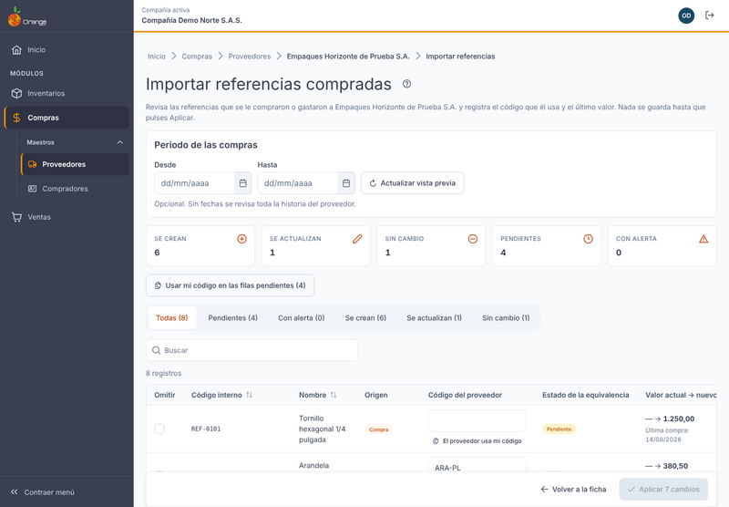
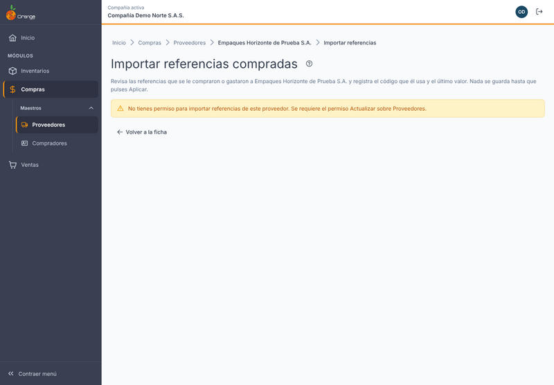
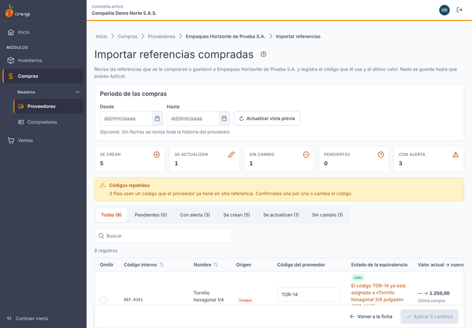
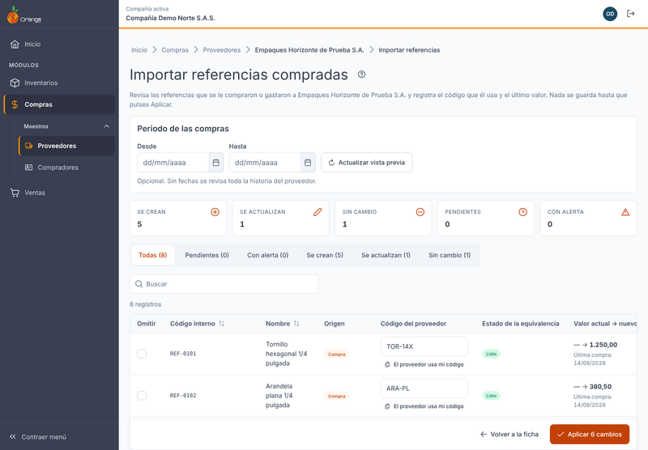
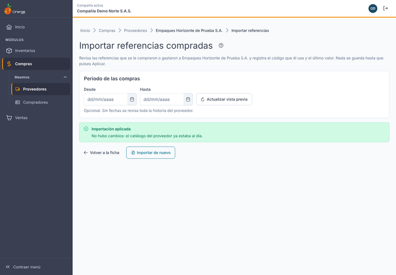
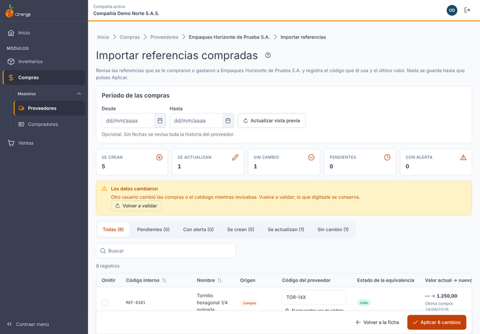
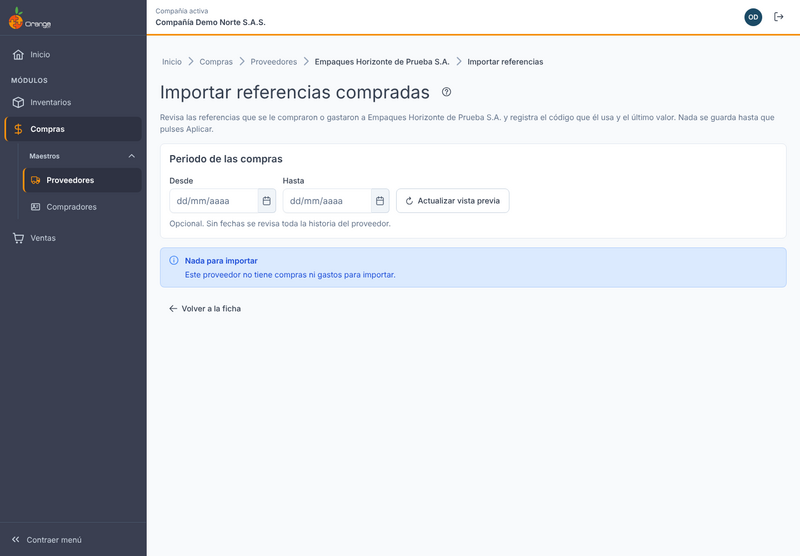
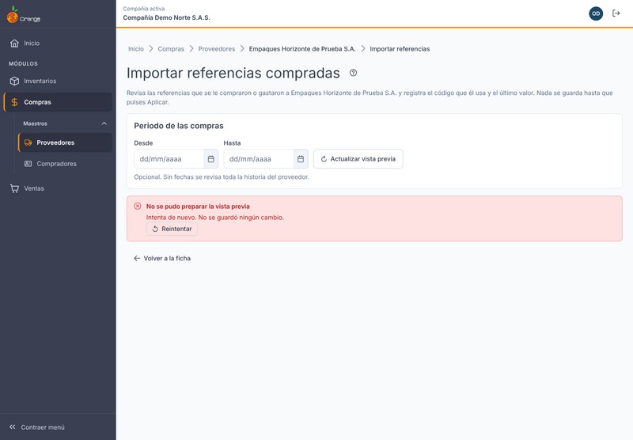

[Regresar a Compras](../readme.md)

---

# 📥 Importar referencias compradas a un proveedor

---

## 📋 Descripción

Esta pantalla trae al **catálogo de un proveedor** las referencias que usted le compró o le gastó: los productos, materiales y servicios que ya le ha comprado, tengan o no manejo de inventario.

Sirve para dejar registrado, en un solo lugar, **el código con el que ese proveedor identifica cada referencia** y **el último valor** que pagó por ella. Ese código es el que usará el proveedor en sus facturas, así que conviene registrarlo bien desde ahora.

Puntos clave:

- Trabaja **solo con el proveedor que tiene abierto**. Nunca trae referencias de otros proveedores ni importa a varios a la vez.
- Se usa **cuando usted lo necesita**. No se ejecuta sola ni en un horario.
- Toda la historia del proveedor se revisa por defecto. Si quiere, puede limitarla a un periodo.
- **Nada se guarda hasta que usted pulsa Aplicar.** Antes de eso, la pantalla solo le muestra lo que va a crear o cambiar.

> 🔐 Necesita el permiso **Actualizar** sobre **Proveedores**. Sin ese permiso el botón no aparece.

---

## 🎯 Acceso

1. Entre a **Compras › Proveedores** y abra la ficha de un proveedor **ya guardado**.
2. En la barra de acciones de la ficha, haga clic en **Importar referencias compradas** (está a la izquierda, junto a **Eliminar**).

Para volver a la ficha, use **Volver a la ficha**. Si la ficha tiene cambios sin guardar, el sistema le avisa antes de salir.

La pantalla muestra en el título el nombre del proveedor y, en la parte de arriba, un botón **?** que abre este manual.

---

## 1️⃣ Pantalla principal

Al abrir la pantalla, el sistema prepara la **vista previa** con todo el historial del proveedor. No tiene que pulsar nada para empezar.

La pantalla tiene, de arriba hacia abajo:

| Parte | Qué muestra |
|-------|-------------|
| **Periodo de las compras** | Dos fechas opcionales (**Desde** y **Hasta**) y el botón **Actualizar vista previa**. |
| **Resumen** | Cinco cifras: **Se crean**, **Se actualizan**, **Sin cambio**, **Pendientes** y **Con alerta**. |
| **Filtros** | Pestañas para ver **Todas**, **Pendientes**, **Con alerta**, **Se crean**, **Se actualizan** o **Sin cambio**. Cada una dice cuántas filas tiene. |
| **Tabla** | Una fila por referencia. Las columnas se explican en la sección 3. |
| **Pie de la pantalla** | Un texto que explica por qué **Aplicar** está deshabilitado (si lo está), el botón **Volver a la ficha** y el botón **Aplicar** con el número de cambios. |

### Qué ve cada permiso

- **Con Actualizar sobre Proveedores** usted ve la pantalla completa y puede aplicar cambios.
- **Solo con Consultar** no ve el botón en la ficha. Si llega a la dirección de la pantalla, ve el aviso *No tiene permiso para importar referencias de este proveedor*, sin periodo ni tabla.

---

## 2️⃣ Periodo de las compras

- El periodo es **opcional**. Sin fechas se revisa toda la historia del proveedor.
- Para limitarlo, escriba **Desde** y **Hasta** y pulse **Actualizar vista previa**.
- Al cambiar el periodo, la tabla se vuelve a calcular. Lo que usted ya escribió, omitió o confirmó se **conserva** para las referencias que siguen apareciendo.

Mensajes del periodo:

| Mensaje | Qué hacer |
|---------|-----------|
| *La fecha inicial no puede ser posterior a la final.* | Corrija las fechas. |
| *Las fechas no pueden ser futuras.* | Use una fecha de hoy o anterior. |
| *No hay compras ni gastos en el periodo elegido. Prueba con otras fechas o quita el periodo.* | Cambie las fechas o borre el periodo. |

---

## 3️⃣ La tabla

Una fila por cada referencia. Si la referencia se compró **y** también se gastó, aparece **una sola fila**.

| Columna | Qué significa |
|---------|---------------|
| **Omitir** | Casilla para dejar la fila **fuera** de esta importación. |
| **Código interno** | El código con el que usted identifica la referencia en el sistema. Solo se lee. |
| **Nombre** | Nombre de la referencia. |
| **Origen** | **Compra**, **Gasto** o **Compra y gasto**: de dónde viene la referencia para este proveedor. |
| **Código del proveedor** | Campo para escribir el código que usa **este** proveedor. Al lado está el botón **El proveedor usa mi código**. |
| **Estado de la equivalencia** | **Ya registrado** (el catálogo ya tiene un código), **Propuesto = mi código**, **Listo** (usted digitó el código) o **Pendiente** (falta resolverla). |
| **Valor actual → nuevo** | El valor que tiene hoy el catálogo, el valor que quedará y la fecha de la última compra o gasto. |
| **Acción** | **Crear** (la referencia no está en el catálogo del proveedor), **Actualizar** (ya está, pero el valor o el código cambia) o **Sin cambio**. |

### El valor

El valor nuevo se toma de la **última compra o gasto** de esa referencia con este proveedor:

- Es el **precio unitario** de esa compra o gasto.
- Va **descontado** (si la compra tuvo descuento) y **sin IVA**.
- Usted **no digita** el valor en esta pantalla. Si quiere cambiarlo, el cambio debe hacerse en la compra o el gasto original.

Si una referencia no tiene un valor mayor que cero, la fila aparece con el mensaje *Sin valor de compra mayor que cero. Omite la fila.* Esa fila no se puede aplicar hasta que la omita.

Si el valor nuevo es igual al actual, la fila queda en **Sin cambio**.

---

## 4️⃣ Código del proveedor

Cada referencia que se va a **crear** necesita un código del proveedor antes de aplicar. Hay tres maneras de resolverla:

| Qué hacer | Resultado |
|-----------|-----------|
| **Digite el código** que el proveedor usa para esa referencia. | La fila queda en **Listo**. |
| Pulse **El proveedor usa mi código**. | Se copia su código interno y la fila queda en **Propuesto = mi código**. |
| Marque **Omitir**. | La fila no se importa. No cuenta como pendiente. |

Reglas del código:

- Debe tener **entre 1 y 20 caracteres**.
- **No** puede llevar coma (,) ni punto y coma (;).
- Se guarda en **MAYÚSCULAS**. Los espacios al inicio y al final se quitan.

Si su código interno no cumple estas reglas, el botón **El proveedor usa mi código** aparece deshabilitado y le dice el motivo. En ese caso digite el código del proveedor.

### Resolver varias filas a la vez

- **Usar mi código en las filas pendientes (n)**: copia su código interno en todas las filas **pendientes**. Las que ya están resueltas no cambian.
  Si alguna no se puede resolver porque su código no sirve para el proveedor, el sistema le dice cuántas siguen pendientes.
- **Pendientes (n)**: filtra la tabla para ver solo lo que falta. Incluye las filas sin código y las que no tienen valor.
- **Ver pendientes**: aparece junto al aviso de **Aplicar**. Lleva al filtro de pendientes y al primer campo por resolver.

### Códigos repetidos (alerta)

Un código repetido es uno que el proveedor **ya tiene asignado a otra referencia** suya, ya sea en el catálogo o en esta misma vista previa. La fila muestra una alerta como:

> *El código X ya está asignado a «nombre» (código).*

Para ese caso aparece la casilla **Confirmo el código repetido**.

- **Confirme solo si está seguro** de que el proveedor usa ese mismo código para las dos referencias.
- Si no está seguro, **cambie el código** o **omita** la fila.
- Un código repetido **no bloquea** la importación, pero sin confirmarlo **no se puede aplicar**.
- Si cambia el código o cambia la casilla de **Omitir**, la confirmación se borra y debe volver a marcarla.

¿Por qué importa? Más adelante las facturas electrónicas del proveedor se van a cruzar con este catálogo. Si un código sirve para dos referencias, no se sabría a cuál corresponde la factura.

---

## 5️⃣ Aplicar

El botón **Aplicar N cambios** cuenta las filas que se van a **crear** y **actualizar**, sin contar las omitidas.

- Está **deshabilitado** mientras haya filas pendientes, códigos repetidos sin confirmar o nada que aplicar. El texto debajo de la tabla dice **por qué**.
- Cuando todo está resuelto, el texto dice *Todas las filas están resueltas. Revisa y pulsa Aplicar.*

Al aplicar:

- **Todo o nada.** Se guardan todas las filas no omitidas o ninguna. Si algo falla, no se guarda nada.
- **No se duplican filas.** Cada par proveedor-referencia tiene una sola fila, aunque se haya comprado y gastado.
- **Repetir no cambia nada.** Si vuelve a importar sin cambios, las filas aparecen como **Sin cambio**.
- Cada cambio queda registrado con su usuario y su fecha.

El resultado muestra cuántas se crearon, cuántas se actualizaron, cuántas quedaron sin cambio y cuántas se omitieron. Desde ahí puede usar:

- **Volver a la ficha**, para regresar al proveedor.
- **Importar de nuevo**, para repetir la revisión.

Si no hubo cambios, el sistema dice: *No hubo cambios: el catálogo del proveedor ya estaba al día.*

---

## 6️⃣ Qué no se importa

| No aparece | Por qué |
|------------|---------|
| **Devoluciones** de compra o de gasto | Una devolución no es una compra y no fija el valor. |
| **Solicitudes de gasto** | Son pedidos de gasto que todavía no se cumplieron. |
| **Referencias de otros proveedores** | La pantalla solo trae las de este proveedor. |

Sí se importan las referencias **con y sin inventario**: los materiales y los gastos también aparecen.

---

## 7️⃣ Cambios de otros usuarios

Esta pantalla **no se actualiza sola**. Si otro usuario cambia las compras o el catálogo del proveedor mientras usted revisa, lo verá al pulsar **Aplicar**:

- Aparece el aviso *Los datos cambiaron* con el texto *Otro usuario cambió las compras o el catálogo mientras revisabas. Vuelve a validar; lo que digitaste se conserva.*
- Pulse **Volver a validar**. La tabla se recalcula y lo que usted digitó se conserva.

Cuando usted aplica cambios, otros usuarios que tengan abiertas las pantallas de **Referencias** o la ficha de este proveedor reciben un aviso. Usted no recibe aviso de su propia importación.

---

## 8️⃣ Mensajes frecuentes y qué hacer

Los mensajes se muestran tal como aparecen en la pantalla (en tuteo, como los escribe el sistema):

| Mensaje en pantalla | Qué hacer |
|---------------------|-----------|
| *Digita el código del proveedor o usa el tuyo.* | Escriba el código del proveedor o pulse **El proveedor usa mi código**. |
| *Máximo 20 caracteres.* | Use un código más corto. |
| *No uses coma (,) ni punto y coma (;).* | Quite esos caracteres del código. |
| *Mi código no sirve para el proveedor (más de 20 caracteres o lleva , o ;). Digita el tuyo.* | Digite el código que usa el proveedor. |
| *Confirma el código repetido en N filas o cámbialo.* | Revise si el código es realmente el mismo (ver sección 4). |
| *Faltan N filas por resolver. Digita el código del proveedor, usa el tuyo u omite la fila.* | Digite el código, use el suyo u omita la fila. Use **Ver pendientes** para encontrarlas. |
| *No hay cambios para aplicar: todas las filas están sin cambio u omitidas.* | No hace falta aplicar nada. |
| *Este proveedor no tiene compras ni gastos para importar.* | No hay nada que traer. Verifique que las compras o gastos estén registrados a este proveedor. |
| *La vista previa supera las 5.000 filas. Acota el periodo e inténtalo de nuevo.* | Use **Desde** y **Hasta** para traer menos filas. |
| *No se pudo preparar la vista previa.* / *Intenta de nuevo. No se guardó ningún cambio.* | Pulse **Reintentar**. Si sigue igual, espere un momento e intente de nuevo. |
| *Este proveedor ya no existe.* | Vuelva al listado de proveedores y busque el proveedor de nuevo. |
| *No tienes permiso para importar referencias de este proveedor.* | Pida a quien administra los permisos que le asigne **Actualizar** sobre **Proveedores**. |
| *No se pudo aplicar.* / *No se guardó ningún cambio. Intenta de nuevo.* | Pulse **Reintentar**. Lo que digitó se conserva. |
| *Los datos cambiaron.* | Pulse **Volver a validar** (ver sección 7). |

---

Así se ven dos de los estados sin datos:

## ❓ Preguntas frecuentes

**¿Por qué no veo el botón Importar referencias compradas?**
Necesita el permiso **Actualizar** sobre **Proveedores**. Además, el botón solo aparece en la ficha de un proveedor que ya está guardado. Si acaba de crearlo, guárdelo primero.

**¿La pantalla cambia algo al abrirla?**
No. Solo prepara la vista previa. Nada se guarda hasta que pulsa **Aplicar**.

**¿Puedo importar varios proveedores de una vez?**
No. La importación es **por proveedor**, desde su ficha.

**¿Qué pasa si importo dos veces?**
No se duplica nada. Las referencias que ya están al día aparecen como **Sin cambio**.

**¿Qué pasa si la referencia ya estaba en el catálogo con otro valor?**
Aparece como **Actualizar**, con el valor anterior y el nuevo. Al aplicar, el valor queda con el de la última compra o gasto.

**¿Por qué una referencia aparece como Compra y gasto?**
Porque ese proveedor se la vendió y también se la gastó. Aparece una sola vez.

**¿Puedo traer solo las compras de este año?**
Sí. Escriba la fecha **Desde** y pulse **Actualizar vista previa**.

**¿Por qué mi código se ve en mayúsculas?**
El sistema guarda los códigos en mayúsculas para que no haya diferencias entre, por ejemplo, `ab12` y `AB12`.

**¿Qué pasa si omito una fila?**
No se importa. Su código y su valor no se tocan. Una fila omitida no cuenta como pendiente.

**¿Puedo cambiar el valor a mano?**
No en esta pantalla. El valor siempre viene de la última compra o gasto.

---

[Regresar a Compras](../readme.md)
