[Regresar a Compras](../readme.md)

---

# 📦 Inventario del proveedor

---

## 📋 Descripción

La pestaña **Inventario y rotación** de la ficha de un proveedor le muestra **cuánto inventario hay hoy** de las referencias que ese proveedor le suministra.

Sirve para responder preguntas como estas:

- ¿Cuántas unidades tengo de lo que me vende este proveedor?
- ¿Cuánto vale ese inventario al costo promedio?
- ¿Qué parte de ese inventario corresponde a este proveedor y cuál a otros?
- ¿Cómo le envío las cantidades al proveedor sin mostrarle costos?

Puntos clave:

- Es **solo de consulta**. Esta pestaña no cambia ningún dato: no guarda nada ni modifica referencias, compras ni inventario.
- La cifra es **a una fecha de corte** que usted elige. No es una consulta en vivo.
- Solo aparecen las **referencias que manejan inventario** (ver la sección 4).
- Exporta a **Excel** y a dos formatos de **PDF**. Uno de ellos no tiene costos ni valores y está pensado para enviárselo al proveedor.

> 🔐 Necesita el permiso **Consultar** sobre **Proveedores**. Sin ese permiso la pestaña no aparece.

Para crear o editar el proveedor, vea el manual de [Proveedores](proveedores.md).

---

## 🎯 Acceso

1. Entre a **Compras › Proveedores** y abra la ficha de un proveedor **ya guardado**.
2. Haga clic en la pestaña **Inventario y rotación**. Está entre **Contactos** y **Cartera**.

Mientras el proveedor se está creando y no se ha guardado, la pestaña no aparece. Guárdelo primero.

Cambiar de pestaña no cambia la dirección de la página. En esta pestaña no hay botón **Guardar**: para salir, use el botón **Volver** de la ficha.

En la parte superior de la pantalla, junto al título, el botón **?** abre este manual.

---

## 1️⃣ Pantalla principal

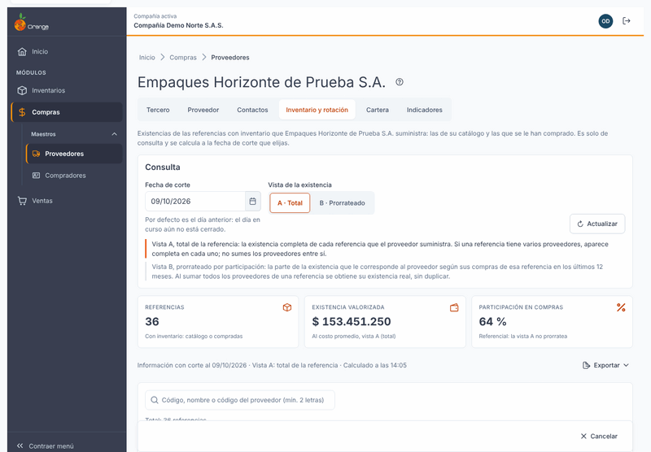

Al abrir la pestaña, verá, de arriba hacia abajo:

| Parte | Qué muestra |
|-------|-------------|
| **Consulta** | La **fecha de corte**, la **vista** (A o B) y el botón **Consultar** (o **Actualizar**, después de la primera consulta). |
| **Tarjetas** | Tres cifras: **Referencias**, **Existencia valorizada** y **Participación en compras**. |
| **Frescura** | Una línea que dice con qué corte y vista se calculó la información, y a qué hora. |
| **Exportar** | Menú para descargar el inventario en Excel o en PDF. |
| **Tabla** | Una fila por referencia, con el buscador encima. |

Antes de la primera consulta la pantalla muestra solo el mensaje *Aún no hay consulta* y el botón **Consultar**.

### Qué ve cada permiso

- **Con Consultar sobre Proveedores** usted ve la pestaña completa, consulta, exporta y ve **costos y valores**.
- **Sin Consultar** la pestaña no aparece. Si el permiso le quitan mientras la pantalla está abierta, verá el aviso *No tienes permiso para consultar el inventario de este proveedor. Se requiere el permiso Consultar sobre Proveedores.*

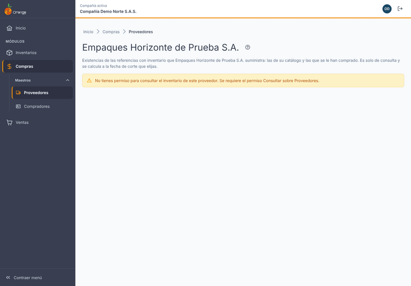

---

## 2️⃣ Fecha de corte

- La fecha de corte viene **por defecto el día anterior** (según la fecha de negocio de la compañía).
- Puede elegir cualquier fecha **de hoy o anterior**. Una fecha futura no se acepta y la pantalla dice *La fecha de corte no puede ser futura.*

**¿Por qué el día anterior?** El día en curso todavía no está cerrado: sus compras, entradas y salidas pueden seguir cambiando. Con el día anterior la cifra es la última completa.

Cambiar la fecha **no consulta** por sí solo. La pantalla le avisa con *Cambiaste los filtros. Pulsa Consultar para ver el inventario con ellos.* Mientras no consulte de nuevo, los datos que ve siguen con la fecha y la vista con que se calcularon.

---

## 3️⃣ Consultar y Actualizar

- **Consultar** trae el inventario con la fecha y la vista que eligió. Úselo la primera vez o después de cambiar la fecha o la vista.
- **Actualizar** vuelve a calcular con la información vigente. Úselo cuando:
  - acaba de registrar compras, entradas, salidas o ajustes que afectan esa fecha de corte;
  - quiere ver la cifra más reciente.

Si pulsa **Actualizar** menos de un minuto después del último cálculo, el sistema puede mostrarle el mismo resultado. La línea de frescura dice a qué hora se calculó.

La consulta no deja registro en la bitácora ni cambia datos. Puede repetirla sin riesgo.

---

## 4️⃣ Qué referencias aparecen

Aparecen las referencias que **manejan inventario** y que cumplen una de estas dos condiciones:

- están en el **catálogo del proveedor** (las que se registran con **Importar referencias compradas**), o
- se le han **comprado** (compras no anuladas).

Quedan **fuera**:

- los **gastos** (servicios y otros gastos que se causan al proveedor);
- los **materiales** y demás referencias **sin inventario**, aunque estén en el catálogo del proveedor;
- las referencias de **otros proveedores**.

Si una referencia se compró y también está en el catálogo, aparece **una sola fila**. La columna **Origen** le dice de dónde viene.

---

## 5️⃣ Vista A y vista B

Elija la vista con el selector **Vista de la existencia**:

| Vista | Qué muestra | Cuándo usarla |
|-------|-------------|---------------|
| **A · Total** (la que aparece por defecto) | La existencia **completa** de cada referencia que el proveedor suministra. | Para saber cuánto hay de cada referencia. |
| **B · Prorrateado** | La parte de la existencia que le corresponde a **este** proveedor, según su participación en las compras de esa referencia en los **últimos 12 meses** antes del corte. | Para repartir el inventario entre proveedores. |

**Reglas que debe recordar:**

- En la **vista A**, una referencia que compra a varios proveedores aparece completa en cada uno. **No sume los proveedores entre sí.**
- En la **vista B**, al sumar todos los proveedores de una referencia obtiene su existencia real, sin duplicar.
- Debajo del selector siempre se explican las dos vistas. La vista elegida está marcada.

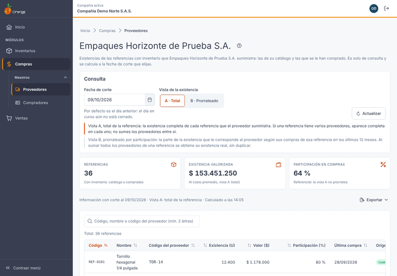

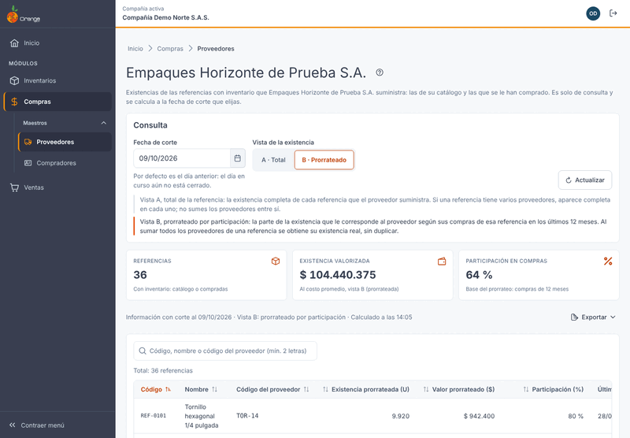

### Sin compras en 12 meses

En la columna **Participación (%)** puede aparecer el texto **Sin compras en 12 meses**. Significa que, en los 12 meses antes del corte, ese proveedor no le vendió esa referencia. Como no hay parte que repartir, la fila muestra la misma cifra que la vista A y la nota **Igual a la vista A**.

Si el proveedor no tiene compras en esos 12 meses en ninguna referencia, la tarjeta **Participación en compras** también dice **Sin compras en 12 meses**.

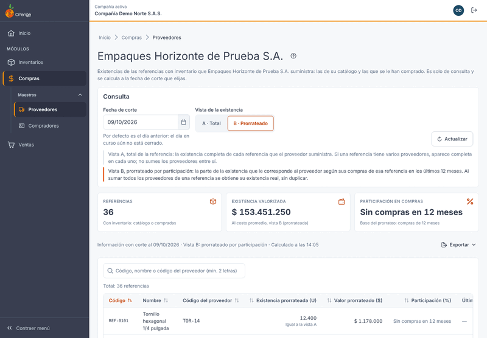

---

## 6️⃣ Tarjetas

| Tarjeta | Qué significa |
|---------|---------------|
| **Referencias** | Cuántas referencias con inventario tiene el proveedor (catálogo o compradas). |
| **Existencia valorizada** | El valor del inventario **al costo promedio**. Con la vista A es el total; con la vista B es la parte prorrateada. |
| **Participación en compras** | El porcentaje de las compras de los 12 meses que este proveedor le hizo. En la vista A la cifra es **referencial**: la vista A no reparte nada. |

---

## 7️⃣ La tabla

Una fila por referencia. Las columnas son:

| Columna | Qué significa |
|---------|---------------|
| **Código** | Código de la referencia en su sistema. |
| **Nombre** | Nombre de la referencia. |
| **Código del proveedor** | El código con el que **ese proveedor** identifica la referencia. Si no lo tiene registrado, aparece **—**. |
| **Existencia (U)** | Unidades en inventario. En la vista B el encabezado dice **Existencia prorrateada (U)**. |
| **Valor ($)** | Valor al costo promedio. En la vista B dice **Valor prorrateado ($)**. |
| **Participación (%)** | Parte de las unidades compradas de la referencia en los 12 meses antes del corte que le compró a este proveedor. |
| **Última compra** | Fecha de la última compra de la referencia a este proveedor. Si no hay, dice **Sin compras**. |
| **Origen** | **Catálogo** (está solo en el catálogo), **Compras** (solo se le ha comprado) o **Catálogo y compras**. |

**Buscar:**

- Escriba en **Buscar referencia** el código, el nombre o el código del proveedor.
- Escriba **al menos 2 caracteres**. Con uno solo no se busca.
- Si ninguna referencia coincide, la tabla dice *Ninguna referencia coincide con «...»*. Pulse **Limpiar búsqueda** para volver a verla completa.

**Orden y páginas:**

- Por defecto la tabla está ordenada por **Código**, de la A a la Z.
- Haga clic en el encabezado de una columna para ordenar por ella.
- Por defecto se ven **25** filas por página. Puede elegir **10**, **25**, **50** o **100**.
- El texto **Total: N referencias** le dice cuántas hay en el resultado.

---

## 8️⃣ Exportar

El botón **Exportar** solo se habilita cuando hay un resultado vigente. El archivo sale con **la misma fecha de corte, la misma vista, la misma búsqueda y el mismo orden** que ve en pantalla, y trae **todas** las filas, no solo la página.

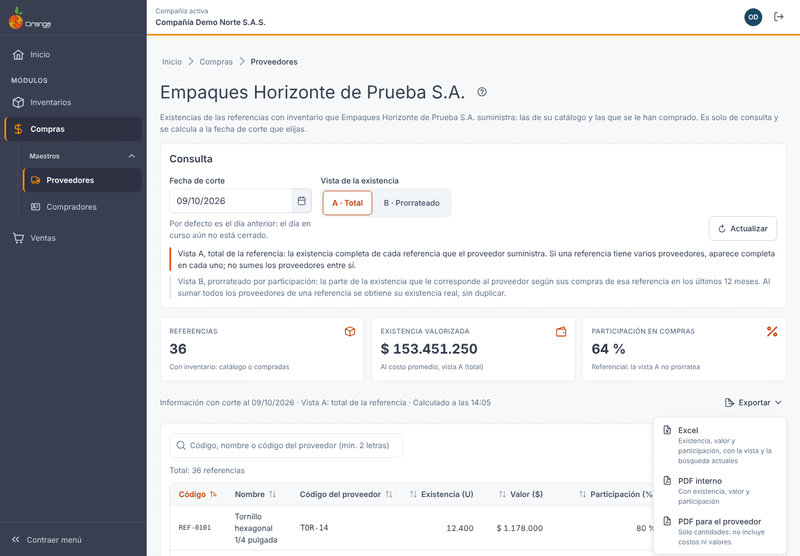

| Opción | Qué trae | Quién lo ve |
|--------|----------|-------------|
| **Excel** | Existencia, valor y participación. | Con costos y valores. |
| **PDF interno** | Existencia, valor y participación. | Con costos y valores. Es para uso dentro de la empresa. |
| **PDF para el proveedor** | **Solo cantidades**: código, nombre, código del proveedor, existencia en unidades y última compra. | **Sin costos, sin valores, sin márgenes y sin participación.** |

Mientras se prepara el archivo la pantalla dice *Preparando el archivo…*. Al terminar aparece *{archivo} descargado.* y el archivo queda en la carpeta de descargas de su equipo.

**Sobre el PDF para el proveedor:** el sistema **no lo envía**. Usted lo descarga y se lo envía al proveedor por su correo u otro medio, por fuera del sistema.

Si el resultado es demasiado grande, vea el mensaje *El resultado es demasiado grande para exportar* en la sección 9.

---

## 9️⃣ Mensajes frecuentes y qué hacer

Los mensajes se muestran tal como aparecen en la pantalla.

| Mensaje en pantalla | Qué hacer |
|---------------------|-----------|
| *Aún no hay consulta* | Elija la fecha y la vista y pulse **Consultar**. |
| *Cambiaste los filtros. Pulsa Consultar para ver el inventario con ellos.* | Pulse **Consultar**. |
| *Consultando el inventario…* | Espere un momento. |
| *Estamos calculando el inventario* · *Calculando… intento N de 12* | Con muchas referencias el primer cálculo puede tardar unos minutos. La pantalla vuelve a consultar sola cada 5 segundos, hasta 12 intentos. Puede pulsar **Reintentar ahora**. Por ahora no tiene que hacer nada más. |
| *El cálculo sigue en curso. Pulsa Reintentar para consultar de nuevo.* | El cálculo tarda más de lo normal. Pulse **Reintentar** más tarde. |
| *El cálculo de este corte ya no está disponible* | Pulse **Actualizar** para calcularlo de nuevo. |
| *El inventario se está calculando* | Otro proceso está calculando esa fecha. Espere unos segundos y pulse **Reintentar**. |
| *Este proveedor no tiene referencias de inventario* | No hay nada que mostrar. Revise que el proveedor tenga referencias que manejen inventario en su catálogo o compras que se le hayan registrado (ver la sección 4). |
| *No se pudo consultar el inventario* | Revise su conexión y pulse **Reintentar**. No se modificó ningún dato. |
| *No tienes permiso para consultar el inventario de este proveedor.* | Pida a quien administra los permisos que le asigne **Consultar** sobre **Proveedores**. |
| *Este proveedor ya no existe.* | Vuelva al listado de proveedores y búsquelo de nuevo. |
| *La fecha de corte no puede ser futura.* | Elija hoy o una fecha anterior. |
| *Ninguna referencia coincide con «...»* | Pulse **Limpiar búsqueda** o cambie el texto. |
| *El resultado es demasiado grande para exportar* | Acote el resultado con el buscador (la búsqueda se usa también al exportar) y exporte de nuevo. El aviso indica el número máximo de filas permitidas. |
| *No se pudo exportar. No se descargó ningún archivo. Inténtalo de nuevo.* | Vuelva a intentar el archivo. |

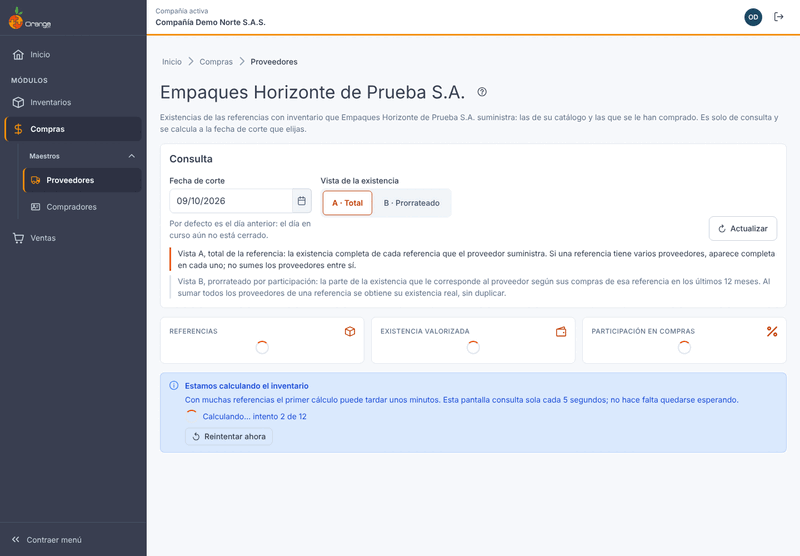

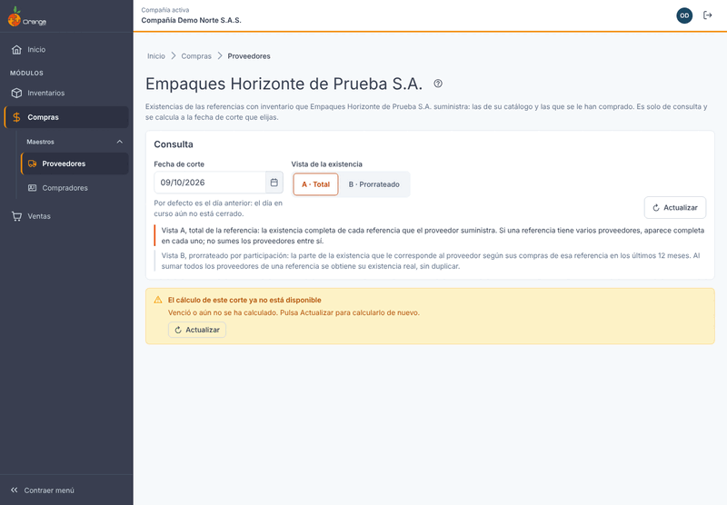

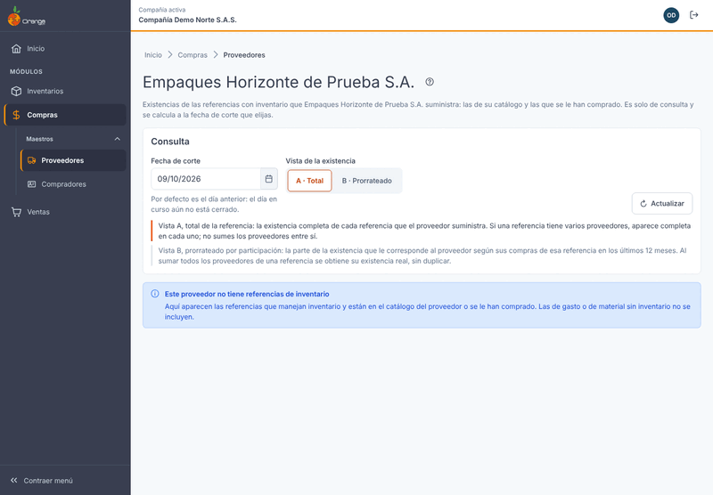

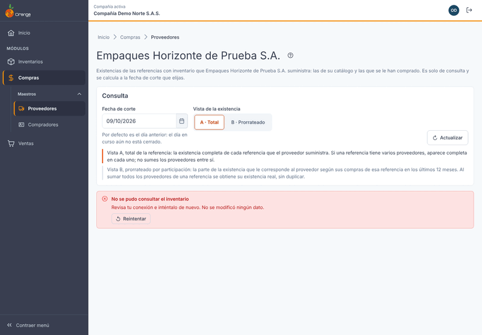

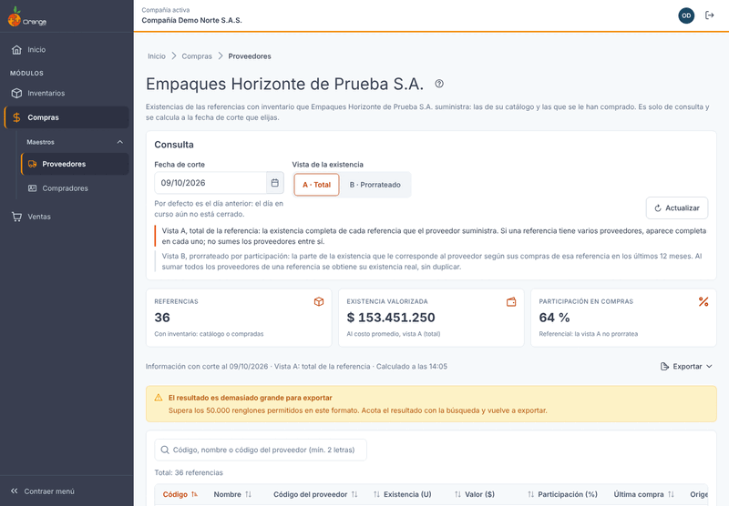

---

## ❓ Preguntas frecuentes

**¿Por qué la cifra no es la de hoy?**
Porque la fecha de corte por defecto es el día anterior. El día en curso no está cerrado. Para ver otra fecha, cámbiela y pulse **Consultar**.

**¿Por qué la suma de los proveedores de la vista A es más que la existencia real?**
Porque en la vista A cada referencia aparece completa en cada proveedor que la suministra. Para repartir sin duplicar, use la vista **B · Prorrateado**.

**¿Qué pasa si no le he comprado a este proveedor en 12 meses una referencia?**
La fila dice **Sin compras en 12 meses** y muestra la misma existencia que la vista A.

**¿Por qué no aparece una referencia que sí compré?**
Revise tres cosas: que la referencia **maneje inventario** (las que no lo manejan, como los materiales y los gastos, no aparecen); que la compra **no esté anulada**; y que la compra sea de **este** proveedor. Las devoluciones tampoco cuentan como compra.

**¿Puedo cambiar el valor o la existencia desde aquí?**
No. Esta pestaña es solo de consulta. El valor sale del costo promedio del inventario. Si algo no cuadra, revise la compra, la entrada o el ajuste original.

**¿Por qué el PDF para el proveedor no tiene valores?**
Está hecho para enviarlo afuera de la empresa. Solo trae cantidades, para que el proveedor sepa cuánto hay de cada referencia sin ver costos ni márgenes.

**¿El archivo trae todas las referencias o solo las de la página que veo?**
Trae todas las referencias del resultado, no solo la página. Si escribió un texto en **Buscar referencia**, el archivo solo trae las que coinciden con ese texto.

**¿Qué significa «Calculado a las»?**
La hora en que se calculó la información que está viendo. Si pulsa **Actualizar** y la hora no cambia, es porque el cálculo era muy reciente.

**¿Cuándo llega la rotación?**
La rotación del inventario (días de inventario, cobertura y clasificación de las referencias) **llegará en una próxima versión** a esta misma pestaña. Por ahora este manual solo describe el inventario.
