[Regresar a Compras](../readme.md)

---

# 🏭 Proveedores

---

## 📋 Descripción

Los **proveedores** son los terceros a quienes la compañía les compra bienes o servicios. Cada proveedor tiene su ficha con los datos de identificación, la información tributaria, las condiciones comerciales (descuento, plazos, cupo de crédito y retenciones), sus contactos, un logo y los documentos adjuntos.

En esta pantalla puede **consultar, crear, editar y eliminar** proveedores, y **exportar** el listado a Excel. Trabaje siempre con la compañía que aparece en el título de la pestaña.

> 📘 La búsqueda, el orden, la paginación y la ayuda funcionan igual en todas las tablas: ver [Manejo general de la información](../../Generales/manejo-general-informacion.md).

> 💡 Una persona puede ser **proveedor y comprador** a la vez. Los datos del tercero (documento, nombre, logo y adjuntos) son los mismos en ambas pantallas; ver [Compradores](compradores.md).

---

## 🎯 Acceso

1. En el menú principal, haga clic en **Compras**.
2. En **Maestros**, haga clic en **Proveedores**.

Para ver la pantalla necesita el permiso **Consultar** sobre la opción Proveedores. Los demás botones dependen de los permisos que le haya dado el administrador (ver la tabla más abajo).

La pantalla tiene las pestañas **Proveedores** y **Cartera**. La pestaña **Cartera** aparece solo si tiene el permiso **Consultar** sobre la opción *Cartera Terceros*. Ver [la sección Cartera](#-cartera-de-proveedores).

---

## 🖥️ Pantalla principal

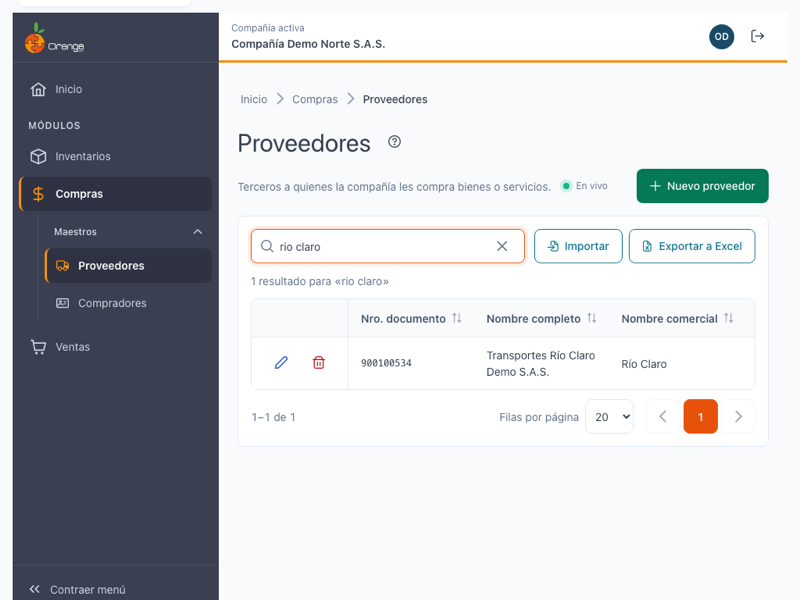

| Elemento | Para qué sirve |
|----------|----------------|
| **?** (junto al título) | Abre esta ayuda en un panel lateral, sin salir de la pantalla. |
| **En vivo** | La pantalla está conectada: los cambios de otros usuarios aparecen solos. Ver *Cambios de otros usuarios* más abajo. |
| **Nuevo proveedor** | Abre la ficha para crear un proveedor. |
| **Buscar por documento o nombre** | Filtra el listado mientras escribe. No distingue mayúsculas ni tildes. |
| **Exportar a Excel** | Descarga los proveedores que cumplen la búsqueda actual. Ver la sección *Exportar a Excel* más abajo. |
| **Importar** | Abre la página para cargar proveedores desde un archivo de Excel. Solo aparece en Proveedores y con el permiso **Exportar**. Ver *Importar desde Excel* más abajo. |
| **Lápiz** / **Papelera** | Editar o eliminar el proveedor de esa fila. Siempre están en la **primera columna**. Si no tiene permiso para editar, el lápiz dice **Ver** y abre la ficha en solo lectura. |
| **Encabezados** | Un clic ordena de forma ascendente, el segundo descendente y el tercero quita el orden. |
| **Filas por página** y paginación | Cambian cuántos proveedores ve por página (10, 20, 50 o 100) y la página. |

Las columnas del listado son: **Nro. documento**, **Nombre completo**, **Nombre comercial**, **Activo** y **Última modificación**.

> 📱 En pantallas pequeñas el listado se ajusta al ancho disponible y las acciones quedan visibles en cada fila.

**¿No ve algún botón?** Cada acción depende de los permisos de su perfil sobre la opción Proveedores:

| Permiso | Qué habilita |
|---------|--------------|
| Consultar | Ver el listado, abrir la ficha y ver el logo y los adjuntos. |
| Crear | **Nuevo proveedor**, agregar contactos, subir el logo y los adjuntos. |
| Actualizar | Editar la ficha, editar contactos, reemplazar o quitar el logo, subir o quitar adjuntos. |
| Eliminar | **Papelera**, quitar contactos y eliminar adjuntos. |
| Exportar | **Exportar a Excel**. |

Si solo tiene **Consultar**, la ficha aparece con el aviso *"Solo tienes permiso de consulta: la ficha no se puede modificar."*

---

## ➕ Crear un proveedor

1. Haga clic en **Nuevo proveedor**.
2. Escriba el **Tipo de documento** y el **Número de documento**. Mientras escribe, el sistema revisa si ese documento ya está registrado en la compañía (ver el paso siguiente).
3. Complete las secciones de la ficha y haga clic en **Guardar**.

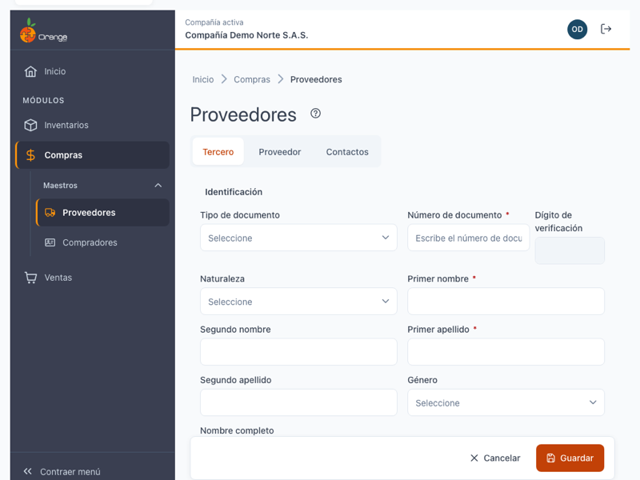

La ficha tiene tres pestañas:

| Pestaña | Qué incluye |
|---------|-------------|
| **Tercero** | Identificación (tipo y número de documento, nombre o razón social, género), ubicación y contacto (dirección, ciudad, teléfono, celular, correo, página web), información tributaria (régimen, actividad económica, cuenta contable, resolución, gran contribuyente, autorretenedor) y estado (activo, observaciones). También tiene el **logo** y los **adjuntos**. |
| **Proveedor** | Condiciones comerciales (descuento comercial, días de plazo de factura y de orden de compra, tipo de movimiento de compras y de gastos), impuestos y retenciones (realiza IVA, retefuente, reteIVA, ICA u otra retención) y crédito y pagos (cupo de crédito, días de mora, banco, tipo y número de cuenta bancaria, pago electrónico). |
| **Contactos** | Las personas con quienes se trata en el proveedor. Ver la sección *Contactos* más abajo. |

**Fecha de nacimiento** (pestaña Proveedor, en Condiciones comerciales): elíjala en el calendario o escríbala. Debe estar entre **1753-01-01** y hoy; fuera de ese rango, el campo muestra *"La fecha de nacimiento debe estar entre 1753-01-01 y hoy."* y no guarda. Si la deja vacía, se guarda 1753-01-01.

**Número de cuenta bancaria** (pestaña Proveedor, en Crédito y pagos): admite hasta **20 caracteres**; con más, verá *"El número de cuenta admite hasta 20 caracteres."*. Con permiso para **Actualizar** lo ve y lo edita completo. Si solo tiene consulta, el número aparece **enmascarado** con los últimos 4 dígitos (por ejemplo, `****1234`). El número completo nunca se registra en el historial de cambios.

Los campos obligatorios se marcan en la ficha. Si falta algún dato o un valor no es válido, la pestaña aparece con un contador de errores (por ejemplo, **2 errores**) y el campo muestra el motivo, como *"Escribe un valor numérico válido."*, *"Debe estar entre 0 y 100."* o *"Elige el impuesto o desmarca la casilla."*. Corríjalo y guarde de nuevo.

Al guardar verá el mensaje **"Proveedor … creado."** y el proveedor aparece en el listado.

### Verificar el documento antes de crear

Cuando escribe el número de documento (entre 5 y 20 caracteres) y deja el campo, el sistema verifica si ese documento ya existe en la compañía. Verá uno de estos avisos:

| Aviso | Qué significa | Qué puede hacer |
|-------|---------------|-----------------|
| *"Verificando si el documento ya está registrado…"* | La revisión está en curso. | Espere un momento. |
| *"Este documento ya existe en la compañía como {nombre} ({roles})."* y *"Se cargó la información registrada…"* | El tercero ya existe con otro perfil (cliente, empleado u otro). **No se duplica.** La ficha se llena con sus datos. | Revise los datos precargados y haga clic en **Guardar**: el tercero se agrega como proveedor sin crear otro. |
| *"Este documento ya es proveedor en la compañía."* y *"{nombre} ya está registrado con este documento."* | Ya tiene este perfil. | Haga clic en **Abrir su edición** para modificarlo. La ficha se abre directamente, sin preguntar nada: lo que escribió en el documento no cuenta como cambio. |
| *"No se pudo verificar el documento…"* | La revisión falló por la conexión. | Haga clic en **Reintentar**, o guarde: el sistema lo verifica otra vez al guardar. |

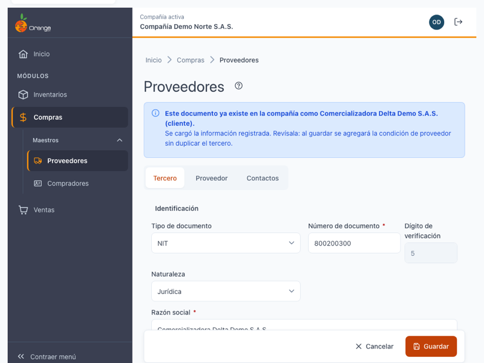

Si cambia el número de documento después de haber cargado un tercero existente, la información precargada se quita y la verificación se repite.

> ⚠️ Si otro usuario crea ese mismo tercero mientras usted llena la ficha, al guardar el sistema vuelve a revisar el documento: carga la información registrada en la ficha y le pide revisarla y guardar otra vez. Si el sistema no puede cargar el tercero registrado con ese documento, verá *"Este documento ya lo usa otro tercero de la compañía."* El sistema nunca crea dos terceros con el mismo documento.

---

## ✏️ Editar un proveedor

1. Haga clic en el **lápiz** del proveedor (o en **Ver** si solo tiene consulta).
2. Cambie los datos y haga clic en **Guardar**.

Los cambios se guardan cuando hace clic en **Guardar**. Si sale de la ficha con cambios sin guardar, el sistema pregunta **"¿Salir sin guardar?"**: **Seguir editando** lo deja en la ficha; **Salir sin guardar** descarta los cambios.

Si otro usuario modificó el mismo proveedor mientras lo edita, vea *Cambios de otros usuarios* más abajo.

---

## 📇 Contactos

Los contactos se agregan dentro de la pestaña **Contactos** de la ficha del proveedor.

1. Escriba el **nombre del contacto** (obligatorio), el **tipo de contacto**, el teléfono, el celular, el correo y la ciudad.
2. Haga clic en **Agregar contacto**.

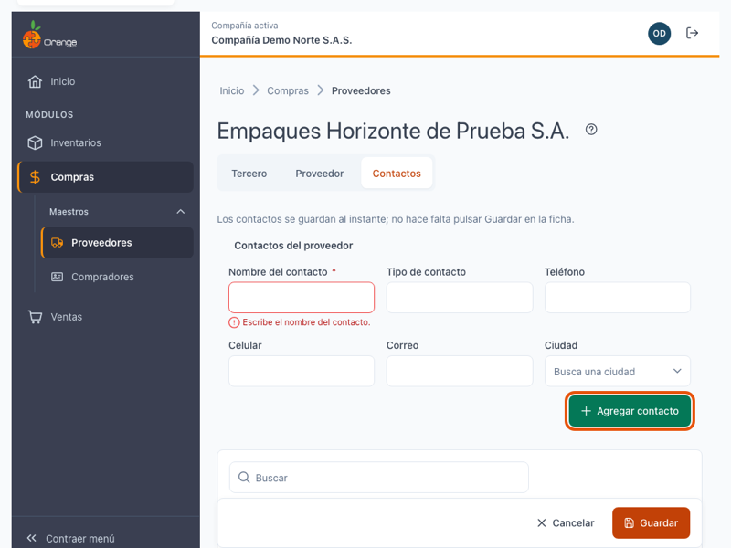

- **Los contactos se guardan al instante**: no hace falta pulsar **Guardar** en la ficha.
- El nombre y el tipo de contacto se guardan en **MAYÚSCULAS**.
- Para cambiar un contacto, haga clic en su **lápiz**, modifique los datos y pulse **Actualizar contacto**. Para cancelar, **Cancelar edición**.
- Para quitar un contacto, haga clic en la **papelera** de la fila y confirme con **Quitar contacto**. Esta acción no se puede deshacer.

> ℹ️ La pestaña **Contactos** solo se usa cuando el proveedor ya está guardado: si es nuevo, primero guarde la ficha. El aviso dice *"Guarda el proveedor para poder agregar contactos."*

---

## 🖼️ Logo y adjuntos

El **logo** y los **adjuntos** están en la pestaña **Tercero** de la ficha. Son los mismos para el proveedor y el comprador de un mismo tercero. Se suben al instante, así que el proveedor debe estar guardado antes (el aviso dice *"Guarda el tercero para poder subir el logo y los adjuntos."*).

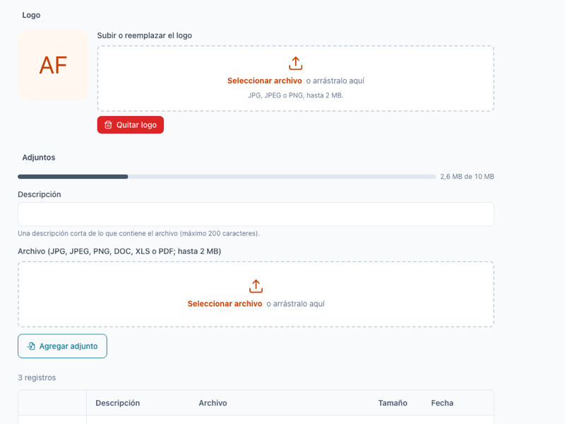

### Logo

| Regla | Detalle |
|-------|---------|
| Formatos | JPG, JPEG o PNG. |
| Tamaño | Hasta 2 MB. |
| Acciones | **Subir o reemplazar el logo** y **Quitar logo** (con confirmación). |

El logo queda guardado aunque edite otros datos del tercero y no lo vuelva a subir.

### Adjuntos

| Regla | Detalle |
|-------|---------|
| Formatos | JPG, JPEG, PNG, DOC, XLS o PDF. |
| Tamaño por archivo | Hasta **2 MB** por archivo. |
| Cupo por tercero | **10 MB** en total para todos los adjuntos del tercero. La lista muestra *"Cupo de adjuntos usado: X de 10 MB"*. |
| Descripción | Obligatoria, de 1 a 200 caracteres. |

Para agregar un adjunto: escriba la **descripción**, elija el **archivo** y haga clic en **Agregar adjunto**. En la lista puede **Descargar** cada archivo o **Eliminar** el adjunto (con confirmación: *"Se eliminará el adjunto …"*).

### ¿Qué puede salir mal?

| Mensaje | Qué hacer |
|---------|-----------|
| *"El logo debe ser JPG, JPEG o PNG."* / *"El adjunto debe ser JPG, JPEG, PNG, DOC, XLS o PDF."* | Use un archivo de un tipo permitido. |
| *"El archivo supera el máximo de 2 MB."* | Reduzca el tamaño del archivo. |
| *"Con este archivo se superaría el cupo de 10 MB por tercero."* | Elimine adjuntos que ya no necesite o reduzca el archivo. |
| *"El archivo está vacío."* | Elija otro archivo. |
| *"Escribe una descripción de 1 a 200 caracteres."* | Escriba la descripción del adjunto. |
| *"El archivo ya no existe."* | Actualice la pantalla: alguien más pudo eliminarlo. |

---

## 🗑️ Eliminar un proveedor

Hay dos formas de empezar: la **papelera** de la fila en el listado, o el botón **Eliminar** al final de la ficha.

Antes de borrar, el sistema confirma con **Eliminar proveedor** y le muestra el documento. Según el caso, verá una de estas situaciones:

| Situación | Qué ocurre |
|-----------|------------|
| El tercero **solo es proveedor**. | Se elimina el proveedor. Mensaje: *"Proveedor … eliminado."* |
| El tercero **también es cliente, empleado u otro perfil**. | El aviso dice *"Este tercero también es {roles}. Solo se retirará su condición de proveedor; el tercero se conserva."* Se retira la condición de proveedor y **el tercero se conserva** con sus otros perfiles. Mensaje: *"Se retiró la condición de proveedor de …; el tercero se conserva."* |
| El proveedor **tiene información relacionada** (compras, referencias asociadas). | No se puede eliminar. El diálogo muestra: *"… tiene información relacionada (compras, referencias asociadas) y no se puede eliminar."* Si la pantalla da un motivo, aparece como **Motivo**. Cierre el diálogo: el proveedor no cambia. |

Cuando se elimina el proveedor de verdad, también se borran sus contactos, su logo y sus adjuntos. Si solo se retira la condición de proveedor, el tercero, su logo y sus adjuntos se conservan.

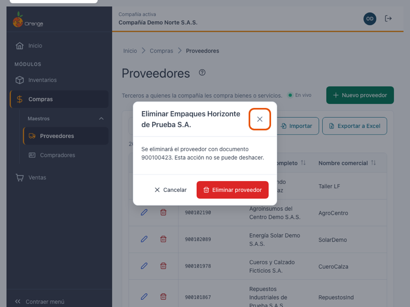

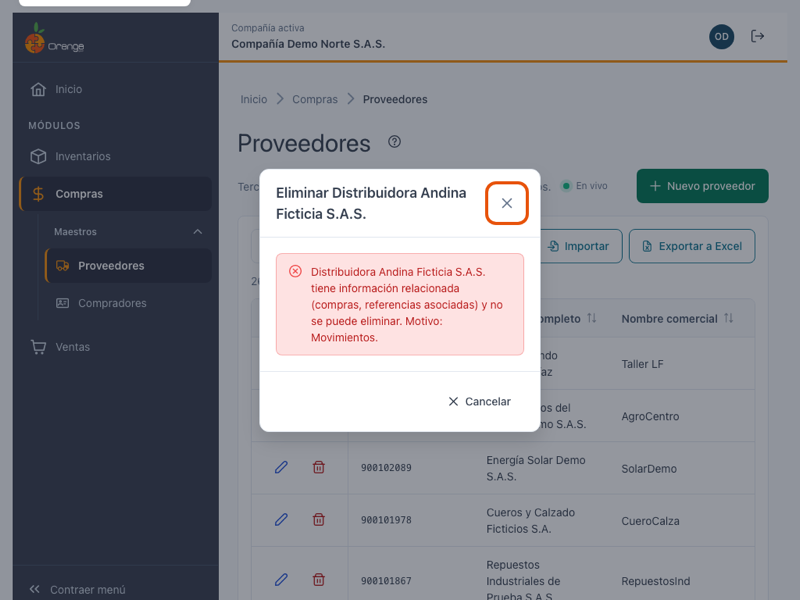

### ¿Qué puede salir mal?

| Mensaje | Qué hacer |
|---------|-----------|
| *"No tienes permiso para realizar esta acción con proveedores."* | Pida el permiso de **Eliminar** a su administrador. |
| *"El proveedor ya no existe. Se quitó del listado."* | Otro usuario lo eliminó. El listado ya se actualizó. |
| *"No se pudo eliminar. Inténtalo de nuevo."* | Revise la conexión e intente otra vez. |

---

## 📤 Exportar a Excel

Haga clic en **Exportar a Excel**. Se descarga el archivo con los proveedores que cumplen la **búsqueda** y el **orden** que tiene en pantalla, de todas las páginas (no solo la visible).

- El archivo puede tener **hasta 10.000 filas**. Si la búsqueda tiene más resultados, verá el aviso *"Hay más de 10.000 proveedores: acota la búsqueda para exportar."* Escriba más texto en el buscador (documento o nombre) para reducir la lista y vuelva a exportar.
- Si la exportación falla por la conexión, verá *"No se pudo exportar los proveedores. Inténtalo de nuevo."*
- Los avisos de exportar se quitan cuando inicia otro intento, cuando la exportación sale bien o cuando cambia la búsqueda o el orden.

---

## 📥 Importar desde Excel

Use esta función cuando tenga muchos proveedores en una hoja de cálculo y quiera cargarlos de una vez. Antes de guardar, el sistema le muestra qué se va a crear, qué se va a convertir y qué se va a actualizar. **Nada se guarda hasta que haga clic en Aplicar.**

> ℹ️ Esta importación es solo para **proveedores**. Los compradores se importan desde su propia página, con el mismo procedimiento: ver [Compradores](compradores.md#-importar-desde-excel).

Para importar necesita el permiso **Exportar** sobre la opción Proveedores. Si no lo tiene, el botón **Importar** no aparece en el listado.

### Antes de empezar

| Regla | Detalle |
|-------|---------|
| Formato | Archivo de Excel **.xlsx**. Solo se lee la **primera hoja**. |
| Tamaño | Hasta **1 MB** por archivo. |
| Filas | Hasta **1.000** filas con datos. Si tiene más, divídalo en varios archivos. |
| Columnas | Las columnas se reconocen por su **encabezado** (el nombre de la fila 1), no por su posición. Use la plantilla para no equivocarse. |
| Documento | La columna **Documento** es obligatoria: sin ella el archivo no se puede usar. |

### Paso a paso

**Paso 1. Cargar archivo**

1. En el listado de **Proveedores**, haga clic en **Importar**.
2. Haga clic en **Descargar plantilla**. Se descarga un archivo de Excel con las columnas de la importación, una fila de ejemplo en la fila 2 y una nota en cada encabezado.
3. Llene la plantilla: escriba un proveedor por fila, empezando en la fila 2. **Borre la fila de ejemplo** o reemplácela por sus datos. Las filas vacías se omiten.
4. Haga clic en **Seleccionar archivo** (o arrastre el archivo a la zona punteada) y elija su archivo .xlsx.

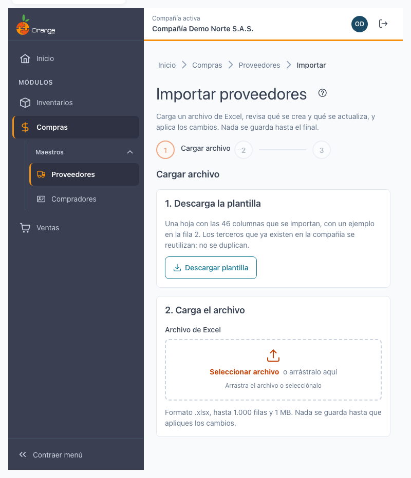

El sistema lee el archivo en su equipo y lo revisa. Si no se puede usar, verá uno de estos avisos:

| Aviso | Qué hacer |
|-------|-----------|
| *"El archivo no es un .xlsx válido."* | Guarde el archivo como **Libro de Excel (.xlsx)** y vuelva a cargarlo. |
| *"No se encontró la columna «Documento». Usa la plantilla."* | Copie sus datos en la plantilla descargada, sin cambiar los encabezados. |
| *"El archivo no tiene filas con datos."* | Escriba los proveedores debajo de los encabezados. |
| *"El archivo tiene N filas; el máximo es 1.000."* | Divida el archivo en varias partes de 1.000 filas o menos. |
| *"El archivo pesa más de 1 MB."* | Quite columnas o filas que no use, o divídalo. |

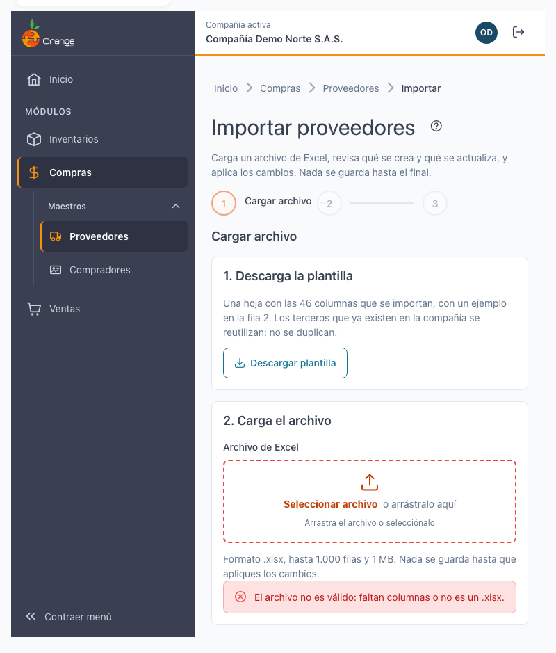

**Paso 2. Revisar (vista previa)**

Cuando el archivo está bien, el sistema compara cada fila con los terceros de la compañía y le muestra el resultado. **Esta revisión no guarda nada.**

- Los **indicadores** arriba muestran cuántas filas son **Nuevos**, **Se convierten**, **Se actualizan**, **Sin cambios** y **Con error**.
- Los **filtros** (Todas, Nuevo, Se actualiza, Existe como tercero, Sin cambios, Error) muestran solo las filas de ese estado.
- Cada fila muestra su **número de fila** del archivo, el **documento**, el **nombre** y el **estado**. Las filas con error muestran el motivo.
- Con el **buscador** puede buscar por documento o nombre.

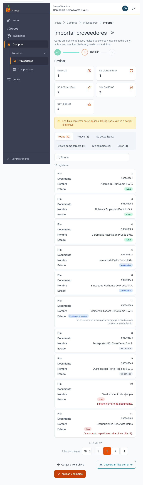

**Paso 3. Aplicar**

1. Revise la vista previa. Si hay filas con error, puede corregirlas (ver la sección siguiente) o aplicar las demás.
2. Haga clic en **Aplicar N cambios**. El número cuenta las filas **Nuevos**, **Se convierten** y **Se actualizan**.
3. Espere el indicador **Aplicando…**. Al terminar verá la pantalla **Importación terminada** con el resumen.

En la pantalla de resultado puede **Ver el listado** o **Importar otro archivo**. El listado de proveedores se actualiza con los cambios aplicados.

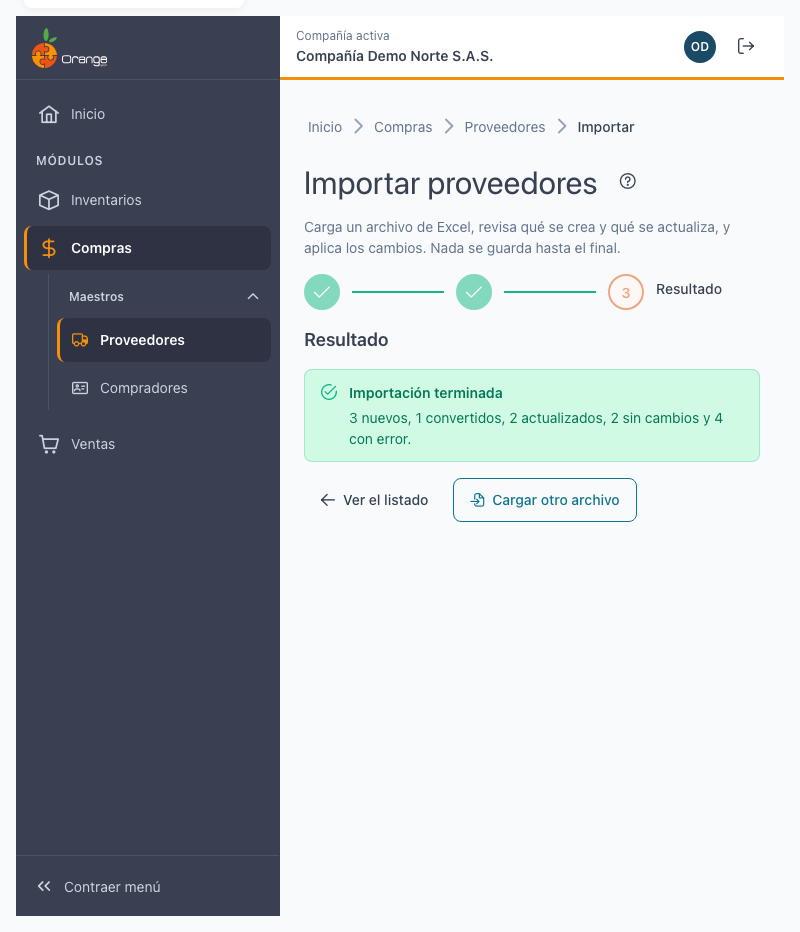

Otros botones de la página:

| Botón | Qué hace |
|-------|----------|
| **Cambiar archivo** | Vuelve al paso 1 para cargar otro archivo. Lo que revisó antes se descarta. |
| **Descargar filas con error** | Descarga solo las filas con error, para corregirlas en Excel. |
| **Cancelar** / **Cargar otro archivo** | Sale de la importación sin guardar nada. |

> ℹ️ Si la vista previa dice *"Nada que aplicar: todas las filas están sin cambios o con error."*, el botón **Aplicar** queda deshabilitado: no hay nada que guardar.

### Todo o nada

Al aplicar, el sistema guarda **todas las filas válidas juntas**, en una sola operación:

- Si todo sale bien, se guardan todas las filas **Nuevos**, **Se convierten** y **Se actualizan**.
- Si ocurre un fallo del servidor, **no se guarda ninguna fila**. Verá *"No se pudo completar. No se guardó ningún cambio. Inténtalo de nuevo."* y puede reintentar.
- Las filas con **error** no se guardan, pero **no bloquean** a las demás: las filas válidas sí se aplican. Corrija las filas con error y vuelva a cargar el archivo cuando quiera.
- La importación **nunca borra** proveedores ni datos que no estén en el archivo.

El resultado muestra cuántos fueron **nuevos**, **convertidos**, **actualizados**, **sin cambios** y **con error**.

### Estados de cada fila

| Estado | Qué significa | Qué pasa al aplicar |
|--------|---------------|---------------------|
| **Nuevo** | El documento no está registrado en la compañía. | Se crea el proveedor. |
| **Existe como tercero** (se convierte) | El documento ya está registrado con otro perfil (por ejemplo, cliente o empleado). | Se agrega la condición de **proveedor** al tercero existente. **No se duplica.** Si el nombre del archivo es distinto del registrado, la fila muestra *"Actual: …"* con el nombre actual. |
| **Se actualiza** | Ya es proveedor y el archivo cambia algún dato. | Se actualizan los datos que cambiaron. |
| **Sin cambios** | Ya es proveedor y el archivo no cambia nada. | No se escribe nada. |
| **Error** | La fila tiene un problema que hay que corregir. | No se guarda. Ver *Errores por fila* más abajo. |

### Qué significa una celda vacía

Una celda vacía significa **sin dato**. Lo que pasa depende de si el proveedor es nuevo o ya existe:

| Caso | Qué ocurre con la celda vacía |
|------|-------------------------------|
| **Dato obligatorio** (por ejemplo, Documento, Tipo de documento, Primer nombre, Dirección, Ciudad, Teléfono, Celular, Correo y Régimen tributario) | Si el proveedor es **nuevo**, la fila tiene error. Si el tercero **ya existe**, se conserva el dato registrado. |
| **Dato opcional** y proveedor **nuevo** | Se usa el valor por defecto: por ejemplo, **Dígito de verificación** vacío queda como NA, **Nombre comercial** vacío toma el nombre completo, **Activo** vacío queda en Sí y **Realizar IVA** (u otro impuesto) con su código queda en Sí. |
| **Dato opcional** y tercero **que ya existe** | Se **conserva** lo que ya está registrado. Una celda vacía no borra datos. |

Para **borrar** un dato que ya existe, no use la importación: modifique el proveedor en su ficha.

### Errores por fila y cómo corregirlos

Cada fila con error muestra el motivo en el paso de revisión. Corrija la celda indicada en Excel y vuelva a cargar el archivo.

| Mensaje | Qué significa | Cómo corregirlo |
|---------|---------------|-----------------|
| *"La fila está vacía."* | La fila no tiene datos. | Borre la fila o escriba los datos del proveedor. |
| *"Falta el número de documento."* | La columna **Documento** está vacía. | Escriba el número de documento. |
| *"El documento debe tener entre 5 y 20 caracteres."* | El documento es muy corto o muy largo. | Revise el número, sin espacios ni texto adicional. |
| *"Documento repetido en el archivo (filas N)."* | El mismo documento aparece en dos o más filas del archivo. | Deje una sola fila por documento o corrija el número de la que sobra. |
| *"Falta un dato obligatorio: {campo}."* | Un dato obligatorio está vacío en un proveedor nuevo. | Complete la celda del campo indicado. |
| *"El dato es demasiado largo: {campo}."* | El texto supera el máximo permitido. | Acorte el texto. |
| *"El dato no es válido: {campo}."* | El formato no es correcto (un número, un sí/no, un porcentaje o un correo). | Revise el formato del campo. Ver los valores aceptados abajo. |
| *"El código no existe en la compañía: {campo}."* | El código (ciudad, actividad económica, cuenta contable, banco, tipo de movimiento o impuesto) no está en la compañía. | Use el código tal como aparece en las tablas de la compañía, o consulte con su administrador. |
| *"La fila tiene un error."* | El error no tiene un mensaje específico. | Revise la fila completa y vuelva a validar. |

Formatos aceptados en los campos:

- **Sí/No**: escriba `1`, `0`, `Sí`, `No`, `S`, `N`, `true`, `false`, `verdadero`, `falso` o `x`.
- **Números**: use punto o coma como separador decimal, sin separador de miles.
- **Descuento comercial**: porcentaje de 0 a 100 (por ejemplo, `5` para 5 %).
- **Días**: de 0 a 9999.
- **Correo**: uno o varios correos separados por `;` o `,`.
- **Tipo de cuenta bancaria**: `A` (ahorros), `C` (corriente) o vacío.

Los campos **Otra retención** y **Fecha de nacimiento** no se importan: se conservan como están en el tercero.

### Conflicto: "Volver a validar"

La vista previa es una foto del momento en que la revisó. Si mientras tanto otra persona cambia proveedores o crea el mismo documento, puede pasar lo siguiente:

| Aviso | Qué significa | Qué hacer |
|-------|---------------|-----------|
| *"Otro usuario cambió proveedores mientras revisabas. Vuelve a validar antes de aplicar."* | Hubo cambios en la compañía mientras revisaba. La vista previa ya no es confiable. | Haga clic en **Volver a validar**. El sistema revisa el archivo otra vez. |
| *"Los datos cambiaron. Otro usuario creó el documento o el perfil mientras revisabas, y no se guardó nada. Vuelve a validar antes de aplicar."* | Al aplicar, un documento ya no era el mismo: no se guardó nada. | Haga clic en **Volver a validar** y revise de nuevo la vista previa antes de aplicar. |

Con **Volver a validar** no se pierde el archivo: el sistema vuelve a leer lo que cargó. Si el error no es de datos sino de conexión, use **Reintentar**.

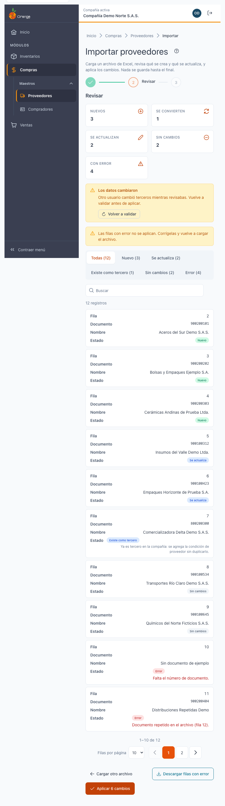

### ¿Qué puede salir mal?

| Mensaje | Qué hacer |
|---------|-----------|
| *"Importar requiere el permiso de exportar."* | Pida el permiso **Exportar** a su administrador. |
| *"No se pudo descargar la plantilla. Inténtalo de nuevo."* | Revise la conexión y pulse **Descargar plantilla** otra vez. |
| *"El servidor no aceptó las filas del archivo (vacío, más de 1.000 filas o numeración repetida). Revisa el archivo."* | Revise el archivo con las reglas de *Antes de empezar*. |
| *"El archivo es demasiado grande para enviarlo (máximo 2 MB de datos). Divídelo en partes."* | Divida el archivo en varias partes. |
| *"No se pudo completar. No se guardó ningún cambio. Inténtalo de nuevo."* | Pulse **Reintentar**. Nada quedó a medias. |

---

## 🔄 Cambios de otros usuarios (en vivo)

Si otra persona crea, modifica o elimina proveedores mientras usted tiene abierto el listado, **no tiene que recargar**: el listado se pone al día solo, sin perder lo que buscó, el orden ni la página.

- Las filas nuevas o modificadas se **resaltan** unos segundos.
- Abajo a la derecha aparece un aviso, por ejemplo *"Otro usuario creó el proveedor …"*.
- Junto a la descripción verá **En vivo** mientras la conexión esté activa. Si se interrumpe, dice **Reconectando…**; al volver, la pantalla se actualiza sola.

**Si estaba editando ese mismo proveedor:**

| Qué hizo el otro usuario | Qué verá | Qué puede hacer |
|--------------------------|----------|-----------------|
| Lo modificó | *"Otro usuario modificó este proveedor mientras lo editabas. Si guardas, reemplazarás sus cambios."* | **Ver sus cambios** para cargar lo que él guardó, o **Guardar** para dejar lo suyo. |
| Lo eliminó | *"Otro usuario eliminó este proveedor. Ya no se puede guardar."* | **Cancelar**. El botón Guardar queda deshabilitado. |

Si estaba por confirmar la eliminación de un proveedor que otro ya eliminó, el diálogo se cierra con el aviso *"Otro usuario ya eliminó el proveedor …"*.

> ℹ️ Los cambios que usted hace en esta misma pestaña no generan avisos.

**Terceros que son proveedor y comprador.** Si el tercero tiene los dos perfiles, un cambio en su ficha (crear, editar, convertir, eliminar o retirar un perfil, contactos o importar) también aparece en vivo en la pantalla de [Compradores](compradores.md), y viceversa. Si se retira un perfil, el aviso llega a las dos pantallas cuando el tercero tenía ambos perfiles antes del cambio.

---

## 💰 Cartera de proveedores

La pestaña **Cartera**, junto a **Proveedores**, muestra cuánto le debe la compañía a cada proveedor a una fecha de corte, con sus documentos y su historia de pagos. Desde la ficha de un proveedor, el botón **Cartera** abre sus documentos directamente.

La cartera es de solo consulta: no se crea, edita ni elimina nada desde ella. Su manual completo está en [Cartera de proveedores](cartera-proveedores.md).

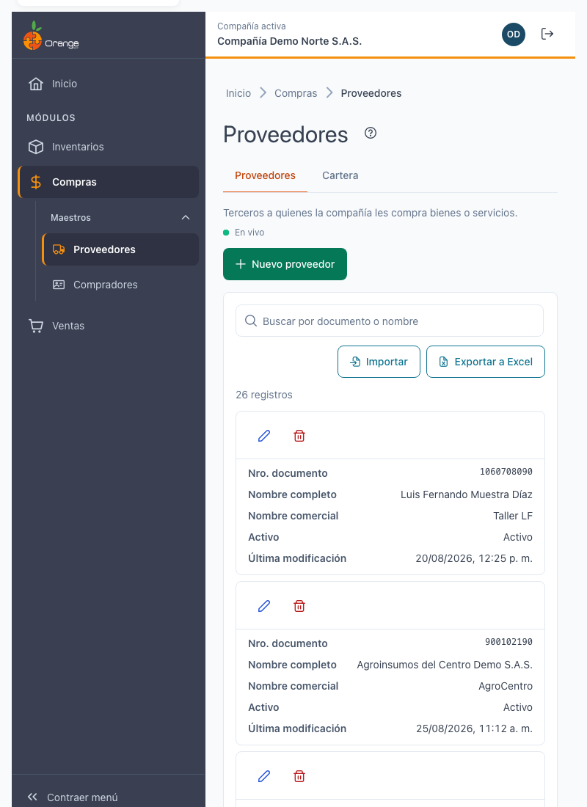

---

## ❓ Preguntas frecuentes

**¿Por qué el sistema dice que el documento ya existe?**
El número de documento es único en la compañía. Si el tercero ya existe (por ejemplo, como cliente), la ficha carga sus datos y, al guardar, solo se agrega la condición de proveedor.

**¿Por qué no puedo guardar el proveedor?**
Revise las pestañas marcadas con el contador de errores. Los campos obligatorios de la pestaña **Proveedor** son necesarios cuando el tercero es proveedor.

**Quité el proveedor y el tercero sigue apareciendo en otra pantalla.**
Si el tercero tenía otro perfil (cliente, empleado u otro), solo se retiró su condición de proveedor, y eso es lo esperado.

**¿Por qué no veo "En vivo"?**
La conexión en vivo no está disponible en este momento (por ejemplo, por la red de su empresa). La pantalla funciona igual; para ver cambios de otros usuarios, recargue la página.

**¿Por qué el archivo de importación dice que no se puede usar?**
Revise el mensaje de la página: el archivo debe ser un .xlsx de hasta 1 MB, con la columna **Documento** y hasta 1.000 filas. Descargue la plantilla y copie sus datos en ella.

**¿Por qué no encuentro un proveedor que sí existe?**
Revise que esté en la compañía correcta (título de la pestaña) y borre el texto del buscador con la **✕**.

---

## 📚 Relacionado

- [Compradores](compradores.md)
- [Manejo general de la información](../../Generales/manejo-general-informacion.md)
