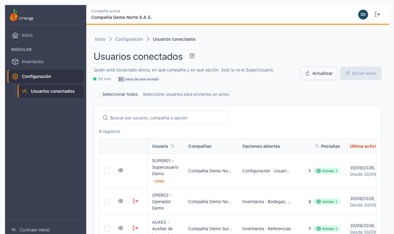
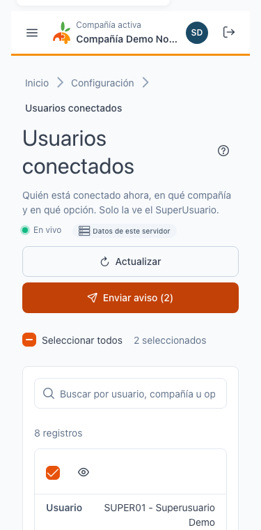
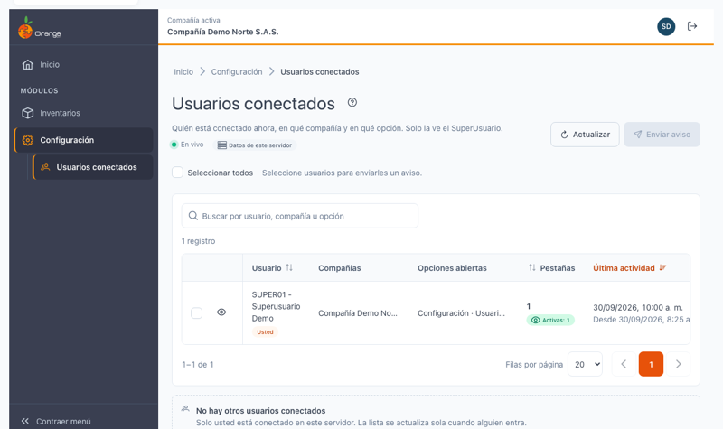
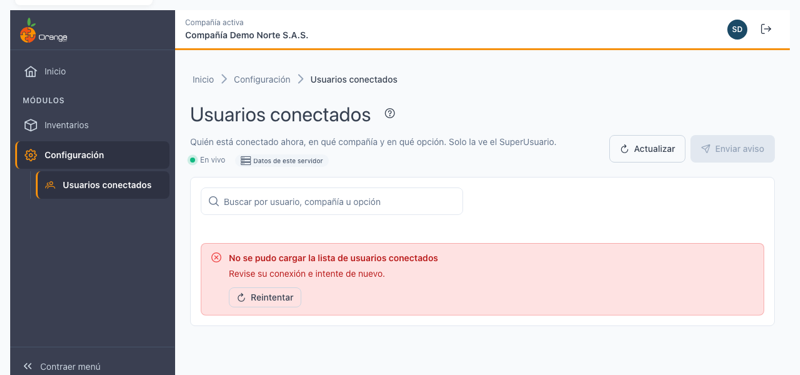
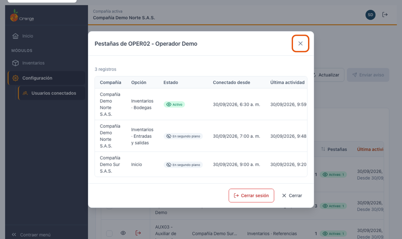
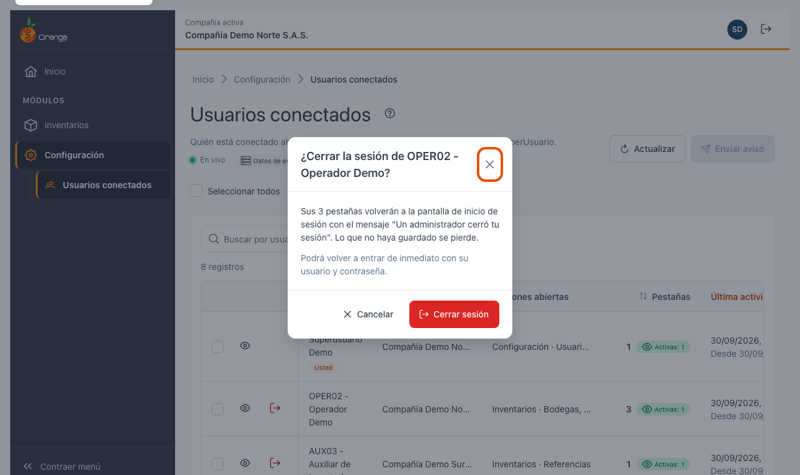
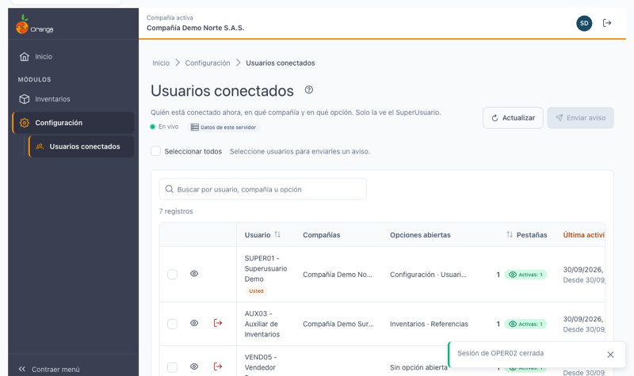
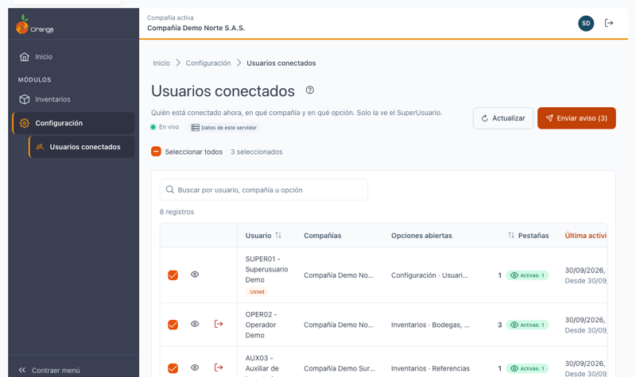
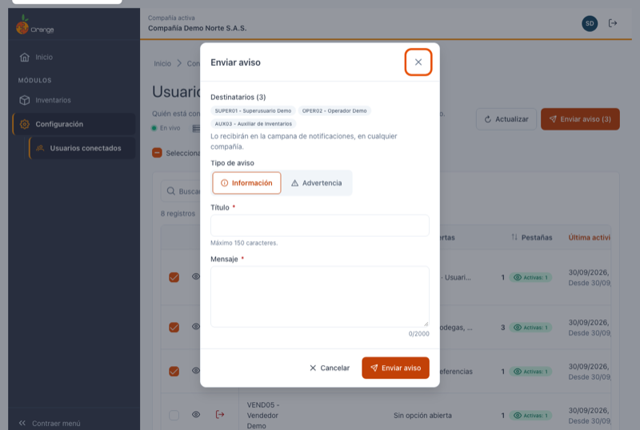
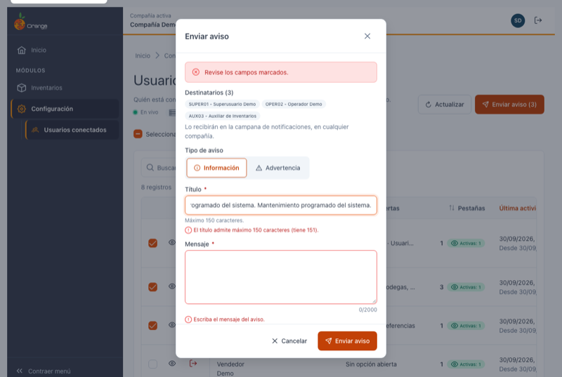

[Regresar a Configuración](../readme.md)

---

# 🔌 Usuarios conectados

---

## 📋 Descripción

Muestra **quién está conectado ahora** a OrangeERP: en qué compañía, en qué opción, cuántas pestañas tiene abiertas y cuándo fue su última actividad.

Desde aquí también puede:

- **Cerrar la sesión** de un usuario (por ejemplo, antes de un mantenimiento o si dejó una sesión abierta en un equipo compartido).
- **Enviar un aviso** a la campana de notificaciones de los usuarios que elija.

> 🔒 Esta pantalla es **exclusiva del SuperUsuario**. Los demás usuarios no la ven en el menú y, si intentan abrirla, vuelven al Inicio con el mensaje "No tiene acceso a esta opción".

> 📘 La búsqueda, el orden y la paginación funcionan igual en todas las tablas: ver [Manejo general de la información](../../Generales/manejo-general-informacion.md).

---

## 🎯 Acceso

1. En el menú principal, haga clic en **Configuración**.
2. En **Seguridad**, haga clic en **Usuarios conectados**.

La opción aparece en cualquier compañía en la que trabaje.

---

## 🖥️ Pantalla principal

Cada fila es **un usuario**, aunque tenga varias pestañas abiertas o trabaje en varias compañías a la vez.

| Elemento | Para qué sirve |
|----------|----------------|
| **?** (junto al título) | Abre esta ayuda en un panel lateral, sin salir de la pantalla. |
| **En vivo** | La lista se actualiza sola cuando alguien entra, sale o cambia de opción. Ver *Cambios en vivo* más abajo. |
| **Datos de este servidor** | La lista muestra las conexiones del servidor que atiende su pestaña. |
| **Actualizar** | Vuelve a cargar la lista en ese momento. |
| **Enviar aviso (N)** | Envía un aviso a los usuarios seleccionados. Se activa al seleccionar al menos uno. |
| **Seleccionar todos** / casilla de la fila | Marca los usuarios que recibirán el aviso. El contador indica cuántos lleva. |
| **Ojo** | Muestra las pestañas abiertas del usuario. |
| **Salida** (icono rojo) | Cierra la sesión del usuario. No aparece en su propia fila. |
| **Buscar por usuario, compañía u opción** | Filtra la lista mientras escribe. |

Columnas:

| Columna | Qué muestra |
|---------|-------------|
| **Usuario** | Código y nombre. Su propia fila lleva la marca **Usted**. |
| **Compañías** | Compañías en las que tiene pestañas abiertas. |
| **Opciones abiertas** | Opciones que está usando (módulo y opción). **Sin opción abierta** si está en el Inicio o en la página de un módulo. |
| **Pestañas** | Cuántas pestañas tiene abiertas y cuántas están **activas** (a la vista). Si ninguna está a la vista, dice **En segundo plano**. |
| **Última actividad** | Última vez que hizo algo; debajo, **Desde** indica cuándo abrió su primera pestaña. |

> 🕒 Las fechas se muestran en la zona horaria de la compañía con la que está trabajando en esta pestaña.

> 📱 En el celular cada usuario se muestra como una tarjeta, con las acciones arriba.
>
> 

### Si solo está usted

La lista muestra únicamente su fila y, debajo, el mensaje **"No hay otros usuarios conectados"**. La lista se llena sola cuando alguien entra.

### Si la lista no carga

Aparece **"No se pudo cargar la lista de usuarios conectados"**. Revise su conexión y pulse **Reintentar**.

---

## 👁️ Ver las pestañas de un usuario

1. En la fila del usuario, haga clic en el **ojo**.
2. Se abre una ventana con una fila por pestaña: **compañía**, **opción**, **estado** (Activo o En segundo plano), **conectado desde** y **última actividad**.

Desde esta ventana también puede **Cerrar sesión** de ese usuario (si no es usted) o pulsar **Cerrar** para volver a la lista.

---

## 🚪 Cerrar la sesión de un usuario

1. En la fila del usuario, haga clic en el icono rojo de **salida** (o en **Cerrar sesión** dentro de la ventana de pestañas).
2. Lea la confirmación: nombra al usuario, dice cuántas pestañas volverán a la pantalla de inicio de sesión y recuerda que **lo que no haya guardado se pierde**.
3. Pulse **Cerrar sesión**.

Qué pasa después:

- El usuario sale de la lista y aparece el mensaje **"Sesión de <código> cerrada"**.
- Todas sus pestañas vuelven a la pantalla de inicio de sesión con el mensaje **"Un administrador cerró tu sesión"**.
- **Puede volver a entrar de inmediato** con su usuario y contraseña: cerrar la sesión no bloquea al usuario.
- El cierre queda registrado en la bitácora con quién lo hizo y cuándo.

> ⚠️ No puede cerrar **su propia** sesión desde aquí (para eso use el botón de salir de la barra superior). Sí puede cerrar la de **otro SuperUsuario**.

### ¿Qué puede salir mal?

| Mensaje | Qué hacer |
|---------|-----------|
| **No se pudo cerrar la sesión. Intente de nuevo.** | La ventana sigue abierta; vuelva a pulsar **Cerrar sesión**. |
| **El usuario ya no existe.** | El usuario fue eliminado mientras tanto; cierre la ventana y pulse **Actualizar**. |

---

## ✉️ Enviar un aviso

Sirve para avisar algo a varios usuarios a la vez, por ejemplo un mantenimiento programado.

1. Marque la casilla de los usuarios que recibirán el aviso (o **Seleccionar todos**). Puede incluirse usted mismo.

   

2. Pulse **Enviar aviso (N)**.
3. En la ventana:
   - Revise los **Destinatarios**.
   - Elija el **Tipo de aviso**: **Información** (por defecto) o **Advertencia**.
   - Escriba el **Título** (máximo 150 caracteres) y el **Mensaje** (máximo 2000; el contador muestra cuántos lleva).
4. Pulse **Enviar aviso**.

Aparece el mensaje **"Aviso enviado a N usuarios"** y la selección se limpia. Cada destinatario lo recibe en la [campana de notificaciones](../../Generales/notificaciones.md), en cualquier compañía en la que esté trabajando.

### ¿Qué puede salir mal?

| Mensaje | Qué hacer |
|---------|-----------|
| **Revise los campos marcados.** | Corrija los campos en rojo; el cursor queda en el primero que tiene error. |
| **Escriba el título del aviso.** / **Escriba el mensaje del aviso.** | El título y el mensaje son obligatorios. |
| **El título admite máximo 150 caracteres (tiene N).** | Acorte el título. |
| **El mensaje admite máximo 2000 caracteres (tiene N).** | Acorte el mensaje. |
| **Seleccione entre 1 y 100 usuarios.** | Un aviso se envía a máximo 100 usuarios; divídalo en varios envíos. |
| **No se pudo enviar el aviso. Intente de nuevo.** | Vuelva a pulsar **Enviar aviso**. |

> 💡 Si no ve el botón **Enviar aviso** ni las casillas de selección, las notificaciones están desactivadas en el sistema. El resto de la pantalla funciona igual.

---

## 🔄 Cambios en vivo

Mientras la pantalla está abierta y el indicador dice **En vivo**, la lista se actualiza sola en pocos segundos cuando un usuario entra, sale, cambia de opción o deja una pestaña en segundo plano. Su búsqueda y los usuarios que tenga seleccionados se conservan.

Si el indicador dice **Reconectando…**, la conexión se interrumpió; al recuperarse, la lista se recarga sola. En cualquier momento puede pulsar **Actualizar**.

---

## ❓ Preguntas frecuentes

**¿Por qué un usuario aparece en "En segundo plano"?**
Tiene OrangeERP abierto, pero en una pestaña que no está a la vista (otra pestaña del navegador u otra ventana encima).

**Un usuario cerró el navegador y sigue en la lista.**
Puede tardar unos segundos en salir. Si sigue ahí, pulse **Actualizar**.

**Sé que un usuario está conectado, pero no aparece.**
La lista muestra las conexiones del servidor que atiende su pestaña (**Datos de este servidor**). Si el sistema trabaja con varios servidores, un usuario atendido por otro no aparece aquí.

**¿Se guarda un histórico de conexiones?**
No. La pantalla muestra solo quién está conectado en este momento. Los cierres de sesión y los avisos enviados sí quedan en la bitácora.

