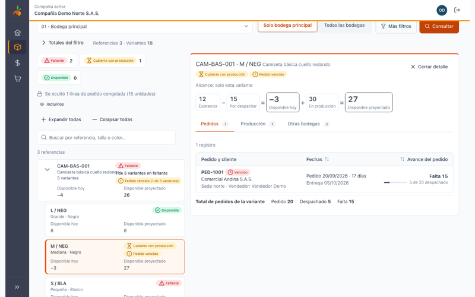
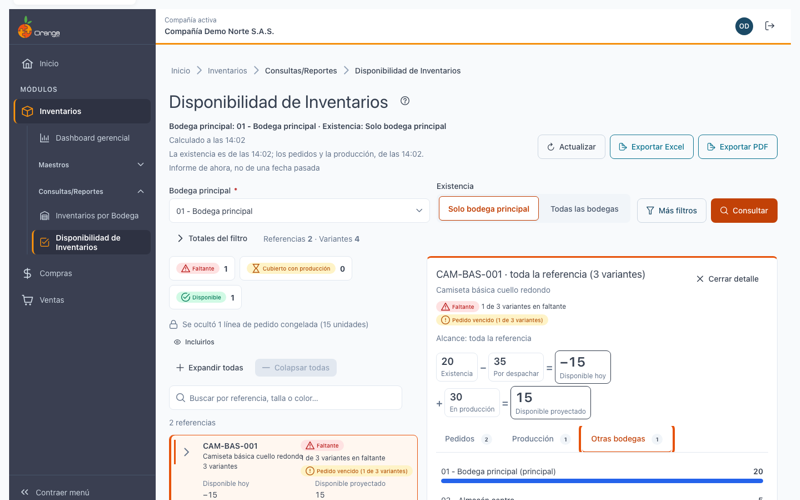
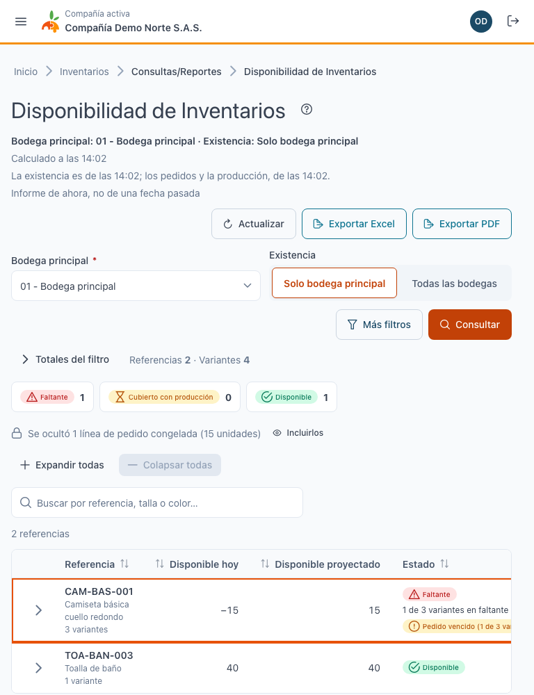
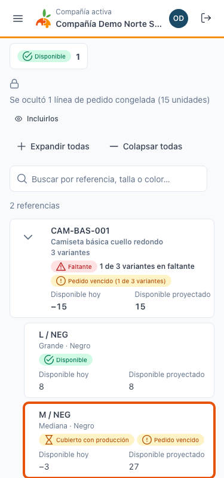
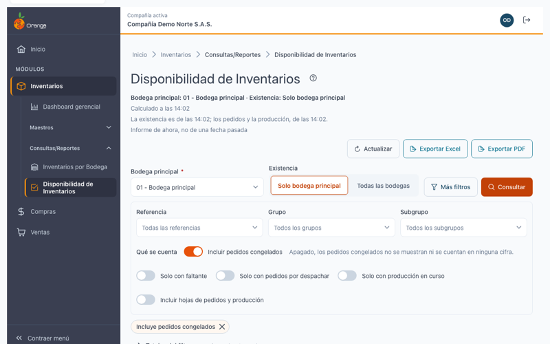

[Regresar a Inventarios](../readme.md)

---

# 📦 Disponibilidad de Inventarios

---

## 🎯 Qué es y para qué sirve

Muestra, por referencia y por variante (talla, color, etc.), **cuánto hay hoy, cuánto está comprometido en pedidos, cuánto viene en producción y cuánto se puede ofrecer**. Reúne en una sola pantalla la existencia, los pedidos pendientes de despachar y la producción en tránsito.

**Cómo se calcula:**

- **Disponible hoy** = Existencia − Por despachar
- **Disponible proyectado** = Disponible hoy + En producción

---

## ℹ️ Antes de empezar

| Requisito | Detalle |
|-----------|---------|
| **Permiso** | Opción **Disponibilidad de Inventarios**: **Consultar** (obligatorio) y **Exportar** (opcional). |
| **Bodega principal** | Es obligatoria. El sistema recuerda la última que eligió. |
| **Qué referencias aparecen** | Solo las que **manejan inventario**. |
| **Información de ahora** | El informe es de este momento, no de una fecha pasada. La pantalla indica la hora del cálculo. |

---

## 3️⃣ Cómo consultar

1. Elija la **Bodega principal**.
2. Elija la **Existencia**: **Solo bodega principal** (por defecto) o **Todas las bodegas**.
3. Si lo necesita, abra **Más filtros**: referencia, grupo y subgrupo; **Solo con faltante**, **Solo con pedidos por despachar**, **Solo con producción en curso**; y **Qué se cuenta** (ver más abajo).
4. Pulse **Consultar**.

**Cálculo en segundo plano.** Si no hay un cálculo reciente, el sistema lo prepara y puede tardar unos segundos. Cuando termina, le avisa en las notificaciones.

**Actualizar.** Vuelve a leer los datos. Si otra persona cambia información mientras usted consulta, aparece el aviso **"Hay cambios desde las HH:MM"** con el botón **Actualizar**; la pantalla no se actualiza sola.

---

## 📊 Leer la lista

La lista tiene **una fila por referencia** con las cifras sumadas de todas sus variantes. Cada fila muestra:

| Dato | Qué significa |
|------|---------------|
| **Referencia** | Código y nombre, con el número de variantes. Pulse la flecha para ver las variantes debajo. |
| **Disponible hoy** | Existencia menos lo que falta por despachar. |
| **Disponible proyectado** | Disponible hoy más lo que viene en producción. |
| **Estado** | Ver abajo. |

**Estados** (siempre con texto e ícono):

- ✅ **Disponible**: alcanza con lo que hay hoy.
- ⏳ **Cubierto con producción**: hoy no alcanza, pero la producción en tránsito lo cubre.
- ⚠️ **Faltante**: no alcanza ni con la producción.

El estado de una referencia es **el peor de sus variantes**, con el texto "N de M variantes en faltante": que sobre una talla no tapa el faltante de otra.

**Filtros rápidos.** Arriba de la lista, los botones **Faltante**, **Cubierto con producción** y **Disponible** muestran cuántas referencias hay en cada estado y sirven de filtro. **Totales del filtro** (plegable) resume las cifras de todo el resultado.

---

## 👁️ Ver el detalle

Haga clic en una **referencia** para ver el detalle de **toda la referencia**, o en una **variante** para ver solo esa variante. También sirve el botón **Detalle** de la fila.

**Dónde se ve el detalle:**

| Pantalla | Cómo se ve |
|----------|------------|
| **Ancha** (desde 1280 px) | Lista a la izquierda y detalle fijo a la derecha. |
| **Tableta** | Una sola vista a la vez: al abrir el detalle ocupa la pantalla con el botón **Volver a la lista**. |
| **Móvil** | Igual que en tableta, con la lista en tarjetas. |

**Encabezado del detalle.** Muestra la fórmula: Existencia − Por despachar = Disponible hoy, y Disponible hoy + En producción = Disponible proyectado.

**Tres tabs**, con el número de registros de cada una:

1. **Pedidos**: pedido y cliente, fecha y antigüedad, y una barra con lo despachado frente a lo pedido y lo que **falta**.
2. **Producción**: orden de producción, etapa actual, fecha estimada de entrega, y lo recibido frente a lo planeado y lo pendiente. Si la orden no tiene ninguna entrada registrada aparece la advertencia **"OP sin entradas registradas"**: en ese caso lo que viene en producción puede estar sobrestimado.
3. **Otras bodegas**: la existencia en cada bodega, con una barra proporcional. La bodega principal está marcada.

Se abre primero la **primera tab con datos** (Pedidos, luego Producción y luego Otras bodegas), y el sistema recuerda la última que usó durante la sesión.

**Cerrar el detalle:** botón **Cerrar detalle**, tecla **Esc**, **Volver a la lista** o el botón **Atrás** del navegador. Al volver, la lista conserva sus filtros, las referencias expandidas y la fila seleccionada.

**Compartir.** La dirección de la página incluye la referencia (y la variante) que está viendo: puede copiarla y enviarla a otra persona con permiso.

---

## 🏭 Qué se cuenta

| Concepto | Regla |
|----------|-------|
| **Pedidos** | Pedidos de venta no anulados, con saldo por despachar. |
| **Pedidos congelados** | **No se muestran ni se cuentan por defecto.** En **Más filtros › Qué se cuenta** puede activar **Incluir pedidos congelados**; entonces se cuentan y aparecen marcados como *Congelado*. Cuando hay pedidos ocultos, la lista avisa: **"Se ocultó N línea(s) de pedido congelada(s) (M unidades)"**, con el botón **Incluirlos**. |
| **Despachado** | Lo facturado menos las devoluciones, por pedido y variante. Las remisiones **no** cuentan como despacho. |
| **Órdenes de producción** | Activas, no canceladas y no congeladas, con cantidad pendiente de recibir. |
| **Recibido** | Las entradas registradas con esa orden de producción. |

**Diferencia con el Reporte de Pedidos.** Calcula pedidos y despachos con la misma regla, salvo por dos puntos: aquí los pedidos congelados quedan ocultos por defecto y solo aparecen las referencias que manejan inventario.

---

## 📤 Exportar a Excel y PDF

Con el permiso **Exportar** aparecen los botones **Exportar Excel** y **Exportar PDF**. Respetan los filtros, la búsqueda y el orden de la pantalla, y también la opción de pedidos congelados.

| Formato | Contenido | Máximo |
|---------|-----------|--------|
| **Excel** | Una sección por referencia, con su subtotal y sus variantes debajo. Con **Incluir hojas de pedidos y producción** agrega las hojas "Pedidos" y "Producción". | 50.000 filas (referencias y variantes) |
| **PDF** | Lo mismo en hoja oficio horizontal, sin las hojas de detalle. | 4.000 filas (referencias y variantes) |

Si el resultado supera el máximo, el sistema se lo indica: filtre más y vuelva a exportar.

---

## 🔗 Entrar desde Referencias

En el maestro **Referencias**, cada referencia tiene la acción **Ver disponibilidad** (solo si usted tiene permiso de consultar este informe).

- Con **bodega principal recordada**, el informe consulta solo y deja la referencia abierta con su detalle.
- Sin bodega recordada, le pide elegirla y luego consulta.
- Una referencia que **no maneja inventario** muestra un aviso claro.
- Para regresar use **Volver a Referencias**: vuelve al maestro donde estaba, con la fila y el foco en esa referencia.

---

## ❓ Preguntas frecuentes

**¿Cómo veo las variantes de una referencia?**
Pulse la flecha de la fila de la referencia. También puede usar **Expandir todas**.

**¿Por qué "Disponible hoy" es negativo?**
Hay más pedidos por despachar que existencia. Si "Disponible proyectado" es positivo, la producción en tránsito lo cubre y el estado es *Cubierto con producción*.

**¿Por qué no veo ciertos pedidos?**
Si están congelados no se muestran por defecto. Active **Incluir pedidos congelados** en **Más filtros**.

**¿Qué es "OP sin entradas registradas"?**
La orden de producción está abierta pero no tiene ninguna entrada registrada. Lo que muestra como pendiente puede ser mayor al real; conviene confirmarlo con producción.

**¿Por qué mi informe no coincide con el Reporte de Pedidos?**
Los pedidos congelados están ocultos por defecto y solo se incluyen las referencias que manejan inventario.

**¿Por qué no aparece una referencia?**
Solo se muestran las que manejan inventario y tienen existencia, pedidos por despachar o producción en tránsito.

---

[Regresar a Inventarios](../readme.md)
