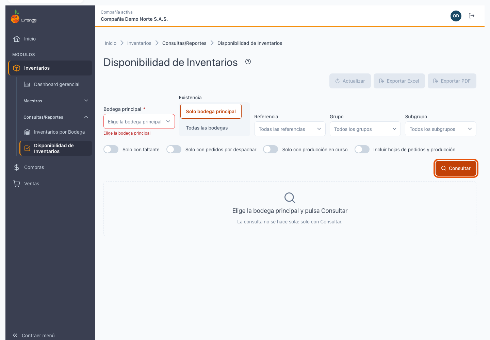
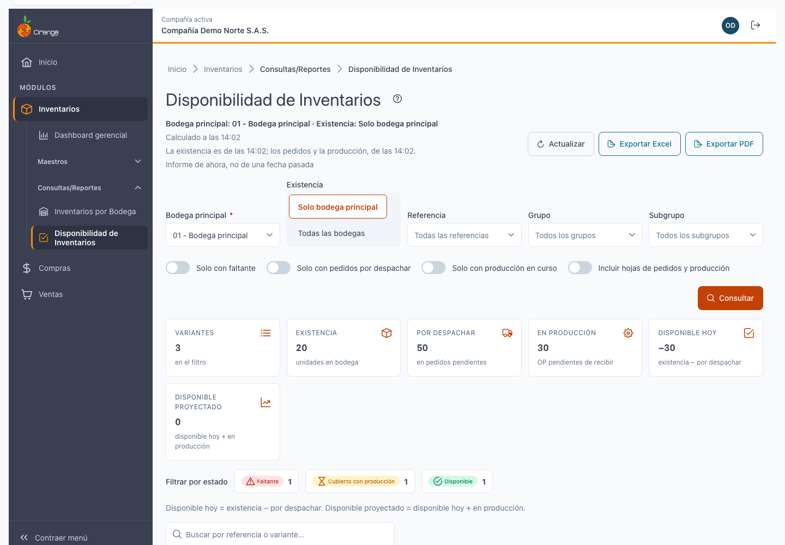
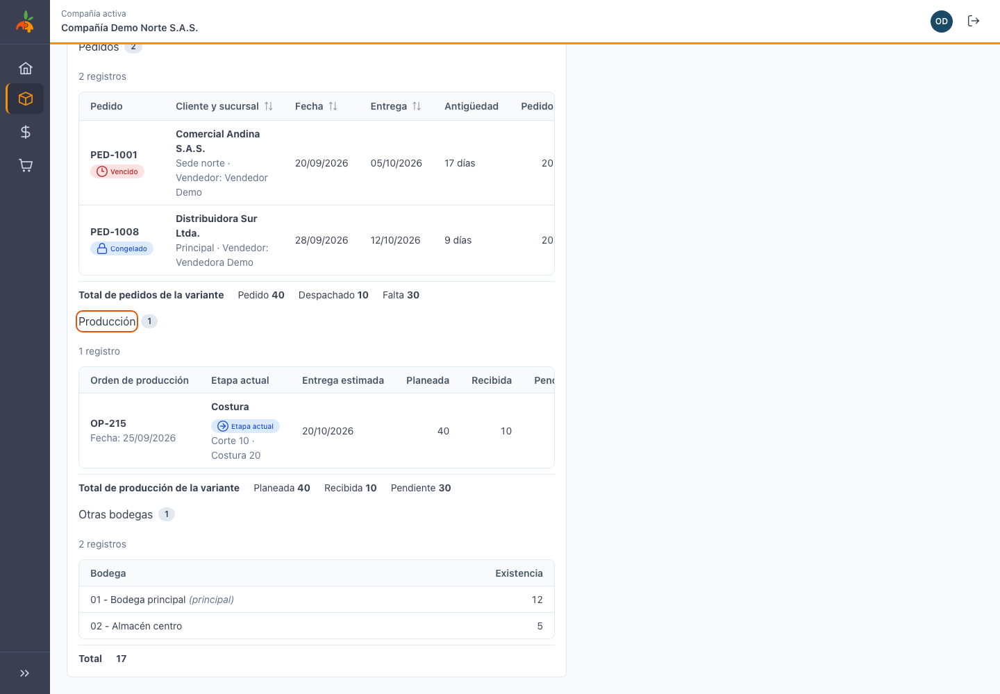
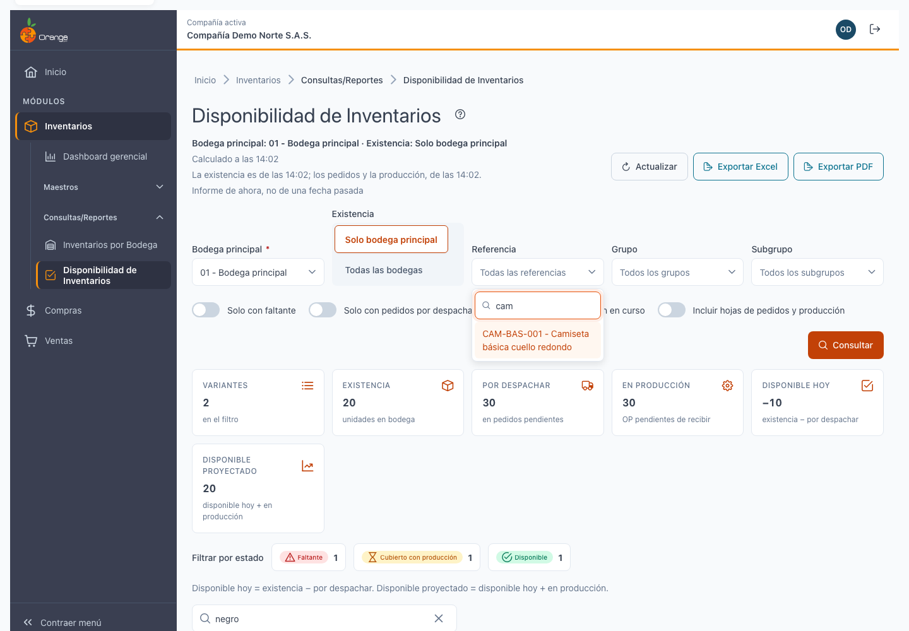
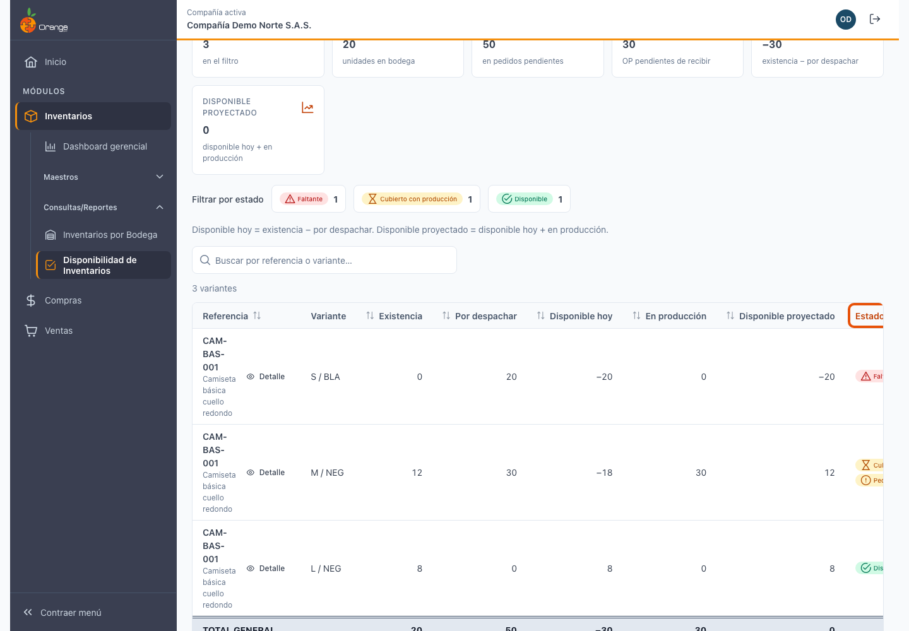
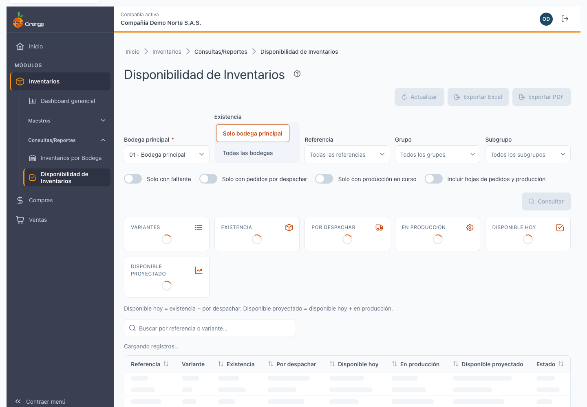
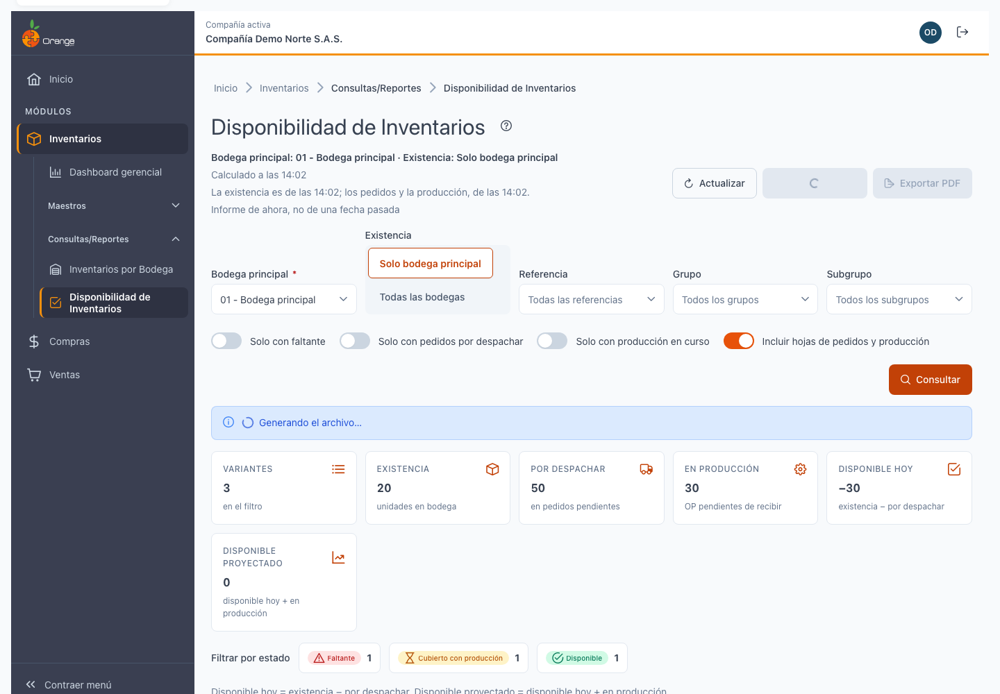

[Regresar a Inventarios](../readme.md)

---

# 📦 Disponibilidad de Inventarios

---

## 📋 Descripción

Esta consulta muestra **cuánto hay hoy de cada referencia en una bodega, cuánto ya está comprometido con pedidos sin despachar, cuánto viene en producción, y por tanto qué puedo ofrecer ahora y qué podré ofrecer cuando termine la fabricación**. Es de **solo lectura**: no crea ni cambia información. Responde a una pregunta del comercial: "¿tengo disponibilidad de este producto para prometer al cliente?"

El informe incluye **solo referencias que manejan inventario**. Los pedidos siguen las mismas reglas que el Reporte de Pedidos legado.

> 📘 El orden, la paginación y la ayuda funcionan como en las demás tablas: ver [Manejo general de la información](../../Generales/manejo-general-informacion.md).

> 💡 Cada pestaña del navegador trabaja con **una compañía**. El nombre de la compañía se ve en la barra superior.

---

## 🎯 Acceso

1. En el menú principal, haga clic en **Inventarios**.
2. En **Consultas/Reportes**, haga clic en **Disponibilidad de Inventarios**.

Permisos de la opción:

| Permiso | Qué permite |
|---------|-------------|
| **Consultar** | Ver la pantalla y consultar. Sin este permiso la pantalla muestra "No tienes acceso a esta consulta". |
| **Exportar** | Ver los botones **Exportar Excel** y **Exportar PDF**. Sin este permiso los botones no aparecen. |

---

## 🖥️ Pantalla principal

Al entrar, la pantalla no muestra datos: elija la bodega principal y pulse **Consultar**.

| Elemento | Para qué sirve |
|----------|----------------|
| **?** (junto al título) | Abre esta ayuda en un panel lateral. |
| **Calculado a las HH:MM** | La hora en que se calculó esa información. |
| **Actualizar** | Vuelve a calcular si han pasado más de 60 segundos. Ver *El día en curso*. |
| **Exportar Excel** / **Exportar PDF** | Descargan lo que cumple los filtros. Están deshabilitados mientras no haya resultados. |
| **Bodega principal** | Elija la bodega donde desea consultar la disponibilidad. **No puede estar vacía.** El sistema recuerda su última elección. |
| **Existencia: Solo bodega principal / Todas las bodegas** | Por defecto **Solo bodega principal**: el disponible se calcula con lo que hay en esa bodega. Active **Todas las bodegas** para ver la disponibilidad usando todo el inventario de la compañía. Los pedidos y la producción siempre cuentan sin importar la bodega. |
| **Referencia, Grupo, Subgrupo, Estado** | Escriba para filtrar. Vacío significa **sin filtrar ese campo**. |
| **Consultar** | Trae el resultado con los filtros elegidos. |

Si deja la bodega vacía o escribe filtros mal formados, el campo marca el error y no se consulta.

---

## 📊 Leer el resultado

1. **Indicadores de resumen:** arriba de la tabla, seis tarjetas con cifras de **todo** lo que cumple los filtros, no solo de la página que ve:
   - **Variantes** (número de filas del resultado).
   - **Existencia** (lo que hay en la bodega elegida, o en todas si activó ese interruptor).
   - **Por despachar** (lo que está comprometido con pedidos sin terminar).
   - **En producción** (lo que está en órdenes de fabricación en tránsito).
   - **Disponible hoy** (Existencia − Por despachar).
   - **Disponible proyectado** (Disponible hoy + En producción).

2. **Tabla:** para cada referencia y variante:
   - **Referencia**: código y nombre del producto.
   - **Atributo principal** y **Atributo secundario**: talla, color, etc.
   - **Unidad**: la unidad de medida de la referencia.
   - **Existencia**: lo que hay en la bodega principal (o el total, según el interruptor).
   - **Por despachar**: saldo pendiente de los pedidos.
   - **Disponible hoy**: Existencia − Por despachar.
   - **En producción**: lo que está en fabricación aún no recibido.
   - **Disponible proyectado**: Disponible hoy + En producción.
   - **Estado** (con texto e ícono): **Disponible** (check, verde), **Cubierto con producción** (reloj, amarillo) o **Faltante** (alerta, rojo).

3. **Seleccionar una variante:** haga clic en una fila o en el botón **Detalle** para abrir el panel de detalles debajo de la tabla. La fila queda resaltada. Se muestra un panel con tres tablas: **Pedidos**, **Producción** y **Otras bodegas**.

4. **Detalle de Pedidos:** tabla con documento/pedido, cliente, sucursal y vendedor, fecha de pedido y entrega, antigüedad, cantidades (Pedido/Despachado/Falta) y estado (Vencido, Congelado, etc.). Se lista por variante seleccionada. Total de todos los pedidos en el pie.

5. **Detalle de Producción:** tabla con número de orden, etapa actual de la ruta (Corte, Costura, etc.), fechas estimadas, cantidades (Planeada/Recibida/Pendiente) y totales en el pie. **Advertencia "OP sin entradas registradas"**: aparece si la orden está en el sistema pero la planta aún no ha registrado ninguna entrada. El tránsito mostrado puede estar sobrestimado; revise con producción.

6. **Otras bodegas:** tabla con bodega (marcando cuál es la principal) y existencia en cada una. Si no hay existencia fuera de la bodega principal, dice "Sin existencia en otras bodegas".

7. **Disposición del detalle:** en escritorio (ancho ≥ 1000 px), **Pedidos** ocupa todo el ancho arriba; **Producción** (2/3) y **Otras bodegas** (1/3) están lado a lado debajo. En tableta, las tres tablas están apiladas con **anclas** (Pedidos · nº, Producción · nº, Otras bodegas · nº) que saltan a cada tabla. En móvil (≤ 640 px), **el detalle ocupa toda la pantalla** con un botón **Volver a la lista** arriba (el foco regresa a la fila).

8. **Cerrar el detalle:** pulse **Cerrar detalle** (botón `✕`), presione **Esc**, seleccione otra fila o haga clic fuera. El detalle se cierra y la selección se quita.

9. **Orden y búsqueda:** al hacer clic en el encabezado de una columna, se ordena la tabla. La búsqueda filtra por código o nombre de referencia (≥ 2 caracteres). Los indicadores, los totales y el detalle se limpian al cambiar filtros, búsqueda u orden. **Actualizar la conserva**: al pulsar **Actualizar**, el detalle sigue abierto y recarga las tres tablas con la información nueva.

Si no hay variantes para esos filtros, la pantalla dice "Sin resultados para los filtros actuales" con un botón **Limpiar filtros**.

---

## 🎨 Estados: Disponible, Cubierto con producción, Faltante

Cada variante tiene un estado que resume su disponibilidad:

| Estado | Significado | Cuándo aparece |
|--------|------------|----------------|
| **Disponible** ✓ | Hay producto disponible ahora para ofrecer. | Disponible hoy ≥ 0 |
| **Cubierto con producción** ⏱ | No hay disponible hoy, pero lo habrá cuando termine la producción en tránsito. | Disponible hoy < 0 y Disponible proyectado ≥ 0 |
| **Faltante** ⚠ | Ni ahora ni con lo que viene en producción hay suficiente. Hay que esperar más producción u obtener de otra forma. | Disponible proyectado < 0 |

Cada estado lleva texto e ícono para que se entienda sin depender solo del color (accesibilidad para el navegador y para lectores de pantalla).

---

## 🏭 Qué cuenta: Pedidos y Órdenes de Producción

### Pedidos (Por despachar)

Cuentan los pedidos de **venta** (opción 56) que:
- No han sido anulados.
- Tienen fecha ≤ hoy (corte "ahora").
- Tienen saldo > 0 por línea.
- Están congelados o no: en ambos casos se incluyen en la cifra de "Por despachar". Los congelados aparecen con una marca de "congelado" en el detalle.

Se mide por **variante**: si un pedido repite la misma variante en dos líneas (quizá con otro valor), se suman y aparece una sola fila.

**Despachado:** suma de todas las facturas de venta y devoluciones ligadas a ese pedido por referencia y variante. Las remisiones **no cuentan** como despacho: solo las facturas hechas.

**Saldo = Cantidad pedida − Despachado**, por variante. Si el saldo es ≤ 0, el pedido no aparece.

**Diferencia con el Reporte de Pedidos legado:** se incluyen pedidos no cerrados (el legado exigía cierre; hoy pueden estar en proceso y contar). Sin embargo, en la mayoría de compañías el cambio es mínimo.

### Órdenes de Producción (En producción)

Cuentan las órdenes de fabricación que:
- Están activas y no canceladas.
- No están congeladas.
- Tienen pendiente > 0 después de restar lo ya recibido.

Se mide por **variante**: cantidad planeada − cantidad recibida (entradas registradas con esa orden), con piso en 0 (una orden sobre-recibida no regala disponibilidad a otra).

**Advertencia "OP sin entradas registradas":** si una orden está en el sistema pero la planta aún no ha registrado ninguna entrada de producto terminado con esa orden, aparece esta advertencia. En ese caso, el tránsito mostrado puede estar sobrestimado. Revise con producción.

---

## 🔍 Filtros

| Filtro | Qué hace | Ejemplo |
|--------|----------|---------|
| **Bodega principal** | Elige dónde consultar la existencia. Obligatorio. El sistema la recuerda. | "01 - Bodega principal" |
| **Existencia** | Cambia si el disponible usa solo esa bodega o todas. | Activar si necesita incluir otras bodegas. |
| **Referencia** | Busca por código o nombre de producto. Escribe ≥ 2 caracteres, sin tildes. | "cam" para "camiseta". |
| **Grupo** | Busca el grupo de la referencia (Ropas, Electrónica, etc.). | "ROP" para "Ropa y calzado". |
| **Subgrupo** | Busca el subgrupo (Tops, Pantalones, etc.). | "TOP" para "Tops y camisetas". |
| **Estado** | Muestra solo variantes con ese estado. | "Faltante" para alertas rojas. |

La búsqueda por referencia es en vivo: conforme escribe, la lista se filtra sin tildes ni mayúsculas. Los otros filtros son de selección múltiple: puede elegir varios valores a la vez.

---

## 🔎 Buscar en el resultado

Después de consultar, escriba en **Buscar…** para filtrar el resultado por código o nombre de referencia. La búsqueda empieza a partir de **2 caracteres** y se hace sola, un instante después de dejar de escribir. No distingue mayúsculas ni tildes.

Los indicadores y los totales se recalculan solo con lo filtrado. Si nada coincide verá "Sin resultados para «…»" y la exportación queda deshabilitada.

---

## 📅 El día en curso

El informe siempre muestra el estado **de hoy** de negocio. Con la hora "Calculado a las HH:MM" aparece un botón **Actualizar** para recalcular si han pasado más de 60 segundos (protege la base de datos de consultas muy seguidas). La información puede cambiar mientras se registran movimientos; tras actualizar, la hora se pone al día.

---

## ⏳ Cuando el cálculo tarda

La primera vez que consulta un día (o si fuerza Actualizar), el inventario se calcula en segundo plano y puede tardar unos segundos. La pantalla muestra "Calculando el inventario..." y puede **seguir trabajando**: cuando termine, el sistema le avisa en la **campana** (notificación en la esquina superior derecha) y el resultado aparece. Las siguientes consultas del mismo día son inmediatas.

---

## 📤 Exportar a Excel y a PDF

Los botones **Exportar Excel** y **Exportar PDF** (solo con permiso **Exportar**) descargan un archivo con el encabezado de la compañía, la hora de cálculo, los filtros usados y **todas las filas** que cumplen los filtros y la búsqueda de pantalla (no solo la página visible).

| Formato | Máximo de filas | Contenido |
|---------|-----------------|-----------|
| **Excel** | 50.000 | Hoja principal "Disponibilidad" con la tabla. Si incluye detalles (opción avanzada), hojas adicionales "Pedidos" y "Producción". |
| **PDF** | 4.000 | Solo la tabla principal en oficio horizontal. Los detalles de pedidos y producción van en Excel si activa la opción. |

Si supera el máximo, un aviso lo indica; **filtre por bodega o referencia** (o busque algo más específico) y vuelva a exportar. Si el Excel es muy grande, el PDF lo será más: pruebe a restringir.

Mientras se genera el archivo, el botón aparece ocupado y al terminar se indica el nombre del archivo descargado. Si algo falla, el mensaje pide intentar de nuevo; sus filtros no se pierden.

---

## 💡 Fórmula y ejemplo

**Disponible hoy = Existencia − Por despachar**

**Disponible proyectado = Disponible hoy + En producción**

### Ejemplo

Referencia `CAM-BAS-001` (Camiseta básica), variante `M/NEG` (Mediano, Negro):

| Concepto | Cantidad | Notas |
|----------|----------|-------|
| Existencia en bodega principal | 12 unidades | Lo que hay ahora. |
| Pedidos pendientes | 30 unidades | Dos pedidos con 15 cada uno sin despachar (aunque haya existencia). |
| **Disponible hoy** | **−18** | 12 − 30. Es negativo: ya está sobre-comprometido. |
| Órdenes de producción en tránsito | 30 unidades | Una orden con 40 planeada, 10 recibida, 30 pendiente. |
| **Disponible proyectado** | **12** | −18 + 30. Cuando termine la orden habrá 12 más de lo pedido. |
| **Estado** | **Cubierto con producción** | Porque hoy es insuficiente (−18 < 0) pero lo cubren las órdenes. |

---

## ⚠️ Advertencia: OP sin entradas registradas

Si abre el detalle de Producción de una orden y ve este aviso, significa que **la planta aún no ha registrado entradas para esa orden**. El tránsito que calcula el sistema puede estar inflado. Ejemplo: una orden con 100 planeada, 0 recibida, muestra 100 en tránsito; pero si la planta está en la mitad de la ruta, el verdadero tránsito es menos. Revise con el equipo de producción.

---

## ❓ Preguntas frecuentes

**¿Puedo ver la disponibilidad a una fecha anterior?**
No. El informe es siempre de hoy. La historia de pedidos y órdenes pasadas no se guarda de forma fiable para reconstruir fechas antiguas.

**¿Qué es la "bodega principal"?**
Es la bodega que elige al entrar. Ahí se mide la existencia y el disponible. Puede cambiarla sin guardarla para siempre: el sistema recuerda la última que usó en esa compañía, pero cada consulta parte de su elección. Si una bodega deja de existir, se olvida.

**¿Los pedidos congelados cuentan?**
Sí. Los congelados se marcan en el detalle para que sepa que están en pausa, pero siguen comprometiendo mercancía y restan del disponible.

**¿Las remisiones cuentan como despacho?**
No. Solo las facturas de venta (y las devoluciones). Una remisión es un paso intermedio; la factura es la que cierra el despacho. Si alguien factura directamente sobre una remisión, se cuenta una sola vez.

**¿Por qué los totales suman unidades distintas?**
Porque cada referencia usa su propia unidad de medida (kilogramos, metros, piezas, etc.). El total de "Existencia" mezcla todas: úselo como referencia de volumen, no como cifra contable. Para cifras de valor, consulte el módulo de **Costeo de Inventarios**.

**¿Por qué un saldo negativo no regala disponibilidad a otra orden?**
Porque cada pedido y cada orden es un compromiso independiente. Si un pedido está sobre-despachado (error de logística), no debe regalar disponibilidad a otro. El "piso en 0" evita eso.

**¿Qué referencias aparecen?**
Solo las que **manejan inventario** (columna `ManejaInventarios` de la referencia). Las que no (servicios, trabajos especiales) no cuentan.

**¿Qué diferencia hay con el Reporte de Pedidos legado?**
1. **Incluye pedidos no cerrados.** El legado exigía cerrado; aquí cuentan aunque estén en tramitación. El cambio es mínimo: en compañías normales, la mayoría de pedidos están cerrados.
2. **Agrega sin importar la bodega del pedido.** El legado emparejaba también por bodega; aquí se suma por variante. El comercial necesita saber si tiene disponible sin importar de dónde viene la línea.
3. **Mide por variante, no por pedido.** Aquí cada variante es una fila; el Reporte podía mostrar el mismo pedido varias veces. Este informe simplifica.

**¿Por qué me dice "No se pudo consultar"?**
Pulse **Actualizar** o vuelva a consultar. Si persiste, la bodega puede no existir en la compañía o su usuario perdió el permiso. Avise a soporte.

**¿Necesito una ruta para ver las etapas de producción?**
No obligatoriamente. Si la orden no tiene ruta o aún no ha iniciado, el detalle lo dice ("Sin ruta definida", "Sin iniciar").

---

[Regresar a Inventarios](../readme.md)
