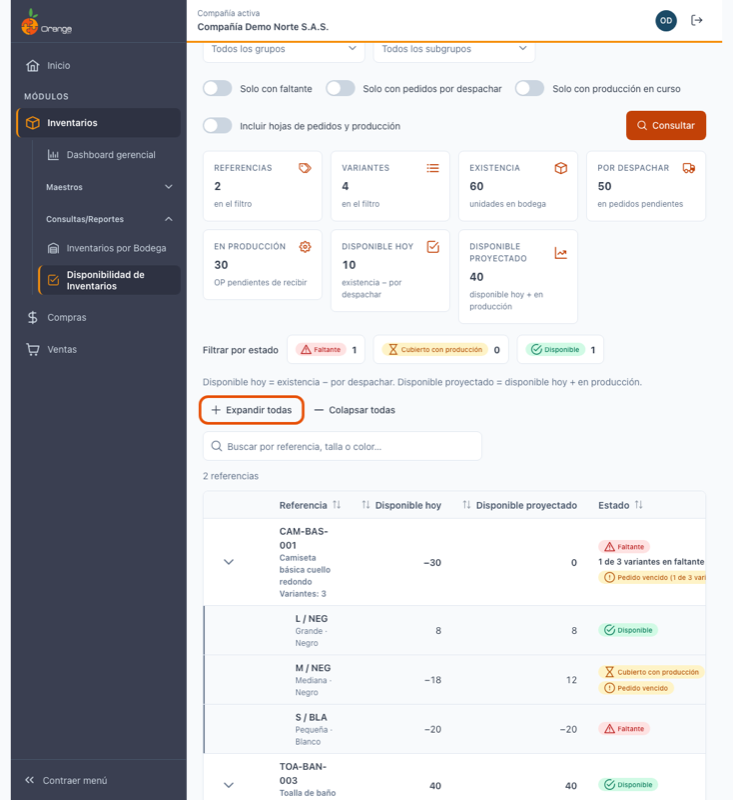
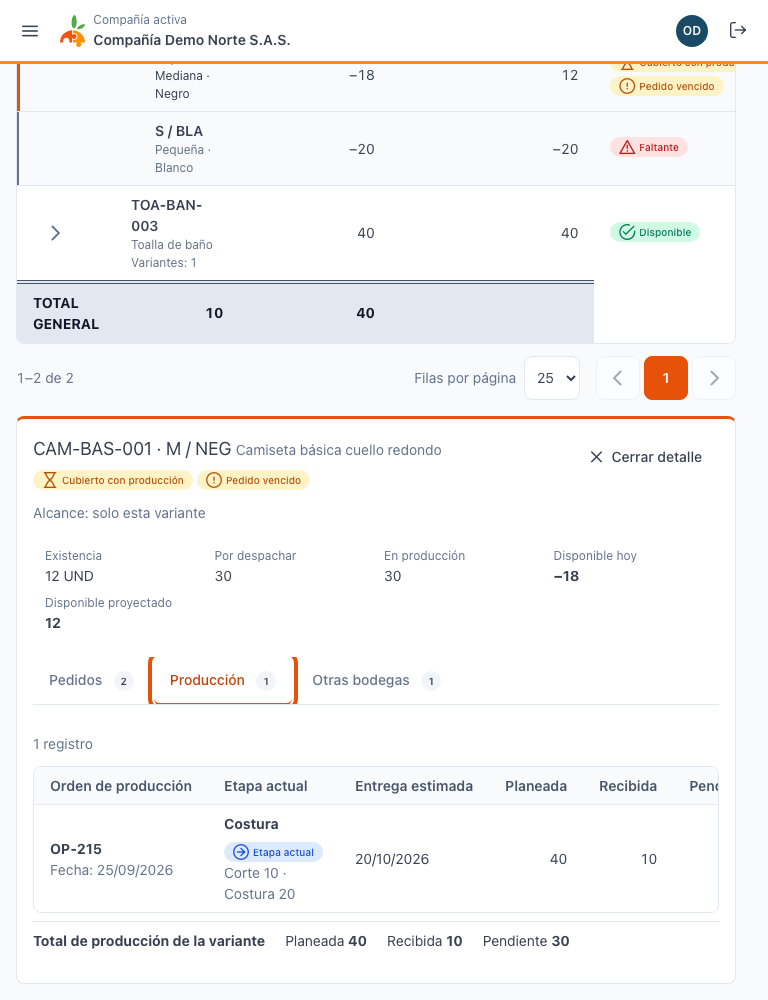
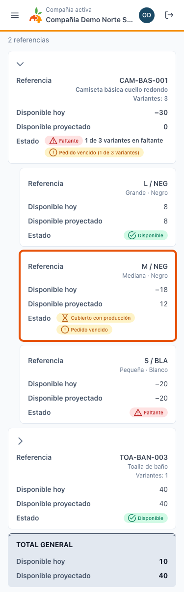

[Regresar a Inventarios](../readme.md)

---

# 📦 Disponibilidad de Inventarios

---

## 📋 Descripción

Consulta que muestra **cuánto hay de cada referencia (por talla, color, etc.) en la bodega principal hoy, cuánto está comprometido con pedidos sin despachar, cuánto viene en producción, y por tanto qué puedo ofrecer ahora y qué podré ofrecer cuando termine la fabricación**. Es de **solo lectura**: no crea ni cambia información. Se puede abrir desde el maestro de **Referencias** con la acción "Ver disponibilidad", filtrada por esa referencia.

El informe incluye **solo referencias que manejan inventario**. Los pedidos siguen las reglas del Reporte de Pedidos legado.

> 📘 Funciona como las demás tablas: ver [Manejo general de la información](../../Generales/manejo-general-informacion.md).

> 💡 Cada pestaña del navegador trabaja con **una compañía**. El nombre de la compañía se ve en la barra superior.

---

## 🎯 Acceso

### Desde Inventarios

1. En el menú principal, haga clic en **Inventarios**.
2. En **Consultas/Reportes**, haga clic en **Disponibilidad de Inventarios**.

### Desde el maestro de Referencias

En **Referencias**, cada referencia tiene una acción **Ver disponibilidad** (ícono de cuadro con check). Al pulsarla, la consulta se abre filtrada por esa referencia. Si ya tiene bodega elegida, consulta automáticamente y abre el detalle. Si no, pide elegir bodega y luego consulta.

**Permisos:**

| Permiso | Qué permite |
|---------|-------------|
| **Consultar** | Ver la pantalla y consultar. Sin él, "No tienes acceso a esta consulta". |
| **Exportar** | Ver botones **Exportar Excel** y **Exportar PDF**. |

---

## 🖥️ Pantalla principal

Al entrar, la pantalla no muestra datos: elija la bodega principal y pulse **Consultar**.

| Elemento | Para qué sirve |
|----------|----------------|
| **?** (junto al título) | Abre esta ayuda en un panel lateral. |
| **Calculado a las HH:MM** | Hora del cálculo. |
| **Actualizar** | Recalcula si han pasado 60+ segundos. Ver *El día en curso*. |
| **Exportar Excel** / **Exportar PDF** | Descargan todo lo filtrado. Deshabilitados sin resultados. |
| **Bodega principal** | **Obligatoria.** El sistema la recuerda. |
| **Existencia: Solo bodega principal / Todas las bodegas** | Por defecto solo la principal. Active para incluir todas. |
| **Referencia, Grupo, Subgrupo** | Filtros por búsqueda. |
| **Solo con faltante, Solo con pedidos, Solo con producción** | Interruptores para ver referencias que tienen ese estado. |
| **Consultar** | Trae el resultado. |

---

## 📊 Leer el resultado

### Grilla por referencia

La tabla muestra **una fila por referencia**, con cifras **sumadas de todas sus variantes**:

- **Referencia**: código y nombre.
- **Variantes**: cuántas tallas, colores, etc. ("3", o "100 de 108" con botón "Ver las 8 restantes").
- **Existencia**: total en la bodega principal (o todas si lo activó).
- **Por despachar**: saldo pendiente sumado.
- **Disponible hoy**: Existencia − Por despachar.
- **En producción**: en fabricación, no recibido.
- **Disponible proyectado**: Disponible hoy + En producción.
- **Estado**: el **peor** de todas las variantes + "1 de 3 variantes en faltante" (u otra cifra).

Números negativos con signo "−".

### Expandir variantes

Haga clic en **▶** para ver sus variantes debajo (p.ej. "M / NEG", "L / NEG"). Botones **Expandir todas** / **Colapsar todas** arriba de la grilla.

Expandir **no abre el detalle**: solo muestra las variantes.

### Seleccionar referencia o variante

**Clic en la referencia (fila principal):** detalle de **toda la referencia** (cifras sumadas, columna "Variante" en las tablas). Título: "CAM-BAS-001 · toda la referencia (3 variantes)".

**Clic en variante (fila con sangría):** detalle de **solo esa variante**. Título: "CAM-BAS-001 · M / NEG".

Una sola selección a la vez. Seleccionar otra cierra la anterior.

### Detalle con tabs

El detalle aparece debajo con tres tabs: **Pedidos · Producción · Otras bodegas**, cada una con contador (p.ej. "Pedidos (3)").

**Solo la tab activa consulta** (más rápido). Las demás consultan cuando las activa.

**Tab por defecto:** Pedidos si hay; si no, Producción; si no, Otras bodegas. Se recuerda durante la sesión.

**Pedidos:** documento, cliente, sucursal·vendedor, fechas, cantidades (Pedido/Despachado/Falta), estado. Con alcance **referencia**, columna "Variante" (qué talla). Total en el pie.

**Producción:** orden, etapa actual (Corte, Costura, etc.), fechas, cantidades (Planeada/Recibida/Pendiente). **"OP sin entradas registradas"** en rojo: la planta no ha registrado entradas, el tránsito puede estar inflado. Total en el pie.

**Otras bodegas:** bodega (la principal marcada) y existencia. Con alcance referencia, columna "Variante" (fila por variante y bodega). Totales.

### Navegar

- **Orden:** clic en encabezado de columna.
- **Búsqueda:** escriba (≥ 2 caracteres) para filtrar referencias. Al expandir, las que coinciden quedan resaltadas "Coincide con el filtro".
- **Cambiar filtro/página/tamaño/orden/búsqueda:** cierra detalle y colapsa referencias.
- **Actualizar:** conserva detalle, expansión y tab. Recarga solo la tab visible.
  - Si la selección desaparece: cierra con aviso "La selección ya no aparece en el resultado".

---

## 🎨 Estados: Disponible, Cubierto con producción, Faltante

El estado de la referencia es el **peor de sus variantes**:

| Estado | Cuándo |
|--------|--------|
| **Disponible** ✓ | Todas las variantes tienen disponible hoy ≥ 0. |
| **Cubierto con producción** ⏱ | Al menos una tiene hoy < 0 pero proyectado ≥ 0 (con producción se cubre). |
| **Faltante** ⚠ | Al menos una tiene proyectado < 0 (falta incluso con producción). |

Lleva "1 de 3 variantes en faltante" u otra combinación: cuántas variantes tienen ese estado.

---

## 🏭 Qué cuenta: Pedidos y Órdenes de Producción

### Pedidos (Por despachar)

- Opción 56 (Ventas › Pedidos).
- No anulados, fecha ≤ hoy, saldo > 0 por línea.
- **Congelados siempre cuentan** (se marcan en el detalle).
- Sumadas por variante.

**Despachado:** facturas de venta + devoluciones (opción 67), por pedido y variante. **Remisiones NO cuentan** (solo factura).

**Saldo = Cantidad − Despachado.**

### Órdenes de Producción (En producción)

- Activas, no canceladas, no congeladas.
- Pendiente > 0 después de restar entradas recibidas.
- Sumadas por variante.

**Advertencia "OP sin entradas registradas":** orden en el sistema pero planta sin entradas → tránsito puede estar sobrestimado.

---

## 📅 El día en curso

Siempre de hoy. Botón **Actualizar** si han pasado 60+ segundos. Información puede cambiar mientras se registran movimientos.

---

## ⏳ Cálculo en segundo plano

Primera consulta del día o Actualizar pueden tardar. Pantalla dice "Calculando..." y puede seguir trabajando. Aviso en la **campana** cuando termine.

---

## 📤 Exportar a Excel y PDF

Con permiso **Exportar**, descargar todo lo filtrado (no solo página).

**Incluir hojas de pedidos y producción:** Excel extra con detalles.

| Formato | Máximo |
|---------|--------|
| **Excel** | 50.000 (ref. + variantes) |
| **PDF** | 4.000 (ref. + variantes) |

Si excede: filtre y reexporte.

---

## 💡 Fórmula y ejemplo

**Disponible hoy = Existencia − Por despachar**

**Disponible proyectado = Disponible hoy + En producción**

**Referencia CAM-BAS-001 (3 variantes):**

| Concepto | M/NEG | L/NEG | S/BLA | **TOTAL** |
|----------|-------|-------|-------|-----------|
| Existencia | 12 | 8 | 0 | **20** |
| Por despachar | 30 | 0 | 20 | **50** |
| Disponible hoy | −18 | 8 | −20 | **−30** |
| En producción | 30 | 0 | 0 | **30** |
| Disponible proyectado | 12 | 8 | −20 | **0** |
| **Estado** | **Cubierto** | **Disponible** | **Faltante** | **Faltante (1 de 3)** |

---

## 📱 Responsive

- **Tableta (768 px):** columnas secundarias ocultas.
- **Móvil (≤ 640 px):** tarjetas anidadas; detalle a pantalla completa con **Volver a la lista**; tabs en fila con scroll.

---

## ❓ Preguntas frecuentes

**¿Desde dónde puedo abrir esta consulta?**
Desde **Inventarios** › **Disponibilidad de Inventarios**, o desde **Referencias** con botón "Ver disponibilidad" en cada fila.

**¿Cómo funcionan las variantes?**
La tabla suma todas las variantes (tallas, colores) en una fila de referencia. Haga clic en **▶** para verlas y **clic en una variante** para ver solo esa.

**¿Qué es el estado de referencia?**
El **peor** de sus variantes: si una está "Faltante", la referencia es "Faltante". Muestra "1 de 3 variantes en faltante", etc.

**¿Los pedidos congelados cuentan?**
Sí, siempre. Se marcan como "Congelado" en el detalle.

**¿Las remisiones cuentan como despacho?**
No. Solo facturas de venta (y devoluciones).

**¿Qué tab se abre por defecto?**
La primera con datos: Pedidos, o Producción, o Otras bodegas (en ese orden). Se recuerda durante la sesión.

**¿Cómo afecta "Actualizar" a mi detalle abierto?**
Conserva: detalle, expansión, tab. Recarga solo la tab visible. Si la selección desaparece, cierra con aviso.

**¿Puedo cambiar filtros sin cerrar el detalle?**
No. Cambiar filtro/página/orden/búsqueda cierra el detalle. **Actualizar** lo conserva.

**¿Por qué pide bodega si abro "Ver disponibilidad" desde Referencias?**
Es la primera vez que consulta. El sistema la recuerda después.

**¿Qué referencias aparecen?**
Solo que **manejan inventario**. Las que no (servicios) no cuentan.

**¿Qué es "Variantes: 100 de 108 · Ver las 8 restantes"?**
La referencia tiene 108 variantes; se muestran 100 en la página. Botón para ver las 8 que falta.

---

[Regresar a Inventarios](../readme.md)
