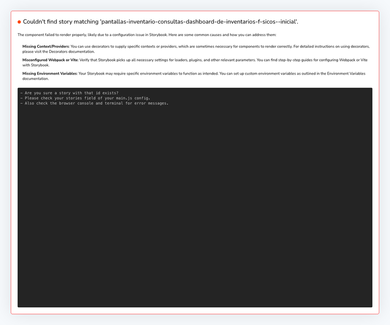
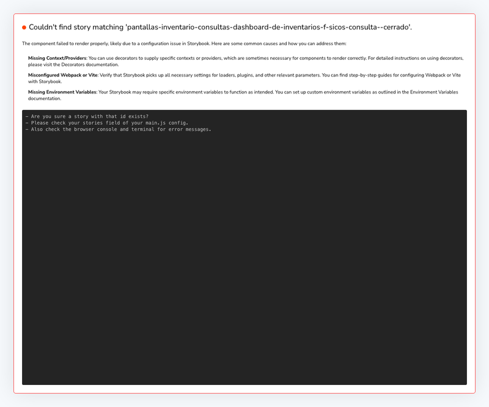
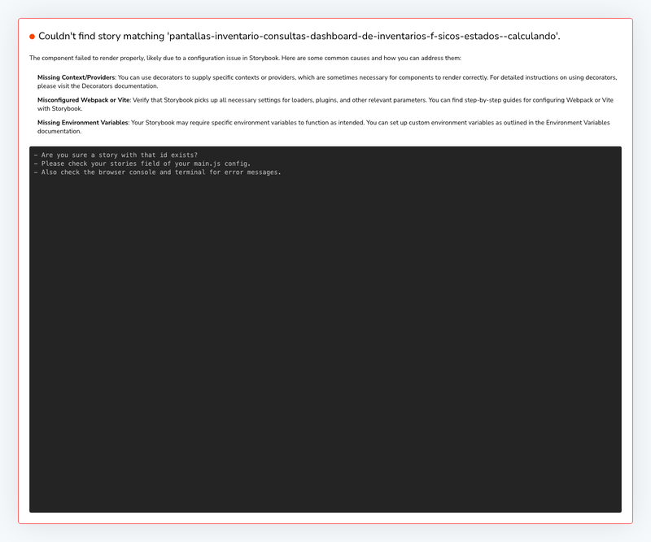

[Regresar a Inventarios](../readme.md)

---

# 📊 Dashboard de Inventarios Físicos

---

## 📋 Descripción

Esta consulta muestra los **conteos finalizados** (Cerrados y Ajustados) de inventario físico en la empresa, con indicadores clave de exactitud, cobertura y estado del ajuste. Es de **solo lectura**: no crea ni cambia información. Puede **consultar, seleccionar conteos, ver gráficos, buscar en el detalle, exportar a Excel y a PDF, e imprimir una presentación de una página**.

El resultado se calcula a partir de los **conteos cerrados** de la compañía, comparando lo **teórico** (según el sistema) con lo **físico** (lo contado), y el **ajuste** si ya se generó. Si elige conteos históricos (cerrados hace meses), algunos pueden no tener ajuste reconstruible y aparecerán marcados como **no reconstruibles**.

En compañías con mucha información el informe se **calcula en segundo plano** y se le avisa por la campana cuando está listo (ver *Calculando…*).

> 📘 La paginación y la ayuda funcionan como en las demás tablas: ver [Manejo general de la información](../../Generales/manejo-general-informacion.md). Las gráficas se pueden ver como tabla con el botón **Ver como tabla**.

> 💡 Cada pestaña del navegador trabaja con **una compañía**. El nombre de la compañía se ve en la barra superior.

---

## 🎯 Acceso

1. En el menú principal, haga clic en **Inventarios**.
2. En **Consultas/Reportes**, haga clic en **Dashboard de Inventarios Físicos**.

Permisos de la opción:

| Permiso | Qué permite |
|---------|-------------|
| **Consultar** | Ver la pantalla, consultar, seleccionar conteos y ver los indicadores, gráficos y detalles. Sin este permiso la pantalla muestra "No tienes acceso a esta consulta". |
| **Exportar** | Ver el botón **Exportar Excel**. Sin este permiso el botón no aparece. |
| **Imprimir** | Ver los botones **Exportar PDF** (detalle) y **Presentar** (resumen de una página). Sin este permiso los botones no aparecen. |

---

## 🖥️ Pantalla principal

Al entrar, la pantalla está vacía: elija los **filtros**, **presione Consultar** y se cargarán los indicadores y gráficos. Si la consulta tarda, verá un aviso **Calculando…** (ver *Calculando…*).

### Banda de corte

La banda superior muestra cuándo se hizo el último conteo (corte), si el resultado ya fue calculado y cuándo, y los botones de actualización y exportes.

| Elemento | Para qué sirve |
|----------|----------------|
| **?** (junto al título) | Abre esta ayuda en un panel lateral. |
| **Conteo del …** | El último conteo que seleccionó; por defecto, el más reciente. Si elige un conteo histórico, la fecha cambia. |
| **Calculado a las HH:MM** | La hora en que se calculó el informe. Si cambia los filtros o selecciona otros conteos, el cálculo se hace de nuevo y esta hora se actualiza. |
| **Actualizar** | Vuelve a calcular el informe sin cambiar los filtros. Está deshabilitado mientras se calcula. |
| **Exportar Excel** | Descargan la tabla de detalle completa. Está deshabilitado mientras no haya resultado. Solo visible con permiso **Exportar**. |
| **Exportar PDF** | Descargan la tabla de detalle en PDF oficio horizontal. Solo visible con permiso **Imprimir**. |
| **Presentar** | Abre una presentación de una página (carta vertical) con un resumen ejecutivo, listo para imprimir o guardar como PDF. Solo visible con permiso **Imprimir**. |

### Filtros

Ajuste estos campos antes de **Consultar**.

| Campo | Qué hace |
|-------|----------|
| **Bodega** | Escriba para buscar por código o nombre y marque **una o varias** (hasta 50). Cada bodega elegida aparece como una etiqueta que puede quitar; **Quitar todos** las borra. Vacío significa **todas las bodegas**. |
| **Desde / Hasta** | El rango de fechas de los conteos. Por defecto, desde el primer conteo disponible hasta hoy. |
| **Tipo** | Elige si quiere **Completo** (conteos de toda la bodega), **Aleatorio** (muestreo) o **Ambos**. |
| **Estado** | **Cerrado** (sin ajuste) o **Ajustado** (con ajuste ya generado). Si elige ambos, verá los dos tipos de conteos. |
| **Elegir conteos** | Abre un modal donde puede seleccionar conteos específicos por nombre, código o bodega (ver *Selector de conteos*). |
| **Consultar** | Calcula el informe con los filtros elegidos. |

### Selector de conteos

Al hacer clic en **Elegir conteos**, se abre un modal con la lista de conteos disponibles en el rango de fechas. Puede buscar, ordenar y seleccionar uno o varios.

- **Búsqueda:** escriba al menos 2 caracteres para buscar por nombre de la bodega o código del conteo.
- **Tabla:** muestre los conteos disponibles, con bodega, código, fecha y estado.
- **Tope:** el modal muestra máximo 31 conteos a la vez; si hay más, use la búsqueda o pagine.
- **Seleccionar:** marque los conteos que desee; si elige un solo conteo, la pantalla muestra solo ese rango. Si elige varios, los gráficos agregados muestran la mezcla.

Los conteos elegidos aparecen como **chips** (etiquetas) bajo los filtros. Puede quitarlos haciendo clic en la **X** de cada chip, o eliminarlos todos con el botón **Limpiar**.

---

## 📊 Indicadores clave (KPI)

Tras consultar, verá las **tarjetas de indicadores** con el resumen del conteo.

### Exactitud

Muestra **cuánto coincide** el conteo físico con lo que el sistema tenía registrado (teórico).

- **Valor:** porcentaje de referencias con diferencia cero (exactitud por unidades).
- **Semáforo:** 
  - 🟢 **Verde (Buena):** ≥ 95% de exactitud.
  - 🟡 **Amarillo (Con atención):** 80% a 94%.
  - 🔴 **Rojo (Crítica):** < 80%.
- **Detalle:** muestra también la exactitud por referencias y por variantes (con atributos).

Si el conteo es **histórico sin ajuste reconstruible**, la exactitud muestra **n/d** (no disponible).

### Cobertura

Muestra **cuántas referencias y variantes se contaron** versus el total disponible.

- **Valor neto y bruto:** unidades contadas y su porcentaje sobre el teórico.
- **Cobertura:** completo (todas), aleatorio (muestreo) o mixta (ambas).
- **Botón "Calcular cobertura":** si elige conteos múltiples, puede pulsar este botón para que el sistema calcule la cobertura combinada de todos (ver *Calcular cobertura*).

### Estado del ajuste

Resume si ya se generó el ajuste y en qué fecha.

- **Pendiente:** el conteo está cerrado pero no hay ajuste aún.
- **Ajustado el DD/MM/YYYY a las HH:MM:** ya existe ajuste, con fecha y hora.
- **Ajuste no identificado:** el ajuste existe pero no se puede vincular a un documento.
- **Inferido:** ajuste histórico reconstruido del documento AJINV, no cien por cien confiable.
- **Anulado:** el ajuste se revirtió.

Si hace clic en el enlace del estado del ajuste (solo con permiso **Consultar** sobre la opción 316), abre la pantalla del **Ajuste de inventario físico** en otra pestaña.

### Calidad de datos

Muestra si hay **marcas o anomalías** en los datos del conteo.

- **Sin marcas:** todos los datos son normales.
- **Lecturas por referencia / Por variante:** hay elementos contados sin atributos o con atributos incompletos (ver *Sobre las marcas*).
- **Teórico no reconstruible (históricos):** algunos registros antiguos no tienen teórico disponible.

---

## 📈 Gráficos

Bajo los indicadores hay **4 gráficos** que visualizan la distribución de exactitud, diferencias y movimientos.

| Gráfico | Muestra |
|---------|---------|
| **Exactitud por Grupos** | Porcentaje de exactitud desglosado por grupo de referencia. Puede cambiar a **Unidades contadas** para ver el volumen. |
| **Diferencias por Grupos** | Sobrantes (lo que hay más) y faltantes (lo que falta) sumados por grupo. |
| **Por Bodega** (solo si selecciona varias) | Exactitud y volumen por bodega. |
| **Detalle por Subgrupos** | Tabla pequeña con el top 10 de subgrupos (o todos si hay menos). |

**Botón "Ver como tabla":** cada gráfico se puede expandir a una tabla con todas las filas y columnas. Cierre la tabla para volver al gráfico.

**Seleccionar grupo / subgrupo:** si hace clic en un grupo del gráfico, el **Detalle** filtra para mostrar solo las referencias de ese grupo. El chip del grupo aparece bajo los filtros y puede eliminarlo.

---

## 📑 Pestaña Detalle

La pestaña **Detalle** muestra una tabla de todas las referencias (renglones) del conteo seleccionado.

### Filtros rápidos

Bajo el título hay **botones de filtro rápido**:

| Botón | Filtra por |
|-------|-----------|
| **Todas** | Muestra todas las referencias. |
| **Con diferencia** | Solo referencias donde físico ≠ teórico. |
| **Sobrantes** | Físico > Teórico (hay más). |
| **Faltantes** | Físico < Teórico (hay menos). |
| **No leídas** | Referencias sin conteo físico. |

### Tabla de detalle

Columnas (puede desplazar horizontalmente en pantallas pequeñas):

- **Referencia:** código y nombre.
- **Variante:** atributo principal y secundario (si aplica).
- **Teórico:** cantidad según el sistema. Marcado con 🏳️ si no es reconstruible (históricos).
- **Física:** cantidad contada.
- **Diferencia:** Física − Teórico (en guion si es cero; marcas de inferido o anulado si aplica).
- **Valor Teórico / Valor Física:** en pesos, con costo promedio del sistema.

### Búsqueda

Escriba en el campo **Buscar referencia, variante o bodega…** para filtrar. La búsqueda empieza a partir de **2 caracteres**, es automática, no distingue mayúsculas ni tildes, y busca en el código y nombre de la referencia, los atributos, y la bodega.

Si nada coincide, verá **Sin resultados para "…"** con el botón **Limpiar búsqueda**.

### Paginación y orden

- **Filas por página:** elige 10, 25, 50 o 100 (por defecto 25).
- **Orden:** por defecto, por **|diferencia| descendente** (los que más diferencia tienen primero). Puede hacer clic en el encabezado de otra columna para reordenar.
- **Totales del filtro:** un panel muestra la suma de cantidad y valor de los renglones visibles (después de búsqueda, filtros rápidos y ordenamiento).

### Marcas en las filas

- **🏳️** (bandera): teórico no reconstruible (conteos históricos sin información original).
- **Inferido:** el ajuste fue reconstruido del documento AJINV.
- **Anulado:** el ajuste se revirtió después.

---

## ⏳ Calculando…

Cuando consulta un rango de fechas grande o selecciona muchos conteos, el sistema calcula el informe en **segundo plano**:

1. Verá el aviso **Calculando… puede tardar unos minutos**. Los filtros quedan visibles pero **Consultar** se deshabilita mientras se calcula.
2. Puede **seguir trabajando** en otras pantallas. Recibirá en la **campana** una notificación **"Informe listo"** cuando termine, con un enlace a la pantalla.
3. Si falla, la notificación lo indica. Puede hacer clic en **Reintentar**.
4. Una vez listo, el resultado se guarda unos 15 minutos: mientras tanto, cambiar de página, buscar, filtrar o exportar es inmediato. Si pasa ese tiempo o se reinicia el servicio, verá **Calculando…** de nuevo.

### Alcance demasiado amplio

Si pide un rango de fechas o cantidad de bodegas muy grande, verá **El resultado es demasiado amplio**. **Acorte el periodo, elija menos bodegas o seleccione conteos específicos** (usar *Selector de conteos*) y consulte de nuevo.

### El informe no está disponible

Si ve **El informe no está disponible por ahora**, no se pudo calcular. Pulse **Reintentar** más tarde; si sigue igual, avise a soporte.

---

## 📤 Exportar a Excel y a PDF

Los botones **Exportar Excel** y **Exportar PDF** (solo con permiso **Exportar** e **Imprimir** respectivamente) descargan la **tabla de detalle** con **los mismos filtros, la misma búsqueda y el mismo orden** que tiene en pantalla.

- **Encabezado:** datos de la compañía, el título "Dashboard de Inventarios Físicos", el rango de fechas, las bodegas (o "Todas"), el tipo de conteo (Completo, Aleatorio, Ambos), el estado (Cerrado, Ajustado, Ambos), la búsqueda, la fecha y hora de generación y el usuario que lo generó.
- **Contenido:** las mismas columnas de la pantalla.
- **Nombre del archivo:** `informe-inventario-fisico_` seguido de las fechas, por ejemplo `informe-inventario-fisico_2026-10-01_2026-10-05.xlsx` o `.pdf`.

| Formato | Máximo de referencias |
|---------|----------------------|
| **Excel** | 50.000 |
| **PDF** | 4.000 |

Si supera el máximo, un aviso lo indica: **acote el periodo, las bodegas o la búsqueda** y vuelva a exportar. Mientras se genera el archivo aparece **Generando el archivo…** y el botón queda ocupado; al terminar se indica el nombre del archivo descargado.

---

## 🖨️ Presentar (Resumen de una página)

El botón **Presentar** (solo con permiso **Imprimir**) abre una presentación de **una página** (carta vertical) con un resumen ejecutivo del conteo: KPI, estado del ajuste, top 5 grupos, tabla por bodega, notas y firmas de Elaboró, Revisó y Aprobó.

Desde ahí puede:
- **Imprimir:** pulsar Ctrl+P (o ⌘+P en Mac) e imprimir directamente.
- **Guardar como PDF:** desde el diálogo de impresión.
- **Vista previa:** hacer clic en el icono de vista previa antes de imprimir.

Esta presentación está optimizada para impresión: las márgenes, el tamaño de letra y los espacios están ajustados para una página estándar.

---

## 💡 Preguntas frecuentes

### ¿Cómo sé si el conteo está correcto?

Revise el **semáforo de exactitud**: si es verde (≥ 95%), el conteo es muy bueno. Si es amarillo (80–94%), hay diferencias pero dentro de lo esperado. Si es rojo (< 80%), hay discrepancias importantes que deben investigarse. Luego abra la **pestaña Detalle** y vea cuáles referencias tienen mayores diferencias.

### ¿Qué significa "Teórico no reconstruible"?

Los conteos históricos (de hace varios meses) pueden tener registros sin información original en la base de datos. En estos casos, la exactitud muestra **n/d** (no disponible) porque no se puede comparar bien. Solo se ve lo **físico** (lo contado) en la tabla, sin teórico.

### ¿Puedo corregir diferencias desde el informe?

No. El informe es de **solo lectura**. Para crear un ajuste, abra la pantalla **Ajuste de inventario físico** (opción 316). Desde el informe, si hace clic en el enlace del estado del ajuste, llega directo a la 316.

### ¿Por qué tarda mucho en calcular?

Conteos muy grandes (miles de referencias en varias bodegas) pueden tardar **varios minutos**. El sistema calcula en segundo plano para que no quede esperando. Recibirá un aviso en la campana cuando termine.

### ¿Qué pasa si el conteo no tiene ajuste?

El estado muestra **Pendiente**. Puede seguir usando el informe para revisar exactitud y diferencias, pero hasta que genere el ajuste no verá los documentos AJINV en la pantalla de Ajuste (316).

### ¿Cómo veo solo un conteo en lugar de varios?

Use el botón **Elegir conteos** para abrir el modal, seleccione un solo conteo y pulse **Consultar**. O ajuste los filtros de **Desde/Hasta** a una sola fecha y seleccione la bodega correspondiente.

### ¿Por qué algunos valores tienen una bandera 🏳️?

Significa que ese dato es **histórico sin teórico reconstruible**. El sistema no tiene información suficiente para calcular el teórico original, así que no se puede confiar en la exactitud ni en la comparación. Revise manualmente o consulte con soporte.

### ¿Puede exportar a otra división o empresa?

No directamente desde el informe. Si necesita compartir los datos, exporte a Excel, abra el archivo y comparta manualmente. El informe siempre está filtrado a **una compañía** a la vez.

---

## 🔄 Cambios de otros usuarios en vivo

El informe es de **consulta en vivo**: cada vez que **Actualiza** o cambia los filtros, el sistema recalcula con los datos actuales. Si otro usuario ajusta un conteo mientras usted lo está viendo, el resultado cambiará al actualizar.

---

## 📌 Diferencias con versiones anteriores

Este informe es **nuevo** en la versión 2026 y reemplaza la opción 314 (Comparativo legado), que ahora redirige aquí automáticamente.

