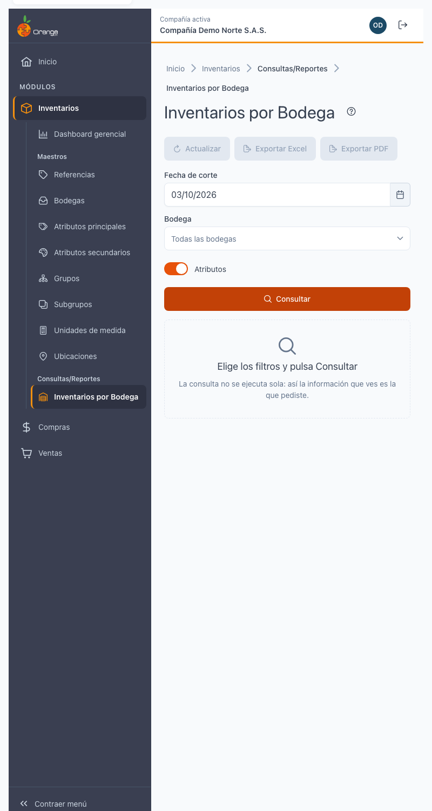
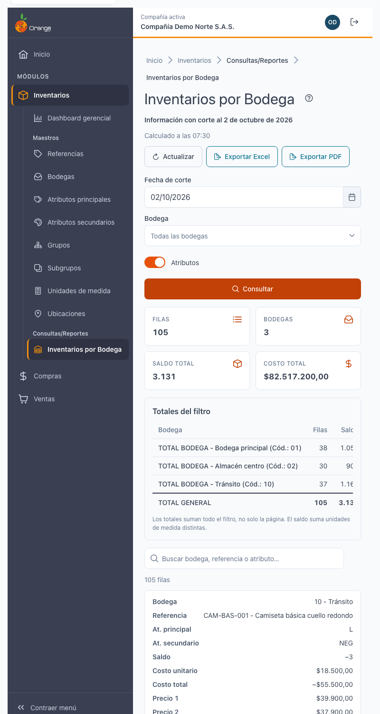
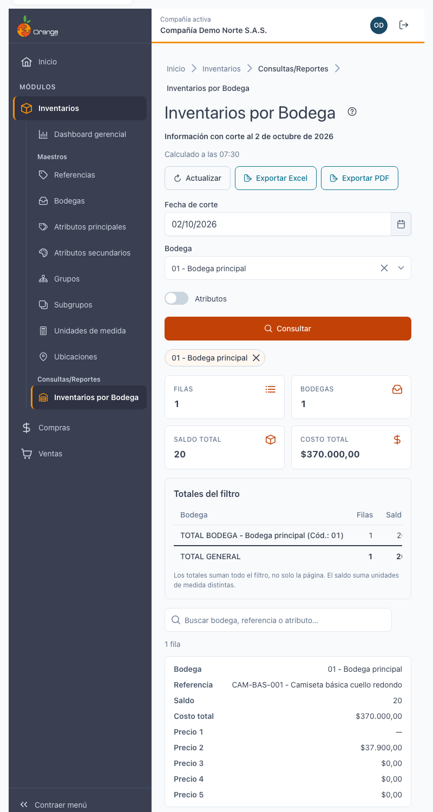
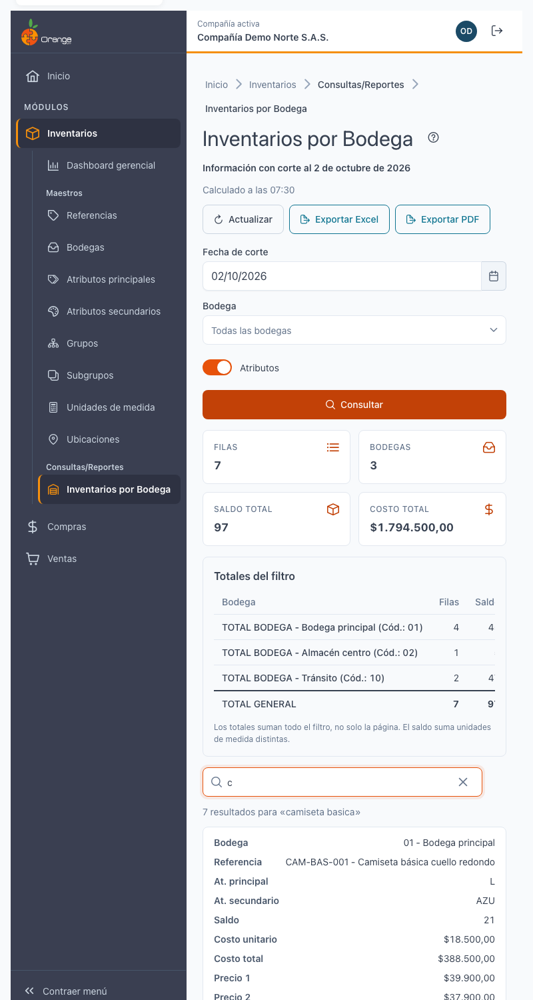
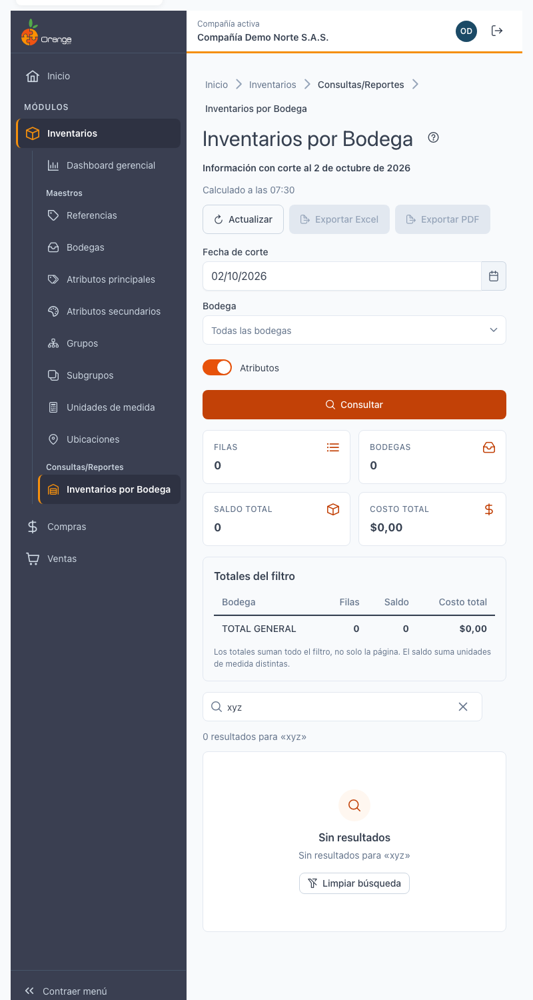
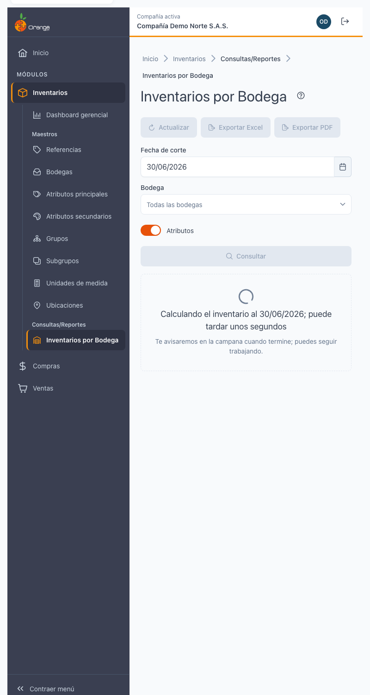
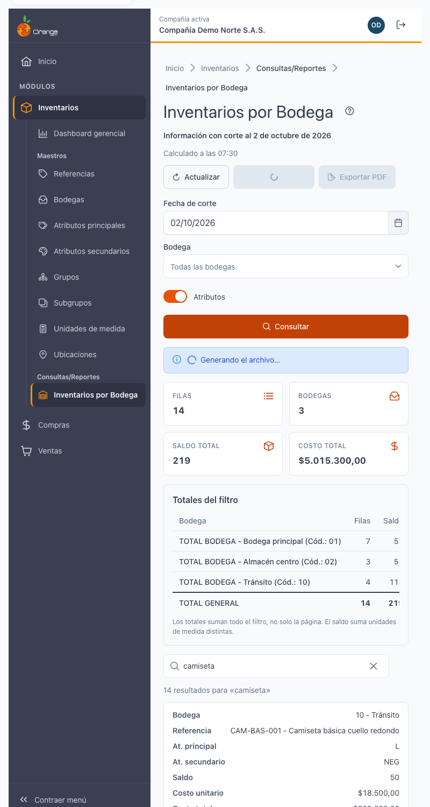
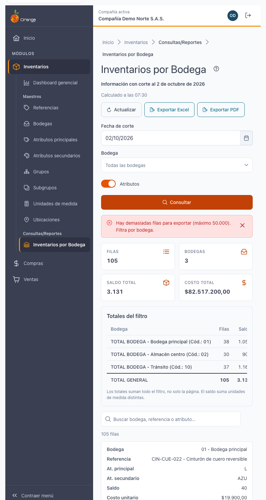

[Regresar a Inventarios](../readme.md)

---

# 📊 Inventarios por Bodega

---

## 📋 Descripción

Esta consulta muestra **cuánto hay de cada referencia en cada bodega** a una **fecha de corte**, con su saldo, su costo unitario, su costo total y los cinco precios de venta. Es de **solo lectura**: no crea ni cambia información. Puede **consultar, buscar, ordenar, exportar a Excel y exportar a PDF**.

> 📘 El orden, la paginación y la ayuda funcionan como en las demás tablas: ver [Manejo general de la información](../../Generales/manejo-general-informacion.md).

> 💡 Cada pestaña del navegador trabaja con **una compañía**. El nombre de la compañía se ve en la barra superior.

---

## 🎯 Acceso

1. En el menú principal, haga clic en **Inventarios**.
2. En **Consultas/Reportes**, haga clic en **Inventarios por Bodega**.

Permisos de la opción:

| Permiso | Qué permite |
|---------|-------------|
| **Consultar** | Ver la pantalla y consultar. Sin este permiso la pantalla muestra "No tienes acceso a esta consulta". |
| **Exportar** | Ver los botones **Exportar Excel** y **Exportar PDF**. Sin este permiso los botones no aparecen. |

---

## 🖥️ Pantalla principal

Al entrar, la pantalla no muestra datos: elija los filtros y pulse **Consultar**.

| Elemento | Para qué sirve |
|----------|----------------|
| **?** (junto al título) | Abre esta ayuda en un panel lateral. |
| **Información con corte al…** | La fecha a la que corresponde lo que está viendo. |
| **Calculado a las HH:MM** | La hora en que se calculó esa información. |
| **Actualizar** | Vuelve a calcular el inventario. Ver *El día en curso*. |
| **Exportar Excel** / **Exportar PDF** | Descargan lo que cumple los filtros y la búsqueda. Están deshabilitados mientras no haya resultados. |
| **Fecha de corte** | Por defecto es **hoy**. No puede ser una fecha futura. |
| **Bodega** | Escriba para buscar por código o nombre. Vacío significa **todas las bodegas**; puede elegir varias y se muestran como etiquetas que puede quitar. |
| **Atributos** | Ver *Con y sin atributos*. |
| **Consultar** | Trae el resultado con los filtros elegidos. |

Si escribe una fecha futura o mal formada, el campo marca el error y no se consulta.

---

## 🔎 Leer el resultado

1. **Tarjetas de resumen:** filas, bodegas, saldo total y costo total de **todo** lo que cumple los filtros, no solo de la página que ve.
2. **Totales del filtro:** una línea **TOTAL BODEGA - nombre (Cód.: código)** por cada bodega y un **TOTAL GENERAL**. Están en un panel sobre la tabla (y no mezclados con las filas) para que sigan correctos aunque la tabla tenga varias páginas. El saldo suma unidades de medida distintas, por eso es una referencia de volumen y no una cifra contable.
3. **Tabla:** Bodega, Referencia, Atributo principal, Atributo secundario, Saldo, Costo unitario, Costo total y Precio 1 a Precio 5. Puede ordenar haciendo clic en el encabezado y elegir 10, 25, 50 o 100 filas por página. En pantallas pequeñas la tabla se convierte en tarjetas.
4. Los saldos **negativos** se muestran con signo **−**: indican que se sacó más de lo que había registrado y conviene revisarlos.

Si no hay inventario para esos filtros, la pantalla dice "No hay inventario con saldo…": pruebe con otra fecha u otra bodega.

---

## 🏷️ Con y sin atributos

El interruptor **Atributos** cambia el nivel de detalle:

| Opción | Qué ve |
|--------|--------|
| **Con atributos** (activado) | Una fila por **variante**: referencia + atributo principal + atributo secundario (por ejemplo, talla y color). |
| **Sin atributos** (desactivado) | Una fila por **referencia**; las columnas de atributos quedan vacías. |

Sin atributos, si las variantes de una referencia tienen **precios distintos**, el precio se muestra como **—** (no se inventa un precio único). Consulte con atributos para verlos.

---

## 🔍 Buscar en el resultado

Escriba en **Buscar bodega, referencia o atributo…**. La búsqueda empieza a partir de **2 caracteres** y se hace sola, un instante después de dejar de escribir. No distingue mayúsculas ni tildes, y cada palabra debe aparecer en el código o el nombre de la bodega, la referencia o los atributos.

Las tarjetas, los totales y los archivos exportados **respetan la búsqueda**. Si nada coincide verá "Sin resultados para «…»" y la exportación queda deshabilitada.

---

## 💲 Costo promedio móvil: por qué las cifras pueden diferir del reporte anterior

El **costo unitario** es el **costo promedio móvil** de cada referencia: se recalcula con cada entrada y la salida se valora a ese costo. Es **la misma cifra** que ve en el Dashboard gerencial de Inventarios y en la pestaña Inventario de [Referencias](../maestros/referencias.md): una sola fuente para las tres pantallas.

El reporte de la versión anterior calculaba el costo con otro método (un promedio de las entradas con redondeo a número entero). Por eso, **para una misma fecha, el costo unitario y el costo total pueden ser distintos** de los que obtenía antes: en una compañía de pruebas el costo fue cerca de un 13 % menor donde el saldo es positivo. **No es un error**: la cifra de ahora es la que coincide con el resto del sistema.

Otras diferencias respecto al reporte anterior:

- Ya no acepta **fechas futuras**.
- Los totales se calculan sobre **todo el resultado** y no solo sobre lo que alcanza a cargar la pantalla.
- Los archivos exportados respetan la **bodega, la búsqueda y el orden** que tiene en pantalla.
- Cada persona ve su propia consulta: ya no se comparte con otros usuarios que estén consultando al tiempo.

---

## 📅 El día en curso

Con la fecha de hoy aparece un aviso: la información puede cambiar mientras se registran movimientos y se calculó a la hora indicada. Pulse **Actualizar** para recalcular.

Con fechas anteriores, la información ya no cambia.

---

## ⏳ Cuando el cálculo tarda

La primera vez que consulta una fecha, el inventario se calcula en segundo plano y puede tardar unos segundos. La pantalla muestra "Calculando el inventario al…" y puede **seguir trabajando**: cuando termine, el sistema le avisa en la **campana** y el resultado aparece. Las siguientes consultas de la misma fecha son inmediatas.

---

## 📤 Exportar a Excel y a PDF

Los botones **Exportar Excel** y **Exportar PDF** (solo con permiso **Exportar**) descargan un archivo con el encabezado de la compañía, la fecha de corte, los filtros usados y **todas las filas** que cumplen la bodega, la búsqueda y el orden de pantalla (no solo la página visible).

| Formato | Máximo de filas |
|---------|-----------------|
| **Excel** | 50.000 |
| **PDF** | 4.000 |

Si supera el máximo, un aviso lo indica; **filtre por bodega** (o busque algo más específico) y vuelva a exportar. Si el PDF es demasiado grande, puede exportar a Excel.

Mientras se genera el archivo, el botón aparece ocupado y al terminar se indica el nombre del archivo descargado. Si algo falla, el mensaje pide intentar de nuevo; sus filtros no se pierden.

---

## ❓ Preguntas frecuentes

**¿Por qué el costo es distinto al del reporte anterior?** Ver *Costo promedio móvil*.

**¿Por qué no veo los botones de exportar?** Su usuario no tiene el permiso **Exportar** en esta opción. Pídalo al administrador.

**¿Puedo consultar una fecha futura?** No.

**¿Por qué el saldo total mezcla unidades?** Suma saldos de referencias con unidades de medida distintas; úselo como referencia de volumen. Para cifras de valor use el **costo total**.

**Me aparece "No se pudo consultar el inventario".** Pulse **Reintentar**. Si persiste, avise a soporte.

---

[Regresar a Inventarios](../readme.md)
