[Regresar a Inventarios](../readme.md)

---

# 📒 Kardex de Inventarios

---

## 📋 Descripción

Esta consulta muestra **cada entrada y cada salida de inventario** de un **periodo**, con el **saldo inicial**, la **existencia** que queda después de cada movimiento (en cantidad y en pesos) y los totales. Es de **solo lectura**: no crea ni cambia información. Puede **consultar, buscar, exportar a Excel y exportar a PDF**.

El saldo se lleva **por referencia y bodega** (y por variante cuando consulta con atributos): cada bodega tiene su propia existencia, aunque consulte varias a la vez.

> 📘 La paginación y la ayuda funcionan como en las demás tablas: ver [Manejo general de la información](../../Generales/manejo-general-informacion.md). A diferencia de otras tablas, aquí **no se puede ordenar por columna** (ver *Leer el resultado*).

> 💡 Cada pestaña del navegador trabaja con **una compañía**. El nombre de la compañía se ve en la barra superior.

---

## 🎯 Acceso

1. En el menú principal, haga clic en **Inventarios**.
2. En **Consultas/Reportes**, haga clic en **Kardex de Inventarios**.

Permisos de la opción:

| Permiso | Qué permite |
|---------|-------------|
| **Consultar** | Ver la pantalla, consultar y ver cantidades y valores. Sin este permiso la pantalla muestra "No tienes acceso a esta consulta". |
| **Exportar** | Ver los botones **Exportar Excel** y **Exportar PDF**. Sin este permiso los botones no aparecen. |

---

## 🖥️ Pantalla principal

Al entrar, la pantalla no muestra datos: elija los filtros y pulse **Consultar**. La consulta no se ejecuta sola, así lo que ve es exactamente lo que pidió.

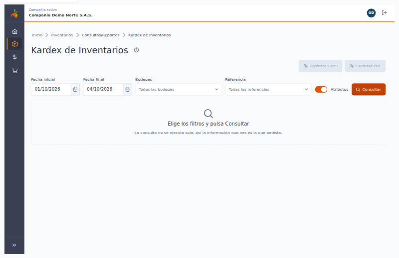

| Elemento | Para qué sirve |
|----------|----------------|
| **?** (junto al título) | Abre esta ayuda en un panel lateral. |
| **Movimientos del … al …** | El periodo al que corresponde lo que está viendo. |
| **Consultado a las HH:MM** | La hora en que se hizo la consulta. Para ver movimientos registrados después, pulse **Consultar** otra vez. |
| **Exportar Excel** / **Exportar PDF** | Descargan lo que cumple los filtros y la búsqueda. Están deshabilitados mientras no haya resultados. |
| **Fecha inicial** / **Fecha final** | Por defecto, del **primer día del mes** a **hoy**. La fecha final no puede ser futura y el periodo no puede superar **12 meses**. |
| **Bodegas** | Escriba para buscar por código o nombre y marque **una o varias** (hasta 50). Cada bodega elegida aparece como una etiqueta que puede quitar; **Quitar todos** las borra. Vacío significa **todas las bodegas**. |
| **Referencia** | Opcional. Escriba para buscar por código o nombre. Vacío significa **todas las referencias**. También encuentra las referencias **inactivas**, marcadas "(inactiva)". |
| **Atributos** | Ver *Con y sin atributos*. Por defecto está activado. |
| **Consultar** | Trae el resultado con los filtros elegidos. |

El botón **?** abre este manual sin salir de la consulta:

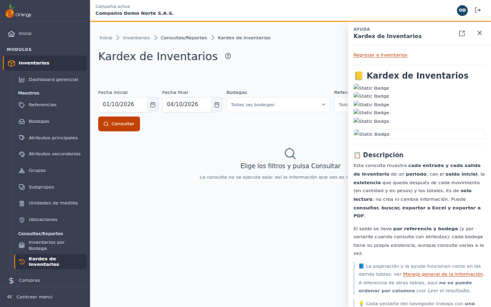

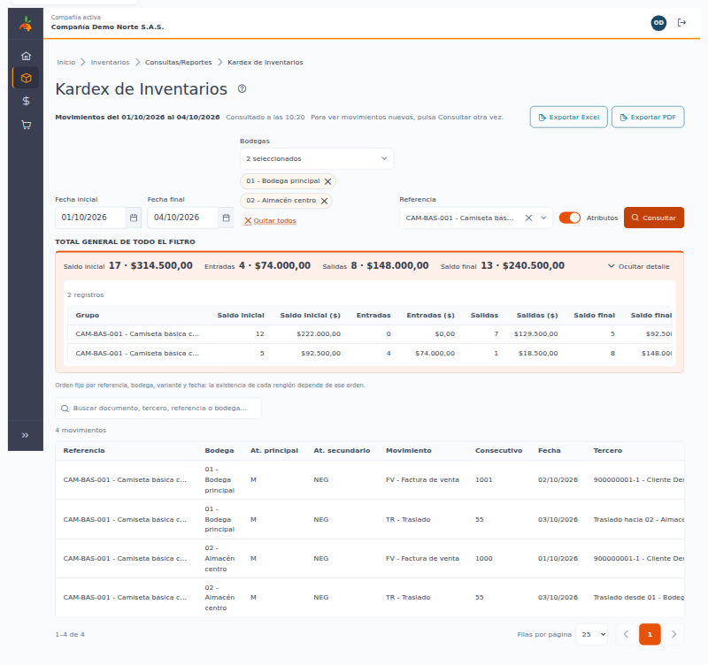

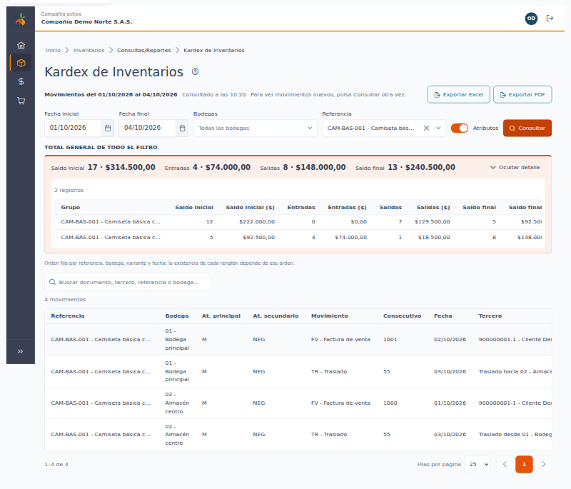

### Fechas que no se aceptan

El campo marca el error y no se consulta cuando:

- Falta la fecha inicial: "Elige una fecha inicial".
- La fecha final es futura o no es válida: "Elige una fecha final que no sea futura".
- La fecha inicial es posterior a la final: "La fecha inicial no puede ser posterior a la final".
- El periodo supera 12 meses: "El periodo no puede superar 12 meses". Divida la consulta en periodos más cortos.

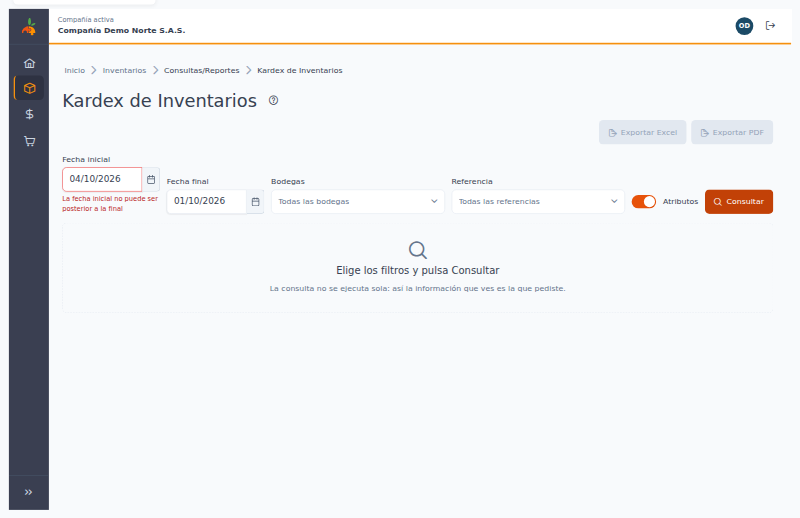

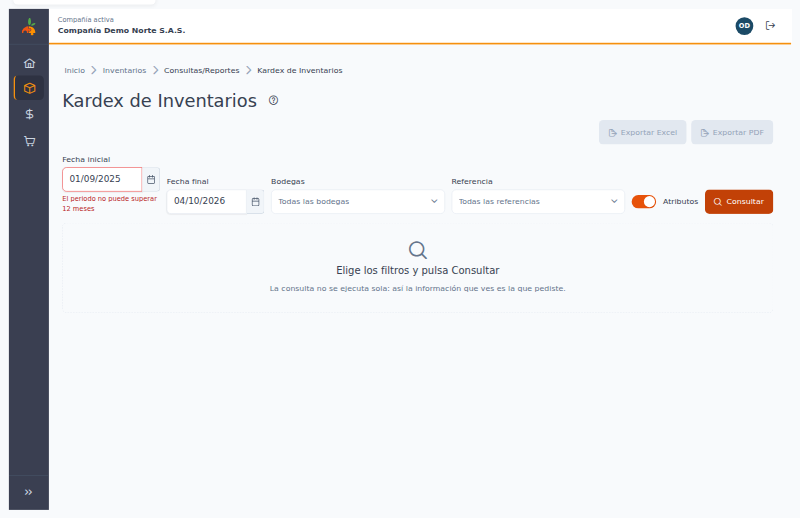

---

## 🔎 Leer el resultado

1. **Panel de totales (sobre la tabla):** el título **TOTAL GENERAL de todo el filtro** muestra cuatro cifras de **todo** lo consultado, no solo de la página que ve, cada una en cantidad · pesos: **Saldo inicial**, **Entradas**, **Salidas** y **Saldo final**. Debajo, la tabla plegable **Totales de los grupos de esta página** trae los mismos cuatro totales para cada grupo (referencia · bodega, y la variante si consulta con atributos) que aparece en la página; esos totales son los del grupo **completo**, aunque parte de sus movimientos esté en otra página. Puede plegar ese detalle y la pantalla recuerda cómo lo dejó.
2. **Tabla de movimientos:** Referencia, Bodega, At. principal y At. secundario (solo con atributos), Movimiento, Consecutivo, Fecha, Tercero, Entradas, Entradas ($), Salidas, Salidas ($), Existencia y Existencia ($). Puede elegir 10, 25, 50 o 100 filas por página (por defecto 25).
3. **Existencia:** es el saldo **después** de ese movimiento, para esa referencia en esa bodega (y esa variante). Empieza en el saldo que había el día anterior a la fecha inicial y suma entradas y resta salidas renglón por renglón.
4. **Orden fijo:** los renglones salen por referencia, bodega, variante y fecha (las entradas de un mismo día antes que las salidas). **No se puede ordenar por columna**, porque la existencia de cada renglón depende de ese orden.
5. **Página que continúa:** la existencia sigue de una página a la siguiente; no vuelve a empezar al cambiar de página.

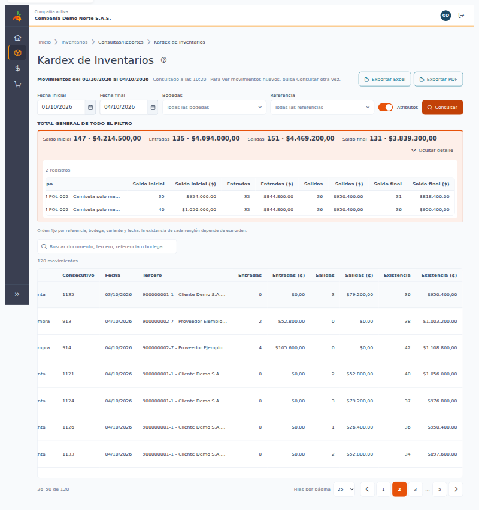

6. Las cantidades se muestran hasta con 4 decimales y los valores con 2. Las existencias **negativas** se muestran con signo **−**: indican que se sacó más de lo que había registrado y conviene revisarlas. Si una existencia llega a 0, el saldo **continúa desde 0** con el siguiente movimiento.

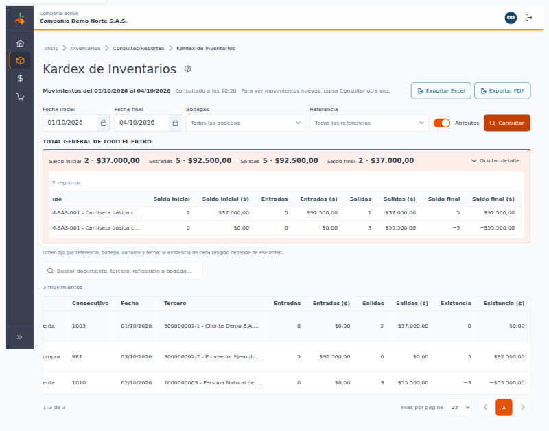

7. **En el celular:** cada renglón se muestra como una tarjeta con todas sus etiquetas, y el panel de totales queda apilado arriba.

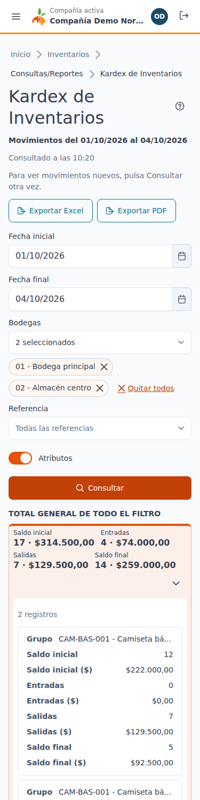

> ⚠️ El **saldo** total suma unidades de medida distintas (unidades, metros, kilos…), por eso es una referencia de volumen y no una cifra contable. Para comparar valores use las cifras en **pesos**.

---

## 💲 Cómo se calcula el valor

- **Entradas ($) y Salidas ($):** cantidad del movimiento × **costo con el que quedó registrada esa línea** del documento.
- **Saldo inicial ($):** la suma de los valores de todos los movimientos anteriores a la fecha inicial.
- **Existencia ($):** saldo inicial ($) + entradas ($) − salidas ($), renglón por renglón.

Es la misma cifra en la pantalla, en el Excel y en el PDF.

---

## 🔁 Traslados

Un traslado entre bodegas aparece en **dos renglones**: la **salida** en la bodega de origen y la **entrada** en la bodega de destino. En la columna **Tercero** se indica la otra bodega: "Traslado hacia *bodega destino*" en la salida y "Traslado desde *bodega origen*" en la entrada.

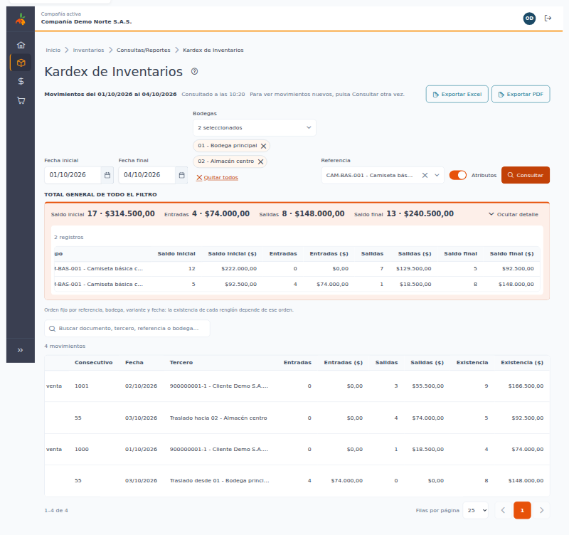

Si consulta solo una de las dos bodegas, verá solo el lado del traslado que le corresponde.

---

## 🚫 Documentos anulados

Los documentos **anulados no aparecen** en el kardex y **no suman** en las existencias ni en los totales.

---

## 📌 Referencias con saldo y sin movimientos en el periodo

Si una referencia tiene saldo en una bodega pero **no tuvo movimientos** en el periodo, aparece con un solo renglón **"Saldo inicial (sin movimientos en el periodo)"**: con la fecha inicial, sin documento ni tercero, entradas y salidas en 0 y la existencia igual al saldo. Ese saldo **sí suma** en el TOTAL GENERAL. Las referencias sin saldo y sin movimientos no aparecen.

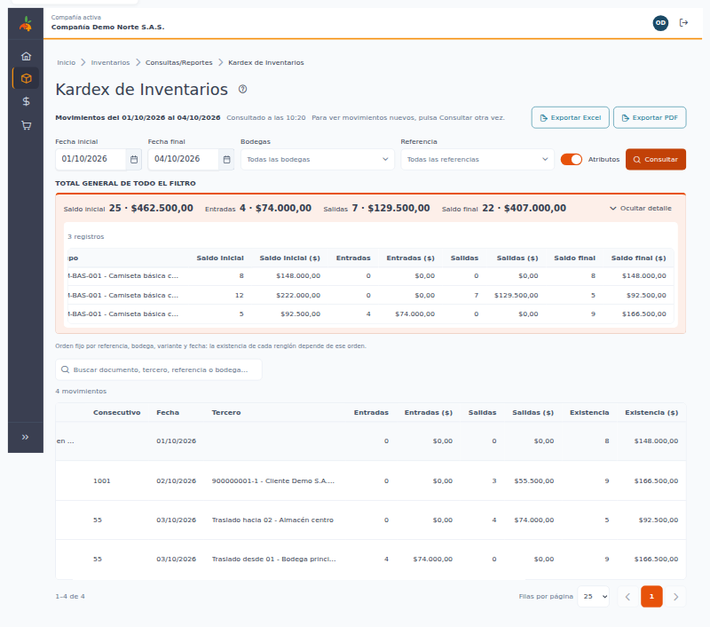

---

## 🏷️ Con y sin atributos

El interruptor **Atributos** cambia el nivel de detalle:

| Opción | Qué ve |
|--------|--------|
| **Con atributos** (activado) | Un renglón por **línea** de documento y la existencia se lleva por **variante**: referencia + bodega + atributo principal + atributo secundario (por ejemplo, talla y color). |
| **Sin atributos** (desactivado) | Un renglón por **documento, referencia y bodega**, sumando las variantes; la existencia se lleva por **referencia y bodega**. Las columnas de atributos no aparecen. |

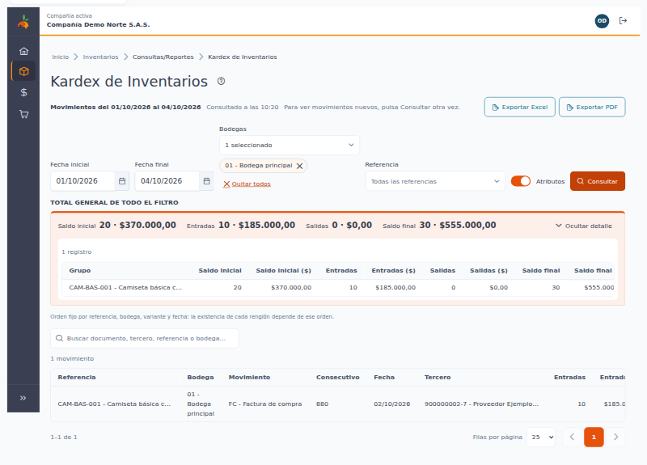

Al cambiar el interruptor, pulse **Consultar** para ver el resultado en el nuevo modo.

---

## 🔍 Buscar en el resultado

Escriba en **Buscar documento, tercero, referencia o bodega…**. La búsqueda empieza a partir de **2 caracteres** y se hace sola, un instante después de dejar de escribir. No distingue mayúsculas ni tildes, y cada palabra debe aparecer en la referencia, la bodega, los atributos, el tipo de movimiento, el consecutivo, el documento o el tercero.

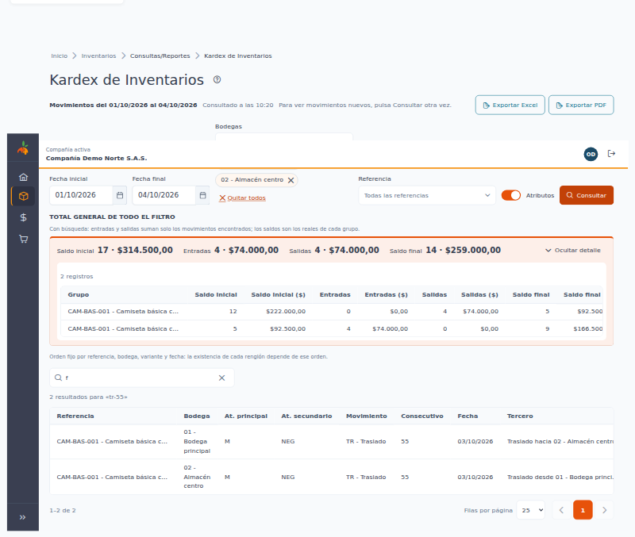

La búsqueda **solo oculta renglones; no cambia la existencia**: cada renglón que queda visible muestra la existencia real de su grupo. Con una búsqueda aplicada, el panel lo indica: **entradas y salidas** suman solo los movimientos encontrados, y el **saldo inicial y el saldo final** son los reales de cada grupo. Los archivos exportados también respetan la búsqueda.

Si nada coincide verá "Sin resultados para «…»" con el botón **Limpiar búsqueda**, y la exportación queda deshabilitada.

---

## 📤 Exportar a Excel y a PDF

Los botones **Exportar Excel** y **Exportar PDF** (solo con permiso **Exportar**) descargan un archivo con **los mismos filtros, la misma búsqueda y el mismo orden** que tiene en pantalla, y **todas las filas** (no solo la página visible).

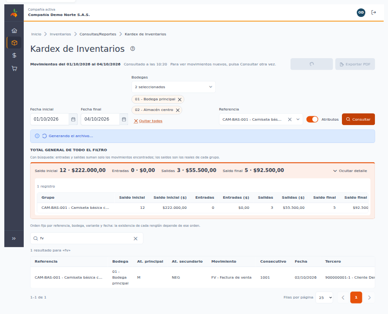

- **Encabezado:** datos de la compañía, el título "Kardex de Inventarios", la **fecha inicial y la fecha final**, las bodegas (o "Todas"), la referencia (o "Todas"), si se consultó con atributos, la búsqueda, la fecha y hora de generación y el usuario que lo generó.
- **Contenido:** las mismas columnas de la pantalla, una fila **TOTAL** al final de cada grupo y la fila **TOTAL GENERAL**. En Excel los números quedan como números, listos para sumar o filtrar. El PDF sale en hoja carta horizontal y numera las páginas ("Página X de Y").
- **Nombre del archivo:** `kardex-inventarios_` seguido de la fecha inicial y la fecha final, por ejemplo `kardex-inventarios_2026-10-01_2026-10-04.xlsx` o `.pdf`.

| Formato | Máximo de movimientos |
|---------|-----------------------|
| **Excel** | 50.000 |
| **PDF** | 4.000 |

Si supera el máximo, un aviso lo indica: **acote el periodo, las bodegas o la referencia** y vuelva a exportar. Si el PDF es demasiado grande, puede exportar a Excel.

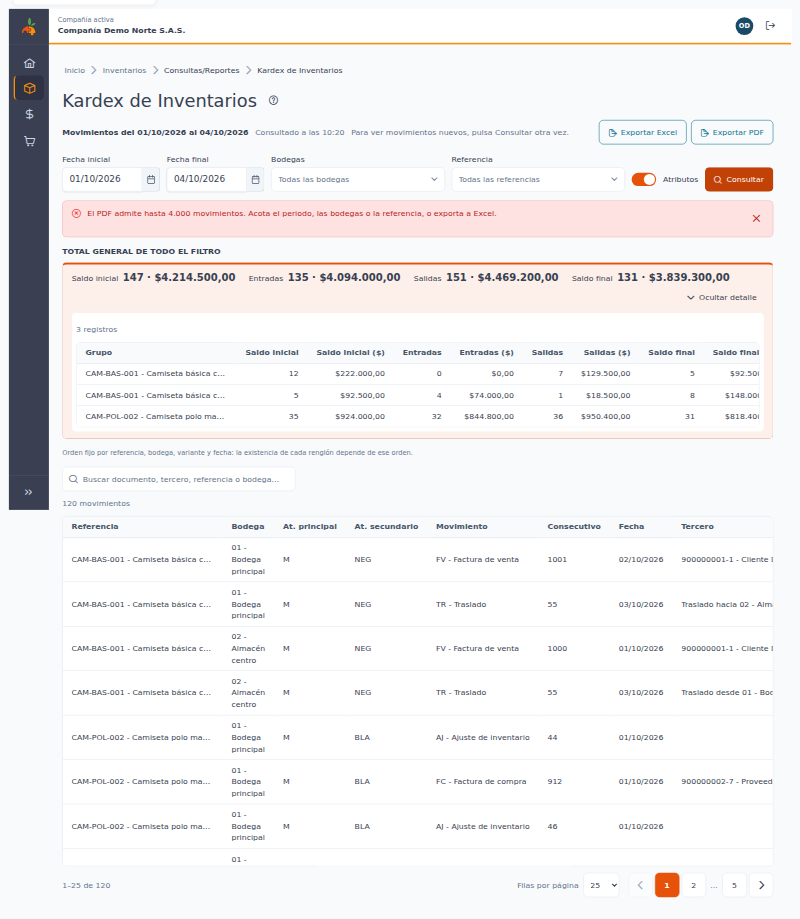

Mientras se genera el archivo aparece "Generando el archivo…" y el botón queda ocupado; al terminar se indica el nombre del archivo descargado. Si algo falla, el mensaje pide intentar de nuevo; sus filtros no se pierden.

---

## 🔄 Diferencias con el reporte anterior

Si compara con el Kardex de la versión anterior, puede ver cifras distintas. **No es un error**: la versión anterior tenía fallas que se corrigieron.

| Tema | Antes | Ahora |
|------|-------|-------|
| **Saldo con varias bodegas** | El saldo se llevaba por referencia y tomaba el saldo inicial de la primera bodega para todas; con varias bodegas la existencia salía mal. | Cada **referencia + bodega** (y variante, con atributos) tiene su propio saldo inicial y su propia existencia. |
| **Orden** | Mezclaba las bodegas dentro de una misma referencia. | Referencia, bodega, variante y fecha. |
| **Existencia que llegaba a 0** | El saldo se reiniciaba con el saldo inicial. | Continúa desde 0. |
| **Valor de la existencia** | El valor en pesos arrancaba en 0 en pantalla y se sumaba varias veces en Excel; sin atributos se multiplicaba por el número de variantes. | Valor = cantidad × costo de cada línea, con el saldo inicial en pesos; igual en pantalla, Excel y PDF. |
| **TOTAL GENERAL** | Omitía la última referencia y algunos totales de grupo. | Se calcula sobre **todo** el filtro. |
| **Referencias con saldo y sin movimientos** | No aparecían. | Aparecen con el renglón de saldo y suman en el total. |
| **Periodo** | Sin límite; por defecto, el último mes. | Máximo **12 meses**; por defecto, del primer día del mes a hoy. No acepta fechas futuras. |
| **Filtro por referencia** | No existía. | Opcional, incluidas las referencias inactivas. |
| **Exportes** | Podían traer la consulta de otro usuario que consultaba al tiempo, y el encabezado no tenía la fecha inicial. | Cada archivo se arma con **sus propios filtros**, la búsqueda y el orden de pantalla, y muestra la fecha inicial y final. |
| **Permisos** | Bastaba con ingresar al sistema. | Se necesita **Consultar** para ver y **Exportar** para descargar. |

Además, el kardex de ahora deja explícitas dos reglas: los **traslados** se ven en dos renglones, uno en cada bodega y con la otra bodega en la columna Tercero (ver *Traslados*), y los **documentos anulados** no aparecen ni suman (ver *Documentos anulados*).

---

## ❓ Preguntas frecuentes

**¿Por qué no puedo consultar más de 12 meses?** Para que la consulta responda rápido. Divida el periodo en partes de hasta 12 meses.

**¿Por qué no veo los movimientos que acabo de registrar?** La consulta muestra lo que había a la hora indicada en "Consultado a las…". Pulse **Consultar** otra vez.

**¿Por qué no puedo ordenar por columna?** La existencia de cada renglón depende del orden; si se cambiara, el saldo dejaría de tener sentido.

**¿Por qué las cifras son distintas a las del reporte anterior?** Ver *Diferencias con el reporte anterior*.

**¿Por qué no aparece un documento que anulé?** Los documentos anulados no se muestran ni suman.

**¿Por qué no veo los botones de exportar?** Su usuario no tiene el permiso **Exportar** en esta opción. Pídalo al administrador.

**Me aparece "No hay movimientos ni saldos de inventario en el periodo para estos filtros".** Pruebe con otro periodo, otras bodegas u otra referencia.

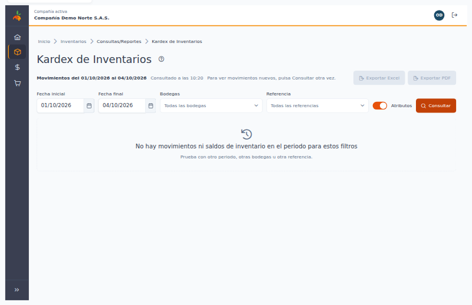

**Me aparece "No se pudo consultar el kardex".** Pulse **Reintentar**; sus filtros se conservan. Si persiste, avise a soporte.

---

[Regresar a Inventarios](../readme.md)
