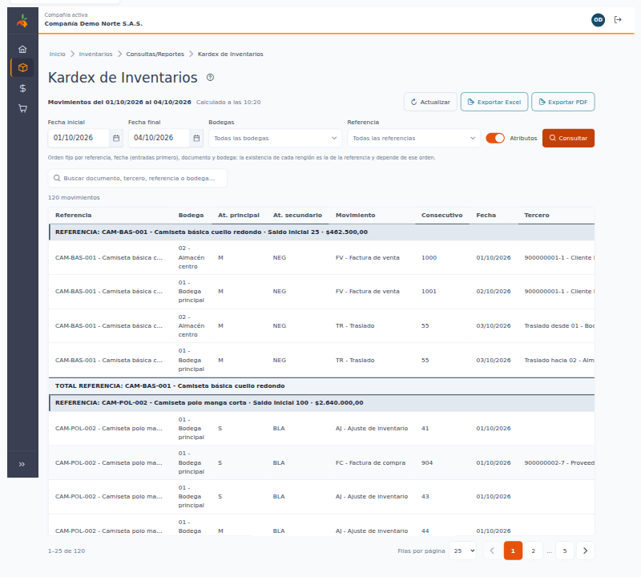
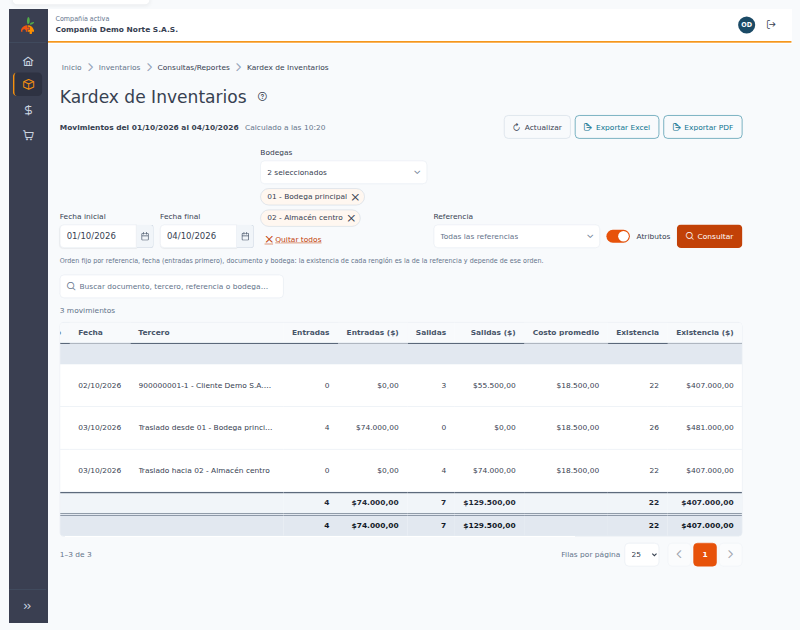
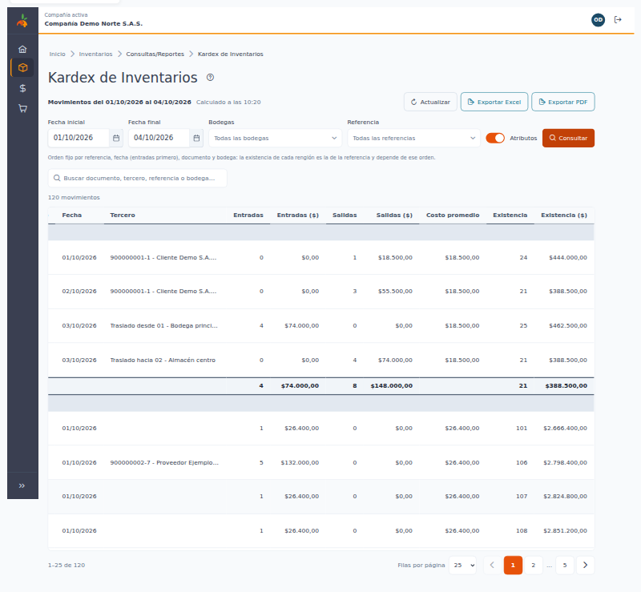
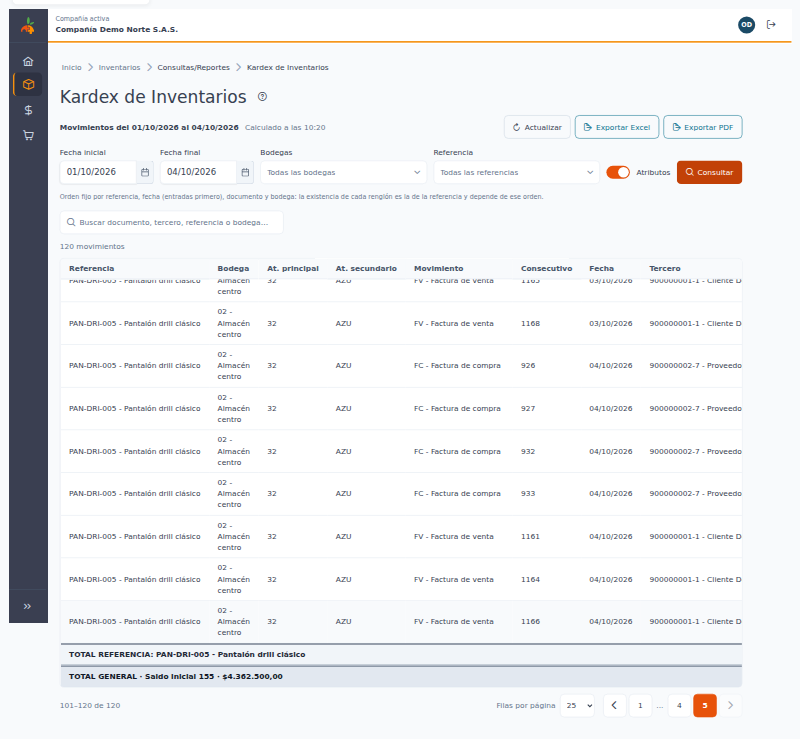
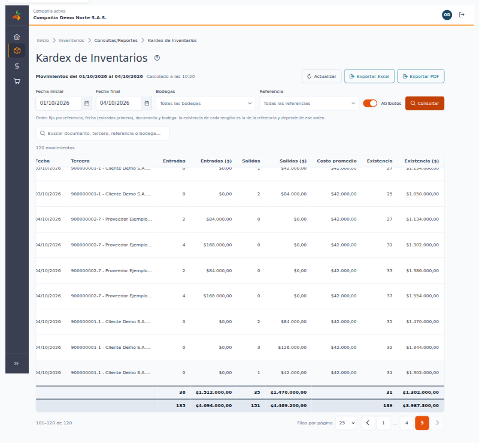
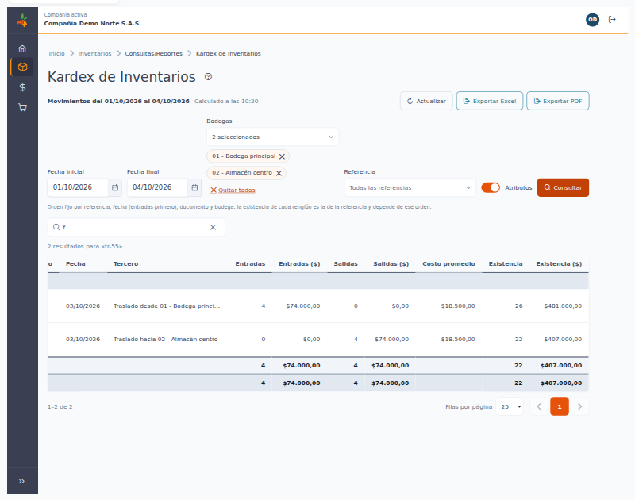
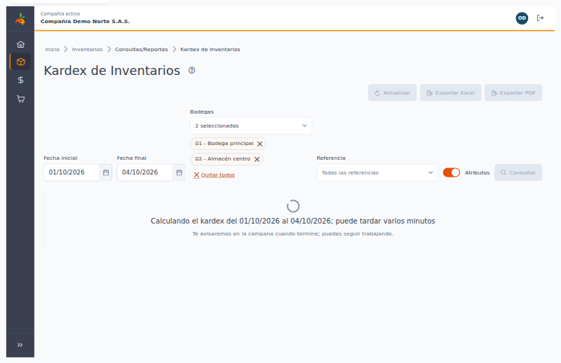
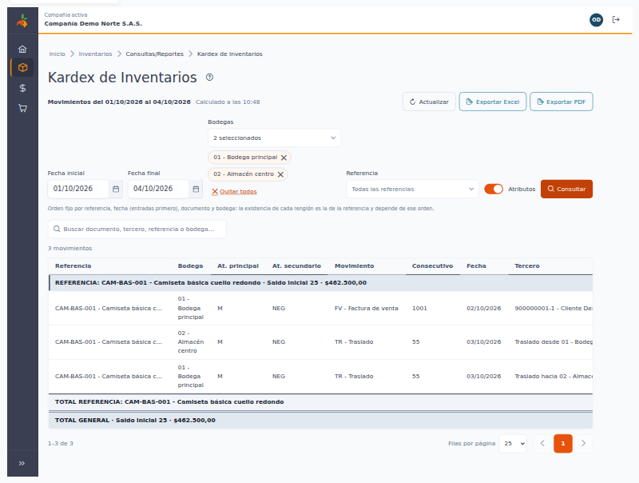
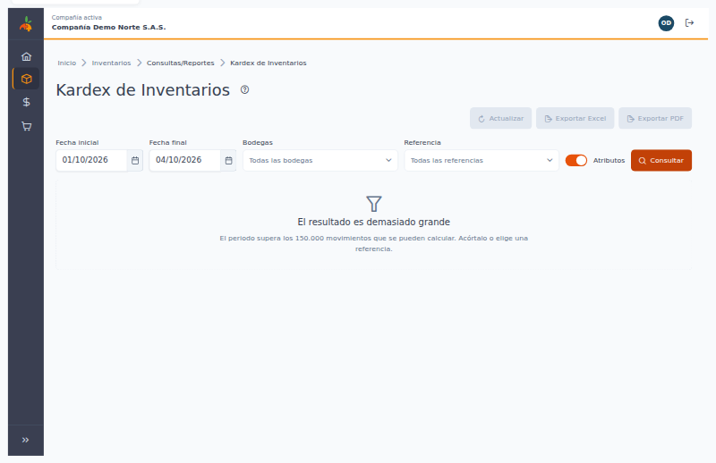
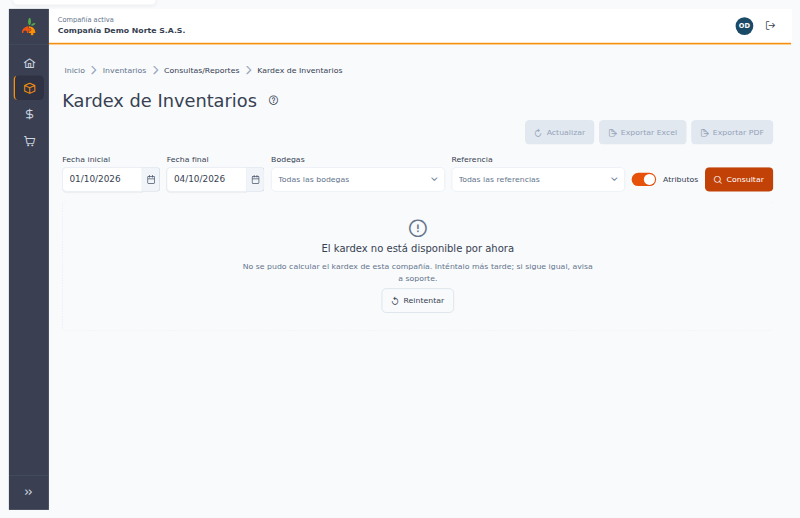

[Regresar a Inventarios](../readme.md)

---

# 📒 Kardex de Inventarios

---

## 📋 Descripción

Esta consulta muestra **cada entrada y cada salida de inventario** de un **periodo**, con la **existencia** que queda después de cada movimiento (en cantidad y en pesos), el **costo promedio** y los totales, que aparecen como **filas grises dentro de la tabla**. Es de **solo lectura**: no crea ni cambia información. Puede **consultar, buscar, exportar a Excel y exportar a PDF**.

La existencia se lleva **por referencia**: suma **todas las bodegas y todas las variantes** (talla, color…) de esa referencia. Aunque consulte una sola bodega, la existencia que ve en cada renglón es la de la referencia completa (ver *Leer el resultado*).

En compañías con mucha información el kardex se **calcula en segundo plano** y se le avisa por la campana cuando está listo (ver *Cálculo en segundo plano*).

> 📘 La paginación y la ayuda funcionan como en las demás tablas: ver [Manejo general de la información](../../Generales/manejo-general-informacion.md). A diferencia de otras tablas, aquí **no se puede ordenar por columna** (ver *Leer el resultado*).

> 💡 Cada pestaña del navegador trabaja con **una compañía**. El nombre de la compañía se ve en la barra superior.

---

## 🎯 Acceso

1. En el menú principal, haga clic en **Inventarios**.
2. En **Consultas/Reportes**, haga clic en **Kardex de Inventarios**.

Permisos de la opción:

| Permiso | Qué permite |
|---------|-------------|
| **Consultar** | Ver la pantalla, consultar y ver cantidades y valores. Sin este permiso la pantalla muestra "No tienes acceso a esta consulta". |
| **Exportar** | Ver los botones **Exportar Excel** y **Exportar PDF**. Sin este permiso los botones no aparecen. |

---

## 🖥️ Pantalla principal

Al entrar, la pantalla no muestra datos: elija los filtros y pulse **Consultar**. La consulta no se ejecuta sola, así lo que ve es exactamente lo que pidió.

| Elemento | Para qué sirve |
|----------|----------------|
| **?** (junto al título) | Abre esta ayuda en un panel lateral. |
| **Movimientos del … al …** | El periodo al que corresponde lo que está viendo. |
| **Calculado a las HH:MM** | La hora en que se calculó el kardex que ve. Los movimientos registrados después no aparecen hasta que pulse **Actualizar**. |
| **Actualizar** | Vuelve a calcular el kardex con los movimientos registrados hasta ahora. Está deshabilitado mientras no haya resultado o mientras se calcula. |
| **Exportar Excel** / **Exportar PDF** | Descargan lo que cumple los filtros y la búsqueda. Están deshabilitados mientras no haya resultados. |
| **Fecha inicial** / **Fecha final** | Por defecto, del **primer día del mes** a **hoy**. La fecha final no puede ser futura y el periodo no puede superar **12 meses**. |
| **Bodegas** | Escriba para buscar por código o nombre y marque **una o varias** (hasta 50). Cada bodega elegida aparece como una etiqueta que puede quitar; **Quitar todos** las borra. Vacío significa **todas las bodegas**. |
| **Referencia** | Opcional. Escriba para buscar por código o nombre. Vacío significa **todas las referencias**. También encuentra las referencias **inactivas**, marcadas "(inactiva)". |
| **Atributos** | Ver *Con y sin atributos*. Por defecto está activado. |
| **Consultar** | Trae el resultado con los filtros elegidos. |

El botón **?** abre este manual sin salir de la consulta:

### Elegir varias bodegas

Con varias bodegas elegidas verá los movimientos de todas ellas. Recuerde que la existencia de cada renglón es la de la **referencia completa**, no la de cada bodega.

### Elegir una referencia

Filtrar por una referencia suele hacer el resultado más pequeño y más fácil de revisar; también ayuda cuando el periodo es muy grande (ver *Resultado demasiado grande*).

### Fechas que no se aceptan

El campo marca el error y no se consulta cuando:

- Falta la fecha inicial: "Elige una fecha inicial".
- La fecha final es futura o no es válida: "Elige una fecha final que no sea futura".
- La fecha inicial es posterior a la final: "La fecha inicial no puede ser posterior a la final".
- El periodo supera 12 meses: "El periodo no puede superar 12 meses". Divida la consulta en periodos más cortos.

---

## 🔎 Leer el resultado

1. **Cómo se organiza la tabla:** los movimientos se agrupan **por referencia** y los totales son **filas grises dentro de la propia tabla**. No hay recuadro de totales sobre la tabla ni pie fijo.
   - **Fila gris de encabezado de la referencia:** abre cada referencia y muestra su **Saldo inicial** (cantidad y pesos), es decir, lo que había antes de la fecha inicial.
   - **Renglones de la referencia:** sus entradas y salidas, una por línea.
   - **Fila gris TOTAL REFERENCIA:** cierra la referencia, **después de su último renglón**, con las **entradas**, las **salidas** y el **saldo final**, en cantidad y en pesos.
   - **Fila gris TOTAL GENERAL:** es **la última fila de la tabla** y suma **todas** las referencias del filtro. Aparece **solo en la última página** (ver *Páginas y totales*).

> 📜 **Las cifras están a la derecha.** La tabla es ancha: en pantallas pequeñas use el **desplazamiento horizontal** para ver las columnas **Entradas, Entradas ($), Salidas, Salidas ($), Costo promedio, Existencia y Existencia ($)**. Las cifras de las filas grises de total (entradas, salidas y saldo final) se leen en esas mismas columnas. Estas capturas muestran la tabla desplazada a la derecha:

2. **Tabla de movimientos:** Referencia, Bodega, At. principal y At. secundario (solo con atributos), Movimiento, Consecutivo, Fecha, Tercero, Entradas, Entradas ($), Salidas, Salidas ($), **Costo promedio**, Existencia y Existencia ($). Puede elegir 10, 25, 50 o 100 filas por página (por defecto 25).
3. **Existencia:** es el saldo de la **referencia** (todas sus bodegas y variantes) **después** de ese movimiento. Empieza en la existencia que tenía la referencia antes de la fecha inicial y suma entradas y resta salidas renglón por renglón. La aplicación calcula este saldo corrido sobre todos los movimientos de la referencia en el periodo.
4. **Con filtro de bodegas, el saldo es el de la referencia completa.** Si elige solo la bodega 02, cada renglón muestra la existencia de la referencia en **todas** las bodegas, no la que quedó en la bodega 02. Por eso la existencia de un renglón puede no coincidir con lo que sumaría solo lo visible. Para ver cuánto hay en cada bodega use la consulta [Inventario por bodega](inventario-por-bodega.md).
5. **Costo promedio:** es el costo promedio móvil de la referencia en ese renglón.
6. **Orden fijo:** los renglones salen por referencia, fecha (las entradas de un mismo día antes que las salidas), documento y bodega. **No se puede ordenar por columna**, porque la existencia de cada renglón depende de ese orden.
7. **Página que continúa:** la existencia sigue de una página a la siguiente; no vuelve a empezar al cambiar de página.

8. Las cantidades se muestran hasta con 4 decimales y los valores con 2. Las existencias **negativas** se muestran con signo **−**: indican que se sacó más de lo que había registrado y conviene revisarlas.

9. **En el celular:** cada renglón se muestra como una tarjeta con todas sus etiquetas, y las filas grises de encabezado y totales se ven como bandas entre las tarjetas.

> ⚠️ La existencia suma unidades de medida distintas (unidades, metros, kilos…), por eso es una referencia de volumen y no una cifra contable. Para comparar valores use las cifras en **pesos**.

---

## 📑 Páginas y totales

- **Una referencia que sigue en otra página:** si una referencia tiene más renglones de los que caben en una página, su encabezado se repite al inicio de la página siguiente con la marca **(continúa)**, con el mismo saldo inicial de la referencia. **TOTAL REFERENCIA** aparece solo en la página donde termina la referencia, y trae los totales de la referencia **completa**, no solo de los renglones de esa página.
- **TOTAL GENERAL solo en la última página:** en las páginas anteriores no hay fila TOTAL GENERAL. Sus cifras son las de **todo lo consultado**, no las de la página que está viendo. Para verlo, vaya a la última página.

- **El conteo de la página** ("1–25 de 120") cuenta solo renglones de movimiento; las filas grises no cuentan.
- **Con filtro de bodegas:** el **saldo inicial**, el **saldo final** y la existencia son los de la **referencia completa** (todas sus bodegas). Las **entradas y salidas** de las filas grises suman solo los movimientos de las bodegas elegidas. Por eso, con una bodega elegida, saldo inicial + entradas − salidas puede no ser igual al saldo final.
- **Con búsqueda:** igual que con bodegas: las filas grises suman **solo los renglones encontrados** (entradas y salidas), y los saldos inicial y final siguen siendo los **reales** de cada referencia. En la captura, la búsqueda deja 2 renglones y la tabla está desplazada a la derecha: las filas de total suman solo esos 2, pero la existencia final (22) es la real de la referencia.

- Los archivos **Excel y PDF** traen las mismas filas de total (una **TOTAL** al final de cada referencia y la fila **TOTAL GENERAL**) de **todo** el resultado, no solo de una página.

---

## 💲 Cómo se calcula el valor

- **Entradas ($) y Salidas ($):** el valor de cada línea del movimiento, tal como quedó registrado en el documento.
- **Costo promedio:** el costo promedio móvil de la referencia en ese renglón.
- **Saldo inicial ($):** el valor de la existencia que tenía la referencia antes de la fecha inicial; se ve en la fila gris de encabezado de cada referencia.
- **Existencia ($):** saldo inicial ($) + entradas ($) − salidas ($), renglón por renglón.

Es la misma cifra en la pantalla, en el Excel y en el PDF.

---

## 🔁 Traslados

Un traslado entre bodegas aparece en **dos renglones**: la **salida** en la bodega de origen y la **entrada** en la bodega de destino. En la columna **Tercero** se indica la otra bodega: "Traslado hacia *bodega destino*" en la salida y "Traslado desde *bodega origen*" en la entrada.

Como la existencia es la de la referencia completa, un traslado entre dos bodegas **no cambia** la existencia total: sale de una y entra en la otra. Si consulta solo una de las dos bodegas, verá solo el lado del traslado que le corresponde; en ese caso, si la pantalla no puede determinar la otra bodega, mostrará el tercero normal del documento.

---

## 🚫 Documentos anulados

Los documentos **anulados no aparecen** en el kardex y **no suman** en las existencias ni en los totales.

---

## 📌 Referencias sin movimientos en el periodo

Las referencias que **no tuvieron movimientos** en el periodo **no aparecen**, aunque tengan existencia: no hay un renglón de saldo para ellas. Si busca una referencia y no la ve, puede ser porque no se movió en esas fechas; para ver cuánto hay use [Inventario por bodega](inventario-por-bodega.md).

Si ninguna referencia tuvo movimientos, verá "No hay movimientos de inventario en el periodo para estos filtros", con la nota "Las referencias sin movimientos en el periodo no aparecen". Los exportes quedan deshabilitados.

---

## ⚠️ Líneas excluidas y fechas incompletas

La información de origen viene del sistema anterior y algunos registros están **incompletos**. El kardex hace lo siguiente con ellos:

- **Líneas con datos incompletos:** si a una línea de un documento le falta información del legado (el **tercero**, los **atributos** o el **grupo** de la referencia), esa línea **no aparece** en la tabla ni suma en las entradas, salidas y totales de movimiento.
- **Movimientos con fecha 01/01/0001:** los registros que quedaron con esa fecha vacía no pertenecen a ningún periodo, así que **no se muestran**.

Por eso el **saldo inicial** de una referencia puede **no cuadrar al centavo** con la suma de lo que ve: la existencia inicial sí incluye esas líneas y esos movimientos, pero la tabla no los muestra. La diferencia suele ser pequeña. Si necesita revisarla, avise a soporte con la referencia y el periodo.

---

## 🏷️ Con y sin atributos

El interruptor **Atributos** cambia el nivel de detalle:

| Opción | Qué ve |
|--------|--------|
| **Con atributos** (activado) | Un renglón por **línea** de documento, con la variante (atributo principal y secundario, por ejemplo talla y color). La existencia sigue siendo la de la referencia. |
| **Sin atributos** (desactivado) | Un renglón por **documento, referencia y bodega**, sumando las variantes. Las columnas de atributos no aparecen. |

Al cambiar el interruptor, pulse **Consultar** para ver el resultado en el nuevo modo. La existencia inicial de la referencia se cuenta **una sola vez**, con o sin atributos.

---

## 🔍 Buscar en el resultado

Escriba en **Buscar documento, tercero, referencia o bodega…**. La búsqueda empieza a partir de **2 caracteres** y se hace sola, un instante después de dejar de escribir. No distingue mayúsculas ni tildes, y cada palabra debe aparecer en la referencia, la bodega, los atributos, el tipo de movimiento, el consecutivo, el documento o el tercero.

La búsqueda **solo oculta renglones; no cambia la existencia**: cada renglón que queda visible muestra la existencia real de su referencia. Con una búsqueda aplicada, en las filas grises **TOTAL REFERENCIA** y **TOTAL GENERAL** las **entradas y salidas** suman solo los movimientos encontrados, y el **saldo inicial y el saldo final** son los reales de cada referencia (ver *Páginas y totales*). Los archivos exportados también respetan la búsqueda.

Si nada coincide verá "Sin resultados para «…»" con el botón **Limpiar búsqueda**, y la exportación queda deshabilitada.

---

## ⏳ Cálculo en segundo plano

Para obtener la existencia de cada referencia, el kardex revisa el historial de movimientos de la compañía hasta la fecha final. En compañías pequeñas el resultado aparece de inmediato. En compañías **grandes** el cálculo puede tardar **varios minutos**, y se hace en segundo plano:

1. Al pulsar **Consultar** verá "Calculando el kardex del … al …; puede tardar varios minutos". Los filtros siguen visibles, pero **Consultar** y **Actualizar** quedan deshabilitados mientras se calcula.
2. Puede **seguir trabajando** en otras pantallas: cuando termine recibirá en la **campana** el aviso "Kardex listo" con un enlace a la pantalla. Si falla, el aviso lo indica y puede volver a intentarlo.
3. Al terminar, la pantalla se llena sola y la banda muestra **Calculado a las HH:MM**.

Una vez calculado, el resultado se **conserva unos 15 minutos**: mientras tanto, cambiar de página, buscar, filtrar bodegas o exportar es inmediato y no vuelve a calcular. Si pasa ese tiempo, o se reinició el servicio, la pantalla **vuelve a calcular sola** y la banda muestra la hora nueva.

Para incluir los movimientos registrados **después** de la hora que indica la banda, pulse **Actualizar**: descarta el resultado guardado y calcula de nuevo (puede volver a tardar varios minutos en compañías grandes).

### Resultado demasiado grande

Si el periodo tiene más movimientos de los que se pueden calcular, verá "El resultado es demasiado grande" con el máximo permitido. **Acorte el periodo o elija una referencia** y consulte de nuevo. Este mensaje no tiene **Reintentar**, porque repetir la misma consulta daría el mismo resultado. Mientras tanto la exportación está deshabilitada.

### El kardex no está disponible

Si ve "El kardex no está disponible por ahora", no se pudo calcular el kardex de esta compañía. Pulse **Reintentar** más tarde; si sigue igual, avise a soporte. Las demás consultas del sistema siguen funcionando.

---

## 📤 Exportar a Excel y a PDF

Los botones **Exportar Excel** y **Exportar PDF** (solo con permiso **Exportar**) descargan un archivo con **los mismos filtros, la misma búsqueda y el mismo orden** que tiene en pantalla, y **todas las filas** (no solo la página visible). Se arman con el resultado ya calculado: si el kardex aún se está calculando, espere a que termine.

- **Encabezado:** datos de la compañía, el título "Kardex de Inventarios", la **fecha inicial y la fecha final**, las bodegas (o "Todas"), la referencia (o "Todas"), si se consultó con atributos, la búsqueda, la fecha y hora de generación y el usuario que lo generó.
- **Contenido:** las mismas columnas de la pantalla, una fila **TOTAL** al final de cada referencia y la fila **TOTAL GENERAL**. En Excel los números quedan como números, listos para sumar o filtrar. El PDF sale en hoja oficio horizontal y numera las páginas ("Página X de Y").
- **Nombre del archivo:** `kardex-inventarios_` seguido de la fecha inicial y la fecha final, por ejemplo `kardex-inventarios_2026-10-01_2026-10-04.xlsx` o `.pdf`.

| Formato | Máximo de movimientos |
|---------|-----------------------|
| **Excel** | 50.000 |
| **PDF** | 4.000 |

Si supera el máximo, un aviso lo indica: **acote el periodo, las bodegas o la referencia** y vuelva a exportar. Si el PDF es demasiado grande, puede exportar a Excel.

Mientras se genera el archivo aparece "Generando el archivo…" y el botón queda ocupado; al terminar se indica el nombre del archivo descargado. Si algo falla, el mensaje pide intentar de nuevo; sus filtros no se pierden.

---

## 🔄 Diferencias con el reporte anterior

Si compara con el Kardex de la versión anterior, puede ver cifras distintas. **No es un error**: la versión anterior tenía fallas que se corrigieron.

| Tema | Antes | Ahora |
|------|-------|-------|
| **Saldo inicial y existencia** | Se tomaba del primer renglón visible, y se reiniciaba si la existencia llegaba a 0. | La existencia inicial es la de la **referencia** (todas las bodegas y variantes) antes de la fecha inicial; el saldo corrido sigue desde ahí y **continúa desde 0** si llega a 0. |
| **Con filtro de bodegas** | La existencia dependía de lo visible. | La existencia es siempre la de la **referencia completa**, no la de cada bodega. |
| **Costo** | No se mostraba. | Columna **Costo promedio** (promedio móvil) en cada renglón. |
| **Orden** | Sin desempate; podía mezclar renglones. | Referencia, fecha (entradas primero), documento y bodega. |
| **Valor de la existencia** | El valor en pesos arrancaba en 0 en pantalla y se sumaba varias veces en Excel; sin atributos se multiplicaba por el número de variantes. | Valor de cada línea con el saldo inicial en pesos; igual en pantalla, Excel y PDF; el saldo inicial se cuenta una vez. |
| **TOTAL GENERAL** | Omitía la última referencia y algunos totales de grupo. | Se calcula sobre **todo** el filtro y es la última fila gris de la tabla, en la última página. |
| **Totales por referencia** | Se calculaban en el navegador y fallaban con varias páginas. | Fila gris **TOTAL REFERENCIA** tras el último renglón de cada referencia, con los totales de la referencia completa. |
| **Referencias sin movimientos** | No aparecían. | Siguen sin aparecer (no hay renglón de saldo). |
| **Datos incompletos del legado** | Algunas líneas se perdían sin explicación. | Siguen excluidas, pero esta ayuda explica por qué el saldo inicial puede no cuadrar (ver *Líneas excluidas y fechas incompletas*). |
| **Tiempo de respuesta** | La pantalla podía quedarse esperando más de 40 minutos. | En compañías grandes se calcula en segundo plano, con aviso por la campana, "Calculado a las…" y **Actualizar**. |
| **Periodo** | Sin límite; por defecto, el último mes. | Máximo **12 meses**; por defecto, del primer día del mes a hoy. No acepta fechas futuras. |
| **Filtro por referencia** | No existía. | Opcional, incluidas las referencias inactivas. |
| **Exportes** | Podían traer la consulta de otro usuario que consultaba al tiempo, y el encabezado no tenía la fecha inicial. | Cada archivo se arma con **sus propios filtros**, la búsqueda y el orden de pantalla, y muestra la fecha inicial y final. |
| **Permisos** | Bastaba con ingresar al sistema. | Se necesita **Consultar** para ver y **Exportar** para descargar. |

---

## ❓ Preguntas frecuentes

**¿Por qué no puedo consultar más de 12 meses?** Para que la consulta responda en un tiempo razonable. Divida el periodo en partes de hasta 12 meses.

**¿Por qué dice "Calculando…" y tarda?** Su compañía tiene mucho historial y el kardex se calcula en segundo plano. Puede seguir trabajando: la campana le avisa cuando esté listo.

**¿Por qué no veo los movimientos que acabo de registrar?** La consulta muestra lo que había a la hora indicada en "Calculado a las…". Pulse **Actualizar**.

**¿Por qué la existencia no es la de la bodega que elegí?** La existencia del kardex es la de la referencia en todas las bodegas. Para la existencia por bodega use [Inventario por bodega](inventario-por-bodega.md).

**¿Por qué no aparece una referencia que sé que tiene existencia?** Las referencias sin movimientos en el periodo no aparecen.

**¿Por qué el saldo inicial no cuadra al centavo con lo que veo?** Puede haber líneas de documentos con datos incompletos del legado o movimientos con fecha 01/01/0001 que cuentan en la existencia pero no se muestran (ver *Líneas excluidas y fechas incompletas*).

**¿Por qué no veo el TOTAL GENERAL?** Aparece solo como última fila de la **última página**. Pase a la última página para verlo; sus cifras son las de todo el filtro.

**¿Por qué una referencia dice "(continúa)" y no tiene total?** Sigue en la página siguiente; su TOTAL REFERENCIA aparece donde termina y es el de la referencia completa.

**Con una bodega o una búsqueda, ¿por qué saldo inicial + entradas − salidas no da el saldo final?** El saldo inicial y el final son los de la referencia completa, y las entradas y salidas son solo las de lo que se ve (ver *Páginas y totales*).

**¿Por qué no puedo ordenar por columna?** La existencia de cada renglón depende del orden; si se cambiara, el saldo dejaría de tener sentido.

**¿Por qué las cifras son distintas a las del reporte anterior?** Ver *Diferencias con el reporte anterior*.

**¿Por qué no aparece un documento que anulé?** Los documentos anulados no se muestran ni suman.

**¿Por qué no veo los botones de exportar?** Su usuario no tiene el permiso **Exportar** en esta opción. Pídalo al administrador.

**Me aparece "No se pudo consultar el kardex".** Pulse **Reintentar**; sus filtros se conservan. Si persiste, avise a soporte.

---

[Regresar a Inventarios](../readme.md)
