[Regresar a Inventarios](../readme.md)

---

# 🧾 Por Tipo Movimiento

---

## 📋 Descripción

Esta consulta muestra los **documentos de inventario de un periodo de hasta un mes**, agrupados por **tipo de movimiento** (por ejemplo, Entrada de almacén, Salida de almacén). Cada renglón es **un documento** (tipo + consecutivo) con su **cantidad** y sus **valores**: bruto, descuento, subtotal, IVA, retenciones, seguros/fletes, otros valores y total. Los **subtotales por tipo** y el **TOTAL GENERAL** aparecen como **filas grises dentro de la tabla**.

Es de **solo lectura**: no crea ni cambia información. Puede **consultar, buscar, exportar a Excel y exportar a PDF**.

> 📘 La paginación y la ayuda funcionan como en las demás tablas: ver [Manejo general de la información](../../Generales/manejo-general-informacion.md). A diferencia de otras tablas, aquí **no se puede ordenar por columna** (ver *Leer el resultado*).

> 💡 Cada pestaña del navegador trabaja con **una compañía**. El nombre de la compañía se ve en la barra superior.

---

## 🎯 Acceso

1. En el menú principal, haga clic en **Inventarios**.
2. En **Consultas/Reportes**, haga clic en **Por Tipo Movimiento**.

Permisos de la opción:

| Permiso | Qué permite |
|---------|-------------|
| **Consultar** | Ver la pantalla, consultar, buscar y ver cantidades y valores. Sin este permiso la pantalla muestra "No tienes acceso a esta consulta". |
| **Exportar** | Ver los botones **Exportar Excel** y **Exportar PDF**. Sin este permiso los botones no aparecen. |

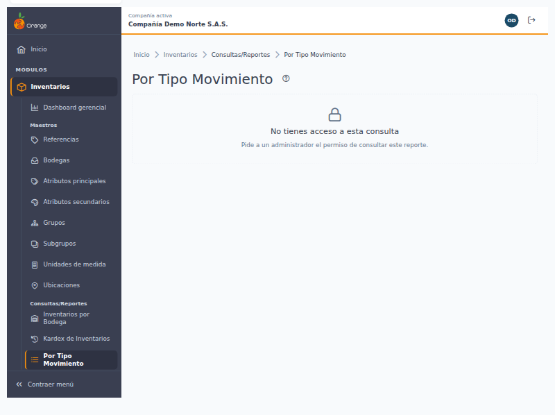

---

## 🖥️ Pantalla principal

Al entrar, la pantalla no muestra datos: elija los filtros y pulse **Consultar**. La consulta no se ejecuta sola, así lo que ve es exactamente lo que pidió.

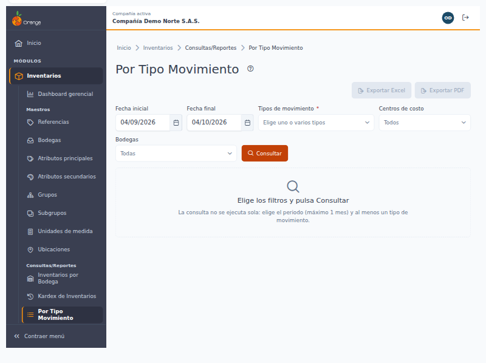

| Elemento | Para qué sirve |
|----------|----------------|
| **?** (junto al título) | Abre esta ayuda en un panel lateral. |
| **Movimientos del … al …** | El periodo al que corresponde lo que está viendo. |
| **Consultado a las HH:MM** | La hora en que se hizo la consulta. Para ver documentos registrados después, pulse **Consultar** otra vez. |
| **Exportar Excel** / **Exportar PDF** | Descargan lo que cumple los filtros y la búsqueda. Están deshabilitados mientras no haya resultados. |
| **Fecha inicial** / **Fecha final** | Obligatorias. Por defecto, de **hace un mes** a **hoy**. La fecha final no puede ser futura y el periodo no puede superar **un mes (31 días)**. |
| **Tipos de movimiento** | **Obligatorio.** Escriba para buscar por código o nombre y marque **uno o varios** (hasta 50). Solo aparecen los tipos de **Entradas/Salidas** y **Traslados** que **su usuario tiene autorizados**. Cada tipo elegido aparece como una etiqueta que puede quitar; **Quitar todos** las borra. |
| **Centros de costo** | Opcional, uno o varios (hasta 50). Vacío significa **todos**. |
| **Bodegas** | Opcional, una o varias (hasta 50). Vacío significa **todas**. |
| **Consultar** | Trae el resultado con los filtros elegidos. |

El botón **?** abre este manual sin salir de la consulta:

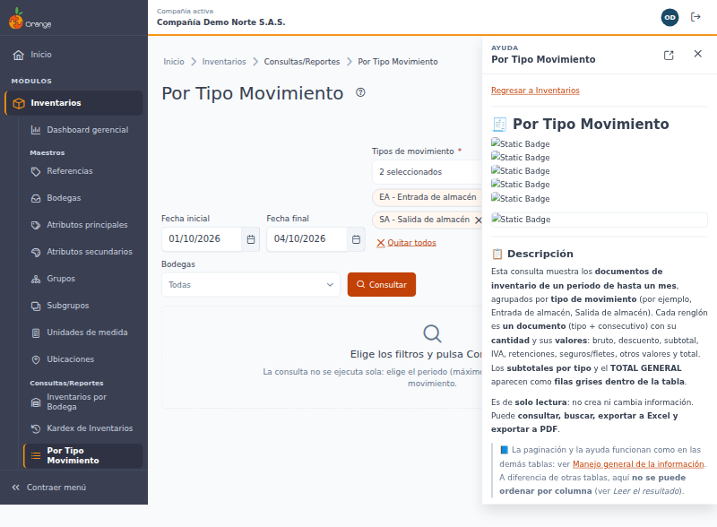

### Elegir varios tipos, centros de costo y bodegas

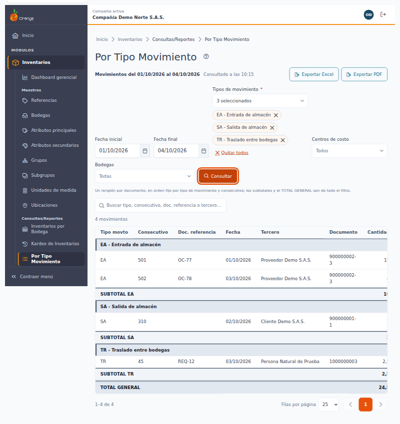

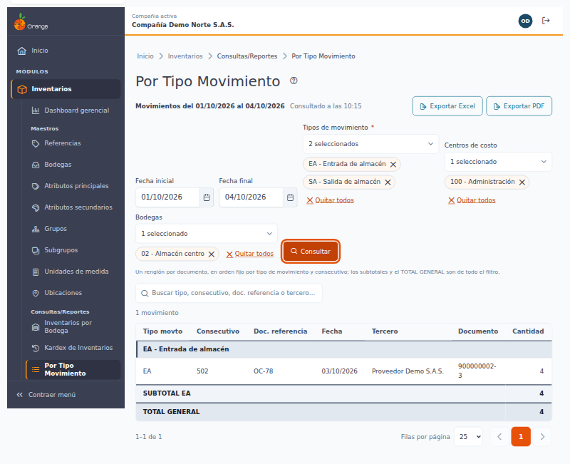

### Filtros que no se aceptan

El campo marca el error y no se consulta cuando:

- Falta la fecha inicial: "Elige una fecha inicial".
- La fecha final es futura o no es válida: "Elige una fecha final que no sea futura".
- La fecha inicial es posterior a la final: "La fecha inicial no puede ser posterior a la final".
- El periodo supera un mes: "El periodo no puede superar 1 mes (31 días)". Por ejemplo, del 01/09 al 02/10 **sí** se acepta (31 días); del 01/09 al 03/10 **no**. Divida la consulta en periodos más cortos.
- No eligió ningún tipo de movimiento: "Elige al menos un tipo de movimiento".

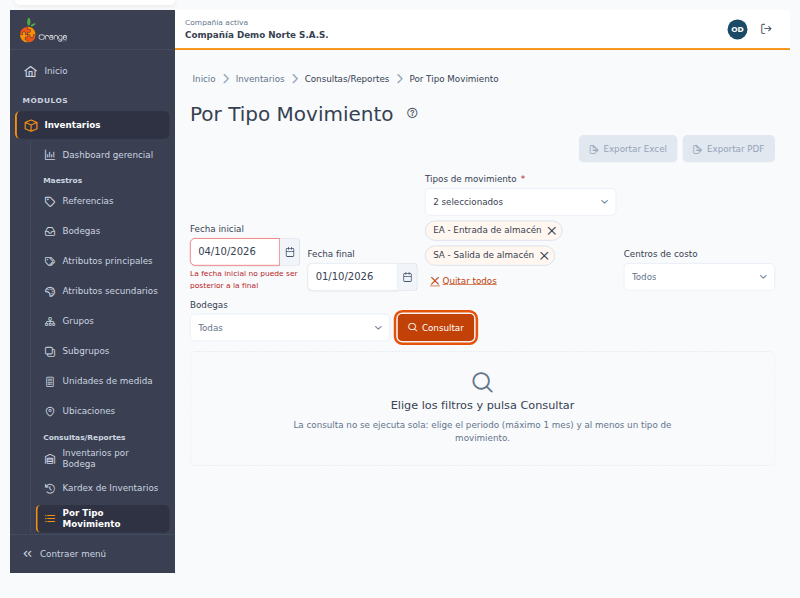

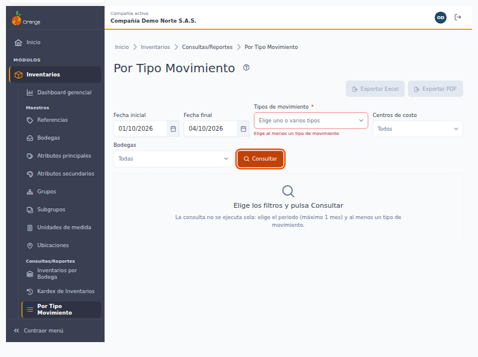

---

## 🔎 Leer el resultado

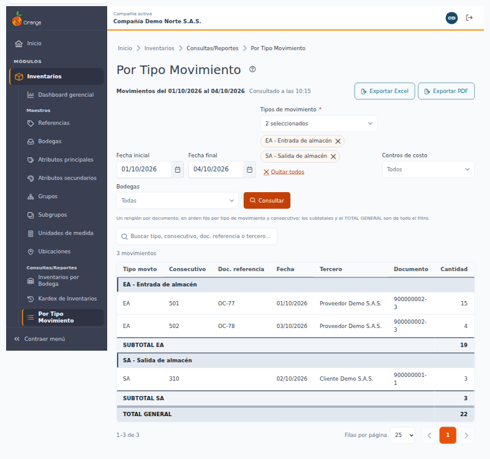

1. **Un renglón por documento.** Si un documento tiene varias líneas (varias referencias, bodegas o centros de costo), se ven **sumadas en un solo renglón**: la cantidad y cada valor son la suma de sus líneas. Doc. referencia, Fecha y Tercero son los del documento.
2. **Cómo se organiza la tabla:** los documentos se agrupan **por tipo de movimiento** y los totales son **filas grises dentro de la propia tabla**:
   - **Fila gris de encabezado del tipo:** abre cada tipo con su código y nombre, por ejemplo "EA - Entrada de almacén".
   - **Renglones del tipo:** un documento por línea.
   - **Fila gris SUBTOTAL** (por ejemplo "SUBTOTAL EA"): cierra el tipo, **después de su último documento**, con la cantidad y los valores de **todo** el tipo.
   - **Fila gris TOTAL GENERAL:** es **la última fila de la tabla** y suma **todos** los tipos del filtro. Aparece **solo en la última página** (ver *Páginas y totales*).
3. **Columnas:** Tipo movto (el código; al pasar el mouse se ve el nombre), Consecutivo, Doc. referencia, Fecha, Tercero, Documento (del tercero, con dígito de verificación), Cantidad, Vr. bruto, Descuento, Subtotal, IVA, Retefuente, ReteICA, ReteIVA, Segu/Fletes, Otros valores y Total.

> 📜 **Los valores están a la derecha.** La tabla es ancha: en pantallas pequeñas use el **desplazamiento horizontal** para ver las columnas de valores. Las cifras de las filas grises de subtotal y total se leen en esas mismas columnas.

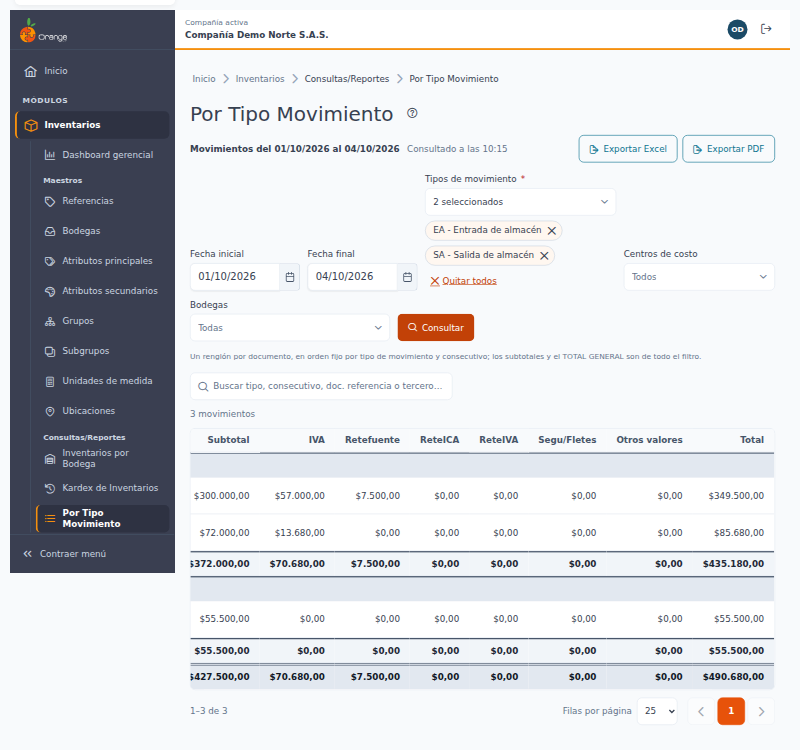

4. **Orden fijo:** los renglones salen por **código del tipo** y **consecutivo**. **No se puede ordenar por columna**, porque las filas de encabezado y subtotal dependen de ese orden.
5. **Cifras:** las cantidades se muestran hasta con **4 decimales** y los valores en pesos con **2**. Puede elegir 10, 25, 50 o 100 filas por página (por defecto 25).
6. **En el celular:** cada renglón se muestra como una tarjeta con todas sus etiquetas, y las filas grises de encabezado y totales se ven como bandas entre las tarjetas.

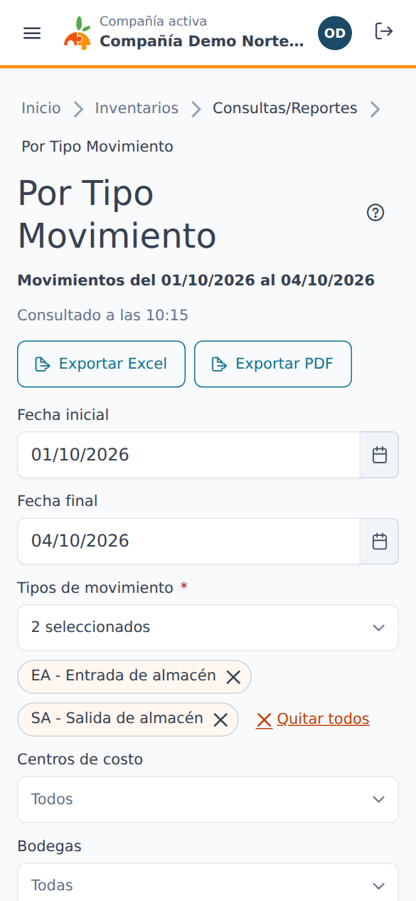

---

## 📑 Páginas y totales

- **Un tipo que sigue en otra página:** si un tipo tiene más documentos de los que caben en una página, su encabezado se repite al inicio de la página siguiente con la marca **(continúa)**. **SUBTOTAL** aparece solo en la página donde termina el tipo, y trae los totales del tipo **completo**, no solo de los renglones de esa página.
- **TOTAL GENERAL solo en la última página:** sus cifras son las de **todo lo consultado**, no las de la página que está viendo.

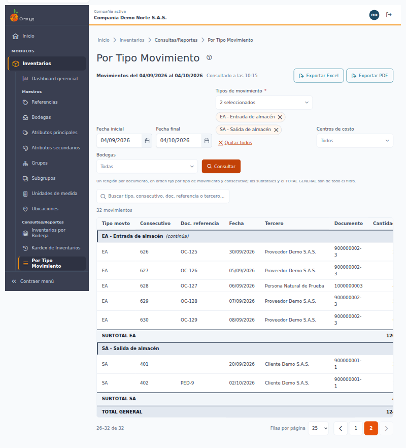

- **El conteo** ("26–32 de 32" y "32 movimientos") cuenta solo **documentos**; las filas grises no cuentan.
- **Redondeo:** los subtotales y el TOTAL GENERAL se calculan con los valores exactos y se redondean al final. Por eso pueden diferir en **$0,01** de la suma de los renglones que ve.
- Los archivos **Excel y PDF** traen las mismas filas de encabezado, subtotal y TOTAL GENERAL de **todo** el resultado.

---

## 🔍 Buscar en el resultado

Escriba en **Buscar tipo, consecutivo, doc. referencia o tercero…**. La búsqueda empieza a partir de **2 caracteres** y se hace sola, un instante después de dejar de escribir. No distingue mayúsculas ni tildes, y cada palabra debe aparecer en el código o nombre del tipo, el consecutivo, el documento de referencia, o el nombre o documento del tercero.

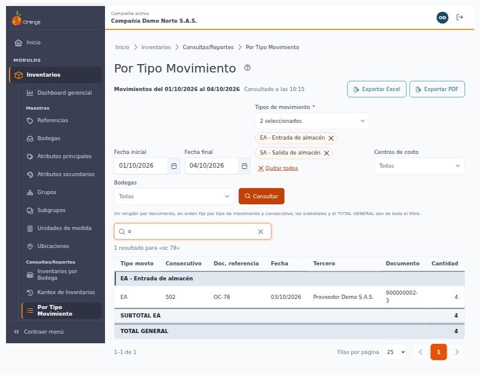

Con una búsqueda aplicada, los **subtotales** y el **TOTAL GENERAL** suman **solo los documentos encontrados**. Los archivos exportados también respetan la búsqueda.

Si nada coincide verá "No hay movimientos que coincidan con la búsqueda «…»" con el botón **Limpiar búsqueda**, y la exportación queda deshabilitada.

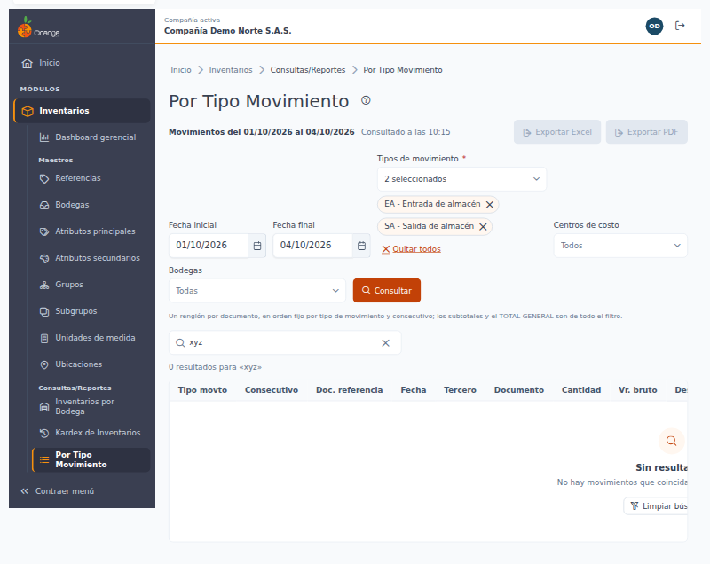

---

## 🚦 Otros mensajes

| Mensaje | Qué hacer |
|---------|-----------|
| **No hay movimientos para los filtros elegidos** | Pruebe con otro periodo u otros tipos, centros de costo o bodegas. Los exportes quedan deshabilitados. |
| **No pudimos cargar los movimientos** | Pulse **Reintentar**; sus filtros se conservan. Si persiste, avise a soporte. |
| **La consulta tardó demasiado** | Acote el periodo o los tipos de movimiento y vuelva a consultar. Si sigue igual, avise a soporte. |
| **El resultado es demasiado grande** | La consulta supera las 200.000 líneas que se pueden procesar. Acote el periodo o los tipos de movimiento. |

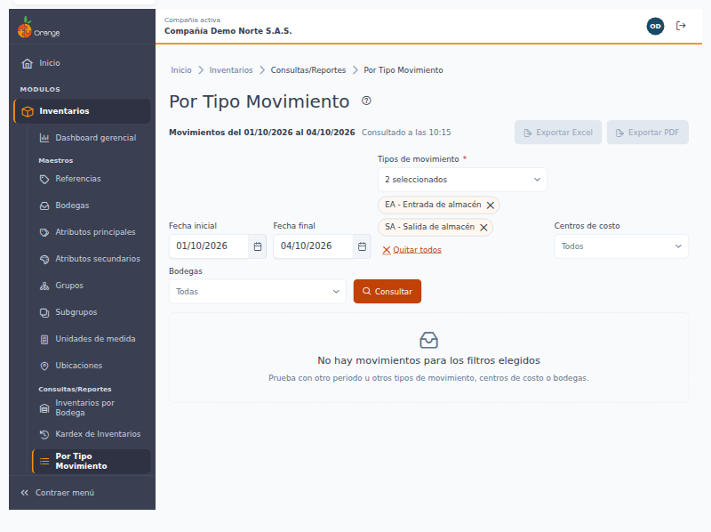

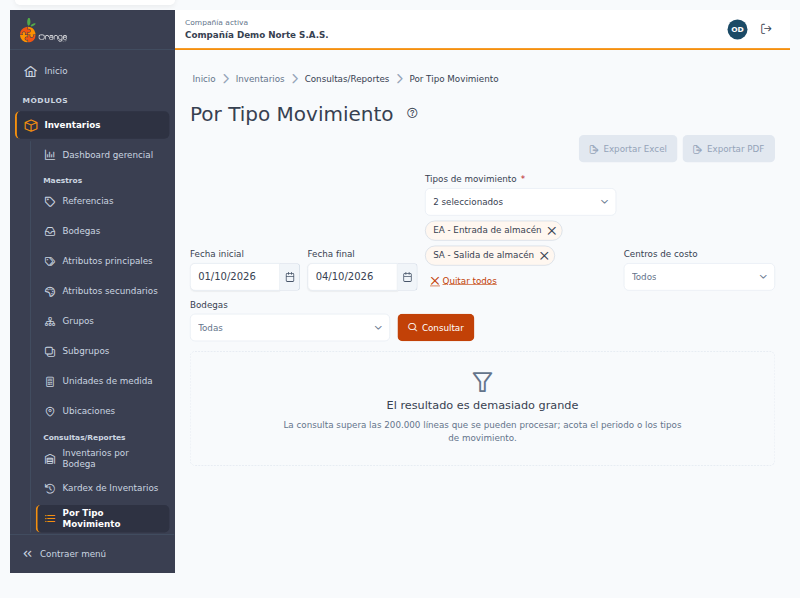

---

## 📤 Exportar a Excel y a PDF

Los botones **Exportar Excel** y **Exportar PDF** (solo con permiso **Exportar**) descargan un archivo con **los mismos filtros, la misma búsqueda y el mismo orden** que tiene en pantalla, y **todos los documentos** (no solo la página visible). El límite de **un mes** también aplica a los exportes.

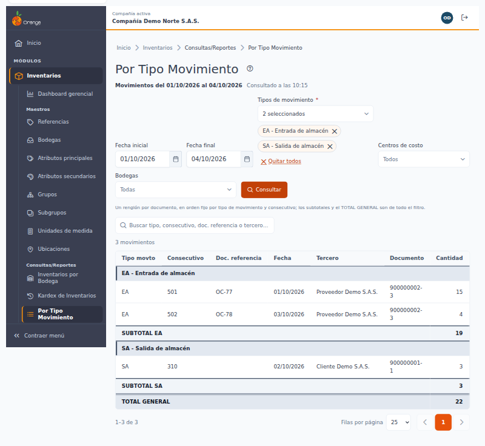

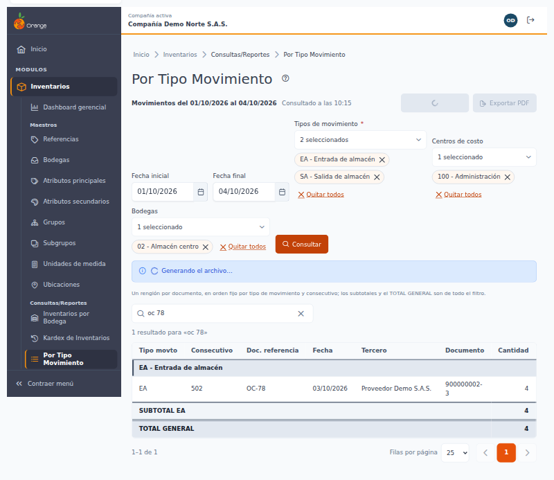

- **Encabezado:** datos de la compañía, el título del reporte, la **fecha inicial y la fecha final**, los tipos de movimiento elegidos, los centros de costo y las bodegas (o "Todos"/"Todas"), la búsqueda, la fecha y hora de generación y el usuario que lo generó.
- **Contenido:** las **mismas 17 columnas** de la pantalla, la fila de encabezado de cada tipo, su **SUBTOTAL** y el **TOTAL GENERAL**. En Excel los números quedan como números, listos para sumar o filtrar. El PDF sale en hoja carta horizontal y numera las páginas ("Página X de Y").
- **Nombre del archivo:** `movimientos-por-tipo-inventarios_` seguido de la fecha inicial y la fecha final, por ejemplo `movimientos-por-tipo-inventarios_2026-10-01_2026-10-04.xlsx` o `.pdf`.

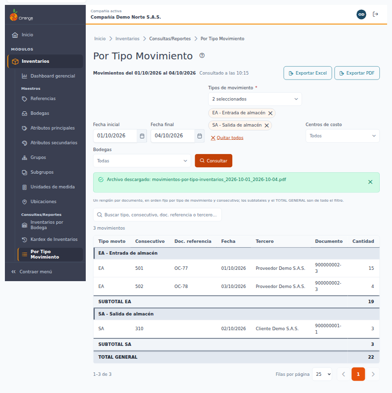

| Formato | Máximo de documentos |
|---------|----------------------|
| **Excel** | 50.000 |
| **PDF** | 4.000 |

Si supera el máximo, un aviso lo indica: **acote el periodo o los filtros** y vuelva a exportar. Si el PDF es demasiado grande, puede exportar a Excel.

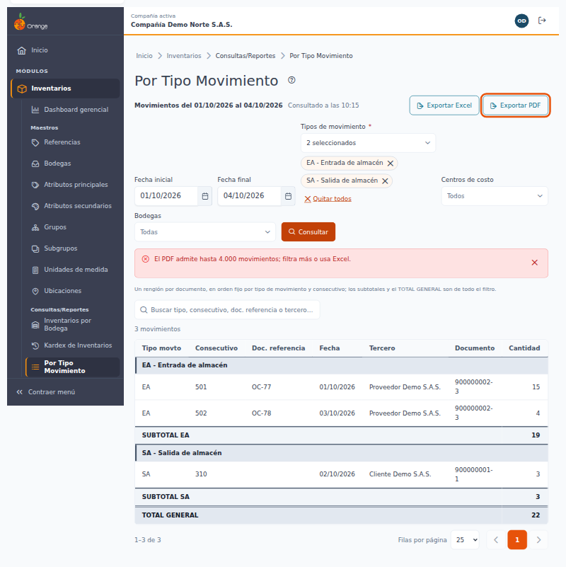

Mientras se genera el archivo aparece "Generando el archivo…" y el botón queda ocupado; al terminar se indica el nombre del archivo descargado. Si algo falla, el mensaje pide intentar de nuevo; sus filtros no se pierden.

---

## 🔄 Diferencias con el reporte anterior

| Tema | Antes | Ahora |
|------|-------|-------|
| **Exportes y búsqueda** | El Excel y el PDF ignoraban la búsqueda de la tabla. | Los archivos traen exactamente lo que ve, **con la búsqueda aplicada**. |
| **Columnas del Excel** | Omitía **Tercero** y **Documento**. | Las **mismas 17 columnas** de la pantalla. |
| **Encabezado y nombre del archivo** | Sin fechas ni filtros; el archivo siempre se llamaba igual. | Con fechas, tipos, centros, bodegas, búsqueda y usuario; el nombre lleva las fechas. |
| **Varias pestañas** | El archivo se armaba con la **última** consulta de la sesión: con dos pestañas abiertas podía salir la consulta de la otra. | Cada archivo se arma con **sus propios filtros**. |
| **Permisos** | Bastaba con ingresar al sistema para ver y exportar. | Se necesita **Consultar** para ver y **Exportar** para descargar. |
| **Redondeo** | El PDF redondeaba distinto a la pantalla y al Excel. | Pantalla, Excel y PDF con **2 decimales** y las mismas cifras. |
| **Cantidad** | Se mostraba con 2 decimales. | Hasta **4 decimales**, sin ceros sobrantes. |
| **Totales** | Se calculaban en el navegador después de traer todo el resultado. | Se calculan sobre **todo el filtro** y se muestran como filas grises: SUBTOTAL por tipo y TOTAL GENERAL en la última página. |
| **Filas por página** | 100 por defecto, con opción "Todos". | 25 por defecto (10, 25, 50 o 100). |
| **Fechas por defecto** | De noche podía proponer el día siguiente como fecha final. | Hace un mes a hoy, según la hora de Colombia. No acepta fechas futuras. |
| **Mensajes de error** | Mostraban textos técnicos. | Mensajes claros, con **Reintentar** cuando aplica. |

El rango máximo de **un mes (31 días)**, los tipos obligatorios, el renglón por documento y el orden por tipo y consecutivo **se conservan** como en el reporte anterior.

---

## ❓ Preguntas frecuentes

**¿Por qué no puedo consultar más de un mes?** Para que la consulta responda en un tiempo razonable. Divida el periodo en partes de hasta 31 días.

**¿Por qué no aparece un tipo de movimiento en la lista?** Solo aparecen los tipos de Entradas/Salidas y Traslados que su usuario tiene autorizados. Pida la autorización al administrador.

**¿Por qué un documento aparece en un solo renglón si tiene varias referencias?** El reporte muestra un renglón por documento y suma sus líneas. Para ver el detalle por referencia use el [Kardex de Inventarios](kardex-inventarios.md).

**¿Por qué no veo el TOTAL GENERAL?** Aparece solo como última fila de la **última página**.

**¿Por qué un tipo dice "(continúa)" y no tiene subtotal?** Sigue en la página siguiente; su SUBTOTAL aparece donde termina y es el del tipo completo.

**¿Por qué el total difiere en un centavo de la suma de los renglones?** Los totales se calculan con los valores exactos y se redondean al final (ver *Páginas y totales*).

**¿Por qué no veo los documentos que acabo de registrar?** La consulta muestra lo que había a la hora indicada en "Consultado a las…". Pulse **Consultar** otra vez.

**¿Por qué no puedo ordenar por columna?** Las filas de encabezado y subtotal dependen del orden por tipo y consecutivo.

**¿Por qué no veo los botones de exportar?** Su usuario no tiene el permiso **Exportar** en esta opción. Pídalo al administrador.

---

[Regresar a Inventarios](../readme.md)
