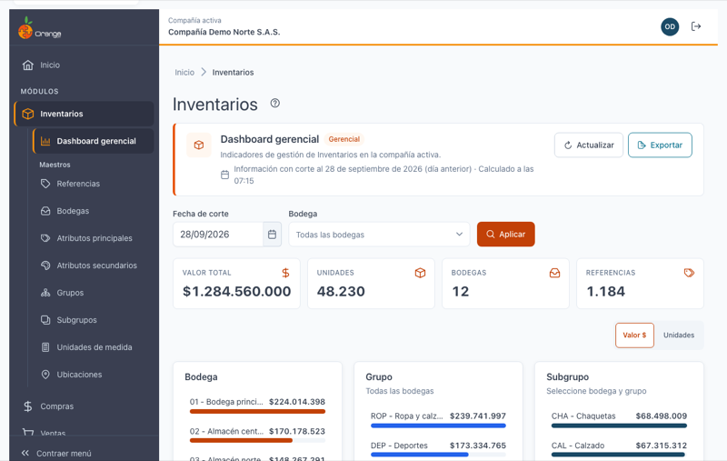
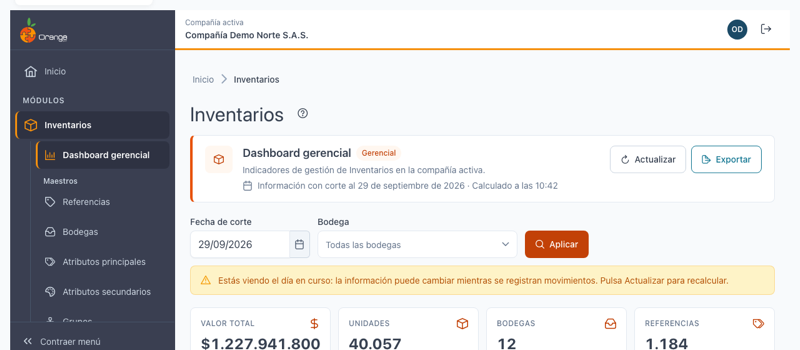
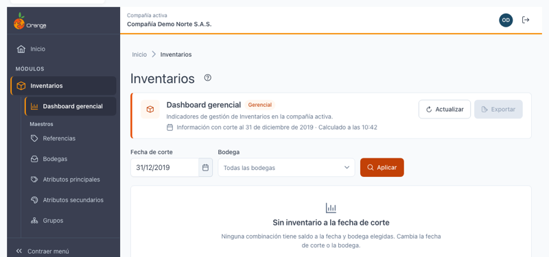
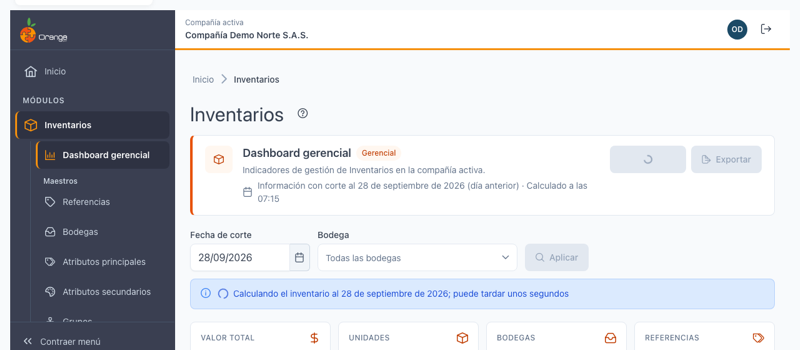
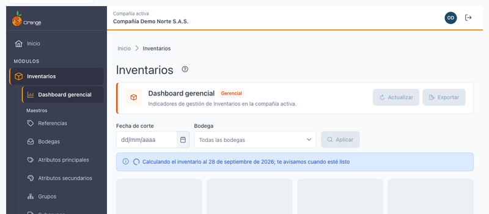
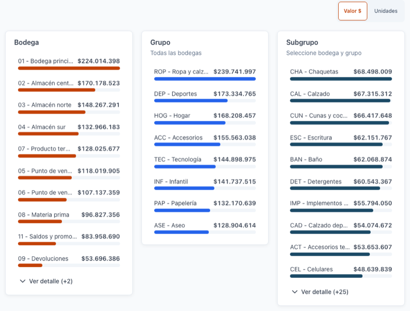
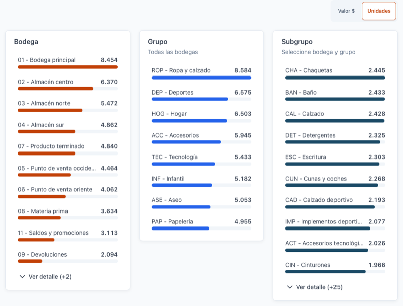
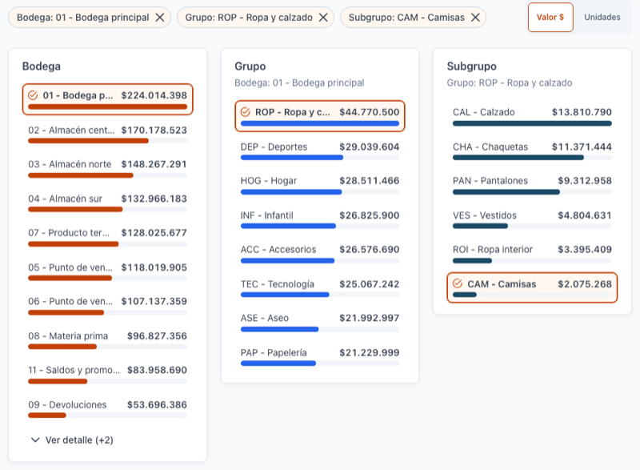
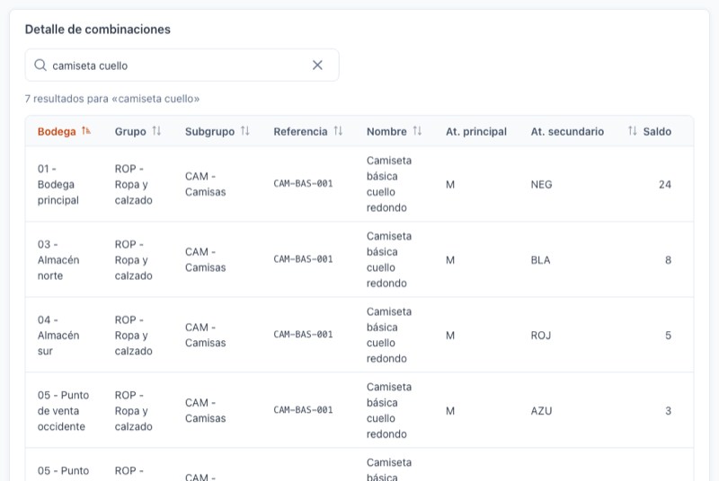
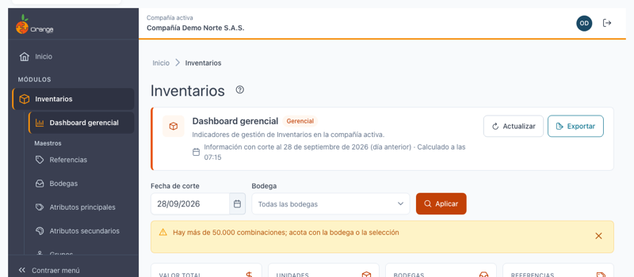

[Regresar a Inventarios](readme.md)

---

# 📈 Dashboard gerencial de Inventarios

---

## 📋 Descripción

El **dashboard gerencial** muestra cuánto inventario tiene la compañía, dónde está y cuánto vale, **con corte al día anterior**. Reemplaza al reporte **Reportes Gerenciales › Inventarios** de la versión anterior de OrangeERP.

En esta pantalla puede:

- Ver cuatro **indicadores**: valor total, unidades, bodegas y referencias con saldo.
- Analizar el inventario **por bodega, grupo y subgrupo** con rankings de barras, y profundizar con un clic (*drill-down*).
- Consultar el **detalle** de cada combinación (bodega, referencia y variante) con su saldo y su valor.
- **Exportar** ese detalle a Excel.

Es solo de consulta: no modifica el inventario.

> 💡 Si su perfil no tiene el reporte gerencial, al entrar a Inventarios verá el [Resumen del módulo](dashboard.md) en lugar de este dashboard.

---

## 🎯 Acceso

1. En el menú principal, haga clic en **Inventarios**.
2. Se abre el dashboard (en el menú aparece como **Dashboard gerencial**, la primera opción del módulo).

---

## 🖥️ Pantalla principal

| Elemento | Para qué sirve |
|----------|----------------|
| **?** (junto al título) | Abre esta ayuda en un panel lateral, sin salir de la pantalla. |
| **Información con corte al …** | La fecha de corte de lo que está viendo. Si es ayer, dice **(día anterior)**. |
| **Calculado a las HH:MM** | La hora en que se calculó la información que ve. Ver *La hora de cálculo y Actualizar* más abajo. |
| **Actualizar** | Vuelve a calcular la información con los movimientos registrados hasta ahora. |
| **Exportar** | Descarga el detalle a Excel. Ver *Exportar a Excel* más abajo. |
| **Fecha de corte**, **Bodega** y **Aplicar** | Filtros. Ver *Filtros* más abajo. |
| **Indicadores** | Valor total, Unidades, Bodegas y Referencias. |
| **Valor $ / Unidades** | Cambia la métrica de los rankings. |
| **Bodega**, **Grupo**, **Subgrupo** | Rankings de barras con *drill-down*. |
| **Detalle de combinaciones** | La tabla con cada combinación con saldo. |

---

## 📅 Fecha de corte: el día anterior

Al entrar, el dashboard muestra la información **con corte al día anterior** (ayer, hasta el final del día) para todas las bodegas, sin que tenga que hacer nada. La banda de arriba lo dice: *"Información con corte al 28 de septiembre de 2026 (día anterior)"*.

**¿Por qué ayer y no hoy?** El día anterior ya cerró: sus cifras no cambian mientras usted las mira. El día en curso cambia con cada venta, compra o traslado que se registra.

"Ayer" y "hoy" se cuentan con la fecha de la compañía, no con la hora de su equipo: si trabaja desde otro país o de madrugada, el corte sigue siendo el día anterior de la compañía.

### Ver el día en curso

Puede elegir la fecha de **hoy** en **Fecha de corte** y hacer clic en **Aplicar**. Verá este aviso bajo los filtros:

> ⚠️ *"Estás viendo el día en curso: la información puede cambiar mientras se registran movimientos. Pulsa Actualizar para recalcular."*

La información del día en curso se recalcula sola cada **10 minutos**; para ver lo último en ese momento, haga clic en **Actualizar**. Al volver a una fecha pasada, el aviso desaparece.

---

## 🔎 Filtros

| Filtro | Qué hace |
|--------|----------|
| **Fecha de corte** | Obligatoria. Por defecto, el día anterior. Puede elegir cualquier fecha hasta hoy; las fechas futuras no se pueden elegir. Si la borra, verá *"La fecha de corte es obligatoria"* y **Aplicar** queda deshabilitado. |
| **Bodega** | Opcional. Vacío = **Todas las bodegas**. Escriba parte del código o del nombre para buscarla; se muestra como *Código - Nombre*. Con la **✕** vuelve a todas. |

Los cambios en los filtros **no se aplican hasta hacer clic en Aplicar**. Al aplicar se limpian la selección de los rankings, la búsqueda del detalle y los rankings expandidos.

> 💡 **Aplicar no vuelve a calcular.** Si la información de esa fecha ya estaba calculada, la usa tal cual (verá la misma hora en *Calculado a las*). Para recalcular, use **Actualizar**. Cambiar solo la bodega nunca recalcula.

Si no hay existencias a la fecha y bodega elegidas, verá **"Sin inventario a la fecha de corte"**, con los filtros disponibles para cambiarlos:

---

## 🕒 La hora de cálculo y Actualizar

Calcular el inventario de toda la compañía puede tomar unos segundos. Por eso OrangeERP **calcula una vez por fecha de corte** y guarda el resultado: los demás usuarios de la compañía que consultan la misma fecha, y usted mismo al navegar por los rankings, el detalle o al exportar, usan ese mismo cálculo sin esperar.

**Calculado a las HH:MM** indica cuándo se hizo ese cálculo. Puede ser anterior a la hora en que usted entró: por ejemplo, si otro usuario abrió el dashboard a las 7:15, usted verá *"Calculado a las 07:15"* aunque entre a las 10:42.

| Fecha de corte | Cuándo se vuelve a calcular solo |
|----------------|----------------------------------|
| **Ayer u otra fecha pasada** | Como máximo **una vez al día**: el cálculo vale hasta el final del día siguiente. |
| **Hoy** | Cada **10 minutos**. |

### Documentos registrados con fecha pasada

Un documento que se registra **con una fecha anterior** (por ejemplo, hoy se registra una compra con fecha de ayer) cambia el inventario de esa fecha. Si la información de esa fecha ya estaba calculada, **ese documento no aparece** en el dashboard hasta que:

- haga clic en **Actualizar**, o
- el cálculo se renueve solo (según la tabla anterior).

Si sabe que se registraron documentos con fecha pasada, haga clic en **Actualizar** antes de revisar las cifras.

### Actualizar

1. Haga clic en **Actualizar** (en la banda de arriba).
2. El botón muestra que está trabajando. Mientras tanto sigue viendo la información anterior; si tarda, aparece *"Calculando el inventario al …; puede tardar unos segundos"*.
3. Al terminar, *Calculado a las* muestra la hora nueva y todo se recarga **sin perder** los filtros, la selección de los rankings, la búsqueda ni el orden del detalle.

> ℹ️ Si alguien actualizó esa misma fecha hace **menos de un minuto**, se usa ese cálculo y la hora no cambia. Así, varios clics seguidos no recargan el sistema.

> ℹ️ Esta pantalla **no se actualiza en vivo**: no verá los movimientos nuevos hasta que la información se recalcule. Si mientras navega la información se recalcula (por ejemplo, porque otro usuario hizo clic en Actualizar), los indicadores y los rankings se recargan solos para que todo corresponda al mismo cálculo.

### Cuando nadie ha calculado esa fecha todavía: "Calculando…"

Si es el **primer usuario del día** que consulta una fecha de corte (por ejemplo, nadie ha entrado todavía y el inventario de ayer aún no está calculado), o hace clic en **Actualizar** y ese cálculo tarda más de lo habitual, el dashboard no lo hace esperar: envía el cálculo a un **proceso en segundo plano** y muestra el aviso:

> ℹ️ *"Calculando el inventario al 28 de septiembre de 2026; te avisamos cuando esté listo"*

Mientras tanto puede:

- **Salir de esta pantalla y seguir trabajando** en cualquier otra parte de OrangeERP; el cálculo sigue corriendo aunque usted no esté mirando el dashboard.
- Esperar en la pantalla: en cuanto el cálculo termina, el dashboard se **recarga solo** con los indicadores, los rankings y el detalle ya listos, sin que tenga que hacer nada.

Cuando el cálculo termina, recibe una **notificación** en la campana:

- Si terminó bien: **"Inventario al {fecha} listo"**. Haga clic en ella para volver al dashboard (que ya mostrará la información calculada).
- Si falló: un aviso de error con el botón **Reintentar**, visible solo para quien pidió el cálculo.

> 💡 Si dos o más personas consultan la misma fecha mientras se está calculando, no se hacen dos cálculos: todas reciben el mismo aviso cuando termina.

### Precálculo nocturno

Todas las noches, entre las **3:00 a. m. y las 5:00 a. m.**, OrangeERP calcula por adelantado el inventario del día anterior de las compañías que tuvieron movimientos en los últimos **30 días**. Así, la mayoría de las veces que usted entra al dashboard en la mañana, la información ya está calculada y la ve de inmediato, sin pasar por el aviso *"Calculando…"*.

> ℹ️ Si el servidor se reinició durante la noche, ese precálculo puede no haberse completado y el dashboard tenga que calcular de nuevo al primer ingreso del día: en ese caso verá el aviso *"Calculando…"* igual que un primer cálculo.

---

## 📊 Indicadores

| Indicador | Qué muestra |
|-----------|-------------|
| **Valor total** | Suma del valor (saldo × costo promedio) de todas las combinaciones con saldo, en pesos sin decimales. |
| **Unidades** | Suma de los saldos. |
| **Bodegas** | Cuántas bodegas tienen saldo. |
| **Referencias** | Cuántas referencias tienen saldo. |

Los indicadores responden a la **fecha de corte** y a la **bodega** del filtro, **no** a la selección de los rankings: al hacer clic en una barra, los indicadores no cambian.

> ℹ️ Si hay **saldos negativos** (se vendió o trasladó más de lo que había registrado), se suman tal cual: restan del valor total y de las unidades.

---

## 📶 Rankings por bodega, grupo y subgrupo

Cada panel muestra una barra por bodega, grupo o subgrupo (*Código - Nombre*), ordenadas de mayor a menor. El largo de la barra es proporcional a la mayor del panel.

- Se ven las **10 primeras**. Con **Ver detalle (+N)** se ven todas; con **Ver menos**, vuelven las 10.
- Una barra con valor **negativo** muestra el signo menos y sin relleno.
- Si un panel no tiene datos para la selección, dice **"Sin datos"**.

### Métrica: Valor $ o Unidades

Con **Valor $** (por defecto) las barras se ordenan por valor; con **Unidades**, por cantidad. Cambiar la métrica es inmediato y conserva la selección.

### Profundizar (*drill-down*)

1. Haga clic en una **bodega**: el panel **Grupo** y el panel **Subgrupo** muestran solo lo de esa bodega, y el detalle se filtra.
2. Haga clic en un **grupo**: el panel **Subgrupo** muestra los subgrupos de ese grupo, y el detalle se filtra.
3. Haga clic en un **subgrupo**: el detalle muestra solo ese subgrupo.

La selección aparece arriba de los paneles como etiquetas, por ejemplo **Bodega: 01 - Bodega principal ✕**.

- Un **segundo clic** en la barra seleccionada la deselecciona.
- La **✕** de una etiqueta quita ese nivel **y los siguientes** (quitar la bodega quita también el grupo y el subgrupo).
- Los subtítulos de cada panel indican qué está mostrando (por ejemplo *Todas las bodegas* o *Seleccione bodega y grupo*).

Profundizar **no recalcula** la información: usa el mismo cálculo (misma hora en *Calculado a las*).

También puede usar el teclado: **Tab** para ir de barra en barra y **Enter** o **Espacio** para seleccionarla.

---

## 📋 Detalle de combinaciones

Una fila por cada **bodega + referencia + variante** con saldo distinto de cero, filtrada por la bodega del filtro y por la selección de los rankings.

| Columna | Qué muestra |
|---------|-------------|
| **Bodega**, **Grupo**, **Subgrupo** | *Código - Nombre*. |
| **Referencia**, **Nombre** | Código y nombre de la referencia. |
| **At. principal**, **At. secundario** | Los atributos de la variante (por ejemplo talla y color). |
| **Saldo** | Existencias a la fecha de corte, con hasta 2 decimales (0,4 se ve como 0,4). |
| **Valor** | Saldo × costo promedio, en pesos. |

- **Buscar**: escriba al menos **2 caracteres**. Encuentra la referencia si su **código contiene** el texto o si **cada palabra** aparece en el nombre, sin importar mayúsculas ni tildes: *"camiseta cuello"* encuentra *"Camiseta básica cuello redondo"*. Si no hay coincidencias, use **Limpiar búsqueda**.
- **Ordenar**: clic en un encabezado (ascendente, y un segundo clic descendente). Los atributos no se ordenan. Por defecto: bodega, grupo, subgrupo y referencia.
- **Paginar**: 20 filas por página (puede elegir 10, 20, 50 o 100).

> 📘 La búsqueda, el orden y la paginación funcionan como en el resto de las tablas: ver [Manejo general de la información](../Generales/manejo-general-informacion.md).

---

## 📤 Exportar a Excel

Haga clic en **Exportar** (en la banda de arriba). Se descarga `inventario-gerencial_AAAA-MM-DD.xlsx` (con la fecha de corte), hoja **Detalle**, con **lo que está viendo en el detalle**, completo y no solo la página visible:

- la fecha de corte y la bodega aplicadas,
- la selección de los rankings,
- la búsqueda y el orden del detalle.

El archivo trae el código y el nombre por separado (bodega, grupo, subgrupo, referencia y atributos) y **Saldo**, **Costo unitario** y **Valor** como números, listos para sumar o filtrar en Excel. Usa el mismo cálculo que la pantalla (no recalcula).

Se pueden exportar hasta **50.000 combinaciones**. Si el detalle tiene más, verá:

> *"Hay más de 50.000 combinaciones; acota con la bodega o la selección"*

Elija una bodega en el filtro, seleccione una bodega, grupo o subgrupo en los rankings, o busque en el detalle, y exporte de nuevo.

---

## 🔒 Permisos

| Para… | Su perfil necesita |
|-------|--------------------|
| Ver este dashboard | Permiso de **Consultar** sobre **Reportes Gerenciales**, su grupo de reportes y la opción **Inventarios** (además del acceso al módulo Inventarios). Sin ese permiso, verá el [Resumen del módulo](dashboard.md). |
| **Actualizar** | El mismo permiso de consultar. |
| **Exportar** | Además, el permiso de **Exportar** sobre la opción **Inventarios** de Reportes Gerenciales. Sin él, el botón **Exportar** no aparece. |

El filtro **Bodega** muestra todas las bodegas de la compañía aunque su perfil no tenga acceso a la pantalla de Bodegas.

Si su perfil perdió el permiso, verá **"No tienes acceso a este dashboard"**. Pida al administrador que lo revise.

> 🗂️ Cada consulta (al entrar, al Aplicar, al Actualizar) queda registrada en la bitácora de actividad con el usuario, la fecha de corte y la bodega consultadas.

---

## 🔀 Diferencias con el Reporte Gerencial anterior

Si compara con el reporte **Reportes Gerenciales › Inventarios** de la versión anterior, verá algunas diferencias. Son intencionales:

### El valor usa el costo promedio móvil (cuadra con contabilidad)

El **valor** de cada combinación es **saldo × costo promedio móvil**: cada vez que entra mercancía, el costo se recalcula ponderando **lo que queda en existencia** con lo que entra. Es el mismo costo que:

- se usa para contabilizar el **costo de ventas** de cada venta, y
- muestra la **pestaña Inventario** de cada referencia (ver [Detalle de una referencia](maestros/referencias-detalle.md), pestaña **Inventario**).

El reporte anterior promediaba **todas las compras de la historia**, incluidas las unidades que ya se vendieron. Por eso daba **otro valor** (en general, menor cuando los precios de compra suben) que no cuadraba con la contabilidad.

**Ejemplo (ficticio):** de un producto se compraron 24 unidades a $25.000 y se vendieron 20; quedan 4. Luego entran 5 unidades a $150.000.

| | Cálculo | Costo unitario |
|---|---|---|
| **Este dashboard** (lo que hay en bodega: 4 a $25.000 y 5 a $150.000) | (4 × 25.000 + 5 × 150.000) ÷ 9 | **$94.444,44** |
| **Reporte anterior** (todas las compras, aunque ya se vendieron) | (24 × 25.000 + 5 × 150.000) ÷ 29 | $46.552 |

Además, el costo se muestra con 2 decimales (el reporte anterior lo redondeaba a pesos).

### Entradas cuando el saldo estaba en cero o negativo

Cuando se vende sin existencias registradas (el saldo queda en cero o negativo) y luego entra mercancía, la fórmula del costo promedio de la versión anterior podía dar **costos negativos o absurdos**. En V2026, **si el saldo antes de una entrada es cero o negativo, el costo pasa a ser el de esa entrada**, que es la regla estándar del inventario permanente.

**Ejemplo (ficticio):** se vendieron 3 unidades sin existencias (saldo −3) y luego entran 2 a $260.000. La versión anterior calculaba un costo de −$520.000; V2026 toma $260.000.

> ⚠️ En esos casos (pocos productos, los que tuvieron saldo negativo), el costo de V2026 puede **no coincidir** con el que la versión anterior ya dejó contabilizado en esos movimientos. V2026 no modifica la contabilidad ya registrada. La pestaña Inventario de las referencias usa la misma regla, así que ambas pantallas muestran el mismo costo.

### Otras diferencias

| Tema | Reporte anterior | Este dashboard |
|------|------------------|----------------|
| Fecha al entrar | Hoy (hora del servidor) | **Ayer**, con la fecha de la compañía, y aviso si elige hoy |
| Fechas futuras | Se aceptaban | No se pueden elegir |
| Clic en un subgrupo | No hacía nada | Filtra el detalle |
| Saldos con decimales | Se veían como 0 | Se ven con hasta 2 decimales |
| Bodegas de otra compañía | Podían aparecer | Solo las de la compañía |
| Existencias | Podían faltar algunas, según cortes guardados que no estaban al día | Se calculan con todos los movimientos hasta la fecha de corte |
| Exportar | No existía | Excel del detalle, hasta 50.000 combinaciones |
| Imprimir | — | No disponible |

---

## ❓ Preguntas frecuentes

**¿Por qué no veo un documento que acabo de registrar?**
Si el documento es de **hoy**, elija la fecha de hoy y haga clic en **Actualizar**. Si tiene **fecha pasada** (dentro del corte que está viendo), haga clic en **Actualizar**: el cálculo guardado no lo incluía. Ver *Documentos registrados con fecha pasada* más arriba.

**¿Por qué "Calculado a las" muestra una hora anterior a la que entré?**
Porque usa el cálculo que ya estaba hecho para esa fecha (quizá lo pidió otro usuario). Si necesita lo más reciente, haga clic en **Actualizar**.

**Hice clic en Actualizar y la hora no cambió.**
Alguien acababa de recalcular esa fecha hace menos de un minuto; se usó ese cálculo.

**La carga tarda y dice "Calculando el inventario…".**
Es el primer cálculo de esa fecha. Puede tardar unos segundos; las siguientes consultas de esa fecha son inmediatas.

**Veo "Calculando…; te avisamos cuando esté listo": ¿tengo que esperar en la pantalla?**
No. Puede salir y seguir trabajando; cuando el cálculo termine le llega una notificación por la campana ("Inventario al {fecha} listo"). Si se queda en la pantalla, se recarga sola al terminar. Ver *Cuando nadie ha calculado esa fecha todavía* más arriba.

**¿Por qué el valor no coincide con el reporte gerencial anterior?**
Porque este dashboard usa el costo promedio móvil, el mismo de la contabilidad y de la pestaña Inventario de las referencias. Ver *Diferencias con el Reporte Gerencial anterior* más arriba.

**Al hacer clic en una bodega, los indicadores no cambian.**
Es así a propósito: los indicadores responden a los filtros (fecha y bodega). Para ver los indicadores de una sola bodega, elíjala en el filtro **Bodega** y haga clic en **Aplicar**.

**No veo el botón Exportar.**
Su perfil no tiene el permiso de exportar sobre el reporte gerencial de Inventarios.

**Una sección dice "No se pudo cargar esta sección."**
Haga clic en **Reintentar** dentro de esa sección; el resto del dashboard sigue funcionando. Si todo el dashboard muestra *"No se pudo cargar el dashboard"*, use **Reintentar**.
