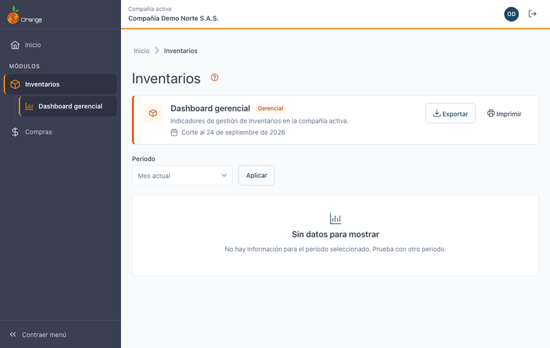

[Regresar a Inventarios](readme.md)

---

# 📈 Dashboard de Inventarios

---

## 📋 Descripción

Es la página de entrada del módulo **Inventarios**: al hacer clic en **Inventarios** en el menú, llega aquí.

Según su perfil verá:

| Tipo | Cuándo | Qué muestra |
|------|--------|-------------|
| **Dashboard gerencial** | Su perfil tiene el reporte gerencial de Inventarios. | Indicadores de gestión de Inventarios. |
| **Resumen del módulo** (inicial) | No tiene el reporte gerencial. | Resumen operativo del módulo. |

---

## 🚧 Estado actual

En esta versión el dashboard muestra la franja del módulo (nombre, tipo y fecha de corte) y el mensaje **"Sin datos para mostrar"**: los indicadores y gráficas se habilitarán en próximas versiones. Los botones **Exportar** e **Imprimir** aparecen según sus permisos y se activan cuando haya datos.

---

## 🧭 Opciones del módulo

Debajo de **Inventarios** en el menú lateral están las opciones disponibles, agrupadas (por ejemplo **Maestros › [Bodegas](maestros/bodegas.md)**).
