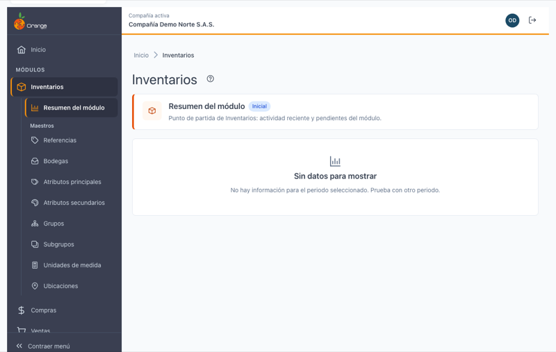

[Regresar a Inventarios](readme.md)

---

# 📈 Dashboard de Inventarios

---

## 📋 Descripción

Es la página de entrada del módulo **Inventarios**: al hacer clic en **Inventarios** en el menú, llega aquí.

Según su perfil verá:

| Tipo | Cuándo | Qué muestra |
|------|--------|-------------|
| **Dashboard gerencial** | Su perfil tiene permiso de consultar **Reportes Gerenciales › Inventarios**. | Valor, unidades, rankings por bodega, grupo y subgrupo, y detalle del inventario con corte al día anterior. Ver [Dashboard gerencial de Inventarios](dashboard-gerencial.md). |
| **Resumen del módulo** (inicial) | No tiene ese permiso. | Resumen operativo del módulo (esta página). |

La imagen de arriba es el **Resumen del módulo**.

---

## 🚧 Estado actual del Resumen del módulo

En esta versión el Resumen del módulo muestra la franja del módulo (nombre y tipo **Inicial**) y el mensaje **"Sin datos para mostrar"**: sus indicadores y gráficas se habilitarán en próximas versiones. Si necesita las cifras del inventario, pida al administrador el permiso del [Dashboard gerencial](dashboard-gerencial.md). Los botones **Exportar** e **Imprimir** aparecen deshabilitados según sus permisos y se activarán cuando haya datos.

---

## 🧭 Opciones del módulo

Debajo de **Inventarios** en el menú lateral están las opciones disponibles, agrupadas (por ejemplo **Maestros › [Bodegas](maestros/bodegas.md)**).
