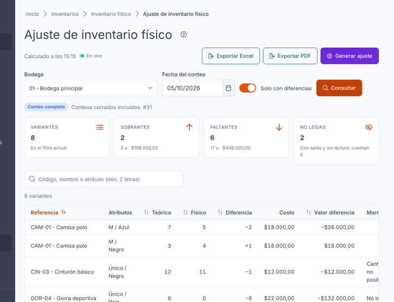
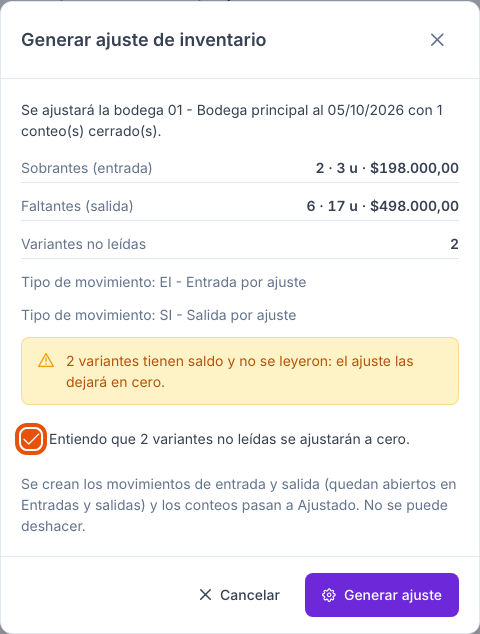
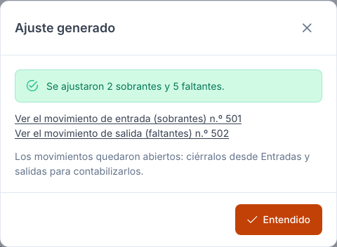

[Regresar a Inventarios](../readme.md)

---

# ⚖️ Inventario físico — Comparativo y ajuste

---

## 📋 Descripción

Aquí compara lo que **contó** con lo que el sistema **dice que hay** (el saldo teórico) en una bodega y una fecha, ve cuántos sobrantes y faltantes hay y, si todo está bien, **genera el ajuste**: el sistema crea un movimiento de entrada por los sobrantes y uno de salida por los faltantes, y marca los conteos como **Ajustados**.

Es el último paso del inventario físico: primero cuenta en **[Captura](captura.md)**, cierra el conteo en **[Conteos](conteos.md)** y luego ajusta aquí.

---

## 🎯 Acceso

Menú **Inventarios** › **Ajuste de Inventarios Físicos**. También llega desde el enlace «Ajuste» de la trazabilidad del Dashboard de Inventarios Físicos.

---

## 🖥️ Pantalla principal

### Filtros

La consulta **no se ejecuta sola**: elija los filtros y pulse **Consultar**.

| Elemento | Para qué sirve |
|----------|----------------|
| **Bodega** | Busque la bodega por código o nombre. Es obligatoria. |
| **Fecha del conteo** | La fecha de los conteos que quiere comparar. Por defecto, hoy. No puede ser futura. |
| **Solo con diferencias** | Activo por defecto: oculta las variantes cuyo físico coincide con el teórico. |
| **Consultar** | Calcula el comparativo con los conteos **Cerrados** de esa bodega y fecha. |

### Resultado

- **Alcance**: *Conteo completo* (se compara toda la bodega) o *Conteo aleatorio* (solo las referencias que leyó, con todas sus variantes). Junto a él verá los conteos incluidos (#31, por ejemplo).
- **Totales** (de **todo** el filtro, no solo de la página que ve):

| Tarjeta | Qué muestra |
|---------|-------------|
| **Variantes** | Cuántas variantes hay en el filtro actual. |
| **Sobrantes** | Variantes con más físico que teórico, con sus unidades y su valor. |
| **Faltantes** | Variantes con menos físico que teórico, con sus unidades y su valor. |
| **No leídas** | Variantes con saldo que no se leyeron: **cuentan cero** al ajustar. |

- **Tabla**: referencia, atributos, teórico, físico, **diferencia** (con signo: **+** sobra, **−** falta), costo, valor de la diferencia y **marcas** (*No leída*, *Cantidad no positiva*, *Sin costo*). Puede buscar (mínimo 2 letras, sin tildes ni mayúsculas), ordenar por columna y paginar.

### Avisos y estados

| Lo que ve | Qué significa |
|-----------|---------------|
| **Consulta el comparativo** | Todavía no ha consultado. |
| **No hay conteos cerrados para esa bodega y fecha** | Cierre el conteo en [Conteos](conteos.md) y vuelva a consultar. |
| **Hay N conteo(s) abierto(s)…** | No puede ajustar hasta cerrarlos o anularlos (ver *Preguntas frecuentes*). |
| **Un conteo de esta consulta cambió…** | Otro usuario cambió un conteo mientras miraba la pantalla. Vuelva a consultar. |
| **Sin acceso al comparativo** | Su perfil no tiene permiso de Consultar sobre esta opción. |

---

## 📤 Exportar

Con permiso de **Exportar** verá **Exportar Excel** y **Exportar PDF**. El archivo se genera con **los mismos filtros, búsqueda y orden** que ve. Si hay demasiadas filas (más de 50.000 en Excel o 4.000 en PDF) el sistema se lo avisa con el máximo: acote la búsqueda o active *Solo con diferencias*.

---

## ⚙️ Generar el ajuste

Con permiso de **Crear** verá **Generar ajuste**. Está disponible cuando consultó, hay conteos **Cerrados**, **no hay conteos Abiertos** de esa bodega y fecha y el resultado no cambió.

1. Pulse **Generar ajuste**. El sistema calcula el resumen de **toda** la bodega y fecha (sin tener en cuenta la búsqueda de la tabla).
2. Revise el diálogo:

   

   - **Sobrantes (entrada)** y **Faltantes (salida)**: variantes, unidades y valor.
   - **Variantes no leídas**: si hay, aparece un aviso y debe **marcar la confirmación** («Entiendo que N variantes no leídas se ajustarán a cero») para habilitar el botón.
   - **Tipo de movimiento**: se usa el único disponible; si hay varios, elija uno para sobrantes y otro para faltantes.
3. Pulse **Generar ajuste** en el diálogo. Queda en *Procesando…* y no puede cancelar hasta la respuesta.
4. Al terminar verá el **resultado** con enlaces a los movimientos creados.

   

### Qué hace el ajuste

- Crea **un movimiento de entrada** (sobrantes) y **uno de salida** (faltantes) en una sola operación: o se crean los dos y los conteos pasan a **Ajustado**, o no se crea nada.
- Cantidad = diferencia sin signo; valor = costo de la variante; tercero = la propia empresa; documento de referencia **AJINV-aaaammdd-bodega**.
- Los movimientos quedan **Abiertos**: ciérrelos desde **Entradas y salidas** para contabilizarlos.
- **Todos** los conteos Cerrados de esa bodega y fecha pasan a **Ajustado** (ya no se pueden reabrir ni anular).
- Si no había diferencias, los conteos quedan **Ajustados** sin crear movimientos.
- Queda registrado en la bitácora y los demás usuarios con la pantalla abierta ven el cambio; los responsables reciben un aviso en la campana.

### Si el sistema no puede ajustar

El mensaje sale **dentro del diálogo** y no se cambia nada:

| Mensaje | Qué hacer |
|---------|-----------|
| **El periodo de la fecha está cerrado para entradas y salidas** | Pida abrir el periodo o ajuste con otra fecha. |
| **Tu usuario no está activo como aprobador del ajuste** | Pida ayuda al administrador. |
| **Hay conteos abiertos de esta bodega y fecha (#32)** | Ciérrelos o anúlelos en [Conteos](conteos.md). |
| **Estos conteos ya no están cerrados** | Probablemente ya se ajustaron (otro usuario o doble clic). Vuelva a consultar. |
| **N variantes a ajustar no tienen costo** | Corrija el costo de esas variantes (marca *Sin costo*) y vuelva a consultar. |
| **No hay un tipo de movimiento disponible** | Pida que le autoricen un tipo de entrada y uno de salida en Entradas y salidas. |
| **La empresa no tiene un tercero con su NIT** | Cree el tercero de la empresa antes de ajustar. |
| **Elige el tipo de movimiento del ajuste** | Elija uno en el diálogo. |

---

## 🔄 Cambios en vivo

La pantalla escucha los cambios de sus conteos. Si otro usuario reabre, anula o ajusta uno, aparece el aviso **«Un conteo de esta consulta cambió…»** y **Generar ajuste** y los exportes se deshabilitan hasta que vuelva a pulsar **Consultar**. Nunca se recarga sola.

---

## 🔐 Permisos y visibilidad

| Permiso (opción 316) | Qué habilita |
|----------------------|--------------|
| **Consultar** | Ver el comparativo. |
| **Exportar** | Botones **Exportar Excel** y **Exportar PDF**. |
| **Crear** | Botón **Generar ajuste**. |

Lo que no puede hacer **no se muestra**. Su compañía es la de la pestaña: nunca verá datos de otra.

---

## ❓ Preguntas frecuentes

**¿Por qué no puedo ajustar si hay un conteo Abierto?**

Porque un conteo abierto todavía puede cambiar el físico. El sistema legado los inactivaba sin avisar; ahora el ajuste se detiene y le dice cuáles son. Ciérrelo (si ya terminó de contar) o anúlelo.

**¿Qué pasa con las variantes que no leí?**

Si el conteo es **completo**, todas las variantes de la bodega con saldo que no leyó cuentan **cero** y generan un faltante por todo su saldo. Por eso el sistema le pide una confirmación explícita. En un conteo **aleatorio**, solo las referencias que leyó cuentan (con todas sus variantes); lo demás no se toca.

**¿Con qué fecha se compara el físico?**

Con la **fecha exacta del conteo** (no con la hora de cierre) y con el saldo teórico del sistema a esa fecha, recalculado en el momento de consultar y de ajustar.

**¿Puedo deshacer un ajuste?**

El conteo no se puede reabrir. Los movimientos creados están **Abiertos**: puede anularlos o eliminarlos desde **Entradas y salidas** según las reglas de ese módulo.

**¿Qué cambia frente al ajuste de la versión anterior?**

- Ya no depende de una pantalla con memoria del servidor: cada consulta trae sus propios filtros y varias personas pueden trabajar a la vez.
- El ajuste es **transaccional** (todo o nada) y **no se puede repetir** por doble clic.
- Ya no inactiva los conteos de la bodega y fecha sin avisar: si hay Abiertos, se detiene.
- Muestra los totales de todo el filtro, permite exportar y deja bitácora y avisos.
- Los sobrantes y faltantes se crean con las reglas actuales de periodo y costos, y la app Ionic de captura no interviene.

---

## 📍 Siguiente paso

- Revise y **cierre los movimientos de ajuste** desde **Entradas y salidas**.
- Consulte el resultado en el **Dashboard de Inventarios Físicos**.
